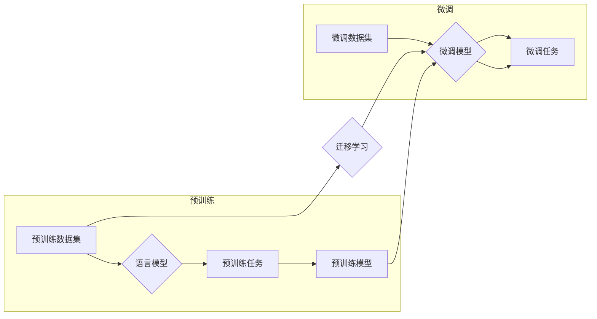

> 关键词：大语言模型，微调，迁移学习，自然语言处理，预训练模型，模型集成，应用开发，工具推荐

# 大语言模型应用指南：基于微调的工具

随着深度学习在自然语言处理（NLP）领域的深入应用，大语言模型（Large Language Models，LLMs）已经成为推动NLP技术进步的关键因素。这些模型通过在海量数据上进行预训练，学习了丰富的语言知识，使得它们能够在多种NLP任务上表现出色。然而，如何将这些强大的模型应用到实际场景中，并实现高效微调，成为了NLP工程实践中的关键问题。本文将深入探讨大语言模型微调的应用指南，并提供实用的工具和资源推荐。

## 1. 背景介绍

### 1.1 大语言模型的兴起

近年来，随着计算能力的提升和数据量的爆炸式增长，大语言模型如BERT、GPT-3等应运而生。这些模型通过在大量文本数据上进行预训练，能够学习到丰富的语言知识和上下文理解能力。它们在文本分类、机器翻译、问答系统等NLP任务上取得了显著的成果，推动了NLP技术的快速发展。

### 1.2 微调的重要性

尽管预训练模型在通用语言理解方面表现出色，但在特定领域的应用中，仍需要针对具体任务进行微调。微调过程旨在利用少量标注数据，调整模型参数，使其适应特定任务的需求，从而提升模型在特定任务上的表现。

## 2. 核心概念与联系

### 2.1 核心概念原理和架构的 Mermaid 流程图



### 2.2 核心概念解释

- **预训练数据集**：用于训练预训练模型的大量无标签文本数据。
- **语言模型**：能够理解并生成自然语言的模型，如GPT、BERT等。
- **预训练任务**：在预训练阶段，模型需要学习完成的任务，如语言建模、掩码语言模型等。
- **预训练模型**：通过预训练任务学习到的语言模型。
- **微调数据集**：用于微调模型的小规模标注数据集。
- **微调模型**：在预训练模型基础上进行微调得到的模型。
- **微调任务**：在微调阶段，模型需要完成的特定任务。
- **迁移学习**：将预训练模型的知识迁移到特定任务上的学习过程。

## 3. 核心算法原理 & 具体操作步骤

### 3.1 算法原理概述

微调的原理是将预训练模型作为初始化参数，在特定任务的数据集上进行监督学习，通过调整模型参数来优化模型在特定任务上的性能。

### 3.2 算法步骤详解

1. **选择预训练模型**：根据任务需求选择合适的预训练模型。
2. **准备微调数据集**：收集和标注少量数据用于微调。
3. **设置微调任务**：定义微调任务，如文本分类、序列标注等。
4. **微调模型参数**：在微调数据集上训练模型，优化模型参数。
5. **评估模型性能**：在验证集上评估模型性能，并进行调优。

### 3.3 算法优缺点

#### 优点：

- **高效**：利用预训练模型的知识，只需少量标注数据即可快速适应特定任务。
- **可扩展**：适用于各种NLP任务，只需调整微调任务即可。
- **强大**：预训练模型在通用语言理解方面表现出色，微调后性能显著提升。

#### 缺点：

- **对标注数据依赖**：需要大量高质量的标注数据。
- **计算资源消耗**：微调过程需要大量计算资源。
- **模型复杂度高**：预训练模型通常参数量巨大，模型复杂度高。

### 3.4 算法应用领域

- **文本分类**：如新闻分类、情感分析等。
- **序列标注**：如命名实体识别、关系抽取等。
- **机器翻译**：如将一种语言翻译成另一种语言。
- **问答系统**：如信息检索、对话系统等。

## 4. 数学模型和公式 & 详细讲解 & 举例说明

### 4.1 数学模型构建

微调模型的数学模型可以表示为：

$$
\hat{y} = M_{\theta}(x)
$$

其中，$M_{\theta}$ 是微调模型，$\theta$ 是模型参数，$x$ 是输入数据，$\hat{y}$ 是模型预测输出。

### 4.2 公式推导过程

以文本分类任务为例，模型预测输出为：

$$
\hat{y} = \sigma(W^T h(M_{\theta}(x)))
$$

其中，$W$ 是分类器权重，$h$ 是激活函数（如softmax），$M_{\theta}(x)$ 是预训练模型输出。

### 4.3 案例分析与讲解

以BERT模型在情感分析任务上的微调为例，模型结构如下：

1. **预训练模型**：BERT-base
2. **微调任务**：文本分类（正面/负面）
3. **微调数据集**：IMDb电影评论数据集

通过在IMDb数据集上进行微调，BERT模型在情感分析任务上取得了优异的性能。

## 5. 项目实践：代码实例和详细解释说明

### 5.1 开发环境搭建

1. 安装Python环境
2. 安装深度学习框架（如PyTorch、TensorFlow）
3. 安装NLP库（如Transformers）

### 5.2 源代码详细实现

```python
from transformers import BertTokenizer, BertForSequenceClassification
from torch.utils.data import DataLoader, TensorDataset
from torch.optim import AdamW

# 加载预训练模型和分词器
model = BertForSequenceClassification.from_pretrained('bert-base-uncased')
tokenizer = BertTokenizer.from_pretrained('bert-base-uncased')

# 加载数据集
train_texts = [...]  # 训练集文本
train_labels = [...]  # 训练集标签

# 编码数据
train_encodings = tokenizer(train_texts, return_tensors='pt', padding=True, truncation=True)
train_dataset = TensorDataset(train_encodings['input_ids'], train_encodings['attention_mask'], train_labels)

# 创建数据加载器
train_dataloader = DataLoader(train_dataset, batch_size=16, shuffle=True)

# 定义优化器
optimizer = AdamW(model.parameters(), lr=2e-5)

# 训练模型
for epoch in range(3):
    model.train()
    for batch in train_dataloader:
        optimizer.zero_grad()
        inputs = {'input_ids': batch[0], 'attention_mask': batch[1], 'labels': batch[2]}
        outputs = model(**inputs)
        loss = outputs.loss
        loss.backward()
        optimizer.step()

# 评估模型
model.eval()
with torch.no_grad():
    for batch in train_dataloader:
        inputs = {'input_ids': batch[0], 'attention_mask': batch[1], 'labels': batch[2]}
        outputs = model(**inputs)
        logits = outputs.logits
        # 计算准确率等指标
```

### 5.3 代码解读与分析

- 加载预训练模型和分词器。
- 加载数据集并进行编码。
- 创建TensorDataset和数据加载器。
- 定义优化器。
- 训练模型。
- 评估模型。

## 6. 实际应用场景

### 6.1 文本分类

微调大语言模型进行文本分类，可以应用于新闻分类、情感分析、主题分类等任务。

### 6.2 机器翻译

微调大语言模型进行机器翻译，可以应用于将一种语言翻译成另一种语言。

### 6.3 问答系统

微调大语言模型进行问答系统，可以应用于信息检索、对话系统等任务。

## 7. 工具和资源推荐

### 7.1 学习资源推荐

- 《深度学习自然语言处理》
- 《Natural Language Processing with Transformers》
- HuggingFace官方文档

### 7.2 开发工具推荐

- PyTorch
- TensorFlow
- Transformers库

### 7.3 相关论文推荐

- BERT: Pre-training of Deep Bidirectional Transformers for Language Understanding
- Generative Pretraining with Transformer
- Attention Is All You Need

## 8. 总结：未来发展趋势与挑战

### 8.1 研究成果总结

大语言模型微调技术在NLP领域取得了显著的成果，为各种NLP任务提供了强大的工具和资源。

### 8.2 未来发展趋势

- 模型规模将进一步扩大
- 微调方法将更加高效和灵活
- 多模态微调将成为趋势
- 模型可解释性和安全性将得到关注

### 8.3 面临的挑战

- 标注数据成本高
- 计算资源消耗大
- 模型复杂度高
- 模型可解释性和安全性不足

### 8.4 研究展望

大语言模型微调技术将不断发展和完善，为NLP技术的应用带来更多可能性。

## 9. 附录：常见问题与解答

### 9.1 常见问题

- **Q1：什么是微调？**
  A1：微调是指在小规模标注数据集上对预训练模型进行训练，使其适应特定任务的过程。

- **Q2：微调需要多少标注数据？**
  A2：微调所需的标注数据量取决于任务和数据集，一般建议数据量在几千到几万之间。

- **Q3：如何评估微调模型？**
  A3：可以通过在验证集上评估模型的性能，如准确率、F1值等指标来评估微调模型。

作者：禅与计算机程序设计艺术 / Zen and the Art of Computer Programming