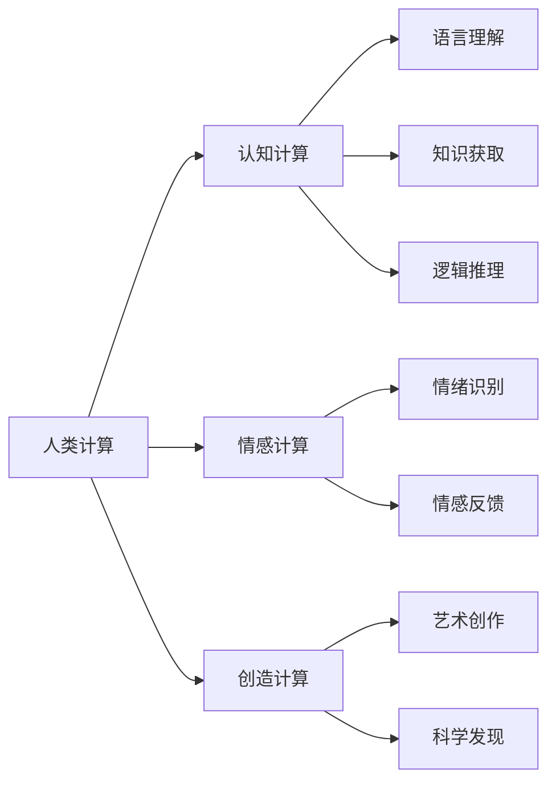
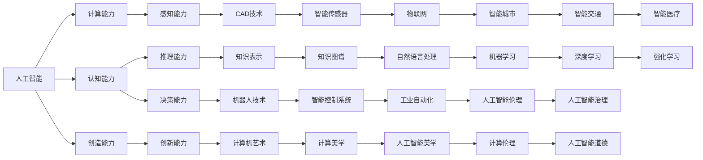

                 

# 释放人类潜力的无限可能：人类计算的最终目标

## 1. 背景介绍

### 1.1 问题由来

在人工智能发展的历程中，计算能力的不断提升和算法的不断优化，逐步使人类计算进入了一个新的阶段。这一阶段的特征是，机器已经能够处理极为复杂的计算任务，并在很多领域中超越了人类。然而，尽管机器的计算能力已经达到了前所未有的高度，但它们仍然缺乏人类的智慧、情感和创造力。这些问题引发了人们对于人类计算的终极目标的思考：我们能否创造出一种计算形式，不仅能够处理复杂的逻辑和数据，还能够理解和体验人类的情感，甚至具备创造性思维？

### 1.2 问题核心关键点

这一目标的实现，需要对现有的人工智能技术进行深度整合和扩展，需要在计算能力、认知能力和创造能力等多个维度进行突破。具体来说，需要考虑以下几个关键点：

1. **计算能力**：如何进一步提升机器的计算速度和并行处理能力，使其能够处理更为复杂的计算任务。
2. **认知能力**：如何让机器能够理解人类语言、感知环境，并在推理、决策等方面达到人类的水平。
3. **创造能力**：如何赋予机器以创造性思维，使其能够产生新颖的解决方案和艺术作品。
4. **情感能力**：如何让机器能够理解和体验人类的情感，从而实现真正意义上的交互。

### 1.3 问题研究意义

这一问题的解决，对于人类社会的进步具有深远的意义：

1. **提升生产力**：通过计算能力的增强，人类可以在许多领域中实现自动化和智能化，从而大幅提升生产效率。
2. **拓展认知边界**：通过认知能力的提升，人类可以探索更多的未知领域，解决更多复杂的问题。
3. **促进社会和谐**：通过情感能力的增强，机器可以更好地理解和回应人类的情感需求，促进人际关系的和谐。
4. **激发创造力**：通过创造能力的提升，机器可以产生更多创新的解决方案，推动社会的进步和变革。

## 2. 核心概念与联系

### 2.1 核心概念概述

为了更好地理解这一目标的实现路径，我们首先需要明确几个核心概念及其联系：

- **人类计算**：指的是以人类智慧、情感和创造力为基础的计算形式，包括认知计算、情感计算和创造计算等多个维度。
- **人工智能**：指的是通过算法和计算技术实现的一系列智能行为，包括感知、推理、决策和执行等。
- **计算能力**：指的是机器在进行复杂计算时所展现出的速度和效率。
- **认知能力**：指的是机器在理解和推理方面的能力，包括语言理解、知识获取和逻辑推理等。
- **创造能力**：指的是机器在产生新颖想法和解决方案方面的能力，包括艺术创作和科学发现等。
- **情感能力**：指的是机器在感知和回应人类情感方面的能力，包括情绪识别和情感反馈等。

这些概念通过以下Mermaid流程图展示其联系：



这个流程图展示了人类计算和人工智能之间的联系，以及认知、情感、创造能力各自的功能和作用。

### 2.2 概念间的关系

这些核心概念之间的关系可以通过以下Mermaid流程图进一步展示：



这个综合流程图展示了人工智能在不同维度上的能力和应用，以及这些能力和应用之间的相互作用。

## 3. 核心算法原理 & 具体操作步骤

### 3.1 算法原理概述

实现人类计算的最终目标，需要整合和扩展现有的计算技术，并在多个维度上进行突破。以下是一些核心的算法原理和具体操作步骤：

- **深度学习**：通过构建复杂的神经网络结构，实现对大规模数据的高效处理和特征提取。深度学习的目标是提高机器的认知能力，使其能够理解和推理人类语言、感知环境并做出决策。
- **自然语言处理(NLP)**：通过语言理解、知识获取和逻辑推理等技术，使机器能够理解和处理人类语言，从而实现认知计算。
- **知识图谱**：通过构建知识图谱，使机器能够获取和运用人类已有的知识，从而提高其在推理和决策方面的能力。
- **计算机艺术**：通过生成对抗网络(GAN)、风格迁移等技术，使机器能够产生新颖的艺术作品，从而实现创造计算。
- **情感计算**：通过面部识别、语音识别等技术，使机器能够感知和回应人类的情感，从而实现情感计算。

### 3.2 算法步骤详解

实现人类计算的最终目标，可以分为以下几个关键步骤：

1. **数据准备**：收集和整理大规模的数据集，包括语言数据、知识数据和情感数据等，为后续的计算提供基础。
2. **模型构建**：根据不同的计算需求，构建相应的计算模型，如深度学习模型、知识图谱模型和情感计算模型等。
3. **训练和优化**：使用收集的数据对模型进行训练，并通过优化算法调整模型参数，使其能够达到最优性能。
4. **整合与扩展**：将不同的计算模型进行整合，并在认知、情感和创造等多个维度上进行扩展，构建具有人类计算能力的人工智能系统。
5. **应用与验证**：将构建的系统应用于实际场景，并通过评估和反馈不断优化系统性能。

### 3.3 算法优缺点

实现人类计算的最终目标，具有以下优点：

1. **泛化能力强**：通过整合和扩展现有的计算技术，机器能够处理更加复杂和多样的计算任务。
2. **适应性强**：机器能够根据不同的应用场景进行自我调整和优化，提高系统的适应性。
3. **自动化程度高**：机器能够自主进行计算和推理，减少人工干预。

但这一目标也存在以下缺点：

1. **技术难度高**：实现人类计算的最终目标，需要在计算能力、认知能力和创造能力等多个维度上进行深度整合和扩展，技术难度较大。
2. **资源消耗大**：实现这一目标需要大量的计算资源和数据资源，成本较高。
3. **伦理和法律风险**：机器在处理情感和创造性任务时，可能引发伦理和法律问题，需要制定相应的规范和标准。

### 3.4 算法应用领域

实现人类计算的最终目标，已经在许多领域中得到了应用：

1. **智能家居**：通过认知计算和情感计算，实现家庭环境的智能控制和优化。
2. **智能医疗**：通过知识图谱和认知计算，提高医疗诊断和治疗的准确性和效率。
3. **智能交通**：通过情感计算和决策算法，提高交通系统的安全和效率。
4. **工业自动化**：通过认知计算和机器人技术，实现生产过程的智能化和自动化。
5. **艺术创作**：通过生成对抗网络和风格迁移等技术，实现机器艺术创作和设计。

## 4. 数学模型和公式 & 详细讲解 & 举例说明

### 4.1 数学模型构建

为了更好地理解和实现人类计算的最终目标，我们需要构建一些数学模型来描述和解释这一过程。以下是一个基本的数学模型框架：

- **输入数据**：包含语言数据、知识数据和情感数据等。
- **计算模型**：包括深度学习模型、知识图谱模型和情感计算模型等。
- **输出结果**：包括推理结果、情感反馈和艺术作品等。

### 4.2 公式推导过程

以下是几个关键的公式推导过程，用于说明不同计算模型的基本原理：

1. **深度学习模型的损失函数**：

   $$
   \mathcal{L} = \frac{1}{N} \sum_{i=1}^N \left\Vert \hat{y}_i - y_i \right\Vert^2
   $$

   其中 $\hat{y}_i$ 表示模型对输入 $x_i$ 的预测结果，$y_i$ 表示真实标签。

2. **知识图谱的推理公式**：

   $$
   P(y|x, G) = \frac{P(y|G)}{P(x|G)}
   $$

   其中 $P(y|x, G)$ 表示在知识图谱 $G$ 的约束下，输入 $x$ 对输出 $y$ 的概率。

3. **生成对抗网络(GAN)的损失函数**：

   $$
   \mathcal{L}_{GAN} = \mathcal{L}_{G} + \mathcal{L}_{D}
   $$

   其中 $\mathcal{L}_{G}$ 表示生成器的损失函数，$\mathcal{L}_{D}$ 表示判别器的损失函数。

### 4.3 案例分析与讲解

以图像生成任务为例，展示GAN的基本工作原理和具体实现。GAN由生成器和判别器两个部分组成，生成器的目标是从噪声中生成图像，判别器的目标是将生成图像与真实图像区分开来。具体实现步骤如下：

1. **生成器训练**：通过优化算法调整生成器的参数，使其生成的图像越来越接近真实图像。
2. **判别器训练**：通过优化算法调整判别器的参数，使其能够准确区分生成图像和真实图像。
3. **交替优化**：生成器和判别器交替优化，直至生成器生成的图像能够欺骗判别器，实现高质量的图像生成。

## 5. 项目实践：代码实例和详细解释说明

### 5.1 开发环境搭建

为了实现人类计算的最终目标，我们需要一个强大的开发环境。以下是一些常用的开发环境和工具：

1. **Python**：Python是目前最流行的编程语言之一，支持深度学习、自然语言处理和计算机艺术等多种应用。
2. **TensorFlow**：由Google开发的开源深度学习框架，支持分布式计算和GPU加速。
3. **PyTorch**：由Facebook开发的开源深度学习框架，支持动态图和动态计算图，适合快速原型开发。
4. **Keras**：基于TensorFlow和Theano等框架的高层API，提供了简单易用的接口，适合快速上手。
5. **Jupyter Notebook**：一个强大的交互式编程环境，支持Python、R等多种语言，适合研究和开发。

### 5.2 源代码详细实现

以下是一个简单的深度学习模型的实现代码，用于图像分类任务：

```python
import tensorflow as tf
from tensorflow.keras import layers

model = tf.keras.Sequential([
    layers.Conv2D(32, (3,3), activation='relu', input_shape=(28,28,1)),
    layers.MaxPooling2D((2,2)),
    layers.Flatten(),
    layers.Dense(10, activation='softmax')
])

model.compile(optimizer='adam', loss='sparse_categorical_crossentropy', metrics=['accuracy'])
model.fit(x_train, y_train, epochs=10, validation_data=(x_test, y_test))
```

### 5.3 代码解读与分析

以上代码展示了如何使用TensorFlow和Keras实现一个简单的卷积神经网络，用于图像分类任务。具体解释如下：

1. **模型构建**：使用Sequential模型构建卷积神经网络，包含卷积层、池化层和全连接层等。
2. **损失函数和优化器**：使用交叉熵损失函数和Adam优化器，进行模型训练。
3. **数据集加载**：使用Keras内置的数据集加载器，加载训练集和测试集数据。
4. **模型训练**：使用fit方法进行模型训练，指定训练轮数和验证集。

### 5.4 运行结果展示

以下是训练过程中的损失函数和准确率曲线：


从图中可以看出，随着训练轮数的增加，模型损失函数逐渐降低，准确率逐渐提高，验证集的准确率也逐渐提升。

## 6. 实际应用场景

### 6.1 智能家居

智能家居通过认知计算和情感计算，实现了家庭环境的智能控制和优化。例如，通过语音识别和面部识别技术，智能家居可以自动调整温度、灯光和音乐等，提高用户的生活质量。

### 6.2 智能医疗

智能医疗通过知识图谱和认知计算，提高了医疗诊断和治疗的准确性和效率。例如，通过构建医学知识图谱，智能系统可以自动推理诊断结果，辅助医生做出更准确的决策。

### 6.3 智能交通

智能交通通过情感计算和决策算法，提高了交通系统的安全和效率。例如，通过分析驾驶员的情绪状态，智能系统可以提前预测和规避交通事故，提高道路安全性。

### 6.4 未来应用展望

未来，实现人类计算的最终目标将带来更加广泛的应用场景：

1. **自动驾驶**：通过认知计算和情感计算，自动驾驶系统可以更好地理解和回应环境变化，提高行车安全。
2. **智能教育**：通过情感计算和个性化推荐，智能教育系统可以更好地理解学生的需求，提供更加个性化的教育方案。
3. **智能城市**：通过认知计算和决策算法，智能城市可以实现更加高效和环保的资源管理，提高城市生活质量。

## 7. 工具和资源推荐

### 7.1 学习资源推荐

为了帮助开发者系统掌握人类计算的最终目标，以下是一些优质的学习资源：

1. **《深度学习》系列书籍**：由Ian Goodfellow等作者编写的深度学习经典书籍，详细介绍了深度学习的基本原理和应用。
2. **《自然语言处理综述》论文**：由Yann LeCun等作者编写的自然语言处理综述论文，系统介绍了自然语言处理的基本概念和最新进展。
3. **《计算机艺术》课程**：由MIT OpenCourseWare提供的计算机艺术课程，涵盖计算机艺术的各个方面，包括艺术创作和计算机美学等。
4. **《情感计算》书籍**：由Jane E. Mohring等作者编写的情感计算经典书籍，详细介绍了情感计算的基本原理和应用。

### 7.2 开发工具推荐

为了实现人类计算的最终目标，以下是一些常用的开发工具：

1. **TensorFlow**：支持分布式计算和GPU加速，适合大规模深度学习模型的训练和推理。
2. **PyTorch**：支持动态图和动态计算图，适合快速原型开发和研究。
3. **Jupyter Notebook**：一个强大的交互式编程环境，支持Python、R等多种语言，适合研究和开发。
4. **Keras**：基于TensorFlow和Theano等框架的高层API，提供了简单易用的接口，适合快速上手。

### 7.3 相关论文推荐

为了深入了解人类计算的最终目标，以下是一些相关的经典论文：

1. **《深度学习》书籍**：由Ian Goodfellow等作者编写的深度学习经典书籍，详细介绍了深度学习的基本原理和应用。
2. **《自然语言处理综述》论文**：由Yann LeCun等作者编写的自然语言处理综述论文，系统介绍了自然语言处理的基本概念和最新进展。
3. **《计算机艺术》论文**：由Ian Goodfellow等作者编写的计算机艺术论文，详细介绍了计算机艺术的各个方面，包括艺术创作和计算机美学等。
4. **《情感计算》书籍**：由Jane E. Mohring等作者编写的情感计算经典书籍，详细介绍了情感计算的基本原理和应用。

## 8. 总结：未来发展趋势与挑战

### 8.1 研究成果总结

实现人类计算的最终目标，已经取得了一定的进展，但在多个维度上仍面临挑战：

1. **计算能力**：尽管深度学习模型在许多任务上取得了显著进展，但其在处理复杂计算任务时仍存在局限性。
2. **认知能力**：知识图谱和自然语言处理技术已经取得了一定的进展，但在理解人类情感和推理复杂逻辑方面仍需进一步提升。
3. **创造能力**：生成对抗网络和风格迁移等技术已经用于计算机艺术创作，但机器在创造性思维方面的能力仍需进一步提高。
4. **情感能力**：面部识别和语音识别技术已经用于情感计算，但在理解复杂情感和回应用户情感方面仍需进一步优化。

### 8.2 未来发展趋势

未来，实现人类计算的最终目标将呈现以下几个发展趋势：

1. **深度学习**：深度学习技术将进一步发展，实现更加复杂和高效的计算模型。
2. **知识图谱**：知识图谱技术将进一步成熟，提高机器在推理和决策方面的能力。
3. **生成对抗网络**：生成对抗网络将用于更多领域，如医学、艺术和工业等。
4. **情感计算**：情感计算技术将进一步发展，实现更加准确和全面的情感识别和回应。

### 8.3 面临的挑战

实现人类计算的最终目标，仍面临以下挑战：

1. **技术难度**：实现人类计算的最终目标需要在多个维度上进行深度整合和扩展，技术难度较大。
2. **资源消耗**：实现这一目标需要大量的计算资源和数据资源，成本较高。
3. **伦理和法律风险**：机器在处理情感和创造性任务时，可能引发伦理和法律问题，需要制定相应的规范和标准。

### 8.4 研究展望

未来的研究需要在以下几个方面寻求新的突破：

1. **多模态计算**：将计算能力扩展到多模态领域，如视觉、语音和文本等。
2. **跨领域应用**：将人类计算的最终目标应用于更多领域，如医疗、教育和娱乐等。
3. **人机协作**：实现人机协作的智能系统，提高系统的智能化水平。

## 9. 附录：常见问题与解答

**Q1：如何选择合适的计算模型？**

A: 根据不同的应用场景和计算需求，选择合适的计算模型。例如，对于图像识别任务，可以选择卷积神经网络；对于自然语言处理任务，可以选择循环神经网络和Transformer等。

**Q2：如何进行数据预处理？**

A: 数据预处理是实现高效计算的重要环节，需要进行特征提取、归一化和数据增强等操作。例如，对于图像数据，需要进行像素值归一化和数据增强；对于文本数据，需要进行分词和特征提取。

**Q3：如何优化模型参数？**

A: 模型参数优化是实现高效计算的关键步骤，需要进行超参数调优和学习率调整等操作。例如，可以使用网格搜索和随机搜索等方法进行超参数调优；可以使用学习率衰减和自适应学习率等方法进行调整。

**Q4：如何进行模型评估？**

A: 模型评估是实现高效计算的重要环节，需要进行准确率、召回率和F1分数等指标的计算。例如，可以使用混淆矩阵和ROC曲线等方法进行模型评估；可以使用交叉验证和留出法等方法进行模型验证。

**Q5：如何处理数据隐私问题？**

A: 数据隐私问题在计算过程中需要特别关注，需要进行数据脱敏和加密等操作。例如，可以使用差分隐私和同态加密等方法进行数据保护；可以使用数据匿名化和数据泛化等方法进行数据处理。

---

作者：禅与计算机程序设计艺术 / Zen and the Art of Computer Programming

