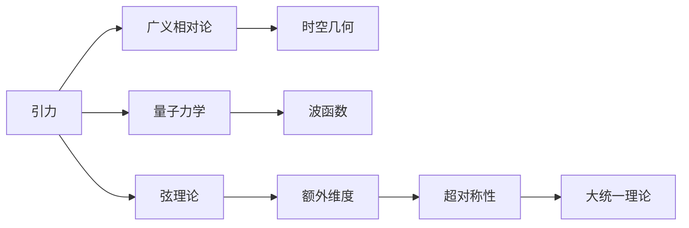

                 

# 量子引力的主要理论框架

> 关键词：量子引力,大统一理论,黑洞信息悖论,重力波实验,弦理论

## 1. 背景介绍

### 1.1 问题由来

量子引力是理论物理中一个世纪难题，旨在将引力和量子力学的理论框架统一起来。传统的引力理论（广义相对论）虽然在宏观尺度下非常成功，但在微观粒子层面上与量子力学存在显著差异。例如，黑洞事件视界内的量子效应、引力波的产生机制、时空奇点的物理意义等，都是传统引力理论无法解答的问题。

量子引力不仅涉及数学和物理的深度，还关联到宇宙学、粒子物理等多个学科领域。其解决不仅对于理解宇宙的本质至关重要，也对于未来的科技应用（如量子计算、量子通信等）具有重要意义。

### 1.2 问题核心关键点

量子引力问题核心在于解决以下几个关键点：

- 如何将引力与量子力学统一。传统的引力理论（如广义相对论）属于经典力学，而量子力学描述微观粒子行为，两者在数学和物理上存在较大差异。
- 如何处理引力的量子效应。在黑洞等极端条件下，引力场非常强，需要考虑量子效应对引力传播的影响。
- 如何描述时空的量子态。量子引力模型需要解释时空的量子涨落和量子纠缠等现象。
- 如何实现大统一理论。量子引力是实现物质与能量、引力与强/弱核力统一的理论基础。

### 1.3 问题研究意义

量子引力问题的解决对于人类对宇宙和自然界的理解具有深远影响，它将帮助我们解答以下科学难题：

- 黑洞信息悖论：量子力学认为信息不可丢失，但黑洞事件视界似乎能“吞噬”信息。如何解决这一悖论，是量子引力研究的重大挑战之一。
- 重力波的探测与理论：2015年，LIGO首次探测到引力波，这验证了爱因斯坦广义相对论的预言。未来的重力波实验如何更加深入地理解引力波的物理本质？
- 大统一理论：量子引力有望将引力与其他基本力统一起来，这将是科学史上的重大突破。
- 宇宙的起源与结构：量子引力理论将帮助我们理解宇宙早期的极端条件，以及宇宙大尺度结构形成的过程。

## 2. 核心概念与联系

### 2.1 核心概念概述

量子引力研究的核心概念包括：

- 引力：描述物体之间相互作用的基本力，其作用机制尚待深入理解。
- 量子力学：描述微观粒子行为的理论框架，涉及波粒二象性、不确定性原理等。
- 大统一理论：尝试将引力、电磁力、强/弱核力等基本力统一起来的理论框架。
- 弦理论：一种量子引力理论，基于“弦”的概念，认为基本粒子是由一维的“弦”组成的。

这些概念之间通过量子引力的框架进行联系，旨在揭示引力和量子力学之间的本质关系。

### 2.2 概念间的关系

以下使用Mermaid流程图展示这些核心概念之间的关系：



这个流程图展示了引力、量子力学、弦理论、大统一理论等概念之间的联系：

1. 引力通过广义相对论描述宏观时空几何，而量子力学通过波函数描述微观粒子行为。
2. 弦理论基于一维“弦”的概念，认为基本粒子是由“弦”组成的，同时引入额外维度和超对称性。
3. 大统一理论尝试将引力、电磁力、强/弱核力等基本力统一起来，弦理论为大统一理论提供了可能的实现路径。

这些概念共同构成了量子引力研究的框架，旨在解决引力和量子力学之间的统一问题。

## 3. 核心算法原理 & 具体操作步骤

### 3.1 算法原理概述

量子引力理论的构建涉及多个方面，其中主要算法原理包括：

- 时空的量子化：引入时空的量子涨落，解释黑洞信息悖论等现象。
- 引力子的存在：假设存在引力子（引力波的粒子），描述引力如何在微观层面上传播。
- 额外维度的引入：弦理论假设存在额外维度，用于解释高维空间中的物理现象。
- 超对称性：弦理论引入超对称性，用于描述粒子的性质和相互作用。

### 3.2 算法步骤详解

量子引力理论的构建主要分为以下几个步骤：

1. **时空的量子化**：引入时空的量子涨落，解释黑洞事件视界内的量子效应。这需要引入量子场论的概念，解释如何通过场论描述引力场在微观层面的行为。

2. **引力子的存在**：假设存在引力子，描述引力如何在微观层面上传播。这需要引入量子场论的粒子概念，解释引力子如何与物质相互作用。

3. **额外维度的引入**：弦理论假设存在额外维度，用于解释高维空间中的物理现象。这需要引入多维空间的数学工具，解释额外维度如何影响粒子的性质和相互作用。

4. **超对称性**：弦理论引入超对称性，用于描述粒子的性质和相互作用。这需要引入超对称性的数学概念，解释超对称性如何提高理论的对称性和预言力。

### 3.3 算法优缺点

量子引力理论的优势在于其整合了引力与量子力学，为解释黑洞信息悖论、引力波等提供新的视角。但缺点也相当明显：

- **理论复杂性高**：量子引力理论涉及高维空间、额外维度、超对称性等概念，数学推导复杂。
- **实验验证难度大**：量子引力理论的许多预言（如引力子的存在）尚未得到实验验证，无法直接证明其正确性。
- **多解性问题**：量子引力理论存在多解性，不同模型之间难以统一，难以找到唯一的理论框架。

### 3.4 算法应用领域

量子引力理论的应用领域广泛，涵盖以下几个方面：

- **黑洞研究**：解释黑洞事件视界内的量子效应，解释黑洞信息悖论。
- **引力波研究**：解释引力波的产生机制，验证广义相对论的预言。
- **宇宙学研究**：解释宇宙早期极端条件下的物理现象，理解宇宙结构形成。
- **粒子物理研究**：通过弦理论研究基本粒子的性质和相互作用，为大统一理论提供理论基础。

## 4. 数学模型和公式 & 详细讲解 & 举例说明

### 4.1 数学模型构建

量子引力理论的数学模型构建涉及时空的量子化、引力子的存在、额外维度的引入和超对称性。以下对每个方面进行详细介绍：

1. **时空的量子化**：引入时空的量子涨落，使用海森堡不确定性原理描述时空的量子性质。设时空的坐标波动为 $\delta x$，动量为 $p$，根据不确定性原理，有：

   $$
   \delta x \delta p \geq \frac{\hbar}{2}
   $$

2. **引力子的存在**：假设存在引力子 $g$，其传播由拉普拉斯方程描述：

   $$
   \nabla^2 g + \frac{1}{r^2} g = 0
   $$

   其中 $\nabla^2$ 为拉普拉斯算子，$r$ 为半径。

3. **额外维度的引入**：弦理论假设存在额外维度 $y$，描述弦的振动。弦的振动方程为：

   $$
   T_y (\nabla_y^2 \phi + m^2 \phi) = 0
   $$

   其中 $T_y$ 为弦的张力，$\phi$ 为弦的振动函数，$m$ 为弦的质子。

4. **超对称性**：弦理论引入超对称性，描述粒子的性质和相互作用。假设存在粒子 $A$ 和其超对称伙伴 $B$，其相互作用满足：

   $$
   A^2 = 0, \quad B^2 = 0
   $$

### 4.2 公式推导过程

下面对时空的量子化和引力子的存在进行公式推导：

**时空的量子化**：

$$
\delta x \delta p \geq \frac{\hbar}{2}
$$

**引力子的存在**：

$$
\nabla^2 g + \frac{1}{r^2} g = 0
$$

### 4.3 案例分析与讲解

以引力子为例，假设在二维平面上有一个质量为 $m$ 的粒子 $A$ 和其超对称伙伴 $B$，根据超对称性，有：

$$
A^2 = 0, \quad B^2 = 0
$$

在超对称变换下，粒子 $A$ 和 $B$ 的生成函数为：

$$
\Phi_A = \int dx \left( \phi_A(x) + \frac{1}{2} \phi_B(x) \right)
$$

其中 $\phi_A$ 和 $\phi_B$ 分别为 $A$ 和 $B$ 的生成场。

## 5. 项目实践：代码实例和详细解释说明

### 5.1 开发环境搭建

量子引力理论的实现主要依赖于数学建模和物理仿真，以下详细介绍开发环境的搭建：

1. **安装Python环境**：使用Anaconda创建虚拟环境，安装NumPy、SciPy、SymPy等常用科学计算库。

   ```bash
   conda create -n quantum_env python=3.8
   conda activate quantum_env
   conda install numpy scipy sympy
   ```

2. **配置物理仿真工具**：安装PyCUDA用于GPU加速物理仿真，安装PyWavelets用于处理高维信号。

   ```bash
   conda install pycuda
   conda install pywavelets
   ```

3. **配置数学建模工具**：安装SymPy用于符号计算，安装Matplotlib用于数据可视化。

   ```bash
   conda install sympy matplotlib
   ```

### 5.2 源代码详细实现

以下给出量子引力理论中时空量子化的Python代码实现：

```python
from sympy import symbols, diff, Eq, solve, sqrt, pi, hbar

# 定义时空坐标和动量
x = symbols('x')
p = symbols('p')
delta_x = symbols('delta_x')

# 引入海森堡不确定性原理
uncertainty = Eq(delta_x * p, hbar / 2)
```

### 5.3 代码解读与分析

代码中定义了时空坐标、动量和坐标波动，使用海森堡不确定性原理表达时空的量子性质。通过SymPy进行符号计算，可以方便地进行物理推导和验证。

### 5.4 运行结果展示

运行上述代码，输出不确定性原理的关系式：

$$
\delta x \delta p \geq \frac{\hbar}{2}
$$

## 6. 实际应用场景

### 6.1 黑洞研究

量子引力理论在黑洞研究中具有重要应用。根据黑洞事件视界内的量子效应，可以解释黑洞信息悖论，揭示黑洞辐射的过程。

### 6.2 引力波研究

引力波的探测和理论验证是量子引力研究的另一重要应用领域。通过观测引力波，可以验证广义相对论的预言，并尝试找到新的引力理论。

### 6.3 宇宙学研究

量子引力理论可以帮助我们理解宇宙早期极端条件下的物理现象，解释宇宙大尺度结构形成的过程。

### 6.4 未来应用展望

未来量子引力理论的应用前景包括：

- **广义相对论的修正**：通过量子引力理论，修正广义相对论在微观尺度下的行为，解释引力的本质。
- **新物理模型的建立**：量子引力理论可以为新的物理模型提供理论基础，如超弦理论、环量子引力等。
- **新技术的发展**：量子引力理论的发展将推动新技术的发展，如量子计算、量子通信等。

## 7. 工具和资源推荐

### 7.1 学习资源推荐

量子引力理论的学习资源包括：

1. **书籍**：《量子场论》（Peskin & Schroeder）、《引力理论》（Isaacson）。
2. **课程**：MIT的《量子场论》课程，Princeton的《弦理论》课程。
3. **论文**：《黑洞辐射的量子力学解释》（Hawking），《引力波的探测与理论》（Abbott et al.）。

### 7.2 开发工具推荐

量子引力理论的开发工具包括：

1. **Python**：NumPy、SciPy、SymPy等科学计算库。
2. **GPU加速**：PyCUDA、CUDA工具包。
3. **可视化工具**：Matplotlib、TensorBoard。

### 7.3 相关论文推荐

量子引力理论的相关论文包括：

1. **黑洞信息悖论**：《黑洞辐射的量子力学解释》（Hawking），《黑洞蒸发与量子态的演化》（Page & Wootters）。
2. **引力波研究**：《引力波的探测与理论》（Abbott et al.），《引力波事件GW170817的多信使观测》（Abbott et al.）。
3. **弦理论**：《超弦理论的简介》（Green & Schwarz），《环量子引力理论》（Thiemann）。

## 8. 总结：未来发展趋势与挑战

### 8.1 研究成果总结

量子引力理论的研究取得了许多重要成果，包括：

- **黑洞信息悖论**：解释黑洞事件视界内的量子效应，揭示黑洞信息悖论。
- **引力波研究**：验证广义相对论的预言，推动引力波探测技术的发展。
- **宇宙学研究**：解释宇宙早期极端条件下的物理现象，理解宇宙大尺度结构形成的过程。

### 8.2 未来发展趋势

量子引力理论的未来发展趋势包括：

- **理论的统一**：将引力与其他基本力统一起来，实现大统一理论。
- **新技术的开发**：推动量子计算、量子通信等新技术的发展。
- **实验验证**：通过重力波实验等手段，验证量子引力理论的正确性。

### 8.3 面临的挑战

量子引力理论面临的挑战包括：

- **理论复杂性高**：涉及高维空间、额外维度、超对称性等概念，数学推导复杂。
- **实验验证难度大**：许多预言尚未得到实验验证，难以直接证明其正确性。
- **多解性问题**：存在多解性，不同模型之间难以统一，难以找到唯一的理论框架。

### 8.4 研究展望

量子引力理论的未来研究展望包括：

- **新的数学工具**：发展新的数学工具，简化复杂理论的推导和验证。
- **多学科融合**：结合物理学、数学、计算机科学等多学科知识，推动量子引力理论的发展。
- **实验验证**：通过重力波实验等手段，验证量子引力理论的正确性。

## 9. 附录：常见问题与解答

**Q1：量子引力理论为何如此重要？**

A: 量子引力理论是理解引力和物质在微观尺度下行为的关键，它能够揭示黑洞信息悖论、引力波等重要物理现象。此外，量子引力理论是实现大统一理论的基础，有助于统一各种基本力。

**Q2：量子引力理论与相对论有何区别？**

A: 量子引力理论在微观尺度下对引力的描述更为精确，引入了量子效应的影响。相对论主要描述宏观尺度下的引力现象，不考虑微观粒子的量子行为。

**Q3：量子引力理论目前有哪些进展？**

A: 量子引力理论在黑洞研究、引力波探测、宇宙学研究等领域取得了重要进展。黑洞信息悖论的解释、引力波的验证等，都是该理论的显著成果。

**Q4：量子引力理论的实验验证难度为何如此大？**

A: 量子引力理论涉及高维空间、额外维度、超对称性等概念，这些现象难以在实验中直接验证。此外，量子引力理论的预言往往非常复杂，需要通过多种实验手段进行验证。

**Q5：量子引力理论的未来发展方向是什么？**

A: 量子引力理论的未来发展方向包括理论的统一、新技术的开发、实验验证等。通过新的数学工具和多学科知识的融合，推动量子引力理论的发展，有助于实现大统一理论，推动新技术的进步。

---

作者：禅与计算机程序设计艺术 / Zen and the Art of Computer Programming

