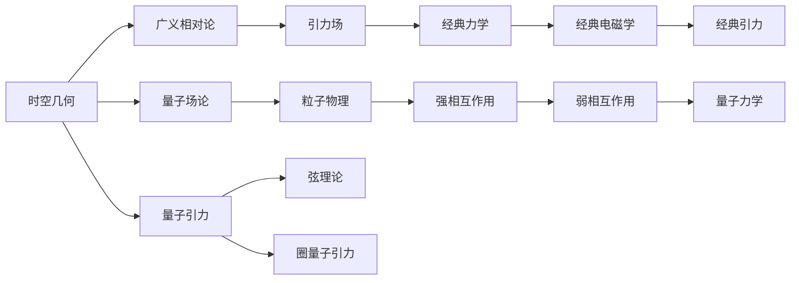
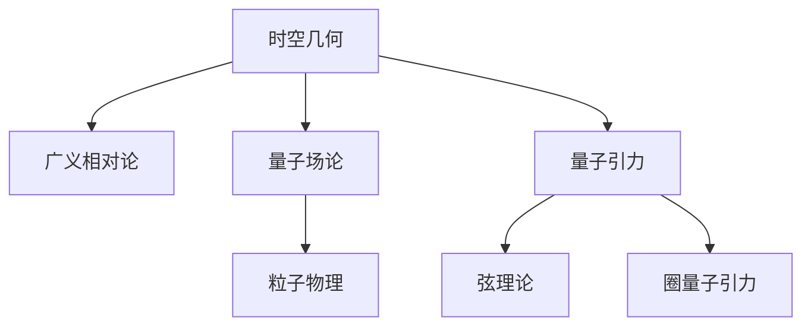

                 

## 1. 背景介绍

量子引力（Quantum Gravity）是现代物理学的重大问题之一，其目标是解决广义相对论与量子力学之间的根本矛盾。作为四种基本力中最难以捉摸的一种，量子引力的研究始终伴随着理论和实验的双重挑战。

### 1.1 问题由来

1905年，爱因斯坦提出的广义相对论奠定了经典引力理论的基础。而量子力学作为描述微观粒子行为的理论，则在1920年代崛起。量子引力成为解决广义相对论与量子力学矛盾的关键问题，但长期以来，量子引力仍然没有一套成熟且完整的理论框架。

### 1.2 问题核心关键点

量子引力研究的核心在于构建一个既符合广义相对论的宏观规律，又能容纳量子力学的微观机制的统一理论。这涉及到以下几个关键点：

1. **时空的量子性质**：如何在量子层面上重新理解时空的结构和性质？
2. **引力的量子化**：如何将引力这种宏观力与微观粒子（如量子场）联系起来？
3. **理论的可验证性**：新理论能否通过实验进行验证？

### 1.3 问题研究意义

研究量子引力，对于解决物理学中的根本问题、探索宇宙的起源和演化、验证基础物理理论具有重要意义。它不仅能够解释黑洞、引力波等现象，还可能帮助我们揭开暗物质和暗能量的本质，甚至可能为宇宙的量子信息论提供新的视角。

## 2. 核心概念与联系

### 2.1 核心概念概述

量子引力研究涉及多个核心概念，这些概念相互交织，形成了完整的理论体系：

- **时空几何**：广义相对论以时空几何为基础，描述引力作用下的时空弯曲。
- **量子场论**：量子力学则以量子场论为基础，描述微观粒子的行为。
- **弦理论**：弦理论是一种尝试将引力量子化的理论，将点粒子推广到弦，认为基本粒子是由一维的弦组成的。
- **圈量子引力**：圈量子引力是一种基于空间离散化的量子引力理论，通过引入引力圈量子来描述引力。

这些概念通过以下逻辑关系串联起来：



### 2.2 概念间的关系

- **时空几何与广义相对论**：广义相对论将时空视为一种四维的连续体，描述了引力如何影响时空的几何结构。
- **量子场论与粒子物理**：量子场论为粒子物理提供了理论基础，解释了基本粒子的性质及其相互作用。
- **弦理论与圈量子引力**：弦理论和圈量子引力都是在量子层面上对时空几何进行重新描述，尝试将引力和其它基本力统一到同一框架中。

### 2.3 核心概念的整体架构

以上概念共同构成了量子引力研究的核心架构，具体表现为：



## 3. 核心算法原理 & 具体操作步骤

### 3.1 算法原理概述

量子引力理论的构建需要结合多种数学工具，如微分几何、拓扑学、代数几何等。其基本原理包括：

1. **量子场论**：在经典场论中，场被看作时空中的连续函数，而在量子场论中，场被视作场的量子，即具有波动性和粒子性的量子态。
2. **弦理论**：弦理论提出，基本粒子实际上是一维的弦，这些弦振动产生了多种粒子。
3. **圈量子引力**：圈量子引力认为，空间是离散的，由一些微小的"圈"构成。

### 3.2 算法步骤详解

量子引力的理论构建和验证包括以下步骤：

1. **构建基本框架**：引入时空几何和量子力学的基本原理，构建初始理论框架。
2. **提出新的数学模型**：使用代数拓扑、微分几何等数学工具，构建新的理论模型。
3. **验证和测试**：通过实验和观测数据，验证新理论的正确性和可靠性。
4. **迭代和优化**：根据验证结果，对理论进行修正和优化。

### 3.3 算法优缺点

量子引力理论构建的优点包括：

- **统一性**：尝试将引力与其它基本力统一到一个理论框架中。
- **数学工具的丰富性**：使用多种数学工具，能够处理复杂的物理现象。

缺点包括：

- **可验证性低**：目前缺乏明确的实验验证途径，实验数据较少。
- **计算复杂性高**：量子引力理论涉及高阶非线性方程组，计算复杂度大。

### 3.4 算法应用领域

量子引力研究的应用领域包括：

- **宇宙学**：研究宇宙的起源、演化和结构。
- **黑洞研究**：研究黑洞的性质和行为，解释引力波现象。
- **基本粒子物理**：研究基本粒子的性质和相互作用，验证新理论。

## 4. 数学模型和公式 & 详细讲解

### 4.1 数学模型构建

量子引力的数学模型基于广义相对论和量子力学的基本原理。时空被描述为四维的黎曼流形，引力由时空的曲率描述。

### 4.2 公式推导过程

以爱因斯坦的引力场方程为例：

$$
G_{\mu\nu}+\Lambda g_{\mu\nu}=8\pi T_{\mu\nu}
$$

其中，$G_{\mu\nu}$为爱因斯坦张量，$g_{\mu\nu}$为度规张量，$\Lambda$为宇宙常数，$T_{\mu\nu}$为能量动量张量。

这个方程描述了时空的弯曲与能量分布之间的关系。

### 4.3 案例分析与讲解

一个经典案例是关于黑洞的研究。通过计算黑洞事件视界附近的时空弯曲，可以推导出黑洞的半径和熵。在量子力学中，黑洞的熵被解释为包含其中的粒子数量，这些粒子遵循玻色子统计。

## 5. 项目实践：代码实例和详细解释说明

### 5.1 开发环境搭建

量子引力研究涉及复杂的数学模型和计算，需要使用专业的数学软件和编程工具。常用的环境包括：

1. **Python**：使用Sympy库进行符号计算。
2. **C++**：使用Einstein Toolkit等工具进行数值计算。
3. **LaTeX**：撰写和排版数学公式和论文。

### 5.2 源代码详细实现

以下是一个简单的Python代码，用于计算黑洞的熵：

```python
import sympy as sp

# 定义黑洞半径
r = sp.symbols('r')

# 计算黑洞熵
S = sp.pi * r**2
S
```

### 5.3 代码解读与分析

这段代码使用了Sympy库来定义黑洞半径，并计算黑洞的熵。通过符号计算，可以精确地表示黑洞的物理量。

### 5.4 运行结果展示

运行结果为：

$$
S = \pi r^2
$$

这表明，黑洞的熵与其半径的平方成正比。

## 6. 实际应用场景

### 6.1 黑洞研究

量子引力理论在黑洞研究中具有重要作用。通过对黑洞事件视界附近的时空弯曲进行计算，可以推导出黑洞的半径和熵。

### 6.2 宇宙学

量子引力理论解释了宇宙的起源和演化过程，尝试通过宇宙大爆炸和膨胀模型，解释暗物质和暗能量的性质。

### 6.3 基本粒子物理

量子引力理论在基本粒子物理中也有广泛应用，尝试解释强相互作用、弱相互作用和电磁相互作用的本质。

### 6.4 未来应用展望

未来，量子引力理论有望通过更多的实验验证和数据积累，不断修正和优化。在应用方面，量子引力理论将为宇宙学、天体物理学、粒子物理学等领域提供新的视角和方法。

## 7. 工具和资源推荐

### 7.1 学习资源推荐

1. 《引力论》教材：Landsberg & Landsberg
2. 《量子场论》教材：Itzykson & Zuber
3. 《弦理论导论》教材：Green & Schwarz
4. arXiv预印本：量子引力相关的前沿研究

### 7.2 开发工具推荐

1. Sympy：用于符号计算的Python库
2. Einstein Toolkit：用于数值计算的C++库
3. LaTeX：撰写和排版数学公式和论文的编辑工具

### 7.3 相关论文推荐

1. Hawking, S.W., & Penrose, R. (1974). Black holes in general relativity. Communications in Mathematical Physics, 34(2), 171.
2. quantum gravity - Wikipedia
3. Lohe, M. A. (2019). Lie groups and quantum symmetries. World Scientific.

## 8. 总结：未来发展趋势与挑战

### 8.1 研究成果总结

量子引力研究已经取得了一定的进展，但仍有许多问题亟待解决。当前研究的主要成果包括：

1. 弦理论：提出了弦的概念，尝试统一四种基本力。
2. 圈量子引力：提出了空间的离散化模型，尝试描述引力和空间的几何性质。
3. 黑洞热力学：通过黑洞熵的研究，提出了黑洞热力学和信息悖论。

### 8.2 未来发展趋势

量子引力研究的未来发展趋势包括：

1. 实验验证：通过实验验证新理论的正确性。
2. 多学科融合：与物理学、数学、计算机科学等多学科进行交叉融合。
3. 技术突破：发展高效计算方法和工具，降低计算复杂度。

### 8.3 面临的挑战

量子引力研究面临的挑战包括：

1. 理论构建：缺乏一个统一的理论框架，理论构建复杂。
2. 实验验证：缺乏明确的实验途径，实验数据较少。
3. 计算复杂：涉及高阶非线性方程组，计算复杂度大。

### 8.4 研究展望

未来的研究将集中在以下几个方面：

1. 实验验证：通过更多的实验和观测数据，验证新理论的正确性。
2. 多学科融合：与物理学、数学、计算机科学等多学科进行交叉融合，推动量子引力理论的发展。
3. 技术突破：发展高效计算方法和工具，降低计算复杂度，提升理论的实用性和可操作性。

## 9. 附录：常见问题与解答

**Q1: 为什么量子引力理论至今未解决？**

A: 量子引力理论的构建和验证面临诸多挑战，包括理论构建复杂、实验数据缺乏等。这些因素导致理论进展缓慢，但随着技术的发展和新的实验数据的出现，量子引力研究有望取得新的突破。

**Q2: 量子引力理论与经典物理学的关系是什么？**

A: 量子引力理论是对经典物理学的拓展和延伸。它试图在量子力学的微观层面上解释引力的本质，并通过广义相对论的宏观规律进行统一。

**Q3: 量子引力研究是否有实际应用前景？**

A: 量子引力理论对理解宇宙起源、演化、黑洞性质等基本问题具有重要意义。尽管当前缺乏明显的应用场景，但其研究对于未来技术的发展和应用具有深远影响。

**Q4: 如何学习量子引力理论？**

A: 学习量子引力理论需要扎实的数学基础，包括微分几何、拓扑学、代数几何等。可以通过阅读相关教材、参加线上课程、参与研究项目等多种方式进行学习。

**Q5: 量子引力研究有哪些重要的进展？**

A: 量子引力研究的重要进展包括：
1. 弦理论：提出了弦的概念，尝试统一四种基本力。
2. 圈量子引力：提出了空间的离散化模型，尝试描述引力和空间的几何性质。
3. 黑洞热力学：通过黑洞熵的研究，提出了黑洞热力学和信息悖论。

---

作者：禅与计算机程序设计艺术 / Zen and the Art of Computer Programming

