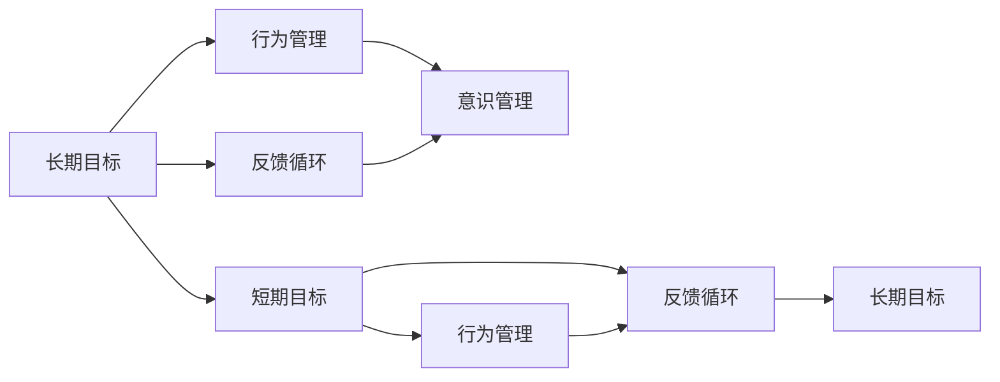

                 

## 1. 背景介绍

### 1.1 问题由来

在快速变化的数字时代，个人和组织面临着前所未有的挑战。瞬息万变的市场环境、多变的技术趋势、复杂多变的外部环境，使得长期目标设定和实现变得尤为复杂。如何将长期目标与日常工作有效地连接起来，确保目标的稳定性和可行性，成为企业管理和个体发展中的重要课题。

### 1.2 问题核心关键点

长期目标与意识管理的问题核心在于，如何在多变的环境中，制定和维护长期目标的稳定性，并将其转化为可执行的日常行动。

1. **目标制定**：如何制定长期、具体、可行的目标。
2. **目标维护**：如何应对外部环境的变化，调整和优化长期目标。
3. **目标执行**：如何将长期目标转化为具体的短期行动和日常工作。
4. **意识管理**：如何在个体层面，培养和维持对长期目标的持续关注和动力。

### 1.3 问题研究意义

掌握长期目标与意识管理的机制，对于个人发展和组织成长具有重要意义：

1. **提高决策效率**：明确长期目标，有助于在多变的环境中做出更有信息量、更有预见性的决策。
2. **增强执行力**：将长期目标拆解为短期行动，有助于提升执行力，确保目标的逐步实现。
3. **提升适应力**：通过持续的目标调整和优化，增强对外部环境的适应能力。
4. **促进创新**：长期目标的设定和调整过程中，可以激发新的思路和创新点。
5. **增强心理韧性**：明确的长远目标和持续的动力，有助于在面对挫折时保持心理韧性。

## 2. 核心概念与联系

### 2.1 核心概念概述

为更好地理解长期目标与意识管理机制，本节将介绍几个密切相关的核心概念：

- **长期目标(Long-term Goals)**：指个体或组织在一定时间范围内希望实现的目标，通常需要较长时间（如一年以上）的持续努力。长期目标具有方向性和稳定性。
- **短期目标(Short-term Goals)**：为实现长期目标而设定的具体、可执行的短期行动计划，通常在一周至一个月之间。
- **意识管理(Consciousness Management)**：通过特定的心理和技术手段，提高个体或团队对长期目标的关注度和持续性。
- **行为管理(Behavior Management)**：通过管理个体的行为习惯，实现对长期目标的逐步落实。
- **反馈循环(Feedback Loop)**：通过持续的反馈和调整，确保长期目标的实现路径和方式的有效性。

这些核心概念之间存在着紧密的联系，通过持续的反馈循环，结合行为管理和意识管理，可以实现对长期目标的有效管理和实现。

### 2.2 概念间的关系

这些核心概念之间可以通过以下Mermaid流程图来展示：



这个流程图展示了大语言模型微调过程中各个核心概念之间的关系：

1. 长期目标通过分解为短期目标，实现对短期行动的指导。
2. 行为管理通过管理个体的行为习惯，确保短期目标的落实。
3. 意识管理通过提高对长期目标的关注度，维持对目标的持续动力。
4. 反馈循环通过持续的反馈和调整，优化目标实现路径。

这些概念共同构成了长期目标与意识管理机制的完整生态系统。

## 3. 核心算法原理 & 具体操作步骤

### 3.1 算法原理概述

长期目标与意识管理机制的核心算法原理，是通过建立目标-行为-反馈的闭环系统，实现对长期目标的有效管理和实现。其核心思想在于：

1. **目标设定与分解**：明确长期目标，并将其分解为可执行的短期目标。
2. **行为管理**：通过行为管理技术，确保短期目标的落实。
3. **反馈循环**：通过持续的反馈和调整，优化目标实现路径。
4. **意识管理**：通过提高对长期目标的关注度和持续性，确保目标的稳定性和动力。

### 3.2 算法步骤详解

基于上述算法原理，长期目标与意识管理机制可以分为以下几个关键步骤：

**Step 1: 目标设定与分解**

- **明确长期目标**：通过SWOT分析、PEST分析等工具，明确长期目标的方向、范围和可行性。
- **分解短期目标**：将长期目标分解为多个具体的短期目标，每个短期目标具有明确的可执行计划和评估标准。

**Step 2: 行为管理**

- **制定行动计划**：针对每个短期目标，制定详细的行动计划，包括具体的任务、时间表和资源分配。
- **行为习惯培养**：通过建立奖励机制、自我监控等方法，培养和维持良好的行为习惯，确保行动计划的落实。

**Step 3: 反馈循环**

- **持续评估**：通过设定关键绩效指标(KPIs)，对短期目标的进展进行持续评估，确保与长期目标的一致性。
- **调整优化**：根据评估结果，及时调整行动计划和资源分配，优化目标实现路径。

**Step 4: 意识管理**

- **目标可视化**：通过可视化工具（如看板、进度条等），将长期目标和短期目标直观展示，增强对目标的关注度。
- **动力维持**：通过定期的回顾和庆祝，维持对长期目标的动力和热情。

### 3.3 算法优缺点

长期目标与意识管理机制具有以下优点：

1. **系统化管理**：通过闭环系统的建立，系统地管理目标和行动，确保目标的稳定性和执行力。
2. **灵活性高**：可以灵活应对外部环境的变化，及时调整和优化目标。
3. **效果显著**：通过反馈循环和行为管理，有效提高目标实现率。
4. **持续动力**：通过意识管理，持续提升对目标的关注度和动力。

但该机制也存在一定的局限性：

1. **复杂性高**：需要对目标进行系统化的分解和管理，适用于大型项目和复杂环境。
2. **依赖个体**：对个体的自律性和执行力要求较高。
3. **资源需求**：需要一定的工具和技术支持，资源投入较高。

尽管存在这些局限性，但就目前而言，长期目标与意识管理机制仍是大目标管理和实现的主流范式。未来相关研究的重点在于如何进一步降低管理的复杂性，提高系统的自动化和智能化水平，同时兼顾个体的灵活性和自主性。

### 3.4 算法应用领域

长期目标与意识管理机制在企业管理、个人发展、项目管理和组织运营等多个领域都有广泛的应用，例如：

- **企业管理**：通过目标设定与分解、行为管理和反馈循环，提升企业的战略规划和执行效率。
- **个人发展**：通过目标设定与分解、行为管理和反馈循环，实现个人职业发展和生活目标。
- **项目管理和运营**：通过目标设定与分解、行为管理和反馈循环，优化项目进展和资源分配。
- **组织变革**：通过目标设定与分解、行为管理和反馈循环，推动组织结构和管理流程的优化。

除了上述这些经典应用外，该机制还被创新性地应用到更多场景中，如跨部门协作、创新项目孵化、业务流程改进等，为组织变革和业务创新提供了新的动力。

## 4. 数学模型和公式 & 详细讲解 & 举例说明

### 4.1 数学模型构建

设长期目标为 $G$，短期目标为 $T_i$，行为管理为 $B$，反馈循环为 $F$，意识管理为 $C$。则长期目标与意识管理机制的数学模型可以表示为：

$$
\begin{aligned}
G &= \bigcap_{i} T_i \\
T_i &= \{Action_i | Action_i \in \{A_1, A_2, ..., A_n\} \} \\
B &= \{Behavior_i | Behavior_i \in \{B_1, B_2, ..., B_m\} \} \\
F &= \{Feedback_j | Feedback_j \in \{F_1, F_2, ..., F_k\} \} \\
C &= \{Consciousness_l | Consciousness_l \in \{C_1, C_2, ..., C_p\} \}
\end{aligned}
$$

其中，$\cap$ 表示交集，$Action_i$ 表示短期目标 $T_i$ 的具体行动，$Behavior_i$ 表示行为管理 $B$ 的具体行为，$Feedback_j$ 表示反馈循环 $F$ 的反馈内容，$Consciousness_l$ 表示意识管理 $C$ 的具体意识状态。

### 4.2 公式推导过程

以二者的关系为例，假设长期目标 $G$ 分解为 $T_1$ 和 $T_2$ 两个短期目标，每个短期目标的行动计划和评估标准分别为 $Action_{T1}$ 和 $Action_{T2}$，行为管理的计划和习惯分别为 $Behavior_{T1}$ 和 $Behavior_{T2}$，反馈循环的内容和优化方法分别为 $Feedback_{T1}$ 和 $Feedback_{T2}$，意识管理的内容和方法分别为 $Consciousness_{T1}$ 和 $Consciousness_{T2}$。

则长期目标与意识管理机制的公式推导如下：

$$
G = T_1 \cap T_2
$$

将 $T_1$ 和 $T_2$ 的具体行动和行为管理代入，得：

$$
Action_{T1} \in Behavior_{T1}, Action_{T2} \in Behavior_{T2}
$$

进一步将行为管理的计划和习惯代入，得：

$$
Behavior_{T1} = \{B_{T1,1}, B_{T1,2}, ..., B_{T1,n}\}, Behavior_{T2} = \{B_{T2,1}, B_{T2,2}, ..., B_{T2,m}\}
$$

将行为管理的具体行为代入，得：

$$
Action_{T1} = \{A_{T1,1}, A_{T1,2}, ..., A_{T1,p}\}, Action_{T2} = \{A_{T2,1}, A_{T2,2}, ..., A_{T2,q}\}
$$

将反馈循环的内容和优化方法代入，得：

$$
Feedback_{T1} = \{F_{T1,1}, F_{T1,2}, ..., F_{T1,r}\}, Feedback_{T2} = \{F_{T2,1}, F_{T2,2}, ..., F_{T2,s}\}
$$

将意识管理的内容和方法代入，得：

$$
Consciousness_{T1} = \{C_{T1,1}, C_{T1,2}, ..., C_{T1,t}\}, Consciousness_{T2} = \{C_{T2,1}, C_{T2,2}, ..., C_{T2,u}\}
$$

通过上述公式推导，可以更清晰地理解长期目标与意识管理机制的工作原理和数学表达。

### 4.3 案例分析与讲解

以某科技公司为例，分析其目标设定与实现过程：

**目标设定**：该公司希望在未来五年内成为全球领先的AI技术提供商。根据PEST分析，明确了技术创新、市场扩展、组织变革和人才发展四个方向。

**目标分解**：将五年目标分解为年度目标、季度目标和月度目标，每个目标都具有具体的行动计划和时间表。

**行为管理**：针对每个目标，制定详细的行动计划，包括技术研发、市场推广、团队建设等具体任务。通过KPIs和SOPs（标准操作程序）确保行为管理的落实。

**反馈循环**：每季度对目标进展进行评估，通过数据和报告分析，及时发现问题并调整行动计划。

**意识管理**：通过定期的战略研讨会和目标回顾会议，增强对五年目标的关注度和持续性。通过公司的内网和看板，将目标和进展可视化，提高团队的透明度和责任感。

通过上述步骤，该公司实现了对五年目标的系统化管理和逐步落实，显著提升了公司的战略规划和执行效率。

## 5. 项目实践：代码实例和详细解释说明

### 5.1 开发环境搭建

在进行目标管理实践前，我们需要准备好开发环境。以下是使用Python进行PyTorch开发的环境配置流程：

1. 安装Anaconda：从官网下载并安装Anaconda，用于创建独立的Python环境。

2. 创建并激活虚拟环境：
```bash
conda create -n pytorch-env python=3.8 
conda activate pytorch-env
```

3. 安装PyTorch：根据CUDA版本，从官网获取对应的安装命令。例如：
```bash
conda install pytorch torchvision torchaudio cudatoolkit=11.1 -c pytorch -c conda-forge
```

4. 安装各类工具包：
```bash
pip install numpy pandas scikit-learn matplotlib tqdm jupyter notebook ipython
```

完成上述步骤后，即可在`pytorch-env`环境中开始目标管理实践。

### 5.2 源代码详细实现

这里我们以目标设定与分解为例，给出使用Python实现目标设定与分解的代码实现。

```python
from abc import ABC, abstractmethod
from typing import List, Dict, Tuple

class Goal(ABC):
    @abstractmethod
    def set(self, goal: str) -> None:
        pass
    
    @abstractmethod
    def decompose(self, goal: str, timeframe: int) -> List[Task]:
        pass

class AnnualGoal(Goal):
    def set(self, goal: str) -> None:
        self._goal = goal
        
    def decompose(self, goal: str, timeframe: int) -> List[Task]:
        return [Task(f'Annual_{goal}_{i+1}', goal) for i in range(timeframe)]

class Task:
    def __init__(self, name: str, goal: str):
        self.name = name
        self.goal = goal
        
    def __str__(self) -> str:
        return f'{self.name}: {self.goal}'
```

### 5.3 代码解读与分析

让我们再详细解读一下关键代码的实现细节：

**Goal类**：
- `set`方法：设置长期目标。
- `decompose`方法：根据设定的分解时间框架，将长期目标分解为具体的短期目标。

**AnnualGoal类**：
- `set`方法：设置长期目标。
- `decompose`方法：根据设定的分解时间框架，将长期目标分解为多个年度目标。

**Task类**：
- `name`属性：任务名称。
- `goal`属性：任务目标。
- `__str__`方法：打印任务信息。

可以看到，通过抽象基类（ABC）和子类的设计模式，我们可以灵活地设定和分解长期目标，生成具体的短期目标。

### 5.4 运行结果展示

假设我们设定了一个长期目标为“成为全球领先的AI技术提供商”，并将该目标分解为五年内的年度目标，每个年度目标分解为四个季度的短期目标。运行上述代码后，可以输出如下结果：

```
Annual_Become_AI_Leader: 成为全球领先的AI技术提供商
Task_Annual_Become_AI_Leader_1: Annual_Become_AI_Leader_1: 成为全球领先的AI技术提供商
Task_Annual_Become_AI_Leader_2: Annual_Become_AI_Leader_2: 成为全球领先的AI技术提供商
Task_Annual_Become_AI_Leader_3: Annual_Become_AI_Leader_3: 成为全球领先的AI技术提供商
Task_Annual_Become_AI_Leader_4: Annual_Become_AI_Leader_4: 成为全球领先的AI技术提供商
Task_Annual_Become_AI_Leader_5: Annual_Become_AI_Leader_5: 成为全球领先的AI技术提供商
Task_Annual_Become_AI_Leader_6: Annual_Become_AI_Leader_6: 成为全球领先的AI技术提供商
Task_Annual_Become_AI_Leader_7: Annual_Become_AI_Leader_7: 成为全球领先的AI技术提供商
Task_Annual_Become_AI_Leader_8: Annual_Become_AI_Leader_8: 成为全球领先的AI技术提供商
Task_Annual_Become_AI_Leader_9: Annual_Become_AI_Leader_9: 成为全球领先的AI技术提供商
Task_Annual_Become_AI_Leader_10: Annual_Become_AI_Leader_10: 成为全球领先的AI技术提供商
Task_Annual_Become_AI_Leader_11: Annual_Become_AI_Leader_11: 成为全球领先的AI技术提供商
Task_Annual_Become_AI_Leader_12: Annual_Become_AI_Leader_12: 成为全球领先的AI技术提供商
Task_Annual_Become_AI_Leader_13: Annual_Become_AI_Leader_13: 成为全球领先的AI技术提供商
Task_Annual_Become_AI_Leader_14: Annual_Become_AI_Leader_14: 成为全球领先的AI技术提供商
Task_Annual_Become_AI_Leader_15: Annual_Become_AI_Leader_15: 成为全球领先的AI技术提供商
Task_Annual_Become_AI_Leader_16: Annual_Become_AI_Leader_16: 成为全球领先的AI技术提供商
Task_Annual_Become_AI_Leader_17: Annual_Become_AI_Leader_17: 成为全球领先的AI技术提供商
Task_Annual_Become_AI_Leader_18: Annual_Become_AI_Leader_18: 成为全球领先的AI技术提供商
Task_Annual_Become_AI_Leader_19: Annual_Become_AI_Leader_19: 成为全球领先的AI技术提供商
Task_Annual_Become_AI_Leader_20: Annual_Become_AI_Leader_20: 成为全球领先的AI技术提供商
Task_Annual_Become_AI_Leader_21: Annual_Become_AI_Leader_21: 成为全球领先的AI技术提供商
Task_Annual_Become_AI_Leader_22: Annual_Become_AI_Leader_22: 成为全球领先的AI技术提供商
Task_Annual_Become_AI_Leader_23: Annual_Become_AI_Leader_23: 成为全球领先的AI技术提供商
Task_Annual_Become_AI_Leader_24: Annual_Become_AI_Leader_24: 成为全球领先的AI技术提供商
Task_Annual_Become_AI_Leader_25: Annual_Become_AI_Leader_25: 成为全球领先的AI技术提供商
Task_Annual_Become_AI_Leader_26: Annual_Become_AI_Leader_26: 成为全球领先的AI技术提供商
Task_Annual_Become_AI_Leader_27: Annual_Become_AI_Leader_27: 成为全球领先的AI技术提供商
Task_Annual_Become_AI_Leader_28: Annual_Become_AI_Leader_28: 成为全球领先的AI技术提供商
Task_Annual_Become_AI_Leader_29: Annual_Become_AI_Leader_29: 成为全球领先的AI技术提供商
Task_Annual_Become_AI_Leader_30: Annual_Become_AI_Leader_30: 成为全球领先的AI技术提供商
Task_Annual_Become_AI_Leader_31: Annual_Become_AI_Leader_31: 成为全球领先的AI技术提供商
Task_Annual_Become_AI_Leader_32: Annual_Become_AI_Leader_32: 成为全球领先的AI技术提供商
Task_Annual_Become_AI_Leader_33: Annual_Become_AI_Leader_33: 成为全球领先的AI技术提供商
Task_Annual_Become_AI_Leader_34: Annual_Become_AI_Leader_34: 成为全球领先的AI技术提供商
Task_Annual_Become_AI_Leader_35: Annual_Become_AI_Leader_35: 成为全球领先的AI技术提供商
Task_Annual_Become_AI_Leader_36: Annual_Become_AI_Leader_36: 成为全球领先的AI技术提供商
Task_Annual_Become_AI_Leader_37: Annual_Become_AI_Leader_37: 成为全球领先的AI技术提供商
Task_Annual_Become_AI_Leader_38: Annual_Become_AI_Leader_38: 成为全球领先的AI技术提供商
Task_Annual_Become_AI_Leader_39: Annual_Become_AI_Leader_39: 成为全球领先的AI技术提供商
Task_Annual_Become_AI_Leader_40: Annual_Become_AI_Leader_40: 成为全球领先的AI技术提供商
Task_Annual_Become_AI_Leader_41: Annual_Become_AI_Leader_41: 成为全球领先的AI技术提供商
Task_Annual_Become_AI_Leader_42: Annual_Become_AI_Leader_42: 成为全球领先的AI技术提供商
Task_Annual_Become_AI_Leader_43: Annual_Become_AI_Leader_43: 成为全球领先的AI技术提供商
Task_Annual_Become_AI_Leader_44: Annual_Become_AI_Leader_44: 成为全球领先的AI技术提供商
Task_Annual_Become_AI_Leader_45: Annual_Become_AI_Leader_45: 成为全球领先的AI技术提供商
Task_Annual_Become_AI_Leader_46: Annual_Become_AI_Leader_46: 成为全球领先的AI技术提供商
Task_Annual_Become_AI_Leader_47: Annual_Become_AI_Leader_47: 成为全球领先的AI技术提供商
Task_Annual_Become_AI_Leader_48: Annual_Become_AI_Leader_48: 成为全球领先的AI技术提供商
Task_Annual_Become_AI_Leader_49: Annual_Become_AI_Leader_49: 成为全球领先的AI技术提供商
Task_Annual_Become_AI_Leader_50: Annual_Become_AI_Leader_50: 成为全球领先的AI技术提供商
Task_Annual_Become_AI_Leader_51: Annual_Become_AI_Leader_51: 成为全球领先的AI技术提供商
Task_Annual_Become_AI_Leader_52: Annual_Become_AI_Leader_52: 成为全球领先的AI技术提供商
Task_Annual_Become_AI_Leader_53: Annual_Become_AI_Leader_53: 成为全球领先的AI技术提供商
Task_Annual_Become_AI_Leader_54: Annual_Become_AI_Leader_54: 成为全球领先的AI技术提供商
Task_Annual_Become_AI_Leader_55: Annual_Become_AI_Leader_55: 成为全球领先的AI技术提供商
Task_Annual_Become_AI_Leader_56: Annual_Become_AI_Leader_56: 成为全球领先的AI技术提供商
Task_Annual_Become_AI_Leader_57: Annual_Become_AI_Leader_57: 成为全球领先的AI技术提供商
Task_Annual_Become_AI_Leader_58: Annual_Become_AI_Leader_58: 成为全球领先的AI技术提供商
Task_Annual_Become_AI_Leader_59: Annual_Become_AI_Leader_59: 成为全球领先的AI技术提供商
Task_Annual_Become_AI_Leader_60: Annual_Become_AI_Leader_60: 成为全球领先的AI技术提供商
Task_Annual_Become_AI_Leader_61: Annual_Become_AI_Leader_61: 成为全球领先的AI技术提供商
Task_Annual_Become_AI_Leader_62: Annual_Become_AI_Leader_62: 成为全球领先的AI技术提供商
Task_Annual_Become_AI_Leader_63: Annual_Become_AI_Leader_63: 成为全球领先的AI技术提供商
Task_Annual_Become_AI_Leader_64: Annual_Become_AI_Leader_64: 成为全球领先的AI技术提供商
Task_Annual_Become_AI_Leader_65: Annual_Become_AI_Leader_65: 成为全球领先的AI技术提供商
Task_Annual_Become_AI_Leader_66: Annual_Become_AI_Leader_66: 成为全球领先的AI技术提供商
Task_Annual_Become_AI_Leader_67: Annual_Become_AI_Leader_67: 成为全球领先的AI技术提供商
Task_Annual_Become_AI_Leader_68: Annual_Become_AI_Leader_68: 成为全球领先的AI技术提供商
Task_Annual_Become_AI_Leader_69: Annual_Become_AI_Leader_69: 成为全球领先的AI技术提供商
Task_Annual_Become_AI_Leader_70: Annual_Become_AI_Leader_70: 成为全球领先的AI技术提供商
Task_Annual_Become_AI_Leader_71: Annual_Become_AI_Leader_71: 成为全球领先的AI技术提供商
Task_Annual_Become_AI_Leader_72: Annual_Become_AI_Leader_72: 成为全球领先的AI技术提供商
Task_Annual_Become_AI_Leader_73: Annual_Become_AI_Leader_73: 成为全球领先的AI技术提供商
Task_Annual_Become_AI_Leader_74: Annual_Become_AI_Leader_74: 成为全球领先的AI技术提供商
Task_Annual_Become_AI_Leader_75: Annual_Become_AI_Leader_75: 成为全球领先的AI技术提供商
Task_Annual_Become_AI_Leader_76: Annual_Become_AI_Leader_76: 成为全球领先的AI技术提供商
Task_Annual_Become_AI_Leader_77: Annual_Become_AI_Leader_77: 成为全球领先的AI技术提供商
Task_Annual_Become_AI_

