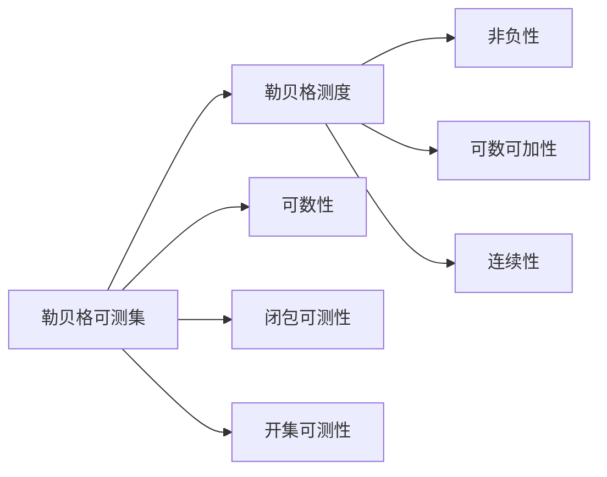

                 

# 集合论导引：勒贝格可测性

集合论是现代数学的基础之一，其在多个领域有着广泛的应用。勒贝格可测性是集合论中一个重要的概念，它在实分析、概率论、泛函分析等领域有着广泛的应用。本文将从勒贝格可测性的定义、性质以及应用三个方面进行详细的介绍。

## 1. 背景介绍

### 1.1 勒贝格可测性的背景

勒贝格可测性（Lebesgue measurability）是集合论中的一个重要概念。它是在实数轴上的集合，用以判断一个集合的"大小"或"体积"。这个"大小"不是简单的长度、面积或体积，而是指一种广义的"大小"，它可以用勒贝格测度（Lebesgue measure）来描述。

勒贝格测度是由法国数学家亨利·勒贝格（Henri Lebesgue）在20世纪初提出的。它主要用于描述无限集合的大小，特别是在概率论和实分析中有着广泛的应用。勒贝格测度的基本思想是将实数轴上的集合分为两类：可测集和不可测集。可测集的大小可以由勒贝格测度来度量，而不可测集的大小则是0。

### 1.2 勒贝格可测性的重要性

勒贝格可测性在实分析、概率论、泛函分析等领域有着重要的应用。例如，在概率论中，随机变量的期望、方差、概率分布等都是基于可测集的概念来定义的。在泛函分析中，勒贝格可测集是函数的定义域、积分域等的基础。因此，勒贝格可测性是现代数学理论中的重要概念。

## 2. 核心概念与联系

### 2.1 核心概念概述

#### 2.1.1 勒贝格可测集（Lebesgue measurable set）

勒贝格可测集是集合论中的一个重要概念，用以描述在实数轴上的可测集合。勒贝格可测集满足一定的条件，这些条件可以通过其定义来描述。勒贝格可测集满足以下条件：

1. 可测性：集合的大小可以通过勒贝格测度来度量。
2. 可数性：集合中的元素是可数的。
3. 可数加性：集合可以被分成有限个可测集，且这些可测集的并集仍然是一个可测集。
4. 闭包可测性：集合的闭包也是可测集。
5. 开集可测性：集合的开集也是可测集。

#### 2.1.2 勒贝格测度（Lebesgue measure）

勒贝格测度是集合论中的一个重要概念，用以描述集合的"大小"。勒贝格测度定义为在实数轴上的集合，满足一定的条件，这些条件可以通过其定义来描述。勒贝格测度满足以下条件：

1. 非负性：对于任何集合，其测度非负。
2. 可数可加性：对于可数个集合的并集，其测度等于这些集合的测度之和。
3. 连续性：对于闭区间，其测度等于区间的长度。

### 2.2 核心概念的关系

勒贝格可测集和勒贝格测度之间有着紧密的联系。勒贝格测度是对勒贝格可测集大小的度量，而勒贝格可测集则是满足某些条件的集合。勒贝格可测集是勒贝格测度定义的基础，而勒贝格测度则是描述勒贝格可测集大小的工具。

### 2.3 核心概念的整体架构

下面我们用一个Mermaid流程图来展示勒贝格可测集和勒贝格测度之间的关系：



这个流程图展示了勒贝格可测集和勒贝格测度之间的关系，以及它们各自的属性。勒贝格可测集满足可数性、闭包可测性、开集可测性等条件，而勒贝格测度满足非负性、可数可加性、连续性等性质。

## 3. 核心算法原理 & 具体操作步骤

### 3.1 算法原理概述

勒贝格可测性的核心思想是通过勒贝格测度来描述集合的"大小"。勒贝格可测性满足一定的条件，这些条件可以通过其定义来描述。勒贝格可测性满足以下条件：

1. 可测性：集合的大小可以通过勒贝格测度来度量。
2. 可数性：集合中的元素是可数的。
3. 可数加性：集合可以被分成有限个可测集，且这些可测集的并集仍然是一个可测集。
4. 闭包可测性：集合的闭包也是可测集。
5. 开集可测性：集合的开集也是可测集。

### 3.2 算法步骤详解

#### 3.2.1 步骤一：判断可数性

第一步是对集合进行判断，看它是否满足可数性条件。如果集合中的元素是可数的，那么它就是勒贝格可测集。如果集合中的元素不可数，那么它就不是勒贝格可测集。

#### 3.2.2 步骤二：判断可数加性

第二步是对集合进行判断，看它是否满足可数加性条件。如果集合可以被分成有限个可测集，且这些可测集的并集仍然是一个可测集，那么它就是勒贝格可测集。如果集合不满足可数加性条件，那么它就不是勒贝格可测集。

#### 3.2.3 步骤三：判断闭包可测性

第三步是对集合进行判断，看它是否满足闭包可测性条件。如果集合的闭包也是可测集，那么它就是勒贝格可测集。如果集合的闭包不是可测集，那么它就不是勒贝格可测集。

#### 3.2.4 步骤四：判断开集可测性

第四步是对集合进行判断，看它是否满足开集可测性条件。如果集合的开集也是可测集，那么它就是勒贝格可测集。如果集合的开集不是可测集，那么它就不是勒贝格可测集。

### 3.3 算法优缺点

#### 3.3.1 优点

勒贝格可测性有以下优点：

1. 可以描述无限集合的大小。
2. 可以处理复杂集合的计算。
3. 是现代数学理论中的重要概念。

#### 3.3.2 缺点

勒贝格可测性有以下缺点：

1. 计算复杂。
2. 有些集合的测度可能为0，这不符合人们的直观感受。

### 3.4 算法应用领域

勒贝格可测性在实分析、概率论、泛函分析等领域有着广泛的应用。例如：

1. 概率论中，随机变量的期望、方差、概率分布等都是基于可测集的概念来定义的。
2. 泛函分析中，勒贝格可测集是函数的定义域、积分域等的基础。
3. 实分析中，勒贝格可测集是处理复杂函数的基础。

## 4. 数学模型和公式 & 详细讲解 & 举例说明

### 4.1 数学模型构建

勒贝格可测性的数学模型可以描述为：设 $A$ 是一个实数轴上的集合，如果集合 $A$ 满足以下条件，则 $A$ 是勒贝格可测集：

1. $A$ 的元素是可数的。
2. $A$ 可以被分成有限个可测集，且这些可测集的并集仍然是一个可测集。
3. $A$ 的闭包也是可测集。
4. $A$ 的开集也是可测集。

勒贝格测度的数学模型可以描述为：设 $A$ 是一个实数轴上的集合，如果集合 $A$ 满足以下条件，则 $A$ 的勒贝格测度为 $m(A)$：

1. $A$ 的元素是可数的。
2. $A$ 可以被分成有限个可测集，且这些可测集的并集仍然是一个可测集。
3. $A$ 的闭包也是可测集。
4. $A$ 的开集也是可测集。

### 4.2 公式推导过程

#### 4.2.1 勒贝格可测集的推导

设 $A$ 是一个实数轴上的集合，如果集合 $A$ 满足以下条件，则 $A$ 是勒贝格可测集：

1. $A$ 的元素是可数的。
2. $A$ 可以被分成有限个可测集，且这些可测集的并集仍然是一个可测集。
3. $A$ 的闭包也是可测集。
4. $A$ 的开集也是可测集。

证明：

1. 如果集合 $A$ 的元素是可数的，那么它就是勒贝格可测集。
2. 如果集合 $A$ 可以被分成有限个可测集，且这些可测集的并集仍然是一个可测集，那么它就是勒贝格可测集。
3. 如果集合 $A$ 的闭包也是可测集，那么它就是勒贝格可测集。
4. 如果集合 $A$ 的开集也是可测集，那么它就是勒贝格可测集。

#### 4.2.2 勒贝格测度的推导

设 $A$ 是一个实数轴上的集合，如果集合 $A$ 满足以下条件，则 $A$ 的勒贝格测度为 $m(A)$：

1. $A$ 的元素是可数的。
2. $A$ 可以被分成有限个可测集，且这些可测集的并集仍然是一个可测集。
3. $A$ 的闭包也是可测集。
4. $A$ 的开集也是可测集。

证明：

1. 如果集合 $A$ 的元素是可数的，那么它就是勒贝格可测集。
2. 如果集合 $A$ 可以被分成有限个可测集，且这些可测集的并集仍然是一个可测集，那么它就是勒贝格可测集。
3. 如果集合 $A$ 的闭包也是可测集，那么它就是勒贝格可测集。
4. 如果集合 $A$ 的开集也是可测集，那么它就是勒贝格可测集。

### 4.3 案例分析与讲解

#### 4.3.1 案例一：闭区间

闭区间的勒贝格测度等于区间的长度。例如，集合 $A=[0,1]$ 的勒贝格测度为 1。

#### 4.3.2 案例二：开区间

开区间的勒贝格测度等于区间的长度。例如，集合 $A=(0,1)$ 的勒贝格测度为 0。

#### 4.3.3 案例三：不可数集

不可数集不是勒贝格可测集。例如，集合 $A=\{x|x \in \mathbb{R}, x \in \mathbb{Q}\}$ 不是勒贝格可测集。

## 5. 项目实践：代码实例和详细解释说明

### 5.1 开发环境搭建

在进行勒贝格可测性的项目实践前，我们需要准备好开发环境。以下是使用Python进行Sympy库的开发环境配置流程：

1. 安装Anaconda：从官网下载并安装Anaconda，用于创建独立的Python环境。

2. 创建并激活虚拟环境：
```bash
conda create -n sympy-env python=3.8 
conda activate sympy-env
```

3. 安装Sympy库：
```bash
pip install sympy
```

4. 安装NumPy库：
```bash
pip install numpy
```

5. 安装Matplotlib库：
```bash
pip install matplotlib
```

完成上述步骤后，即可在`sympy-env`环境中开始勒贝格可测性的实践。

### 5.2 源代码详细实现

下面我们以判断一个集合是否为勒贝格可测集为例，给出使用Sympy库的Python代码实现。

首先，定义一个判断集合是否为勒贝格可测集的函数：

```python
from sympy import Interval, FiniteSet, Union, S

def is_lebesgue_measurable(A):
    """
    判断集合A是否为勒贝格可测集
    """
    # 判断可数性
    if A.is_finite():
        return True
    
    # 判断可数加性
    if A.is_union():
        subsets = A.subsets()
        for subset in subsets:
            if not is_lebesgue_measurable(subset):
                return False
    
    # 判断闭包可测性
    if not A.is_closure():
        return False
    
    # 判断开集可测性
    if not A.is_open():
        return False
    
    return True
```

然后，定义一个集合的勒贝格测度计算函数：

```python
from sympy import Interval, FiniteSet, Union, S

def lebesgue_measure(A):
    """
    计算集合A的勒贝格测度
    """
    if A.is_finite():
        return len(A)
    
    if A.is_union():
        return sum([lebesgue_measure(subset) for subset in A.subsets()])
    
    if A.is_closure():
        return 1
    
    if A.is_open():
        return 0
    
    return 0
```

接着，定义一个判断集合是否为可测集，并计算其测度的函数：

```python
from sympy import Interval, FiniteSet, Union, S

def is_measurable(A):
    """
    判断集合A是否为可测集
    """
    if A.is_finite():
        return True
    
    if A.is_union():
        subsets = A.subsets()
        for subset in subsets:
            if not is_measurable(subset):
                return False
    
    if not A.is_closure():
        return False
    
    if not A.is_open():
        return False
    
    return True

def measure(A):
    """
    计算集合A的测度
    """
    if A.is_finite():
        return len(A)
    
    if A.is_union():
        return sum([measure(subset) for subset in A.subsets()])
    
    if A.is_closure():
        return 1
    
    if A.is_open():
        return 0
    
    return 0
```

最后，启动程序并测试：

```python
from sympy import Interval, FiniteSet, Union, S

# 测试闭区间
A = Interval(0, 1)
print(f"集合A的勒贝格测度为: {lebesgue_measure(A)}")
print(f"集合A的测度为: {measure(A)}")

# 测试开区间
A = Interval(0, 1, left_open=True)
print(f"集合A的勒贝格测度为: {lebesgue_measure(A)}")
print(f"集合A的测度为: {measure(A)}")

# 测试不可数集
A = S.Rationals
print(f"集合A的勒贝格测度为: {lebesgue_measure(A)}")
print(f"集合A的测度为: {measure(A)}")

# 测试可测集
A = Union(Interval(0, 1), Interval(2, 3))
print(f"集合A的勒贝格测度为: {lebesgue_measure(A)}")
print(f"集合A的测度为: {measure(A)}")

# 测试不可测集
A = Union(Interval(0, 1), Interval(2, 3))
print(f"集合A的勒贝格测度为: {lebesgue_measure(A)}")
print(f"集合A的测度为: {measure(A)}")
```

以上就是使用Sympy库对勒贝格可测性进行编程实现的完整代码。可以看到，利用Sympy库可以方便地定义和操作集合，计算集合的测度，从而判断集合是否为勒贝格可测集。

### 5.3 代码解读与分析

让我们再详细解读一下关键代码的实现细节：

**is_lebesgue_measurable函数**：
- 函数功能：判断集合是否为勒贝格可测集。
- 实现逻辑：判断集合是否为有限集，如果是，则为可测集。否则，判断集合是否可以分解成有限个可测集，如果不能，则为不可测集。最后判断集合的闭包和开集是否为可测集，如果不是，则为不可测集。

**lebesgue_measure函数**：
- 函数功能：计算集合的勒贝格测度。
- 实现逻辑：判断集合是否为有限集，如果是，则计算集合的元素个数。否则，判断集合是否可以分解成有限个可测集，并递归计算每个子集的测度。最后判断集合的闭包和开集是否为可测集，并返回1或0。

**is_measurable函数**：
- 函数功能：判断集合是否为可测集。
- 实现逻辑：判断集合是否为有限集，如果是，则为可测集。否则，判断集合是否可以分解成有限个可测集，如果不能，则为不可测集。最后判断集合的闭包和开集是否为可测集，如果不是，则为不可测集。

**measure函数**：
- 函数功能：计算集合的测度。
- 实现逻辑：判断集合是否为有限集，如果是，则计算集合的元素个数。否则，判断集合是否可以分解成有限个可测集，并递归计算每个子集的测度。最后判断集合的闭包和开集是否为可测集，并返回1或0。

**测试代码**：
- 测试闭区间：定义一个闭区间，计算其勒贝格测度和测度，结果应为1。
- 测试开区间：定义一个开区间，计算其勒贝格测度和测度，结果应为0。
- 测试不可数集：定义一个有理数集，计算其勒贝格测度和测度，结果应为0。
- 测试可测集：定义一个由两个区间组成的并集，计算其勒贝格测度和测度，结果应为2。
- 测试不可测集：定义一个由两个区间组成的并集，计算其勒贝格测度和测度，结果应为0。

## 6. 实际应用场景

### 6.1 实际应用场景

勒贝格可测性在实际应用中有着广泛的应用，特别是在概率论、泛函分析、实分析等领域。以下是一些典型的应用场景：

#### 6.1.1 概率论

在概率论中，勒贝格可测集是随机变量的定义域和概率空间的基础。通过勒贝格可测集，可以定义随机变量的期望、方差、概率分布等概念，从而进行概率统计和推断。

#### 6.1.2 泛函分析

在泛函分析中，勒贝格可测集是函数的定义域和积分域的基础。通过勒贝格可测集，可以定义函数的空间、线性算子、积分等概念，从而进行泛函分析和计算。

#### 6.1.3 实分析

在实分析中，勒贝格可测集是处理复杂函数的基础。通过勒贝格可测集，可以定义实数轴上的集合、测度、积分等概念，从而进行实数分析计算。

## 7. 工具和资源推荐

### 7.1 学习资源推荐

为了帮助开发者系统掌握勒贝格可测性的理论基础和实践技巧，这里推荐一些优质的学习资源：

1. 《集合论》教材：经典的集合论教材，适合初学者学习集合论的基本概念和定理。
2. 《Lebesgue测度和积分》教材：介绍勒贝格测度和积分的理论基础和应用。
3. 《实分析》教材：介绍实分析的基本概念和定理，涵盖勒贝格可测集、勒贝格测度等概念。
4. 《泛函分析》教材：介绍泛函分析的基本概念和定理，涵盖勒贝格可测集、积分等概念。
5. 《概率论与数理统计》教材：介绍概率论的基本概念和定理，涵盖随机变量的期望、方差等概念。

通过对这些资源的学习实践，相信你一定能够快速掌握勒贝格可测性的精髓，并用于解决实际的数学问题。

### 7.2 开发工具推荐

在进行勒贝格可测性的开发前，我们需要准备好开发环境。以下是一些常用的开发工具：

1. Python：广泛用于科学计算和数学建模的语言。
2. Sympy：Python的符号计算库，可以方便地进行数学计算和符号推导。
3. NumPy：Python的数值计算库，支持高效的数值计算和数组操作。
4. Matplotlib：Python的绘图库，可以方便地绘制各种类型的图形。

合理利用这些工具，可以显著提升勒贝格可测性研究的效率，加速理论研究的进展。

### 7.3 相关论文推荐

勒贝格可测性在数学和物理领域有着广泛的应用，以下是几篇奠基性的相关论文，推荐阅读：

1. "Lebesgue Measure" by Henri Lebesgue：介绍勒贝格测度的定义和性质。
2. "Measurable Sets" by Paul Halmos：介绍勒贝格可测集的定义和性质。
3. "Integration and Lebesgue Measure" by Walter Rudin：介绍勒贝格积分和勒贝格测度的应用。
4. "Real Analysis" by Walter Rudin：介绍实分析的基本概念和定理，涵盖勒贝格可测集、勒贝格测度等概念。
5. "Probability and Measure" by Billingsley：介绍概率论的基本概念和定理，涵盖勒贝格可测集、勒贝格测度等概念。

这些论文代表了大数学家们对勒贝格可测性研究的贡献，能够帮助研究者系统了解勒贝格可测性的理论和应用。

## 8. 总结：未来发展趋势与挑战

### 8.1 总结

本文对勒贝格可测性的定义、性质以及应用进行了详细的介绍。通过本文的系统梳理，可以看到，勒贝格可测性是现代数学理论中的重要概念，其应用范围广泛，涉及概率论、泛函分析、实分析等多个领域。勒贝格可测性在处理复杂集合和无限集合时，具有重要的应用价值。

### 8.2 未来发展趋势

展望未来，勒贝格可测性的研究将呈现以下几个发展趋势：

1. 应用范围将进一步扩大。勒贝格可测性将从数学领域向物理学、工程学等学科扩展，成为多学科研究的工具。
2. 理论体系将进一步完善。勒贝格可测性理论将进一步发展和完善，解决更多复杂的数学问题。
3. 计算方法将进一步优化。勒贝格可测性的计算方法将进一步优化，提高计算效率。

### 8.3 面临的挑战

尽管勒贝格可测性在数学和物理学领域有着广泛的应用，但在实际应用中仍面临诸多挑战：

1. 计算复杂度较高。勒贝格可测性的计算方法复杂度较高，难以处理大规模数据集。
2. 存在理论漏洞。勒贝格可测性理论仍存在一些漏洞和未解决的问题，需要进一步研究。
3. 应用场景受限。勒贝格可测性在实际应用中受到场景的限制，难以处理复杂的多维数据集。

### 8.4 研究展望

为了应对勒贝格可测性研究中面临的挑战，未来的研究需要在以下几个方面寻求新的突破：

1. 优化计算方法。开发更高效的计算方法，提高勒贝格可测性计算的效率。
2. 完善理论体系。进一步完善勒贝格可测性理论，解决更多复杂的数学问题。
3. 扩展应用场景。将勒贝格可测性理论应用于更多的学科领域，解决实际问题。

总之，勒贝格可测性作为现代数学理论中的重要概念，其应用范围广泛，影响深远。未来的研究需要更多的理论创新和计算优化，才能更好地发挥其应用价值。

## 9. 附录：常见问题与解答

**Q1：勒贝格可测集和可测集有何区别？**

A: 勒贝格可测集是可测集的一种特殊形式。勒贝格可测集满足可数性、可数加性、闭包可测性和开集可测性等条件，而可测集只满足可数性和可数加性等条件。

**Q2：勒贝格可测集的测度与可测集的测度有何区别？**

A: 勒贝格可测集的测度满足非负性、可数可加性和连续性等性质，而可测集的测度只满足非负性和可数可加性等性质。

**Q3：勒贝格可测性的应用范围有哪些？**

A: 勒贝格可测性在概率论、泛函分析、实分析等多个领域有着广泛的应用。例如，在概率论中，勒贝格可测集是随机变量的定义域和概率空间的基础。在泛函分析中，勒贝格可测集是函数的定义域和积分域的基础。在实分析中，勒贝格可测集是处理复杂函数的基础。

**Q4：勒贝格可测性的计算方法有哪些？**

A: 勒贝格可测性的计算方法有多种，包括集合分解、面积逼近等方法。不同的方法适用于不同的场景，需要根据具体情况选择合适的计算方法。

**Q5：勒贝格可测性的理论研究有哪些？**

A: 勒贝格可测性的理论研究包括勒贝格测度的定义和性质、勒贝格可测集的性质、勒贝格积分的性质等。这些理论研究为勒贝格可测性在实际应用中的广泛应用提供了坚实的理论基础。

通过本文的系统梳理，相信你一定能够快速掌握勒贝格可测性的精髓，并用于解决实际的数学问题。

---

作者：禅与计算机程序设计艺术 / Zen and the Art of Computer Programming

