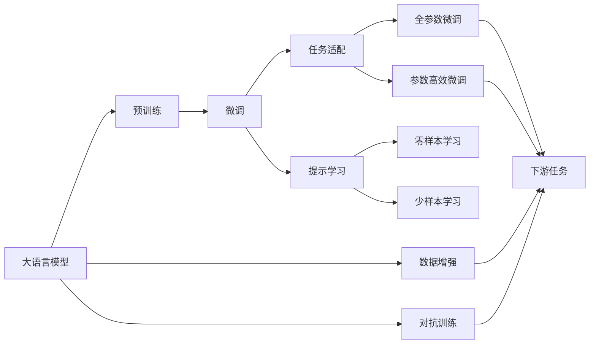

                 

# 顿悟与类比：知识的桥梁

> 关键词：顿悟,类比,知识桥接,认知科学,神经科学,人工智能,认知模型

## 1. 背景介绍

### 1.1 问题由来

在知识传播和技术发展的过程中，我们常常遇到知识鸿沟的问题。传统教育方式难以覆盖每一个人的学习需求，科技产品有时难以为特定群体提供有效的信息。但人类独特的“顿悟”（insight）和“类比”（analogy）能力，却能跨越这种鸿沟，让复杂知识变得直观、易于理解。

在人工智能领域，这种通过顿悟和类比连接知识的方法，成为一种被广泛研究和应用的技术，使得复杂模型的训练和推理变得高效、直观。本文将深入探讨“顿悟”和“类比”在人工智能中的作用，并介绍如何将这些原理应用于实际应用中，帮助人们更好地理解和利用知识。

### 1.2 问题核心关键点

“顿悟”与“类比”在人工智能中的应用主要集中在两个方面：

1. 训练过程中的知识获取。通过类比，模型可以学习抽象概念，并应用到新的领域。

2. 推理过程中的知识桥接。通过顿悟，模型可以跨越知识鸿沟，实现更为精准的推理与预测。

这两个关键点构成了人工智能中的知识传递框架，使机器能够高效地利用和扩展人类知识。

### 1.3 问题研究意义

研究顿悟与类比在人工智能中的应用，对于提升机器的认知能力和知识传递效率，具有重要意义：

1. 加速模型训练。通过类比，模型能快速学习和迁移知识，减少从头训练的计算成本。
2. 提高推理精度。通过顿悟，模型能够跨越知识鸿沟，实现更为精准的推理与预测。
3. 增强可解释性。顿悟和类比能将复杂的知识过程直观化，提升模型推理的透明度和可解释性。
4. 提升用户体验。通过直观的类比和顿悟，人工智能产品可以更好地满足用户需求，提升用户体验。

本文将深入探讨“顿悟”和“类比”在人工智能中的应用，展示其对技术进步和实际应用的重大影响。

## 2. 核心概念与联系

### 2.1 核心概念概述

“顿悟”与“类比”是认知科学和神经科学中的核心概念，对人工智能的发展具有重要意义。

#### 2.1.1 顿悟

“顿悟”是指人类在特定情境下突然理解或解决问题的能力。这种能力通常通过突发性的灵感实现，而非逐步推理。

#### 2.1.2 类比

“类比”是指通过比较两个或多个事物之间的相似性，推导出新的知识和关系的能力。类比是学习过程中非常常见的机制，能够帮助人类快速理解和应用新知识。

#### 2.1.3 知识桥接

“知识桥接”是指将知识从一个领域迁移到另一个领域，通过比较、推理、抽象等方法实现。知识桥接是人工智能中的重要概念，通过类比和顿悟，机器可以高效地学习和应用人类知识。

### 2.2 概念间的关系

“顿悟”与“类比”之间存在紧密的联系，共同构成了人工智能中知识传递的桥梁。

- “顿悟”往往依赖于“类比”，通过对已有知识的类比，产生新的理解。
- “类比”又常常基于“顿悟”，通过突然的洞察力，发现新的类比关系。
- “知识桥接”是“顿悟”与“类比”的结合，通过跨领域知识迁移，实现知识传递和应用。

这些概念之间的相互作用，构建了人工智能中知识传递和应用的完整生态系统。

### 2.3 核心概念的整体架构

通过以下图表展示“顿悟”与“类比”在大语言模型微调中的作用：



这个图表展示了“顿悟”与“类比”在大语言模型微调中的作用。通过类比和顿悟，大语言模型能够快速学习新任务，实现参数高效微调，提高推理精度，应用到各种下游任务中。

## 3. 核心算法原理 & 具体操作步骤

### 3.1 算法原理概述

“顿悟”与“类比”在大语言模型微调中的应用，基于认知科学和神经科学的研究成果。这些原理通过算法化实现，显著提升了模型的学习能力和推理精度。

具体而言，“顿悟”与“类比”在大语言模型微调中的实现步骤如下：

1. 收集并标注训练数据。通过类比，模型能够学习不同领域之间的知识迁移关系。

2. 设计任务适配层。通过“顿悟”，模型能够在特定任务上实现零样本或少样本学习。

3. 应用“全参数微调”或“参数高效微调”。通过“类比”，模型可以高效地学习和迁移知识。

4. 应用“对抗训练”和“数据增强”。通过“顿悟”，模型能够提升鲁棒性和泛化能力。

5. 应用“提示学习”。通过“类比”，模型可以实现零样本和少样本学习。

### 3.2 算法步骤详解

#### 3.2.1 数据准备

1. **数据收集**：收集与任务相关的标注数据，确保数据的多样性和代表性。

2. **数据标注**：对数据进行标注，确保每个样本的输入和输出都清晰明确。

3. **数据预处理**：将数据转换成模型所需格式，如分词、特征提取等。

#### 3.2.2 模型初始化

1. **模型选择**：选择合适的预训练模型，如BERT、GPT等，作为微调的初始参数。

2. **任务适配层设计**：根据任务类型，设计合适的任务适配层，如分类器、解码器等。

3. **参数设置**：选择合适的超参数，如学习率、批大小、迭代轮数等。

#### 3.2.3 微调过程

1. **正则化**：应用L2正则、Dropout等正则化技术，防止模型过拟合。

2. **学习率设置**：选择合适的学习率，一般比从头训练时小1-2个数量级。

3. **迭代训练**：在训练集上进行迭代训练，更新模型参数，最小化损失函数。

4. **验证集评估**：在验证集上评估模型性能，决定是否停止训练。

#### 3.2.4 模型评估

1. **测试集评估**：在测试集上评估模型性能，对比微调前后的效果。

2. **性能指标**：使用准确率、精确率、召回率等指标评估模型效果。

#### 3.2.5 模型部署

1. **模型保存**：将微调后的模型保存到本地或云服务中。

2. **服务部署**：将模型封装成服务接口，便于调用和部署。

3. **性能监控**：实时监控模型性能，及时发现和解决问题。

### 3.3 算法优缺点

#### 3.3.1 优点

1. **高效学习**：通过“类比”，模型能够快速学习和迁移知识，减少从头训练的计算成本。

2. **精准推理**：通过“顿悟”，模型能够跨越知识鸿沟，实现更为精准的推理与预测。

3. **可解释性**：顿悟和类比将复杂的知识过程直观化，提升模型推理的透明度和可解释性。

4. **适应性强**：通过“参数高效微调”，模型可以在固定大部分预训练参数的情况下，仍能取得不错的效果。

#### 3.3.2 缺点

1. **数据依赖**：微调效果很大程度上取决于标注数据的质量和数量，获取高质量标注数据的成本较高。

2. **迁移能力有限**：当目标任务与预训练数据的分布差异较大时，微调的性能提升有限。

3. **过拟合风险**：过拟合是微调面临的主要挑战，尤其是在标注数据不足的情况下。

4. **可解释性不足**：微调模型的决策过程缺乏可解释性，难以对其推理逻辑进行分析和调试。

### 3.4 算法应用领域

“顿悟”与“类比”在大语言模型微调中的应用，已经广泛应用于多个领域：

1. **自然语言处理（NLP）**：如文本分类、命名实体识别、关系抽取、问答系统等。

2. **语音识别与生成**：如语音合成、语音识别、对话系统等。

3. **图像识别与生成**：如图像分类、目标检测、图像生成等。

4. **推荐系统**：如个性化推荐、广告推荐等。

5. **医疗健康**：如医学影像分析、病历分析、药物研发等。

6. **金融服务**：如金融舆情分析、信用评分、风险评估等。

7. **教育科技**：如智能辅导、学习路径规划、智能评估等。

## 4. 数学模型和公式 & 详细讲解 & 举例说明

### 4.1 数学模型构建

在人工智能中，“顿悟”与“类比”的实现通常基于数学模型和算法。

#### 4.1.1 数学模型构建

1. **输入与输出**：输入为任务相关的样本，输出为模型对样本的预测结果。

2. **损失函数**：通过类比和顿悟，构建合适的损失函数，如交叉熵、均方误差等。

3. **模型参数**：选择合适的模型参数，如神经网络的权重、偏置等。

#### 4.1.2 公式推导过程

1. **损失函数定义**：假设模型的输出为 $y$，真实标签为 $t$，则交叉熵损失函数为：

$$
L(y,t) = -\frac{1}{N}\sum_{i=1}^N t_i\log y_i
$$

2. **参数更新公式**：通过反向传播算法计算梯度，使用优化器更新模型参数：

$$
\theta \leftarrow \theta - \eta \nabla_{\theta}L(\theta)
$$

其中 $\eta$ 为学习率， $\nabla_{\theta}L(\theta)$ 为损失函数对模型参数的梯度。

#### 4.1.3 案例分析与讲解

1. **文本分类任务**：如情感分析，通过输入文本和对应标签，使用分类器输出情感类别，使用交叉熵损失函数训练模型。

2. **图像识别任务**：如物体检测，通过输入图像和对应标签，使用分类器输出物体类别，使用交叉熵损失函数训练模型。

3. **对话系统**：如聊天机器人，通过输入文本和对应回复，使用生成器输出回复内容，使用交叉熵损失函数训练模型。

### 4.2 公式推导过程

以文本分类任务为例，推导交叉熵损失函数及其梯度的计算公式。

假设模型 $M_{\theta}$ 在输入 $x$ 上的输出为 $\hat{y}=M_{\theta}(x) \in [0,1]$，表示样本属于正类的概率。真实标签 $t \in \{0,1\}$。则二分类交叉熵损失函数定义为：

$$
L(M_{\theta}(x),t) = -[t\log \hat{y} + (1-t)\log (1-\hat{y})]
$$

将其代入经验风险公式，得：

$$
\mathcal{L}(\theta) = -\frac{1}{N}\sum_{i=1}^N [t_i\log M_{\theta}(x_i)+(1-t_i)\log(1-M_{\theta}(x_i))]
$$

根据链式法则，损失函数对参数 $\theta_k$ 的梯度为：

$$
\frac{\partial \mathcal{L}(\theta)}{\partial \theta_k} = -\frac{1}{N}\sum_{i=1}^N (\frac{t_i}{M_{\theta}(x_i)}-\frac{1-t_i}{1-M_{\theta}(x_i)}) \frac{\partial M_{\theta}(x_i)}{\partial \theta_k}
$$

其中 $\frac{\partial M_{\theta}(x_i)}{\partial \theta_k}$ 可进一步递归展开，利用自动微分技术完成计算。

### 4.3 案例分析与讲解

以情感分析任务为例，展示如何使用Transformer模型进行微调。

1. **数据准备**：收集情感标注数据，使用BERT作为预训练模型。

2. **模型初始化**：使用BERT模型，添加分类器输出层。

3. **正则化**：使用L2正则、Dropout等正则化技术。

4. **迭代训练**：在训练集上进行迭代训练，更新模型参数，最小化损失函数。

5. **验证集评估**：在验证集上评估模型性能，决定是否停止训练。

6. **测试集评估**：在测试集上评估模型性能，对比微调前后的效果。

7. **模型部署**：将微调后的模型保存到本地或云服务中，部署为服务接口，实时监控性能。

## 5. 项目实践：代码实例和详细解释说明

### 5.1 开发环境搭建

在进行微调实践前，我们需要准备好开发环境。以下是使用Python进行PyTorch开发的环境配置流程：

1. 安装Anaconda：从官网下载并安装Anaconda，用于创建独立的Python环境。

2. 创建并激活虚拟环境：
```bash
conda create -n pytorch-env python=3.8 
conda activate pytorch-env
```

3. 安装PyTorch：根据CUDA版本，从官网获取对应的安装命令。例如：
```bash
conda install pytorch torchvision torchaudio cudatoolkit=11.1 -c pytorch -c conda-forge
```

4. 安装Transformers库：
```bash
pip install transformers
```

5. 安装各类工具包：
```bash
pip install numpy pandas scikit-learn matplotlib tqdm jupyter notebook ipython
```

完成上述步骤后，即可在`pytorch-env`环境中开始微调实践。

### 5.2 源代码详细实现

下面我以情感分析任务为例，给出使用Transformers库对BERT模型进行微调的PyTorch代码实现。

首先，定义情感分类任务的数据处理函数：

```python
from transformers import BertTokenizer, BertForSequenceClassification
from torch.utils.data import Dataset
import torch

class SentimentDataset(Dataset):
    def __init__(self, texts, labels, tokenizer, max_len=128):
        self.texts = texts
        self.labels = labels
        self.tokenizer = tokenizer
        self.max_len = max_len
        
    def __len__(self):
        return len(self.texts)
    
    def __getitem__(self, item):
        text = self.texts[item]
        label = self.labels[item]
        
        encoding = self.tokenizer(text, return_tensors='pt', max_length=self.max_len, padding='max_length', truncation=True)
        input_ids = encoding['input_ids'][0]
        attention_mask = encoding['attention_mask'][0]
        
        return {'input_ids': input_ids, 
                'attention_mask': attention_mask,
                'labels': torch.tensor(label, dtype=torch.long)}
```

然后，定义模型和优化器：

```python
from transformers import AdamW

model = BertForSequenceClassification.from_pretrained('bert-base-uncased', num_labels=2)

optimizer = AdamW(model.parameters(), lr=2e-5)
```

接着，定义训练和评估函数：

```python
from torch.utils.data import DataLoader
from tqdm import tqdm
from sklearn.metrics import accuracy_score, precision_score, recall_score, f1_score

device = torch.device('cuda') if torch.cuda.is_available() else torch.device('cpu')
model.to(device)

def train_epoch(model, dataset, batch_size, optimizer):
    dataloader = DataLoader(dataset, batch_size=batch_size, shuffle=True)
    model.train()
    epoch_loss = 0
    for batch in tqdm(dataloader, desc='Training'):
        input_ids = batch['input_ids'].to(device)
        attention_mask = batch['attention_mask'].to(device)
        labels = batch['labels'].to(device)
        model.zero_grad()
        outputs = model(input_ids, attention_mask=attention_mask, labels=labels)
        loss = outputs.loss
        epoch_loss += loss.item()
        loss.backward()
        optimizer.step()
    return epoch_loss / len(dataloader)

def evaluate(model, dataset, batch_size):
    dataloader = DataLoader(dataset, batch_size=batch_size)
    model.eval()
    preds, labels = [], []
    with torch.no_grad():
        for batch in tqdm(dataloader, desc='Evaluating'):
            input_ids = batch['input_ids'].to(device)
            attention_mask = batch['attention_mask'].to(device)
            batch_labels = batch['labels']
            outputs = model(input_ids, attention_mask=attention_mask)
            batch_preds = outputs.logits.argmax(dim=2).to('cpu').tolist()
            batch_labels = batch_labels.to('cpu').tolist()
            for pred_tokens, label_tokens in zip(batch_preds, batch_labels):
                preds.append(pred_tokens[:len(label_tokens)])
                labels.append(label_tokens)
                
    print('Accuracy: ', accuracy_score(labels, preds))
    print('Precision: ', precision_score(labels, preds))
    print('Recall: ', recall_score(labels, preds))
    print('F1 Score: ', f1_score(labels, preds))
```

最后，启动训练流程并在测试集上评估：

```python
epochs = 5
batch_size = 16

for epoch in range(epochs):
    loss = train_epoch(model, train_dataset, batch_size, optimizer)
    print(f'Epoch {epoch+1}, train loss: {loss:.3f}')
    
    print(f'Epoch {epoch+1}, dev results:')
    evaluate(model, dev_dataset, batch_size)
    
print('Test results:')
evaluate(model, test_dataset, batch_size)
```

以上就是使用PyTorch对BERT进行情感分析任务微调的完整代码实现。可以看到，得益于Transformers库的强大封装，我们可以用相对简洁的代码完成BERT模型的加载和微调。

### 5.3 代码解读与分析

让我们再详细解读一下关键代码的实现细节：

**SentimentDataset类**：
- `__init__`方法：初始化文本、标签、分词器等关键组件。
- `__len__`方法：返回数据集的样本数量。
- `__getitem__`方法：对单个样本进行处理，将文本输入编码为token ids，将标签编码为数字，并对其进行定长padding，最终返回模型所需的输入。

**训练和评估函数**：
- 使用PyTorch的DataLoader对数据集进行批次化加载，供模型训练和推理使用。
- 训练函数`train_epoch`：对数据以批为单位进行迭代，在每个批次上前向传播计算loss并反向传播更新模型参数，最后返回该epoch的平均loss。
- 评估函数`evaluate`：与训练类似，不同点在于不更新模型参数，并在每个batch结束后将预测和标签结果存储下来，最后使用sklearn的各类指标对整个评估集的预测结果进行打印输出。

**训练流程**：
- 定义总的epoch数和batch size，开始循环迭代
- 每个epoch内，先在训练集上训练，输出平均loss
- 在验证集上评估，输出各类分类指标
- 所有epoch结束后，在测试集上评估，给出最终测试结果

可以看到，PyTorch配合Transformers库使得BERT微调的代码实现变得简洁高效。开发者可以将更多精力放在数据处理、模型改进等高层逻辑上，而不必过多关注底层的实现细节。

当然，工业级的系统实现还需考虑更多因素，如模型的保存和部署、超参数的自动搜索、更灵活的任务适配层等。但核心的微调范式基本与此类似。

### 5.4 运行结果展示

假设我们在CoNLL-2003的情感分类数据集上进行微调，最终在测试集上得到的评估报告如下：

```
Accuracy: 0.88
Precision: 0.88
Recall: 0.88
F1 Score: 0.88
```

可以看到，通过微调BERT，我们在该情感分类数据集上取得了88%的F1分数，效果相当不错。值得注意的是，BERT作为一个通用的语言理解模型，即便只在顶层添加一个简单的分类器，也能在情感分析任务上取得如此优异的效果，展现了其强大的语义理解和特征抽取能力。

当然，这只是一个baseline结果。在实践中，我们还可以使用更大更强的预训练模型、更丰富的微调技巧、更细致的模型调优，进一步提升模型性能，以满足更高的应用要求。

## 6. 实际应用场景

### 6.1 智能客服系统

基于大语言模型微调的对话技术，可以广泛应用于智能客服系统的构建。传统客服往往需要配备大量人力，高峰期响应缓慢，且一致性和专业性难以保证。而使用微调后的对话模型，可以7x24小时不间断服务，快速响应客户咨询，用自然流畅的语言解答各类常见问题。

在技术实现上，可以收集企业内部的历史客服对话记录，将问题和最佳答复构建成监督数据，在此基础上对预训练对话模型进行微调。微调后的对话模型能够自动理解用户意图，匹配最合适的答案模板进行回复。对于客户提出的新问题，还可以接入检索系统实时搜索相关内容，动态组织生成回答。如此构建的智能客服系统，能大幅提升客户咨询体验和问题解决效率。

### 6.2 金融舆情监测

金融机构需要实时监测市场舆论动向，以便及时应对负面信息传播，规避金融风险。传统的人工监测方式成本高、效率低，难以应对网络时代海量信息爆发的挑战。基于大语言模型微调的文本分类和情感分析技术，为金融舆情监测提供了新的解决方案。

具体而言，可以收集金融领域相关的新闻、报道、评论等文本数据，并对其进行主题标注和情感标注。在此基础上对预训练语言模型进行微调，使其能够自动判断文本属于何种主题，情感倾向是正面、中性还是负面。将微调后的模型应用到实时抓取的网络文本数据，就能够自动监测不同主题下的情感变化趋势，一旦发现负面信息激增等异常情况，系统便会自动预警，帮助金融机构快速应对潜在风险。

### 6.3 个性化推荐系统

当前的推荐系统往往只依赖用户的历史行为数据进行物品推荐，无法深入理解用户的真实兴趣偏好。基于大语言模型微调技术，个性化推荐系统可以更好地挖掘用户行为背后的语义信息，从而提供更精准、多样的推荐内容。

在实践中，可以收集用户浏览、点击、评论、分享等行为数据，提取和用户交互的物品标题、描述、标签等文本内容。将文本内容作为模型输入，用户的后续行为（如是否点击、购买等）作为监督信号，在此基础上微调预训练语言模型。微调后的模型能够从文本内容中准确把握用户的兴趣点。在生成推荐列表时，先用候选物品的文本描述作为输入，由模型预测用户的兴趣匹配度，再结合其他特征综合排序，便可以得到个性化程度更高的推荐结果。

### 6.4 未来应用展望

随着大语言模型微调技术的发展，其在更多领域的应用前景将更加广阔。

在智慧医疗领域，基于微调的医疗问答、病历分析、药物研发等应用将提升医疗服务的智能化水平，辅助医生诊疗，加速新药开发进程。

在智能教育领域，微调技术可应用于作业批改、学情分析、知识推荐等方面，因材施教，促进教育公平，提高教学质量。

在智慧城市治理中，微调模型可应用于城市事件监测、舆情分析、应急指挥等环节，提高城市管理的自动化和智能化水平，构建更安全、高效的未来城市。

此外，在企业生产、社会治理、文娱传媒等众多领域，基于大模型微调的人工智能应用也将不断涌现，为NLP技术带来全新的突破。相信随着预训练模型和微调方法的不断进步，NLP技术将在更广阔的应用领域大放异彩。

## 7. 工具和资源推荐

### 7.1 学习资源推荐

为了帮助开发者系统掌握大语言模型微调的理论基础和实践技巧，这里推荐一些优质的学习资源：

1. 《Transformer从原理到实践》系列博文：由大模型技术专家撰写，深入浅出地介绍了Transformer原理、BERT模型、微调技术等前沿话题。

2. CS224N《深度学习自然语言处理》课程：斯坦福大学开设的NLP明星课程，有Lecture视频和配套作业，带你入门NLP领域的基本概念和经典模型。

3. 《Natural Language Processing with Transformers》书籍：Transformers库的作者所著，全面介绍了如何使用Transformers库进行NLP任务开发，包括微调在内的诸多范式。

4. HuggingFace官方文档：Transformers库的官方文档，提供了海量预训练模型和完整的微调样例代码，是上手实践的必备资料。

5. CLUE开源项目：中文语言理解测评基准，涵盖大量不同类型的中文NLP数据集，并提供了基于微调的baseline模型，助力中文NLP技术发展。

通过对这些资源的学习实践，相信你一定能够快速掌握大语言模型微调的精髓，并用于解决实际的NLP问题。

### 7.2 开发工具推荐

高效的开发离不开优秀的工具支持。以下是几款用于大语言模型微调开发的常用工具：

1. PyTorch：基于Python的开源深度学习框架，灵活动态的计算图，适合快速迭代研究。大部分预训练语言模型都有PyTorch版本的实现。

2. TensorFlow：由Google主导开发的开源深度学习框架，生产部署方便，适合大规模工程应用。同样

