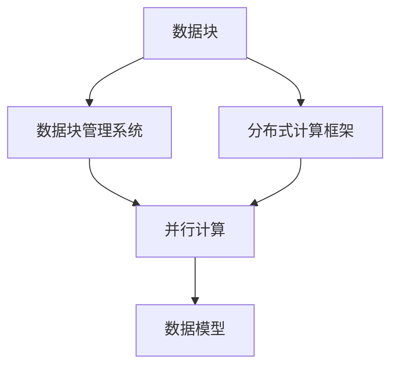

                 

## 1. 背景介绍

随着数据驱动技术的蓬勃发展，数据块（Data Block）作为一种高效、灵活的数据管理方式，在各行各业中扮演了越来越重要的角色。从科学研究到工业生产，从智能推荐到自然语言处理，数据块技术的应用场景日益广泛，其高效性和可扩展性成为关键。

### 1.1 问题由来

在当今数据时代，数据种类繁多、来源复杂，如何高效管理、组织和分析这些数据成为重要问题。传统的表格数据库或文件系统难以应对大规模、异构的数据挑战。数据块技术应运而生，通过将数据划分为块的形式，实现了更高效的数据管理和查询。

数据块技术最早起源于计算机文件系统，随后在分布式计算和数据科学领域得到广泛应用。例如，Apache Hadoop和Apache Spark都支持数据块处理，使得海量数据的并行计算成为可能。

### 1.2 问题核心关键点

数据块技术的关键在于其高效性和可扩展性：

- **高效性**：数据块以固定大小划分，减少了I/O操作的次数，提高了数据读写效率。
- **可扩展性**：数据块可以并行处理，利用分布式计算框架实现大规模数据的高效计算。
- **灵活性**：数据块可以自由组合、拆分，适应不同应用场景的需求。

### 1.3 问题研究意义

深入理解数据块技术，对提升数据处理效率、降低存储和计算成本、促进数据科学和人工智能的发展具有重要意义：

1. **提升效率**：数据块技术通过减少I/O操作次数，显著提高了数据读写效率。
2. **降低成本**：数据块技术可以优化存储资源使用，减少冗余数据存储，降低存储和计算成本。
3. **支持并行计算**：数据块技术支持分布式计算，可以处理大规模数据集，提升计算效率。
4. **促进数据科学**：数据块技术为数据科学提供了高效的数据管理工具，支持复杂的模型训练和分析。

## 2. 核心概念与联系

### 2.1 核心概念概述

为更好地理解数据块技术，本节将介绍几个核心概念：

- **数据块（Data Block）**：指在存储系统中以固定大小划分的数据片段。数据块的大小通常为若干MB或GB。
- **数据块管理系统（Data Block Manager）**：负责数据块的存储、管理和检索。常见的数据块管理系统有Hadoop Distributed File System (HDFS)、Apache Spark。
- **分布式计算框架（Distributed Computing Framework）**：支持数据块并行处理的技术框架，如Apache Hadoop、Apache Spark、Apache Flink。
- **数据模型（Data Model）**：描述数据块如何组织和管理的数据结构。常见的数据模型包括层次模型、文档模型、键值模型、图形模型。
- **并行计算（Parallel Computing）**：通过同时处理多个数据块，利用分布式计算框架实现高效的并行计算。

### 2.2 概念间的关系

这些核心概念之间存在紧密联系，形成了数据块技术的基本框架：



这个流程图展示了数据块技术的基本流程：

1. **数据块**被管理系统管理，用于存储和检索。
2. **分布式计算框架**支持并行处理，利用数据块管理系统高效计算。
3. **数据模型**描述数据块的组织方式，为并行计算提供结构化支持。

## 3. 核心算法原理 & 具体操作步骤

### 3.1 算法原理概述

数据块技术的基本原理是通过将数据划分为固定大小的数据块，减少I/O操作次数，提高数据读写效率。数据块管理系统负责数据的存储和检索，而分布式计算框架则支持数据的并行处理，利用数据块管理系统实现高效的计算。

### 3.2 算法步骤详解

基于数据块技术的数据管理流程包括以下关键步骤：

**Step 1: 数据划分与存储**

1. **数据划分**：将数据划分为固定大小的数据块。
2. **数据存储**：将数据块存储在分布式文件系统或对象存储中。

**Step 2: 数据检索与计算**

1. **数据检索**：根据查询条件，从分布式文件系统或对象存储中检索数据块。
2. **数据计算**：利用分布式计算框架对数据块进行并行计算，得出计算结果。

**Step 3: 数据整合与输出**

1. **数据整合**：将计算结果合并为一个完整的结果。
2. **数据输出**：将结果输出到用户指定的位置。

### 3.3 算法优缺点

数据块技术具有以下优点：

- **高效性**：数据块大小固定，减少了I/O操作次数，提高了数据读写效率。
- **可扩展性**：数据块可以并行处理，利用分布式计算框架实现大规模数据的并行计算。
- **灵活性**：数据块可以自由组合、拆分，适应不同应用场景的需求。

但数据块技术也存在以下缺点：

- **管理复杂**：数据块的管理、检索和合并需要较复杂的算法支持。
- **成本高**：分布式文件系统和计算框架需要大量硬件资源，初始成本较高。

### 3.4 算法应用领域

数据块技术广泛应用于以下领域：

- **大数据处理**：Hadoop和Spark等分布式计算框架都支持数据块处理，使得大规模数据的并行计算成为可能。
- **数据存储与检索**：数据块技术被广泛应用于企业级数据存储系统，如Amazon S3、Google Cloud Storage等。
- **科学研究**：数据块技术支持大规模科学数据的存储和处理，促进了科学研究的发展。
- **人工智能与机器学习**：数据块技术支持大规模机器学习模型的训练和推理，提升模型性能。

## 4. 数学模型和公式 & 详细讲解

### 4.1 数学模型构建

数据块技术可以通过数学模型来描述其基本原理。假设数据集为 $D=\{(x_i, y_i)\}_{i=1}^N$，其中 $x_i$ 为输入，$y_i$ 为输出。假设每个数据块大小为 $B$，数据块总数为 $K$，则数据块表示为：

$$
D = \{(x_{i_1}, x_{i_2}, ..., x_{i_K})\}_{i=1}^N
$$

其中 $x_{i_j}$ 表示数据块 $j$ 中的数据。

### 4.2 公式推导过程

数据块处理的基本流程可以表示为以下数学公式：

1. **数据划分**：将数据集 $D$ 划分为 $K$ 个数据块 $D_k = \{x_{i_j}\}_{j=1}^B$。

2. **数据存储**：将每个数据块 $D_k$ 存储在分布式文件系统或对象存储中。

3. **数据检索**：根据查询条件 $Q$，检索包含查询条件的数据块 $D_k'$。

4. **数据计算**：利用分布式计算框架对数据块 $D_k'$ 进行并行计算，得到计算结果 $R_k'$。

5. **数据整合**：将计算结果 $R_k'$ 合并为一个完整的结果 $R'$。

6. **数据输出**：将结果 $R'$ 输出到用户指定的位置。

### 4.3 案例分析与讲解

以Apache Spark为例，其数据块处理流程如下：

1. **数据划分**：Spark将数据集划分为多个RDD（弹性分布式数据集），每个RDD包含多个数据块。

2. **数据存储**：Spark将RDD存储在HDFS或S3等分布式文件系统中。

3. **数据检索**：Spark根据查询条件，检索包含查询条件的数据块。

4. **数据计算**：Spark利用任务调度器将数据块分配给多个计算节点进行并行计算，得到计算结果。

5. **数据整合**：Spark将计算结果合并为一个完整的结果。

6. **数据输出**：Spark将结果输出到用户指定的位置，如HDFS或S3等。

## 5. 项目实践：代码实例和详细解释说明

### 5.1 开发环境搭建

在进行数据块项目实践前，我们需要准备好开发环境。以下是使用Python进行PySpark开发的环境配置流程：

1. 安装Anaconda：从官网下载并安装Anaconda，用于创建独立的Python环境。

2. 创建并激活虚拟环境：
```bash
conda create -n pyspark-env python=3.8 
conda activate pyspark-env
```

3. 安装PySpark：根据CUDA版本，从官网获取对应的安装命令。例如：
```bash
conda install pyspark -c pypi
```

4. 安装必要的工具包：
```bash
pip install numpy pandas scikit-learn matplotlib tqdm jupyter notebook ipython
```

完成上述步骤后，即可在`pyspark-env`环境中开始数据块项目的开发。

### 5.2 源代码详细实现

下面我们以Apache Spark处理数据块为例，给出完整的PySpark代码实现。

首先，我们需要定义一个简单的数据块管理系统，用于存储和检索数据块：

```python
from pyspark.sql import SparkSession

spark = SparkSession.builder.appName('block_manager').getOrCreate()

class BlockManager:
    def __init__(self, num_blocks):
        self.num_blocks = num_blocks
        self.block_size = 1024 * 1024  # 每个数据块大小为1MB

    def store(self, data, block_id):
        block = data.take(self.block_size)
        block_path = f'./block{block_id}.txt'
        with open(block_path, 'w') as f:
            f.write('\n'.join(block))

    def load(self, block_id):
        block_path = f'./block{block_id}.txt'
        with open(block_path, 'r') as f:
            return list(map(int, f.read().split()))
```

然后，定义一个简单的分布式计算函数，用于处理数据块：

```python
def process_block(block_data):
    return sum(block_data)
```

最后，进行数据块的实际处理：

```python
# 定义数据块管理器
block_manager = BlockManager(10)

# 存储数据块
block_id = 0
block_data = [1, 2, 3, 4, 5]
block_manager.store(block_data, block_id)

# 检索数据块
block_data = block_manager.load(block_id)

# 处理数据块
result = process_block(block_data)
print(f'Result: {result}')
```

### 5.3 代码解读与分析

让我们再详细解读一下关键代码的实现细节：

**BlockManager类**：
- `__init__`方法：初始化数据块管理器，包括数据块总数和每个数据块大小。
- `store`方法：将数据块存储到本地文件系统中。
- `load`方法：从本地文件系统中读取数据块。

**process_block函数**：
- 定义了一个简单的数据块处理函数，用于对数据块进行处理。

**数据块处理**：
- 首先，定义一个数据块管理器，指定数据块总数为10。
- 然后，创建一个数据块，并将其存储到本地文件系统中。
- 接着，检索存储的数据块。
- 最后，对数据块进行处理，并输出结果。

通过这些代码实现，我们可以看到数据块的基本处理流程：存储、检索和处理。数据块管理器负责数据的存储和检索，而分布式计算函数则处理数据块，最终得到计算结果。

## 6. 实际应用场景

### 6.1 智能推荐系统

智能推荐系统是数据块技术的重要应用场景之一。在大数据环境下，如何高效地处理和分析用户行为数据，生成个性化的推荐结果，是智能推荐系统面临的关键问题。

通过数据块技术，可以将用户行为数据划分为多个数据块，存储在分布式文件系统中。利用Apache Spark等分布式计算框架，对数据块进行并行计算，生成推荐结果。利用数据块技术，可以提高推荐系统的处理效率和数据准确性，提升用户体验。

### 6.2 金融风控系统

金融风控系统需要对大量的交易数据进行实时分析，以识别和防范欺诈行为。数据块技术可以支持大规模交易数据的存储和处理，提高实时分析的效率。

通过数据块技术，可以将交易数据划分为多个数据块，存储在分布式文件系统中。利用Apache Spark等分布式计算框架，对数据块进行并行计算，生成风控结果。利用数据块技术，可以大幅提升风控系统的处理速度和数据准确性，降低金融风险。

### 6.3 自然语言处理

自然语言处理（NLP）是数据块技术的另一个重要应用场景。通过数据块技术，可以高效地处理和分析大量的文本数据，提升NLP模型的性能。

在NLP任务中，文本数据通常非常庞大，如何高效地存储和处理这些数据，是NLP系统面临的关键问题。通过数据块技术，可以将文本数据划分为多个数据块，存储在分布式文件系统中。利用Apache Spark等分布式计算框架，对数据块进行并行计算，提升NLP模型的性能。

## 7. 工具和资源推荐

### 7.1 学习资源推荐

为了帮助开发者系统掌握数据块技术，这里推荐一些优质的学习资源：

1. 《大数据技术与应用》系列书籍：由著名数据科学家撰写，全面介绍了大数据技术的基本原理和应用实践。

2. 《Apache Spark编程实战》书籍：Apache Spark官方编写，提供了丰富的代码示例和实践经验。

3. Coursera《大数据技术与应用》课程：由斯坦福大学开设，讲解大数据技术的核心概念和实践技巧。

4. Udacity《大数据技术与应用》纳米学位课程：深入浅出地介绍了大数据技术的核心原理和应用场景。

5. Kaggle：数据科学竞赛平台，提供丰富的数据集和案例实践，帮助开发者提升实战能力。

通过这些资源的学习实践，相信你一定能够快速掌握数据块技术的精髓，并用于解决实际的业务问题。

### 7.2 开发工具推荐

高效的开发离不开优秀的工具支持。以下是几款用于数据块开发常用的工具：

1. Apache Spark：支持大规模数据处理，提供了丰富的数据块处理API。

2. Apache Hadoop：传统的分布式计算框架，支持大规模数据的存储和处理。

3. PySpark：Python接口，支持数据块处理和分布式计算。

4. Weights & Biases：模型训练的实验跟踪工具，可以记录和可视化模型训练过程中的各项指标，方便对比和调优。

5. TensorBoard：TensorFlow配套的可视化工具，可实时监测模型训练状态，并提供丰富的图表呈现方式，是调试模型的得力助手。

6. Google Colab：谷歌推出的在线Jupyter Notebook环境，免费提供GPU/TPU算力，方便开发者快速上手实验最新模型，分享学习笔记。

合理利用这些工具，可以显著提升数据块开发的效率，加快创新迭代的步伐。

### 7.3 相关论文推荐

数据块技术的发展源于学界的持续研究。以下是几篇奠基性的相关论文，推荐阅读：

1. "Data Management with Data Blocks" by Jeff P. virtue：介绍了数据块技术的基本原理和应用场景。

2. "Data Blocks for the Masses: A Simple Tool for Efficiently Managing Large Datasets" by Hadoop社区：展示了如何利用数据块技术高效管理大规模数据集。

3. "The Apache Spark Data Block System" by Zhe Huang等：介绍了Apache Spark数据块系统的实现细节。

4. "Efficient and Flexible Data Block Operations with Spark SQL" by Xiao Yang等：展示了如何利用Apache Spark SQL进行高效的数据块操作。

5. "A Survey of Data Block Systems" by B. Chandra等：综述了数据块系统的研究现状和未来发展方向。

这些论文代表了大数据块技术的发展脉络。通过学习这些前沿成果，可以帮助研究者把握学科前进方向，激发更多的创新灵感。

## 8. 总结：未来发展趋势与挑战

### 8.1 总结

本文对数据块技术进行了全面系统的介绍。首先阐述了数据块技术的背景和意义，明确了其在提升数据处理效率、降低存储和计算成本、支持大规模并行计算等方面的独特价值。其次，从原理到实践，详细讲解了数据块管理的数学模型和具体实现步骤，提供了PySpark代码实例。同时，本文还探讨了数据块技术在智能推荐系统、金融风控系统、自然语言处理等领域的实际应用场景，展示了数据块技术的广阔前景。

通过本文的系统梳理，可以看到，数据块技术通过将数据划分为块的形式，显著提升了数据管理的效率和灵活性。未来，伴随数据量的持续增长和计算能力的不断提升，数据块技术将迎来更加广阔的应用空间。

### 8.2 未来发展趋势

展望未来，数据块技术将呈现以下几个发展趋势：

1. **更大规模的存储和计算**：随着数据量的持续增长和计算能力的提升，数据块技术将支持更大规模的数据存储和计算。例如，利用Hadoop HDFS和Spark等技术，可以实现PB级数据的存储和处理。

2. **更高效的并行计算**：未来的分布式计算框架将支持更多种类的数据块操作，实现更高的并行效率。例如，利用GPU/TPU等硬件加速，可以实现更高的计算速度和更低的延迟。

3. **更丰富的数据模型**：未来的数据块技术将支持更多种类的数据模型，如文档模型、键值模型、图形模型等，满足不同应用场景的需求。

4. **更多的算法和工具支持**：未来的数据块技术将提供更多的算法和工具支持，如机器学习、深度学习等，提升数据处理和分析的智能化水平。

5. **更好的兼容性和互操作性**：未来的数据块技术将支持更多的数据格式和数据源，实现更好的兼容性和互操作性，支持更多种类的数据处理场景。

以上趋势凸显了数据块技术在未来数据科学和人工智能领域的重要地位。这些方向的探索发展，必将进一步提升数据处理和分析的效率和智能化水平，推动数据科学和人工智能的发展。

### 8.3 面临的挑战

尽管数据块技术已经取得了不少成就，但在迈向更加智能化、普适化应用的过程中，仍面临以下挑战：

1. **管理复杂性**：数据块的管理、检索和合并需要较复杂的算法支持，增加了系统的复杂性。

2. **成本高**：分布式文件系统和计算框架需要大量硬件资源，初始成本较高。

3. **延迟高**：数据块的I/O操作和数据传输增加了系统的延迟，影响系统响应速度。

4. **数据一致性**：数据块的并发读写操作需要保证数据的一致性，增加了系统复杂性。

5. **性能瓶颈**：数据块的处理和计算瓶颈可能出现在分布式计算框架和硬件设备上，影响系统性能。

6. **可扩展性**：数据块的扩展性需要考虑数据量和计算能力的变化，增加了系统设计的复杂性。

这些挑战需要通过持续的技术创新和算法优化来解决。未来，只有不断突破这些瓶颈，才能实现数据块技术的进一步发展和应用。

### 8.4 研究展望

未来的数据块技术研究可以从以下几个方向寻求突破：

1. **新的数据块划分策略**：研究更加高效、灵活的数据块划分策略，提升数据块管理的效率和可扩展性。

2. **分布式计算优化**：研究更加高效的分布式计算算法和工具，提升数据块的处理和计算效率。

3. **数据模型优化**：研究更加丰富、灵活的数据模型，提升数据块技术的通用性和适应性。

4. **系统架构优化**：研究更加高效、稳定、可扩展的系统架构，提升数据块技术的可靠性和性能。

5. **算法和工具创新**：研究更加高效、智能化、通用的算法和工具，提升数据块技术的智能化水平。

6. **伦理和安全保障**：研究数据块技术的伦理和安全保障机制，提升数据处理的可信度和安全性。

这些研究方向将推动数据块技术向更加高效、智能化、安全化的方向发展，为数据科学和人工智能的发展提供更加坚实的技术基础。

## 9. 附录：常见问题与解答

**Q1：数据块技术适用于所有类型的应用场景吗？**

A: 数据块技术适用于大部分需要高效、灵活数据管理的应用场景，如大数据处理、分布式计算、科学计算等。但对于实时性要求极高的应用场景，数据块技术可能需要与其他技术结合使用，才能满足性能要求。

**Q2：数据块技术对存储和计算资源有哪些要求？**

A: 数据块技术需要较强大的存储和计算资源，以便支持大规模数据的存储和处理。一般来说，数据块技术需要高性能的分布式文件系统，如Hadoop HDFS、Amazon S3等，以及强大的计算框架，如Apache Spark、Apache Flink等。

**Q3：数据块技术如何支持并行计算？**

A: 数据块技术通过将数据划分为块的形式，支持并行计算。分布式计算框架可以将数据块分配给多个计算节点进行并行计算，实现高效的并行处理。

**Q4：数据块技术如何优化存储资源使用？**

A: 数据块技术可以通过数据压缩、分片、索引等技术，优化存储资源的使用。例如，利用压缩技术减少数据块的存储空间，利用分片技术提高数据块的并发访问速度，利用索引技术快速定位和检索数据块。

**Q5：数据块技术在数据一致性方面有哪些考虑？**

A: 数据块技术在数据一致性方面需要考虑多个计算节点对同一数据块的并发读写操作。一般来说，可以使用锁机制、版本控制、一致性哈希等技术，保证数据块的一致性。

通过这些回答，相信你对数据块技术有了更加全面的了解。数据块技术在数据科学和人工智能领域具有广泛的应用前景，未来还将迎来更多的创新和发展。

---

作者：禅与计算机程序设计艺术 / Zen and the Art of Computer Programming

