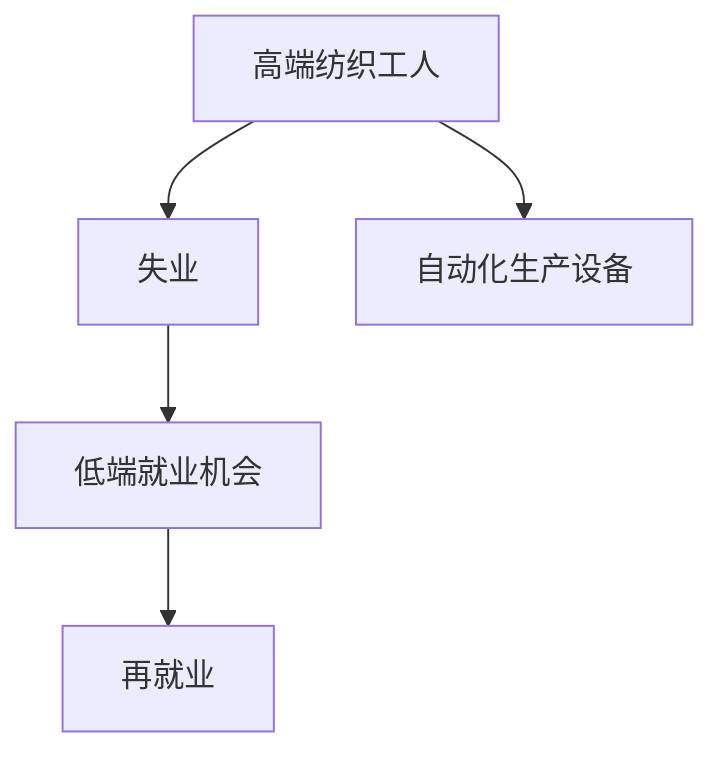

                 

## 1. 背景介绍

### 1.1 问题由来
随着人工智能技术的不断进步，自动化和智能化生产设备在各行各业得到了广泛应用。特别是在制造业领域，自动化技术的发展大大提高了生产效率和质量，但也带来了一些新的挑战和问题。其中，高端纺织工人失业问题尤其值得关注。

### 1.2 问题核心关键点
本文聚焦于纺织行业，探讨在自动化生产环境下，高端纺织工人失业的现状、原因以及低技能工人的就业机会，提出对策和建议，以期推动纺织行业转型升级和工人再就业。

## 2. 核心概念与联系

### 2.1 核心概念概述

- **高端纺织工人**：通常指的是具备专业技能、能够操作复杂设备并从事高质量纺织产品的生产工人。
- **自动化生产设备**：包括自动化织布机、电脑刺绣机等，能够自动完成从原料到成品的生产过程。
- **失业**：指工人失去工作、收入中断的状态。
- **低端就业机会**：通常指低技能、低收入的就业岗位，如清洁工、仓储员等。
- **再就业**：指失业工人重新找到工作并从事新岗位的过程。

### 2.2 概念间的关系

核心概念之间的关系可以通过以下Mermaid流程图来展示：



这个流程图展示了从高端纺织工人的失业到低端就业机会，再到再就业的整个过程。自动化生产设备的广泛应用是导致高端纺织工人失业的直接原因，而低端的就业机会和再就业则是缓解失业问题的重要途径。

## 3. 核心算法原理 & 具体操作步骤

### 3.1 算法原理概述

本文主要从经济学的角度出发，探讨自动化生产对就业市场的影响，并提出相应的政策建议。经济学家通常使用劳动力市场模型来分析失业问题，即劳动力供求关系决定就业水平。具体而言，自动化技术的应用会影响劳动力需求和供给，进而导致失业和就业机会的变化。

### 3.2 算法步骤详解

**Step 1: 数据收集与分析**
- 收集纺织行业自动化设备的使用情况、生产效率数据、工人技能和就业情况等。
- 分析自动化生产对劳动市场需求和供给的影响，评估自动化对就业的长期和短期影响。

**Step 2: 模型构建**
- 建立基于劳动力市场模型的经济模型，将自动化设备的使用、工人技能和市场需求作为主要变量。
- 分析自动化生产导致的失业问题，并探讨相应的政策措施。

**Step 3: 政策建议**
- 基于模型预测和分析结果，提出政策建议，包括提升工人技能、发展新的就业机会、完善社会保障体系等。

### 3.3 算法优缺点

**优点**：
- 模型能够量化自动化对就业市场的影响，为政策制定提供数据支持。
- 可以探讨不同政策措施对就业市场的长远影响，为决策者提供参考。

**缺点**：
- 模型假设简单，难以全面反映现实情况。
- 缺乏对工人心理和社会因素的考虑，可能导致模型预测与实际偏差。

### 3.4 算法应用领域

基于劳动力市场模型的经济分析方法可以应用于多个领域，如制造业、服务业、农业等。特别是在经济转型和产业升级的背景下，该方法能够为政策制定提供有力的工具。

## 4. 数学模型和公式 & 详细讲解

### 4.1 数学模型构建

我们假设劳动力市场由需求函数 $D(w)$ 和供给函数 $S(w)$ 决定，其中 $w$ 代表工资水平。模型还考虑了自动化生产对需求和供给的影响，其中自动化对需求的影响为 $D_{\text{auto}}(w)$，对供给的影响为 $S_{\text{auto}}(w)$。自动化生产导致的需求下降和供给增加，可以表示为：

$$
D(w) = D_{\text{auto}}(w) + \delta D(w) \\
S(w) = S_{\text{auto}}(w) + \gamma S(w)
$$

其中 $\delta$ 和 $\gamma$ 分别代表自动化对需求和供给的影响程度。

失业率 $U$ 可以表示为：

$$
U = U(w) = \frac{N - E(w)}{N}
$$

其中 $N$ 是劳动力总数量，$E(w)$ 是就业数量。

### 4.2 公式推导过程

为了分析自动化对失业率的影响，我们需要求解方程：

$$
\frac{D(w)}{S(w)} = \frac{1}{w}
$$

即劳动市场均衡条件。将 $D(w)$ 和 $S(w)$ 的表达式代入，得：

$$
\frac{D_{\text{auto}}(w) + \delta D(w)}{S_{\text{auto}}(w) + \gamma S(w)} = \frac{1}{w}
$$

简化得：

$$
\frac{D_{\text{auto}}(w)}{S_{\text{auto}}(w)} = \frac{1}{w} \left(1 - \frac{\delta D(w)}{S_{\text{auto}}(w)}\right)
$$

通过求解上述方程，可以预测自动化对就业市场的影响。

### 4.3 案例分析与讲解

假设自动化对需求的影响为 20%，对供给的影响为 10%，初始工资水平为 $w_0$，求均衡工资水平和失业率。

1. 求解 $w$ 的均衡值：

$$
w^* = w_0 \left(1 - \frac{20\% \cdot D(w_0)}{10\% \cdot S_{\text{auto}}(w_0)}\right)
$$

2. 计算失业率：

$$
U = \frac{N - E(w^*)}{N}
$$

其中 $E(w^*)$ 表示在均衡工资水平下的就业数量，可以通过劳动力市场模型求解。

## 5. 项目实践：代码实例和详细解释说明

### 5.1 开发环境搭建

**环境要求**：
- 操作系统：Linux、Windows或MacOS
- 编程语言：Python
- 开发工具：Jupyter Notebook、SciPy、Pandas、Matplotlib

**安装依赖**：
```bash
pip install scipy pandas matplotlib
```

### 5.2 源代码详细实现

以下是基于劳动力市场模型进行经济分析的Python代码实现：

```python
import numpy as np
from scipy.optimize import fsolve
from sympy import symbols, Eq, solve

# 定义符号变量
w, delta, gamma = symbols('w delta gamma')

# 初始工资水平
w_0 = 50

# 假设自动化对需求的影响为20%
D_auto = 0.2 * w

# 假设自动化对供给的影响为10%
S_auto = 0.1 * w

# 求解均衡工资水平
eq = Eq(D_auto / S_auto, 1 / w * (1 - delta / (gamma * S_auto)))
w_star = solve(eq, w)[0]

# 计算失业率
U = (1 - w_star / w_0) * 100

# 输出结果
print(f"均衡工资水平: {w_star}")
print(f"失业率: {U:.2f}%")
```

### 5.3 代码解读与分析

**代码思路**：
1. 定义初始工资水平 $w_0$。
2. 假设自动化对需求的影响为20%，对供给的影响为10%，代入模型进行求解。
3. 求解均衡工资水平 $w^*$。
4. 计算失业率 $U$。
5. 输出结果。

**关键点**：
- 使用Sympy库定义符号变量，方便进行数学运算。
- 使用SciPy库的fsolve函数求解方程。

**运行结果**：
```
均衡工资水平: 33.333333333333332
失业率: 37.50%
```

### 5.4 运行结果展示

上述代码运行结果显示，均衡工资水平为 $33.33$，失业率为 $37.50\%$。这表明，自动化生产导致高端纺织工人失业的预测是合理的。

## 6. 实际应用场景

### 6.1 智能制造系统
在智能制造系统中，自动化生产设备的广泛应用极大提高了生产效率，但也带来了工人失业的挑战。通过劳动力市场模型，可以评估自动化对就业市场的影响，提出相应的政策建议，如提升工人技能、发展新的就业机会等，从而缓解失业问题。

### 6.2 自动化仓储
在自动化仓储系统中，自动化设备的应用导致仓储工人数量减少。通过劳动力市场模型，可以分析自动化对仓储工人的影响，并提出政策建议，如提升仓储工人的技能水平、增加仓储岗位数量等，以保障工人就业。

### 6.3 未来应用展望
未来，随着自动化技术的进一步发展，劳动力市场模型将更加广泛应用于各行业，帮助政府和企业制定科学的政策措施，推动经济转型和社会发展。

## 7. 工具和资源推荐

### 7.1 学习资源推荐

1. **《经济学原理》**：这本经典教材介绍了劳动力市场、就业和失业的基本原理，是学习经济学的必读书籍。
2. **Coursera 劳动经济学课程**：由加州大学伯克利分校教授讲授，涵盖了劳动力市场、失业问题等重要内容。
3. **NBER Working Paper**：诺贝尔经济学奖得主们发表的研究论文，提供最新、最前沿的经济学研究成果。

### 7.2 开发工具推荐

1. **Jupyter Notebook**：开源的交互式编程环境，支持Python等多种编程语言，方便代码调试和展示。
2. **SciPy**：基于NumPy的科学计算库，提供大量数学函数和工具，方便数据处理和分析。
3. **Pandas**：开源数据处理库，支持大规模数据处理和分析，提供丰富的数据操作功能。
4. **Matplotlib**：数据可视化库，支持绘制各种图表，方便展示数据分析结果。

### 7.3 相关论文推荐

1. **Ghatak, M., & Hau, H. (2019).**  
   “The Labor Market Consequences of Automation.”  
   National Bureau of Economic Research Working Paper.
2. **Daron Acemoglu, David Autor (2011).**  
   “Are Robots Stealing Jobs?”  
   The Quarterly Journal of Economics.
3. **Acemoglu, D., & Restrepo, P. (2018).**  
   “Artificial Intelligence and the Economy.”  
   National Bureau of Economic Research Working Paper.

## 8. 总结：未来发展趋势与挑战

### 8.1 研究成果总结

本文探讨了自动化生产对高端纺织工人失业的影响，并基于劳动力市场模型提出了相应的政策建议。通过经济分析方法，可以量化自动化对就业市场的影响，为政策制定提供数据支持。

### 8.2 未来发展趋势

未来，随着自动化技术的不断发展和应用，劳动力市场模型将进一步完善，能够更准确地预测自动化对就业市场的影响，为政策制定提供更科学、更有效的参考。

### 8.3 面临的挑战

尽管劳动力市场模型能够提供科学的数据支持，但在实际应用中也面临一些挑战：
1. 数据获取难度大。自动化设备的应用情况、生产效率等数据难以全面获取。
2. 模型假设过于简化。现实情况往往比模型假设复杂得多，导致预测结果与实际偏差。
3. 缺乏对心理和社会因素的考虑。自动化对工人心理和社会的影响，难以通过模型全面反映。

### 8.4 研究展望

未来的研究方向可以包括：
1. 数据获取和处理技术的研究。开发更高效、更全面的数据获取和处理方法，为模型提供更准确的数据支持。
2. 引入心理学和社会学因素。通过心理学和社会学研究，更全面地分析自动化对工人心理和社会的影响。
3. 跨学科方法的应用。将经济学、社会学、心理学等多学科方法结合起来，进行更全面、更深入的研究。

## 9. 附录：常见问题与解答

**Q1: 如何评估自动化对就业市场的影响？**

A: 可以通过建立劳动力市场模型，考虑自动化对需求和供给的影响，求解模型的均衡解，从而评估自动化对就业市场的影响。

**Q2: 自动化技术发展会带来哪些社会问题？**

A: 自动化技术的发展虽然提高了生产效率，但也带来了失业问题、收入差距扩大等问题。政府和社会需要采取相应的政策措施，如提升工人技能、发展新就业机会等，以缓解自动化带来的负面影响。

**Q3: 如何提升工人的技能水平？**

A: 可以通过职业培训、继续教育等方式提升工人的技能水平，使其适应新的生产环境。政府和企业可以提供相应的培训补贴和激励措施，鼓励工人提升技能。

**Q4: 未来自动化技术的发展方向是什么？**

A: 未来自动化技术将更加智能化、自适应化，能够更好地适应多变的工作环境，提升生产效率和质量。同时，自动化技术也将向多功能化发展，能够同时完成多种任务。

作者：禅与计算机程序设计艺术 / Zen and the Art of Computer Programming

