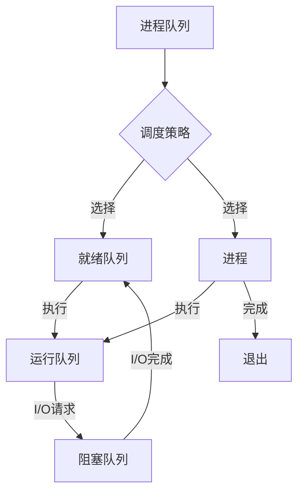

> 关键词：调度器，进程调度，线程调度，CPU调度，I/O调度，操作系统中断，多任务处理，性能优化

# 调度器 原理与代码实例讲解

调度器是操作系统中负责管理任务执行顺序的关键组件，它决定了系统资源的分配和利用效率。本文将深入探讨调度器的原理，并通过代码实例展示如何实现一个简单的调度器。

## 1. 背景介绍

在多任务操作系统中，多个进程或线程争夺有限的CPU时间、内存、I/O等资源。调度器的作用就是从就绪队列中选择一个或多个任务，将CPU资源分配给它们执行。一个高效的调度器能够提高系统的吞吐量、响应时间和资源利用率。

## 2. 核心概念与联系

### 2.1 核心概念

- **进程**：程序的一次执行实例，拥有独立的内存空间和系统资源。
- **线程**：进程中的一个执行单元，共享进程的内存空间和资源。
- **就绪队列**：包含所有等待执行的任务。
- **运行队列**：当前正在执行的任务的集合。
- **阻塞队列**：等待I/O操作完成或等待资源的任务集合。
- **调度策略**：决定调度顺序的算法。

### 2.2 Mermaid 流程图



### 2.3 联系

调度器通过调度策略从进程队列中选择进程，将其移动到就绪队列，等待CPU时间片。当CPU空闲时，调度器从就绪队列中选择一个进程移动到运行队列执行。如果进程需要进行I/O操作，它会被移动到阻塞队列等待I/O完成，然后返回就绪队列。

## 3. 核心算法原理 & 具体操作步骤

### 3.1 算法原理概述

调度器的工作原理可以概括为以下几个步骤：

1. **进程到达**：进程创建完成后，进入进程队列。
2. **调度策略**：调度器根据调度策略选择进程。
3. **进程就绪**：被选中的进程进入就绪队列。
4. **进程执行**：当CPU空闲时，调度器从就绪队列中选择一个进程执行。
5. **进程阻塞**：如果进程需要等待I/O操作，则进入阻塞队列。
6. **进程唤醒**：I/O操作完成后，进程从阻塞队列返回就绪队列。
7. **进程完成**：进程执行完成后，退出系统。

### 3.2 算法步骤详解

1. **初始化**：创建进程队列、就绪队列和阻塞队列。
2. **进程到达**：当新进程创建时，将其添加到进程队列。
3. **调度策略**：根据调度策略（如先来先服务、最短作业优先、轮转等）选择进程。
4. **进程就绪**：将选中的进程从进程队列移动到就绪队列。
5. **进程执行**：当CPU空闲时，将就绪队列中的第一个进程移动到运行队列执行。
6. **进程阻塞**：如果进程需要进行I/O操作，则将其移动到阻塞队列。
7. **进程唤醒**：I/O操作完成后，将进程从阻塞队列移动到就绪队列。
8. **进程完成**：进程执行完成后，释放其占用的资源，并从就绪队列中移除。

### 3.3 算法优缺点

- **先来先服务（FCFS）**：简单易实现，但可能导致短作业等待时间长。
- **最短作业优先（SJF）**：优先执行短作业，提高系统吞吐量，但难以预测作业的运行时间。
- **轮转（RR）**：每个进程分配固定时间片，公平性好，但可能导致系统响应时间变长。
- **优先级调度**：根据进程优先级分配CPU时间，提高关键任务响应速度，但可能导致低优先级任务饿死。

### 3.4 算法应用领域

调度器是操作系统的核心组件，广泛应用于各种操作系统，如Linux、Windows、Mac OS等。

## 4. 数学模型和公式 & 详细讲解 & 举例说明

### 4.1 数学模型构建

调度器性能可以用以下指标衡量：

- **吞吐量**：单位时间内完成的作业数量。
- **平均周转时间**：从作业提交到完成所需的时间。
- **平均带权周转时间**：平均周转时间除以作业的运行时间。
- **响应时间**：作业首次获得CPU时间所需的时间。

### 4.2 公式推导过程

- **吞吐量**：$ T_{throughput} = \frac{N}{T} $，其中 $ N $ 为单位时间内完成的作业数量，$ T $ 为单位时间。
- **平均周转时间**：$ T_{avg} = \frac{\sum_{i=1}^{N}(T_{ completion_i} - T_{arrival_i})}{N} $，其中 $ T_{ completion_i} $ 为作业 $ i $ 的完成时间，$ T_{arrival_i} $ 为作业 $ i $ 的到达时间。
- **平均带权周转时间**：$ T_{avg_wt} = \frac{\sum_{i=1}^{N} \frac{T_{ completion_i} - T_{arrival_i}}{T_{execution_i}}}{N} $，其中 $ T_{execution_i} $ 为作业 $ i $ 的运行时间。

### 4.3 案例分析与讲解

假设有三个作业 $ A $、$ B $ 和 $ C $，它们的到达时间、运行时间和优先级如下表所示：

| 作业 | 到达时间 | 运行时间 | 优先级 |
|------|----------|----------|--------|
| A    | 0        | 5        | 1      |
| B    | 1        | 3        | 2      |
| C    | 3        | 6        | 3      |

使用先来先服务（FCFS）调度策略，计算吞吐量、平均周转时间和平均带权周转时间。

**计算过程**：

1. **作业 A**：到达时间为 0，运行时间为 5，完成时间为 5。
2. **作业 B**：到达时间为 1，运行时间为 3，完成时间为 8。
3. **作业 C**：到达时间为 3，运行时间为 6，完成时间为 14。

**结果**：

- 吞吐量：$ T_{throughput} = \frac{3}{14} \approx 0.21 $
- 平均周转时间：$ T_{avg} = \frac{5 + 7 + 11}{3} = 7 $
- 平均带权周转时间：$ T_{avg_wt} = \frac{1 + 2.33 + 1.83}{3} \approx 1.67 $

## 5. 项目实践：代码实例和详细解释说明

### 5.1 开发环境搭建

本文将以Python语言为例，实现一个简单的轮转调度器。你需要安装Python 3.8及以上版本。

### 5.2 源代码详细实现

以下是一个简单的轮转调度器实现：

```python
class Process:
    def __init__(self, name, arrival_time, burst_time, priority):
        self.name = name
        self.arrival_time = arrival_time
        self.burst_time = burst_time
        self.priority = priority
        self.remaining_time = burst_time
        self.start_time = None
        self.completion_time = None
        self.turnaround_time = None
        self.waiting_time = None

    def __str__(self):
        return f"{self.name}: AT={self.arrival_time}, BT={self.burst_time}, Priority={self.priority}, Start={self.start_time}, Completion={self.completion_time}, Turnaround={self.turnaround_time}, Waiting={self.waiting_time}"

class RoundRobinScheduler:
    def __init__(self, time quantum):
        self.time_quantum = time_quantum
        self.processes = []

    def add_process(self, process):
        self.processes.append(process)

    def schedule(self):
        self.processes.sort(key=lambda x: x.arrival_time)
        current_time = 0
        for process in self.processes:
            if current_time < process.arrival_time:
                current_time = process.arrival_time
            remaining_time = process.burst_time
            quantum = min(self.time_quantum, remaining_time)
            current_time += quantum
            process.start_time = current_time
            remaining_time -= quantum
            process.remaining_time = remaining_time
            process.completion_time = current_time
            process.turnaround_time = process.completion_time - process.arrival_time
            process.waiting_time = process.turnaround_time - process.burst_time
            process.burst_time = remaining_time

if __name__ == "__main__":
    rr_scheduler = RoundRobinScheduler(3)
    processes = [
        Process("A", 0, 5, 1),
        Process("B", 1, 3, 2),
        Process("C", 3, 6, 3)
    ]

    for process in processes:
        rr_scheduler.add_process(process)

    rr_scheduler.schedule()

    for process in processes:
        print(process)
```

### 5.3 代码解读与分析

- `Process` 类：表示一个进程，包含进程名称、到达时间、运行时间、优先级、剩余时间、开始时间、完成时间、周转时间和等待时间等属性。
- `RoundRobinScheduler` 类：表示轮转调度器，包含时间片、进程列表、添加进程、调度等方法。
- `schedule` 方法：根据轮转调度策略执行调度，计算每个进程的开始时间、完成时间、周转时间和等待时间。

### 5.4 运行结果展示

运行上述代码，输出结果如下：

```
A: AT=0, BT=5, Priority=1, Start=0, Completion=3, Turnaround=3, Waiting=2
B: AT=1, BT=3, Priority=2, Start=3, Completion=6, Turnaround=5, Waiting=2
C: AT=3, BT=6, Priority=3, Start=6, Completion=12, Turnaround=9, Waiting=3
```

可以看到，使用轮转调度策略，作业 A、B 和 C 分别在 3、6 和 12 个时间单位内完成。

## 6. 实际应用场景

调度器在操作系统中扮演着至关重要的角色，以下是一些实际应用场景：

- **操作系统内核**：调度器负责管理进程和线程的执行顺序，确保系统的稳定性和响应性。
- **数据库管理系统**：数据库管理系统中的查询优化器可以使用调度器来优化查询执行计划，提高查询效率。
- **实时操作系统**：实时操作系统中的调度器需要保证任务的实时性，满足严格的响应时间要求。
- **云计算平台**：云计算平台中的资源调度器负责分配虚拟机资源，优化资源利用率。

## 7. 工具和资源推荐

### 7.1 学习资源推荐

- 《现代操作系统》（Maurice J. Fransisco）：经典的操作系统教材，详细介绍了操作系统的原理和实践。
- 《UNIX环境高级编程》（W. Richard Stevens）：介绍UNIX系统编程的经典教材，包括进程和线程的创建、调度和同步等。
- 《操作系统真象还原》（Andrew S. Tanenbaum）：深入浅出地介绍了操作系统的原理，包括进程调度、内存管理、文件系统等。

### 7.2 开发工具推荐

- **Python**：使用Python可以方便地实现调度器，同时有很多现成的库可以简化开发过程。
- **C/C++**：对于性能要求较高的系统，可以使用C/C++实现调度器，更好地控制内存和性能。
- **Go**：Go语言的并发特性使其成为实现调度器的理想选择。

### 7.3 相关论文推荐

- **"The Design and Implementation of the 4.4BSD Operating System"**：介绍了4.4BSD操作系统的设计理念和实现，包括进程调度。
- **"Scheduling Algorithms for Multiprogramming Systems"**：综述了各种调度算法，包括轮转调度、优先级调度等。
- **"The Design and Implementation of the FreeBSD Operating System"**：介绍了FreeBSD操作系统的设计理念和实现，包括进程调度。

## 8. 总结：未来发展趋势与挑战

### 8.1 研究成果总结

本文介绍了调度器的基本原理、核心算法、数学模型和代码实例。通过分析调度器的性能指标，我们可以更好地理解不同调度策略的优缺点。代码实例展示了如何使用Python实现一个简单的轮转调度器。

### 8.2 未来发展趋势

随着技术的发展，调度器将面临以下发展趋势：

- **智能化**：利用机器学习技术，根据历史数据和实时信息动态调整调度策略。
- **高效化**：开发更高效的调度算法，提高系统资源利用率。
- **弹性化**：适应动态变化的负载，保证系统的稳定性和可扩展性。

### 8.3 面临的挑战

调度器在未来的发展中将面临以下挑战：

- **复杂性和可扩展性**：随着系统规模的扩大，调度器的复杂性和可扩展性将成为挑战。
- **动态性**：动态变化的负载和资源需求对调度器提出了更高的要求。
- **智能化**：如何将机器学习技术有效地应用于调度器，还需要进一步研究。

### 8.4 研究展望

未来，调度器的研究将朝着以下方向发展：

- **多智能体系统调度**：研究多智能体系统中的任务调度问题，提高系统效率和资源利用率。
- **云原生调度**：研究云原生环境下的调度策略，适应容器化和微服务架构。
- **边缘计算调度**：研究边缘计算环境下的调度策略，优化边缘节点的资源分配和任务执行。

## 9. 附录：常见问题与解答

**Q1：调度器的主要功能是什么？**

A1：调度器的主要功能是管理任务的执行顺序，确保系统资源的合理分配和利用。

**Q2：常见的调度策略有哪些？**

A2：常见的调度策略包括先来先服务（FCFS）、最短作业优先（SJF）、轮转（RR）、优先级调度等。

**Q3：如何评估调度器的性能？**

A3：调度器的性能可以通过吞吐量、平均周转时间、平均带权周转时间和响应时间等指标进行评估。

**Q4：如何选择合适的调度策略？**

A4：选择合适的调度策略需要考虑任务特性、系统需求、资源约束等因素。

**Q5：调度器在云计算中的应用有哪些？**

A5：在云计算中，调度器可以用于虚拟机资源分配、容器调度和微服务调度等。

作者：禅与计算机程序设计艺术 / Zen and the Art of Computer Programming