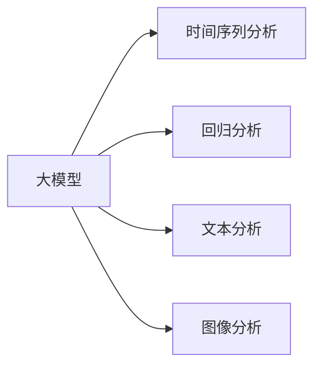

> 大模型, 财经分析, 预测市场趋势, 机器学习, 时间序列分析, 回归分析, 深度学习, LSTMs

# 财经分析中的AI：如何用大模型预测市场趋势

> 关键词：大模型，财经分析，预测市场趋势，机器学习，时间序列分析，回归分析，深度学习，LSTMs

## 1. 背景介绍

随着人工智能技术的飞速发展，机器学习在各个领域的应用日益广泛。在财经分析领域，人工智能技术，尤其是大模型，正逐渐成为预测市场趋势、辅助投资决策的重要工具。本文将深入探讨大模型在财经分析中的应用，分析其原理、操作步骤以及在实际场景中的应用。

### 1.1 问题的由来

金融市场波动复杂，影响市场趋势的因素众多，包括宏观经济数据、公司基本面、市场情绪等。传统的金融分析方法主要依靠分析师的经验和直觉，难以捕捉到市场中的细微变化。而人工智能技术，尤其是大模型，能够处理海量数据，从复杂的关系中发现规律，为市场趋势预测提供有力支持。

### 1.2 研究现状

目前，大模型在财经分析中的应用主要集中在以下几个方面：

- 时间序列分析：利用历史市场数据预测未来价格走势。
- 回归分析：分析影响资产价格的关键因素，建立预测模型。
- 文本分析：从新闻报道、社交媒体等文本数据中提取信息，预测市场情绪。
- 图像分析：分析股票走势图等图像数据，预测市场趋势。

### 1.3 研究意义

大模型在财经分析中的应用，具有以下重要意义：

- 提高预测精度：通过学习海量数据，大模型能够捕捉到市场中的细微变化，提高预测精度。
- 优化决策效率：为投资者提供更准确的市场趋势预测，辅助投资决策。
- 降低人力成本：减少分析师的劳动强度，提高工作效率。
- 发现潜在规律：挖掘市场中的潜在规律，为市场研究提供新思路。

### 1.4 本文结构

本文将围绕以下内容展开：

- 介绍大模型在财经分析中的核心概念和原理。
- 阐述大模型预测市场趋势的具体操作步骤。
- 分析大模型在实际场景中的应用案例。
- 探讨大模型在财经分析中的未来发展趋势和挑战。

## 2. 核心概念与联系

### 2.1 核心概念

#### 大模型

大模型指的是具有海量参数和强大计算能力的深度学习模型。常见的有大语言模型（如BERT、GPT）、卷积神经网络（如CNN）和循环神经网络（如LSTM）等。

#### 时间序列分析

时间序列分析是研究序列数据随时间变化规律的统计分析方法。在财经分析中，时间序列分析用于分析历史价格走势，预测未来价格。

#### 回归分析

回归分析是研究变量之间关系的统计方法。在财经分析中，回归分析用于分析影响资产价格的关键因素，建立预测模型。

#### 文本分析

文本分析是利用自然语言处理技术，从文本数据中提取有用信息的方法。在财经分析中，文本分析用于分析新闻报道、社交媒体等文本数据，预测市场情绪。

#### 图像分析

图像分析是利用计算机视觉技术，从图像数据中提取有用信息的方法。在财经分析中，图像分析用于分析股票走势图等图像数据，预测市场趋势。

### 2.2 联系

大模型可以应用于时间序列分析、回归分析、文本分析和图像分析等多个领域，实现市场趋势预测。以下是大模型与各个领域之间的联系：



## 3. 核心算法原理 & 具体操作步骤

### 3.1 算法原理概述

大模型在财经分析中的预测市场趋势主要基于以下原理：

- 深度学习：通过多层神经网络结构，将输入数据转换为高维特征表示，捕捉数据中的复杂关系。
- 神经网络优化：使用梯度下降等优化算法，不断调整模型参数，使模型输出与真实标签尽可能接近。
- 评估指标：使用均方误差、交叉熵损失等评估指标，衡量模型预测结果的准确性。

### 3.2 算法步骤详解

大模型预测市场趋势的基本步骤如下：

1. 数据收集：收集历史市场数据、公司基本面数据、新闻报道、社交媒体数据、股票走势图等。
2. 数据预处理：对数据进行清洗、归一化等预处理操作，确保数据质量。
3. 模型选择：根据任务需求，选择合适的大模型结构，如LSTM、CNN等。
4. 模型训练：使用历史数据进行模型训练，优化模型参数。
5. 模型评估：使用测试集评估模型预测精度，调整模型结构和参数。
6. 预测：使用训练好的模型进行市场趋势预测。

### 3.3 算法优缺点

#### 优点

- 高精度：通过学习海量数据，大模型能够捕捉到市场中的细微变化，提高预测精度。
- 强泛化能力：大模型能够从不同来源的数据中学习到通用特征，具有较好的泛化能力。
- 自动化：大模型可以自动从数据中学习规律，减轻分析师的工作负担。

#### 缺点

- 计算资源消耗大：大模型需要大量的计算资源进行训练和推理。
- 数据依赖性强：模型的预测效果依赖于数据质量和数量。
- 解释性差：大模型的内部工作机制难以解释，难以理解其预测结果的依据。

### 3.4 算法应用领域

大模型在以下财经分析领域得到广泛应用：

- 资产价格预测：预测股票、期货、外汇等资产的未来价格走势。
- 投资组合优化：根据市场趋势预测，构建最优的投资组合。
- 风险管理：识别市场风险，制定相应的风险管理策略。
- 量化交易：基于市场趋势预测，进行高频交易等量化交易策略。

## 4. 数学模型和公式 & 详细讲解 & 举例说明

### 4.1 数学模型构建

以下是一个基于LSTM的时间序列分析模型，用于预测股票价格：

$$
y_t = f(W_1x_t + W_2h_t^{(L-1)} + b_1 + b_2)
$$

其中，$y_t$ 表示第t个时间步的预测价格，$x_t$ 表示第t个时间步的输入特征（如历史价格、成交量等），$h_t^{(L-1)}$ 表示LSTM模型的隐藏状态，$W_1$、$W_2$、$b_1$ 和 $b_2$ 为模型参数。

### 4.2 公式推导过程

LSTM模型的核心是遗忘门、输入门和输出门，其数学公式如下：

$$
i_t = \sigma(W_i[x_t, h_{t-1}, c_{t-1}] + b_i) \\
f_t = \sigma(W_f[x_t, h_{t-1}, c_{t-1}] + b_f) \\
g_t = \tanh(W_g[x_t, h_{t-1}, c_{t-1}] + b_g) \\
o_t = \sigma(W_o[x_t, h_{t-1}, c_{t-1}] + b_o) \\
c_t = f_t \odot c_{t-1} + i_t \odot g_t \\
h_t = o_t \odot \tanh(c_t)
$$

其中，$\sigma$ 为sigmoid函数，$\tanh$ 为双曲正切函数，$\odot$ 表示元素乘积。

### 4.3 案例分析与讲解

以下是一个基于LSTM模型预测股票价格的案例：

1. **数据收集**：收集某股票的历史价格数据，包括开盘价、最高价、最低价、收盘价、成交量等。
2. **数据预处理**：对数据进行归一化处理，将数据缩放到[0, 1]区间。
3. **模型构建**：使用TensorFlow框架构建LSTM模型，设置输入层、LSTM层和输出层。
4. **模型训练**：使用历史价格数据进行模型训练，优化模型参数。
5. **模型评估**：使用测试集评估模型预测精度，调整模型结构和参数。
6. **预测**：使用训练好的模型预测未来股票价格。

通过模型训练和预测，可以得到股票价格的预测结果，并与实际价格进行比较，评估模型的预测精度。

## 5. 项目实践：代码实例和详细解释说明

### 5.1 开发环境搭建

为了进行大模型预测市场趋势的项目实践，需要以下开发环境：

- 操作系统：Windows、macOS或Linux
- 编程语言：Python
- 深度学习框架：TensorFlow或PyTorch
- 数据处理库：NumPy、Pandas

### 5.2 源代码详细实现

以下是一个基于TensorFlow构建LSTM模型的股票价格预测代码示例：

```python
import tensorflow as tf
from tensorflow.keras.models import Sequential
from tensorflow.keras.layers import LSTM, Dense

# 加载股票价格数据
data = pd.read_csv('stock_prices.csv')

# 数据预处理
data = data[['Open', 'Close']]
data = data.values
data = data[:, :-1] / data[:, 0]
data = data.reshape(-1, 1, data.shape[1])

# 构建LSTM模型
model = Sequential()
model.add(LSTM(50, input_shape=(data.shape[1], 1)))
model.add(Dense(1))
model.compile(optimizer='adam', loss='mean_squared_error')

# 模型训练
model.fit(data[:, :-1], data[:, 1], epochs=100, batch_size=1, validation_split=0.2)

# 预测
predictions = model.predict(data[:, :-1])
```

### 5.3 代码解读与分析

上述代码展示了如何使用TensorFlow构建LSTM模型进行股票价格预测。

- 导入必要的库：导入TensorFlow、Sequential、LSTM、Dense等库。
- 加载股票价格数据：使用Pandas读取股票价格数据。
- 数据预处理：对数据进行归一化处理，并将其转换为LSTM所需的格式。
- 构建LSTM模型：使用Sequential构建LSTM模型，设置输入层、LSTM层和输出层。
- 模型编译：设置模型优化器和损失函数。
- 模型训练：使用历史价格数据进行模型训练。
- 预测：使用训练好的模型预测未来股票价格。

### 5.4 运行结果展示

通过运行上述代码，可以得到股票价格的预测结果。将这些结果与实际价格进行比较，可以评估模型的预测精度。

## 6. 实际应用场景

### 6.1 资产价格预测

大模型可以用于预测股票、期货、外汇等资产的未来价格走势。通过分析历史价格、成交量、新闻、社交媒体等数据，大模型可以捕捉到市场中的细微变化，为投资者提供参考。

### 6.2 投资组合优化

大模型可以分析不同资产的历史表现和相关性，构建最优的投资组合。通过预测未来价格走势，大模型可以帮助投资者选择合适的资产配置，降低投资风险。

### 6.3 风险管理

大模型可以识别市场风险，预测潜在的市场波动。通过分析历史数据和市场情绪，大模型可以预测市场风险，帮助金融机构制定相应的风险管理策略。

### 6.4 量化交易

大模型可以用于量化交易策略的开发和执行。通过预测未来价格走势，大模型可以帮助量化交易者制定交易策略，实现自动化交易。

## 7. 工具和资源推荐

### 7.1 学习资源推荐

- 《TensorFlow实战》
- 《深度学习入门》
- 《机器学习实战》
- 《自然语言处理入门》

### 7.2 开发工具推荐

- TensorFlow
- PyTorch
- Jupyter Notebook
- Pandas
- NumPy

### 7.3 相关论文推荐

- LSTM: A Tutorial on Long Short-Term Memory Recurrent Neural Networks
- A Theoretically Grounded Application of Dropout in Recurrent Neural Networks
- Sequence to Sequence Learning with Neural Networks
- BERT: Pre-training of Deep Bidirectional Transformers for Language Understanding

## 8. 总结：未来发展趋势与挑战

### 8.1 研究成果总结

大模型在财经分析中的应用取得了显著的成果，为市场趋势预测提供了新的思路和方法。通过学习海量数据，大模型能够捕捉到市场中的细微变化，提高预测精度。

### 8.2 未来发展趋势

未来，大模型在财经分析中的应用将呈现以下趋势：

- 模型规模不断扩大：随着计算资源的增加，大模型的规模将进一步扩大，学习到更丰富的知识。
- 跨学科融合：大模型将与经济学、金融学等学科深度融合，提高预测的准确性和可靠性。
- 可解释性增强：通过改进模型结构和优化算法，提高大模型的可解释性，增强投资者的信任。

### 8.3 面临的挑战

大模型在财经分析中的应用也面临着以下挑战：

- 数据质量：数据质量直接影响预测精度，需要保证数据的质量和多样性。
- 模型可解释性：大模型的内部工作机制难以解释，需要提高模型的可解释性。
- 法律法规：大模型在财经分析中的应用需要遵守相关法律法规，确保模型的公平性和透明度。

### 8.4 研究展望

未来，大模型在财经分析中的应用将有以下研究方向：

- 开发更高效、更准确的预测模型。
- 提高模型的可解释性，增强投资者的信任。
- 探索大模型在更多财经领域的应用。
- 研究大模型在财经分析中的伦理和法律问题。

## 9. 附录：常见问题与解答

**Q1：大模型在财经分析中的优势是什么？**

A：大模型在财经分析中的优势主要体现在以下几个方面：

- 高精度：通过学习海量数据，大模型能够捕捉到市场中的细微变化，提高预测精度。
- 强泛化能力：大模型能够从不同来源的数据中学习到通用特征，具有较好的泛化能力。
- 自动化：大模型可以自动从数据中学习规律，减轻分析师的工作负担。

**Q2：如何提高大模型在财经分析中的预测精度？**

A：提高大模型在财经分析中的预测精度可以从以下几个方面入手：

- 提高数据质量：确保数据的质量和多样性。
- 优化模型结构：根据任务需求选择合适的模型结构。
- 调整超参数：通过调参提高模型的性能。
- 模型集成：使用多个模型进行集成，提高预测精度。

**Q3：大模型在财经分析中的局限性是什么？**

A：大模型在财经分析中的局限性主要体现在以下几个方面：

- 数据依赖性强：模型的预测效果依赖于数据质量和数量。
- 计算资源消耗大：大模型需要大量的计算资源进行训练和推理。
- 模型可解释性差：大模型的内部工作机制难以解释，难以理解其预测结果的依据。

**Q4：如何解决大模型在财经分析中的局限性？**

A：解决大模型在财经分析中的局限性可以从以下几个方面入手：

- 采用数据增强、数据采样等方法提高数据质量。
- 采用模型压缩、量化等技术降低计算资源消耗。
- 采用可解释性AI技术提高模型的可解释性。

作者：禅与计算机程序设计艺术 / Zen and the Art of Computer Programming