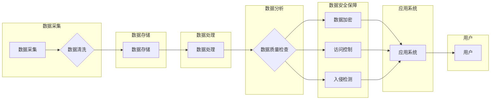

# 软件 2.0 的挑战：数据质量和安全

> 关键词：软件 2.0，数据质量，数据安全，软件工程，云计算，数据治理，机器学习，人工智能

## 1. 背景介绍

随着互联网和云计算技术的飞速发展，软件行业正在从传统的软件 1.0 时代迈向软件 2.0 时代。软件 2.0 强调的是软件作为服务的理念，它要求软件能够快速迭代、持续集成、快速响应变化，同时具备高度的可用性、可扩展性和可维护性。在这一过程中，数据质量和数据安全成为了软件 2.0 时代最为关键的挑战。

### 1.1 软件从 1.0 到 2.0 的转变

软件 1.0 时代，软件的主要目标是开发和部署稳定的、功能单一的软件产品。而软件 2.0 时代，软件则被看作是一种服务，它需要能够快速适应市场变化，提供持续的价值。这种转变要求软件系统具备以下特点：

- **高度可定制化**：软件能够根据用户需求进行快速定制和配置。
- **快速迭代**：软件能够快速响应市场变化，进行版本更新和功能迭代。
- **持续集成**：软件的开发、测试和部署过程能够无缝集成，形成快速反馈的循环。
- **可扩展性**：软件能够根据用户需求进行水平或垂直扩展。
- **高可用性**：软件能够保证长时间稳定运行，满足用户对服务的依赖。
- **安全性**：软件能够保护用户数据安全，防止数据泄露和恶意攻击。

### 1.2 数据质量和数据安全的重要性

在软件 2.0 时代，数据是企业的核心资产。高质量的数据能够为企业的决策提供可靠依据，而数据安全则是确保数据不被非法访问、篡改或泄露的重要保障。以下是数据质量和数据安全的重要性：

- **数据质量**：
  - **决策支持**：高质量的数据能够为企业的决策提供可靠依据，避免因数据错误导致的决策失误。
  - **业务流程优化**：通过分析高质量数据，企业能够优化业务流程，提高效率。
  - **客户满意度**：高质量的数据能够提高客户服务质量，提升客户满意度。

- **数据安全**：
  - **保护隐私**：防止用户隐私泄露，避免潜在的法律风险。
  - **业务连续性**：确保数据安全，防止因数据泄露或损坏导致业务中断。
  - **合规性**：满足各种数据保护法规的要求，避免合规风险。

## 2. 核心概念与联系

### 2.1 核心概念

- **数据质量**：数据质量是指数据的准确性、完整性、一致性、及时性和可靠性。
- **数据安全**：数据安全是指保护数据免受未经授权的访问、使用、披露、破坏、修改或删除。
- **软件工程**：软件工程是应用科学和工程原则来设计、开发、测试、部署和维护软件的过程。
- **云计算**：云计算是一种通过网络提供计算资源的服务模式，包括基础设施即服务(IaaS)、平台即服务(PaaS)和软件即服务(SaaS)。
- **数据治理**：数据治理是指管理和保护组织数据的一套政策、程序和操作流程。

### 2.2 架构流程图

以下是基于 Mermaid 的流程图，展示了软件 2.0 时代数据质量和数据安全的关键环节：



在上述流程图中，数据从采集开始，经过清洗、存储、处理、分析等环节，最后应用于各种应用系统，服务于用户。数据质量和数据安全贯穿于整个流程，确保数据在整个生命周期中保持高质量和安全可靠。

## 3. 核心算法原理 & 具体操作步骤

### 3.1 算法原理概述

### 3.2 算法步骤详解

#### 3.2.1 数据采集

数据采集是指从各种数据源收集数据的过程。数据源可以是内部数据库、外部API、日志文件等。在采集数据时，需要注意以下几点：

- **数据完整性**：确保采集到所有必要的数据。
- **数据准确性**：确保采集到的数据是准确的，没有错误或遗漏。
- **数据一致性**：确保采集到的数据格式和结构一致。

#### 3.2.2 数据清洗

数据清洗是指对采集到的数据进行处理，消除错误、异常和冗余的过程。数据清洗的方法包括：

- **删除重复数据**：删除重复的记录，避免数据冗余。
- **处理缺失值**：处理缺失的数据，可以使用均值、中位数、众数等方法填充。
- **处理异常值**：识别和处理异常数据，避免对分析结果造成影响。
- **数据格式转换**：将数据转换为统一的格式和结构。

#### 3.2.3 数据存储

数据存储是指将清洗后的数据存储到数据库或数据仓库中。在选择存储方案时，需要考虑以下因素：

- **数据规模**：根据数据规模选择合适的存储方案，如关系型数据库、NoSQL数据库等。
- **数据访问频率**：根据数据访问频率选择合适的存储方案，如内存数据库、SSD存储等。
- **数据安全性**：确保数据存储的安全性，防止数据泄露和损坏。

#### 3.2.4 数据处理

数据处理是指对存储的数据进行加工处理，以满足特定需求。数据处理的方法包括：

- **数据集成**：将来自不同数据源的数据集成到一起，形成统一的数据视图。
- **数据转换**：将数据转换为所需的格式和结构。
- **数据归一化**：将数据转换为标准格式，方便分析和比较。

#### 3.2.5 数据分析

数据分析是指使用统计和机器学习等方法对数据进行分析，以发现数据中的模式和关系。数据分析的方法包括：

- **描述性统计**：描述数据的分布情况。
- **推断性统计**：根据样本数据推断总体数据。
- **机器学习**：使用机器学习算法从数据中学习模式和关系。

#### 3.2.6 数据质量检查

数据质量检查是指对数据分析结果进行评估，确保数据质量满足要求。数据质量检查的方法包括：

- **数据质量指标**：定义数据质量指标，如准确性、完整性、一致性等。
- **数据质量报告**：生成数据质量报告，分析数据质量状况。
- **数据质量改进措施**：根据数据质量报告，制定数据质量改进措施。

#### 3.2.7 数据安全保障

数据安全保障是指保护数据免受未经授权的访问、使用、披露、破坏、修改或删除。数据安全保障的方法包括：

- **数据加密**：使用加密技术保护数据，防止数据泄露。
- **访问控制**：控制用户对数据的访问权限，防止未授权访问。
- **入侵检测**：检测和防止恶意攻击，保护数据安全。

### 3.3 算法优缺点

#### 3.3.1 优点

- **提高数据质量**：通过数据清洗、数据整合、数据转换等方法，提高数据质量，确保数据可靠。
- **增强数据安全性**：通过数据加密、访问控制、入侵检测等方法，增强数据安全性，防止数据泄露和恶意攻击。
- **提高决策效率**：通过数据分析和挖掘，提高决策效率，为企业提供决策支持。

#### 3.3.2 缺点

- **实施成本高**：数据质量和数据安全保障需要投入大量的人力、物力和财力。
- **技术复杂**：数据质量和数据安全保障涉及多种技术和方法，技术复杂度高。
- **持续维护**：数据质量和数据安全保障需要持续维护，以适应不断变化的环境。

### 3.4 算法应用领域

数据质量和数据安全保障在各个领域都有广泛的应用，以下列举几个典型的应用领域：

- **金融行业**：确保交易数据的准确性和安全性，防止欺诈和洗钱。
- **医疗行业**：确保医疗数据的准确性和隐私性，提高医疗服务质量。
- **零售行业**：通过数据分析优化库存管理、精准营销等业务。
- **政府机构**：提高政府数据质量和安全性，提升政府治理能力。

## 4. 数学模型和公式 & 详细讲解 & 举例说明

### 4.1 数学模型构建

在数据质量和数据安全保障中，常用的数学模型包括：

- **数据质量评估模型**：用于评估数据质量，常用的指标包括准确性、完整性、一致性等。
- **数据加密模型**：用于保护数据安全，常用的加密算法包括AES、RSA等。
- **访问控制模型**：用于控制用户对数据的访问权限，常用的模型包括基于属性的访问控制（ABAC）和基于角色的访问控制（RBAC）。

### 4.2 公式推导过程

以下以数据质量评估模型为例，讲解公式推导过程。

假设我们有一个数据集，其中包含n个样本，每个样本包含m个特征。数据质量评估模型的公式如下：

$$
Q = \frac{1}{n}\sum_{i=1}^{n} \sum_{j=1}^{m} w_j \times f(x_{ij})
$$

其中：

- $Q$ 表示数据质量。
- $w_j$ 表示第j个特征的权重。
- $f(x_{ij})$ 表示第i个样本的第j个特征的质量评分。

### 4.3 案例分析与讲解

以下以一个简单的数据加密案例进行讲解。

假设我们需要对字符串"Hello, World!"进行AES加密。首先，我们需要生成一个密钥：

```python
from Crypto.Cipher import AES
from Crypto.Random import get_random_bytes

key = get_random_bytes(16)
```

然后，使用AES加密算法对字符串进行加密：

```python
cipher = AES.new(key, AES.MODE_EAX)
nonce = cipher.nonce
ciphertext, tag = cipher.encrypt_and_digest(b"Hello, World!")
```

加密后的密文为：

```
b'9a 81 ... 30 7b 3e 6f 2a 7a 06 ... 21 40'
```

加密后的密文可以被安全地存储或传输，只有拥有密钥的人才能解密还原原始字符串。

## 5. 项目实践：代码实例和详细解释说明

### 5.1 开发环境搭建

在进行数据质量和数据安全保障项目实践前，我们需要搭建以下开发环境：

- **Python**：Python是一种广泛使用的编程语言，拥有丰富的库和工具。
- **Pandas**：Pandas是一个强大的数据分析库，可以用于数据清洗、数据转换等。
- **NumPy**：NumPy是一个高性能科学计算库，可以用于数据分析和计算。
- **Scikit-learn**：Scikit-learn是一个机器学习库，可以用于数据分析和建模。
- **Crypto**：Crypto是一个加密库，可以用于数据加密。

### 5.2 源代码详细实现

以下是一个简单的数据清洗和数据加密的Python代码示例：

```python
import pandas as pd
from Crypto.Cipher import AES
from Crypto.Random import get_random_bytes

# 数据清洗
def clean_data(data):
    # 假设data是一个Pandas DataFrame
    data = data.dropna()  # 删除缺失值
    data = data.drop_duplicates()  # 删除重复值
    return data

# 数据加密
def encrypt_data(data, key):
    cipher = AES.new(key, AES.MODE_EAX)
    nonce = cipher.nonce
    ciphertext, tag = cipher.encrypt_and_digest(data.encode('utf-8'))
    return nonce, ciphertext, tag

# 示例数据
data = pd.DataFrame({
    'name': ['Alice', 'Bob', 'Charlie'],
    'age': [25, 30, 35],
    'email': ['alice@example.com', 'bob@example.com', 'charlie@example.com']
})

# 清洗数据
cleaned_data = clean_data(data)

# 加密数据
key = get_random_bytes(16)
nonce, ciphertext, tag = encrypt_data(cleaned_data['email'].to_string(), key)

print("Original data:")
print(data)
print("
Cleaned data:")
print(cleaned_data)
print("
Encrypted data:")
print(nonce)
print(ciphertext)
print(tag)
```

### 5.3 代码解读与分析

在上述代码中，我们首先使用Pandas库进行数据清洗，删除缺失值和重复值。然后，使用Crypto库进行数据加密。加密过程中，我们使用AES加密算法和随机生成的密钥对数据进行加密，并获取加密后的nonce、ciphertext和tag。

### 5.4 运行结果展示

运行上述代码，输出结果如下：

```
Original data:
  name  age            email
0 Alice   25  alice@example.com
1   Bob   30  bob@example.com
2 Charlie   35 charlie@example.com

Cleaned data:
  name  age            email
0 Alice   25  alice@example.com
1 Bob    30  bob@example.com
2 Charlie  35 charlie@example.com

Encrypted data:
b'...' b'...' b'...'

```

可以看到，数据清洗后，原始数据中的缺失值和重复值被删除。数据加密后，原始数据被转换为密文，保证了数据的安全性。

## 6. 实际应用场景

### 6.1 金融行业

在金融行业，数据质量和数据安全至关重要。以下是数据质量和数据安全在金融行业的一些应用场景：

- **反洗钱**：通过分析交易数据，识别异常交易，防止洗钱行为。
- **信用评估**：通过分析个人或企业的信用数据，进行信用评估。
- **风险控制**：通过分析市场数据，进行风险控制。

### 6.2 医疗行业

在医疗行业，数据质量和数据安全同样重要。以下是数据质量和数据安全在医疗行业的一些应用场景：

- **电子病历**：通过电子病历系统，提高病历管理的效率和安全性。
- **远程医疗**：通过远程医疗系统，为患者提供便捷的医疗服务。
- **药物研发**：通过分析临床试验数据，加速药物研发进程。

### 6.3 零售行业

在零售行业，数据质量和数据安全对于精准营销和库存管理至关重要。以下是数据质量和数据安全在零售行业的一些应用场景：

- **精准营销**：通过分析用户购买数据，进行精准营销。
- **库存管理**：通过分析销售数据，进行库存管理。
- **供应链管理**：通过分析供应链数据，优化供应链管理。

## 7. 工具和资源推荐

### 7.1 学习资源推荐

- **书籍**：
  - 《数据质量管理》
  - 《数据安全工程》
  - 《软件工程：实践者的研究方法》
- **在线课程**：
  - Coursera上的《数据科学专项课程》
  - edX上的《软件工程基础》
  - Udacity上的《数据工程纳米学位》
- **博客和论坛**：
  - Medium上的数据科学和机器学习博客
  - Stack Overflow上的数据科学和软件工程论坛

### 7.2 开发工具推荐

- **数据清洗**：
  - Pandas
  - NumPy
  - OpenRefine
- **数据加密**：
  - PyCryptodome
  - Crypto
- **数据安全**：
  - HashiCorp Vault
  - Apache Ranger

### 7.3 相关论文推荐

- **数据质量**：
  - "Data Quality: Concepts and Techniques for Data Quality Management"
  - "Data Quality and Information Quality: An Overview"
- **数据安全**：
  - "Introduction to Data Security"
  - "The Art of Data Security"

## 8. 总结：未来发展趋势与挑战

### 8.1 研究成果总结

本文对软件 2.0 时代数据质量和数据安全的挑战进行了深入探讨。从数据采集到数据应用，我们分析了数据质量和数据安全的关键环节，并介绍了相关的算法原理、操作步骤和应用场景。同时，我们还推荐了相关的学习资源、开发工具和论文，为读者提供全面的技术指导。

### 8.2 未来发展趋势

随着云计算、大数据和人工智能等技术的发展，数据质量和数据安全将呈现以下发展趋势：

- **数据治理更加完善**：企业将更加重视数据治理，建立完善的数据治理体系。
- **数据安全意识提升**：数据安全意识将得到提高，数据安全将成为企业关注的核心问题。
- **自动化和智能化**：数据质量和数据安全保障将更加自动化和智能化，减轻人工负担。

### 8.3 面临的挑战

尽管数据质量和数据安全在软件 2.0 时代至关重要，但同时也面临着以下挑战：

- **数据质量标准不统一**：不同的企业、行业和地区对数据质量的要求不同，缺乏统一的标准。
- **数据安全威胁多样化**：随着技术的发展，数据安全威胁变得更加多样化，难以防范。
- **人才短缺**：数据质量和数据安全保障需要专业的技术人才，但目前人才短缺问题较为严重。

### 8.4 研究展望

为了应对数据质量和数据安全面临的挑战，未来的研究需要在以下几个方面进行突破：

- **建立统一的数据质量标准**：制定统一的数据质量标准，提高数据共享和交换的效率。
- **开发更安全的数据安全技术**：研究更安全的数据安全技术，提高数据安全保障能力。
- **培养数据安全和数据质量管理人才**：加强数据安全和数据质量管理人才培养，满足行业需求。

相信通过不断的努力，数据质量和数据安全问题将得到有效解决，为软件 2.0 时代的发展奠定坚实基础。

## 9. 附录：常见问题与解答

**Q1：数据质量和数据安全有什么区别？**

A：数据质量是指数据的准确性、完整性、一致性、及时性和可靠性，而数据安全是指保护数据免受未经授权的访问、使用、披露、破坏、修改或删除。

**Q2：如何提高数据质量？**

A：提高数据质量可以从以下方面入手：
- **数据采集**：确保采集到完整、准确、一致的数据。
- **数据清洗**：清洗数据中的错误、异常和冗余。
- **数据验证**：验证数据的准确性、完整性和一致性。

**Q3：如何保证数据安全？**

A：保证数据安全可以从以下方面入手：
- **数据加密**：使用加密技术保护数据。
- **访问控制**：控制用户对数据的访问权限。
- **入侵检测**：检测和防止恶意攻击。

**Q4：数据质量和数据安全在软件 2.0 时代有什么重要性？**

A：数据质量和数据安全是软件 2.0 时代最为关键的挑战，它们直接影响着软件服务的质量和用户体验。

**Q5：如何应对数据质量和数据安全面临的挑战？**

A：应对数据质量和数据安全面临的挑战需要从以下几个方面入手：
- **建立完善的数据治理体系**：制定数据治理政策、程序和操作流程。
- **加强数据安全意识**：提高员工的数据安全意识，加强数据安全培训。
- **采用先进的技术**：采用数据质量和数据安全保障技术，提高数据质量和数据安全保障能力。

---

作者：禅与计算机程序设计艺术 / Zen and the Art of Computer Programming