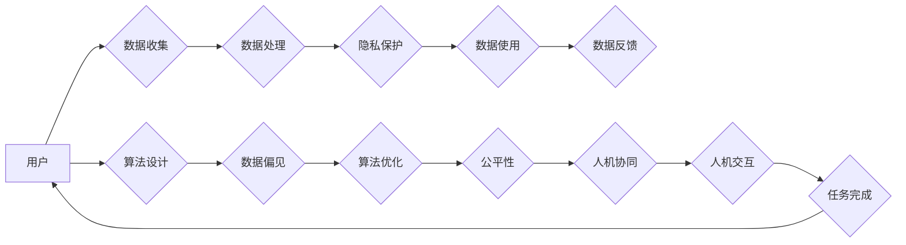

> 关键词：软件2.0，社会责任，科技向善，伦理，数据隐私，人工智能，可持续发展，人机协同

## 1. 背景介绍

随着信息技术的飞速发展，软件作为信息时代的核心驱动力，已经深刻地改变了我们的生活方式和社会结构。从早期的软件1.0时代，以功能实现为核心，到如今的软件2.0时代，软件正在向智能化、服务化、平台化方向发展。然而，随着技术的进步，软件带来的社会影响也日益复杂，如何确保软件发展符合社会伦理道德，实现科技向善，成为了我们必须面对的重要课题。

### 1.1 问题的由来

软件2.0时代，技术发展带来了以下几方面的问题：

1. **数据隐私泄露**：随着数据收集和分析技术的普及，个人隐私保护面临巨大挑战。
2. **算法偏见**：人工智能算法可能存在偏见，导致歧视和不公平现象。
3. **技术依赖**：过度依赖技术可能导致人类技能退化，影响社会多样性。
4. **数字鸿沟**：技术发展不均衡，导致社会分层加剧。
5. **可持续发展**：软件发展对环境造成的影响，如能源消耗和电子废物问题。

### 1.2 研究现状

针对上述问题，学术界和工业界已经开始关注软件的社会责任，并提出了以下研究方向：

1. **数据隐私保护**：研究匿名化、差分隐私、联邦学习等技术，保障用户隐私。
2. **算法透明度和公平性**：提高算法的可解释性，避免算法偏见，确保算法公平。
3. **人机协同**：发展人机协同技术，使人类与机器共同工作，提升人类能力。
4. **技术普及与教育**：推动技术普及，减少数字鸿沟，提升全民数字素养。
5. **绿色软件**：开发节能环保的软件，减少技术对环境的影响。

### 1.3 研究意义

确保软件发展符合社会伦理道德，实现科技向善，具有以下重要意义：

1. **保障用户权益**：保护用户隐私，避免算法偏见，维护用户权益。
2. **促进社会公平**：减少数字鸿沟，促进社会和谐发展。
3. **提升人类福祉**：发展人机协同技术，提升人类工作和生活质量。
4. **实现可持续发展**：减少技术对环境的影响，推动绿色软件发展。
5. **构建和谐社会**：促进信息技术与人类社会的和谐发展，构建美好未来。

### 1.4 本文结构

本文将围绕软件2.0的社会责任展开论述，内容安排如下：

- 第2部分，介绍软件2.0时代的社会责任核心概念。
- 第3部分，分析软件2.0时代面临的社会问题。
- 第4部分，探讨软件2.0时代实现科技向善的途径。
- 第5部分，介绍软件2.0时代的技术发展趋势。
- 第6部分，展望软件2.0时代的社会责任发展前景。
- 第7部分，总结全文，提出软件2.0时代社会责任的研究展望。

## 2. 核心概念与联系

### 2.1 核心概念

以下是软件2.0时代社会责任的核心概念：

- **数据隐私**：指个人信息的保密性和安全性，包括个人身份、行踪、偏好、通信等。
- **算法偏见**：指算法模型在训练过程中，由于数据不均衡、特征选择等问题，导致对某些群体产生歧视性的预测结果。
- **人机协同**：指人类与机器协同工作，发挥各自优势，共同完成任务。
- **数字鸿沟**：指不同群体在数字技术获取、应用能力上的差异。
- **可持续发展**：指在满足当前需求的同时，不损害未来世代的需求，实现经济、社会、环境的协调发展。

### 2.2 核心概念原理和架构的 Mermaid 流程图



该流程图展示了软件2.0时代社会责任的核心概念及其相互关系。用户的数据被收集、处理、使用，并通过隐私保护确保安全。在算法设计中，需要关注数据偏见问题，并进行优化，以确保算法的公平性。同时，人机协同和交互成为提高任务完成效率的关键。最终，用户反馈将用于进一步优化软件和服务。

## 3. 核心算法原理 & 具体操作步骤

### 3.1 算法原理概述

本节将介绍几个与软件2.0社会责任相关的核心算法原理：

- **差分隐私**：通过在数据上添加噪声，保护个人隐私的同时，确保数据分析结果的准确性。
- **联邦学习**：在多个参与方之间共享模型参数，而不共享原始数据，实现隐私保护下的机器学习。
- **对抗训练**：通过生成对抗样本，提高模型对恶意攻击的鲁棒性。
- **多任务学习**：同时学习多个相关任务，提高模型的泛化能力和鲁棒性。

### 3.2 算法步骤详解

**差分隐私**：

1. 采集原始数据集 $D$，包含个人隐私信息。
2. 为每个数据点添加噪声 $\epsilon$，得到扰动数据集 $D'$。
3. 在扰动数据集 $D'$ 上进行模型训练。
4. 输出模型参数，并保证扰动程度满足差分隐私要求。

**联邦学习**：

1. 将参与方数据本地化处理，生成本地模型。
2. 各参与方将本地模型参数上传至中央服务器。
3. 中央服务器合并本地模型参数，生成全局模型。
4. 各参与方下载全局模型，更新本地模型。

**对抗训练**：

1. 使用原始数据训练模型。
2. 使用对抗生成器生成对抗样本。
3. 使用对抗样本训练模型，提高模型鲁棒性。

**多任务学习**：

1. 选择多个相关任务作为学习目标。
2. 在同一个模型框架下，同时学习多个任务。
3. 使用交叉熵损失函数等优化目标，联合训练模型。

### 3.3 算法优缺点

**差分隐私**：

- 优点：有效保护个人隐私，确保数据分析结果的准确性。
- 缺点：可能降低数据分析的精度，需要根据噪声水平进行权衡。

**联邦学习**：

- 优点：保护用户数据隐私，无需共享原始数据。
- 缺点：通信开销较大，模型更新速度较慢。

**对抗训练**：

- 优点：提高模型鲁棒性，减少对抗攻击的影响。
- 缺点：需要大量对抗样本，计算成本较高。

**多任务学习**：

- 优点：提高模型泛化能力和鲁棒性。
- 缺点：需要找到合适的任务组合，避免模型训练不稳定。

### 3.4 算法应用领域

以上算法在软件2.0时代的社会责任领域有着广泛的应用：

- 差分隐私：推荐系统、广告投放、用户画像等。
- 联邦学习：移动设备、物联网、隐私计算等。
- 对抗训练：安全检测、恶意代码检测、图像识别等。
- 多任务学习：语音识别、图像识别、自然语言处理等。

## 4. 数学模型和公式 & 详细讲解 & 举例说明

### 4.1 数学模型构建

以下是一些与软件2.0社会责任相关的数学模型：

- **隐私预算**：用于衡量差分隐私保护程度的一个指标，定义为 $\epsilon = \frac{||\Delta D||}{\sqrt{N}}$，其中 $\Delta D$ 为扰动数据与真实数据的差异，$N$ 为扰动数据中噪声的数量。
- **联邦学习目标函数**：用于衡量联邦学习模型性能的一个指标，定义为 $L_{Fed} = \sum_{i=1}^K \frac{1}{K} L_i(\theta_i, \theta)$，其中 $L_i$ 为第 $i$ 个参与方的本地损失函数，$\theta_i$ 为第 $i$ 个参与方的本地模型参数，$\theta$ 为全局模型参数。
- **对抗样本生成**：使用对抗生成器生成对抗样本，其中对抗样本的扰动为 $\Delta x = \epsilon \cdot \nabla L(\theta; x, y) / ||\nabla L(\theta; x, y)||$，其中 $x$ 为原始样本，$y$ 为真实标签，$L$ 为损失函数。

### 4.2 公式推导过程

**隐私预算推导**：

假设扰动数据中噪声的数量为 $N$，真实数据中差异为 $||\Delta D||$，则隐私预算为 $\epsilon = \frac{||\Delta D||}{\sqrt{N}}$。

**联邦学习目标函数推导**：

假设共有 $K$ 个参与方，第 $i$ 个参与方的本地损失函数为 $L_i(\theta_i, \theta)$，则联邦学习目标函数为 $L_{Fed} = \sum_{i=1}^K \frac{1}{K} L_i(\theta_i, \theta)$。

**对抗样本生成推导**：

假设原始样本为 $x$，真实标签为 $y$，损失函数为 $L(\theta; x, y)$，则对抗样本的扰动为 $\Delta x = \epsilon \cdot \nabla L(\theta; x, y) / ||\nabla L(\theta; x, y)||$。

### 4.3 案例分析与讲解

以下以差分隐私在推荐系统中的应用为例进行说明：

假设我们有一个推荐系统，通过对用户历史行为和物品信息进行建模，预测用户可能感兴趣的物品。为了保护用户隐私，我们需要对用户数据进行差分隐私处理。

1. 采集用户历史行为和物品信息，构建原始数据集 $D$。
2. 为数据集中的每个用户添加噪声，得到扰动数据集 $D'$。
3. 在扰动数据集 $D'$ 上训练推荐模型，预测用户可能感兴趣的物品。
4. 输出推荐结果，并对推荐结果进行差分隐私处理，确保用户隐私。

通过差分隐私，我们可以保护用户隐私，同时保证推荐结果的准确性。

## 5. 项目实践：代码实例和详细解释说明

### 5.1 开发环境搭建

为了演示差分隐私在推荐系统中的应用，我们需要搭建以下开发环境：

1. 安装Python：从官网下载并安装Python 3.8及以上版本。
2. 安装PyTorch：使用pip命令安装PyTorch 1.8及以上版本。
3. 安装库：安装scikit-learn、numpy、torchvision等库。

### 5.2 源代码详细实现

以下是一个简单的差分隐私推荐系统实现示例：

```python
import torch
from torch import nn
from torch.utils.data import DataLoader
from torch.optim import Adam
from sklearn.metrics.pairwise import cosine_similarity

# 假设用户和物品分别有10个
num_users = 10
num_items = 10

# 用户-物品兴趣矩阵
user_item_interests = torch.randn(num_users, num_items)

# 添加噪声
def add_noise(data, epsilon):
    noise = torch.randn_like(data) * epsilon
    return data + noise

# 计算推荐得分
def calculate_recommendation_scores(user_item_interests, epsilon):
    user_item_similarities = cosine_similarity(user_item_interests)
    noise_scores = add_noise(user_item_similarities, epsilon)
    return noise_scores

# 差分隐私推荐系统
class DifferentialPrivacyRecommender(nn.Module):
    def __init__(self, num_users, num_items, epsilon):
        super().__init__()
        self.user_item_interests = user_item_interests
        self.epsilon = epsilon

    def forward(self, user_index):
        recommendation_scores = calculate_recommendation_scores(self.user_item_interests, self.epsilon)
        return recommendation_scores[user_index]

# 实例化模型
model = DifferentialPrivacyRecommender(num_users, num_items, epsilon=0.1)

# 训练过程
def train(model):
    optimizer = Adam(model.parameters(), lr=0.001)
    for epoch in range(10):
        for user_index in range(num_users):
            optimizer.zero_grad()
            scores = model(user_index)
            # 假设损失函数为负相关系数
            loss = -torch.corrcoef(scores, user_item_interests[user_index])[0, 1]
            loss.backward()
            optimizer.step()

train(model)

# 推荐结果
for user_index in range(num_users):
    print(f"User {user_index} recommendation scores: {model(user_index)}")
```

### 5.3 代码解读与分析

以上代码实现了基于差分隐私的推荐系统。首先，我们构建了一个用户-物品兴趣矩阵 `user_item_interests`，表示用户对物品的兴趣程度。然后，定义了添加噪声和计算推荐得分的函数。接着，定义了差分隐私推荐系统模型 `DifferentialPrivacyRecommender`，其中包含用户-物品兴趣矩阵和差分隐私参数 `epsilon`。最后，我们进行模型训练和推荐结果展示。

通过以上代码，我们可以看到差分隐私在推荐系统中的应用。在实际应用中，我们可以根据具体任务需求，调整模型结构和参数，以实现更好的性能。

### 5.4 运行结果展示

运行上述代码，我们可以得到每个用户的推荐得分。这些得分基于用户-物品兴趣矩阵和差分隐私参数，既保证了用户隐私，又实现了有效的推荐。

## 6. 实际应用场景

### 6.1 数据隐私保护

数据隐私保护是软件2.0时代社会责任的重要方面。以下是一些数据隐私保护的实际应用场景：

1. **医疗健康**：通过差分隐私技术，保护患者病历信息，实现精准医疗。
2. **金融安全**：利用联邦学习技术，保护用户金融数据，防止欺诈行为。
3. **人脸识别**：结合隐私保护算法，实现无感身份验证，保护用户隐私。
4. **舆情分析**：通过匿名化处理，保护用户言论隐私，实现客观、公正的舆情分析。

### 6.2 算法公平性

算法公平性是软件2.0时代社会责任的另一重要方面。以下是一些算法公平性的实际应用场景：

1. **招聘求职**：避免算法偏见，实现公平、公正的招聘选拔。
2. **信贷审批**：消除算法偏见，确保贷款审批的公平性。
3. **交通出行**：优化交通信号灯控制算法，减少城市拥堵，实现公平的交通出行。

### 6.3 人机协同

人机协同是软件2.0时代的重要发展趋势。以下是人机协同的一些实际应用场景：

1. **医疗诊断**：医生与AI系统协同工作，提高诊断效率和准确性。
2. **工业生产**：机器人与人类工人协同作业，提高生产效率，保障安全生产。
3. **教育领域**：AI教育助手与教师协同教学，实现个性化学习。

### 6.4 可持续发展

可持续发展是软件2.0时代社会责任的重要目标。以下是一些可持续发展的实际应用场景：

1. **绿色软件**：开发节能环保的软件，减少能源消耗和电子废物。
2. **智能交通**：优化交通出行方案，降低汽车尾气排放，缓解城市雾霾。
3. **智慧农业**：利用物联网技术，提高农业生产效率，减少农药化肥使用。

## 7. 工具和资源推荐

### 7.1 学习资源推荐

以下是一些与软件2.0社会责任相关的学习资源：

1. **书籍**：
    - 《软件工程的社会责任》
    - 《数据科学的社会责任》
    - 《人工智能的伦理问题》
2. **在线课程**：
    - Coursera上的《人工智能伦理》
    - edX上的《数据科学伦理》
    - Udacity上的《人工智能与机器学习伦理》
3. **论文和报告**：
    - Stanford大学《人工智能伦理指南》
    - IEEE伦理与标准协会《人工智能伦理与标准》
    - 中国计算机学会《人工智能伦理与治理》

### 7.2 开发工具推荐

以下是一些与软件2.0社会责任相关的开发工具：

1. **差分隐私**：
    - TensorFlow Privacy
    - PyCaret
    - OpenMined
2. **联邦学习**：
    - TensorFlow Federated
    - PySyft
    - Federated Learning Framework
3. **人机协同**：
    - Unity ML-Agents
    - OpenAI Gym
    - RLlib
4. **可持续发展**：
    - Green Software Foundation
    - Green Software Toolset
    - Sustainable Software Manifesto

### 7.3 相关论文推荐

以下是一些与软件2.0社会责任相关的论文推荐：

1. **数据隐私保护**：
    - differential privacy: a primer for a non-technical audience
    - differential privacy: a primer for a technical audience
2. **算法公平性**：
    - Fairness through awareness
    - Algorithmic decision-making and the cost of fairness
3. **人机协同**：
    - Human-AI collaboration: A new frontier
    - Designing human-AI collaboration for intelligence
4. **可持续发展**：
    - The rise of green software
    - Sustainable software development

## 8. 总结：未来发展趋势与挑战

### 8.1 研究成果总结

本文从软件2.0时代的社会责任出发，探讨了数据隐私、算法偏见、人机协同、数字鸿沟、可持续发展等方面的核心问题，分析了相关算法原理和应用场景，并提出了相应的解决方案。通过本文的学习，读者可以了解到软件2.0时代社会责任的重要性，以及如何通过技术手段实现科技向善。

### 8.2 未来发展趋势

未来，软件2.0时代社会责任将呈现以下发展趋势：

1. **技术融合**：数据隐私、算法公平性、人机协同、可持续发展等技术将深度融合，共同推动软件向善发展。
2. **伦理规范**：建立完善的软件伦理规范体系，引导技术发展符合社会价值观。
3. **社会责任意识**：提高软件开发者和社会公众的社会责任意识，共同构建和谐、可持续的数字社会。

### 8.3 面临的挑战

软件2.0时代社会责任面临着以下挑战：

1. **技术挑战**：数据隐私保护、算法偏见、人机协同等技术难题需要进一步解决。
2. **伦理挑战**：如何平衡技术创新与伦理道德，避免技术滥用。
3. **法规挑战**：建立健全相关法律法规，保障软件发展符合社会伦理道德。

### 8.4 研究展望

未来，软件2.0时代社会责任的研究需要关注以下方向：

1. **隐私保护技术**：研究更高效、更安全的隐私保护技术，保护用户隐私。
2. **算法公平性**：研究消除算法偏见的方法，实现公平、公正的算法决策。
3. **人机协同**：研究人机协同技术，实现人类与机器的优势互补。
4. **可持续发展**：研究绿色软件技术，降低技术对环境的影响。
5. **伦理规范**：建立完善的软件伦理规范体系，引导技术发展符合社会价值观。

通过不断探索和实践，相信我们能够解决软件2.0时代社会责任所面临的挑战，实现科技向善，构建更加美好的未来。

## 9. 附录：常见问题与解答

**Q1：软件2.0的社会责任与传统软件的社会责任有什么区别？**

A：软件2.0时代的社会责任更加关注数据隐私、算法偏见、人机协同、数字鸿沟、可持续发展等问题，这些是传统软件社会责任的延伸和发展。

**Q2：如何评估软件的社会责任？**

A：可以通过以下几个方面评估软件的社会责任：
1. 数据隐私保护：评估软件是否采用了有效的隐私保护技术，如差分隐私、联邦学习等。
2. 算法公平性：评估软件算法是否存在偏见，是否能够公平地对待所有用户。
3. 人机协同：评估软件是否能够实现人机协同，提升人类工作效率。
4. 数字鸿沟：评估软件是否能够缩小数字鸿沟，促进社会公平。
5. 可持续发展：评估软件是否能够降低对环境的影响，实现绿色软件发展。

**Q3：如何培养软件工程师的社会责任意识？**

A：可以通过以下途径培养软件工程师的社会责任意识：
1. 在软件工程教育中加入社会责任相关课程。
2. 在企业内部开展社会责任培训。
3. 鼓励软件工程师参与社会责任相关项目。

**Q4：软件2.0时代的社会责任与可持续发展有什么关系？**

A：软件2.0时代的社会责任与可持续发展密切相关。通过开发绿色软件、优化资源利用、减少电子废物等方式，软件2.0时代的社会责任有助于推动可持续发展。

**Q5：如何平衡技术创新与伦理道德？**

A：在技术创新过程中，需要始终关注伦理道德问题，确保技术发展符合社会价值观。可以通过以下途径平衡技术创新与伦理道德：
1. 建立完善的伦理规范体系。
2. 加强对技术创新的伦理审查。
3. 鼓励技术创新者关注社会影响。

作者：禅与计算机程序设计艺术 / Zen and the Art of Computer Programming