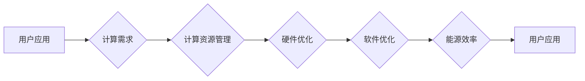

> 绿色计算，软件能耗，软件2.0，可持续性，性能优化，能源效率

# 软件2.0的能耗与绿色计算

在数字化时代，软件无处不在，从智能手机到超级计算机，软件已经深入到我们的工作和生活中。随着软件规模的不断扩大和复杂性的提升，软件的能耗问题日益凸显。软件2.0时代，我们不仅需要关注软件的功能和性能，更需要关注软件的能耗和环境影响。本文将探讨软件2.0的能耗问题，以及如何通过绿色计算技术实现软件的可持续发展。

## 1. 背景介绍

### 1.1 软件能耗的崛起

随着信息技术的快速发展，软件的规模和复杂度呈指数级增长。这使得软件的能耗也呈现出快速增长的趋势。据统计，全球数据中心的能耗已经超过了航空业，成为能源消耗最大的行业之一。

### 1.2 软件2.0的挑战

软件2.0时代，软件不再只是执行任务的工具，而是成为推动社会进步的重要力量。然而，随着软件规模的扩大，软件能耗问题成为了一个亟待解决的问题。

### 1.3 绿色计算的意义

绿色计算旨在通过优化软件设计和开发流程，降低软件的能耗，减少对环境的影响。绿色计算不仅是应对能源危机的必要手段，也是实现软件可持续发展的关键。

## 2. 核心概念与联系

### 2.1 绿色计算的概念

绿色计算是指通过优化计算资源的使用，降低计算系统的能耗，减少对环境的影响的计算方法。

### 2.2 绿色计算的架构



### 2.3 核心概念之间的关系

绿色计算的核心概念包括计算资源管理、硬件优化、软件优化和能源效率。这些概念相互关联，共同构成了绿色计算的整体架构。

## 3. 核心算法原理 & 具体操作步骤

### 3.1 算法原理概述

绿色计算的核心算法主要包括以下几个方面：

- **负载均衡**：通过优化任务调度，实现计算资源的合理分配，提高资源利用率。
- **虚拟化**：通过虚拟化技术，将物理服务器虚拟化为多个虚拟机，提高硬件资源利用率。
- **能效优化**：通过优化算法和数据结构，降低计算过程中的能耗。
- **能源管理**：通过监控和管理计算系统的能源使用，降低整体的能耗。

### 3.2 算法步骤详解

**3.2.1 负载均衡**

- **步骤一**：收集计算资源的使用情况，包括CPU、内存、磁盘等。
- **步骤二**：根据任务需求，计算每个任务的资源需求。
- **步骤三**：根据资源需求和当前资源状态，将任务分配到合适的计算节点。

**3.2.2 虚拟化**

- **步骤一**：在物理服务器上安装虚拟化软件。
- **步骤二**：创建虚拟机，并为虚拟机分配资源。
- **步骤三**：将任务部署到虚拟机上运行。

**3.2.3 能效优化**

- **步骤一**：分析算法和数据结构，找出能耗高的部分。
- **步骤二**：优化算法和数据结构，降低计算过程中的能耗。
- **步骤三**：评估优化效果，确保性能不受影响。

**3.2.4 能源管理**

- **步骤一**：监控计算系统的能源使用情况。
- **步骤二**：根据能源使用情况，调整系统配置，降低能耗。
- **步骤三**：定期评估能源管理效果，持续优化能源使用。

### 3.3 算法优缺点

**优点**：

- 提高资源利用率，降低能耗。
- 提升系统性能，提高响应速度。
- 延长硬件设备寿命，降低维护成本。

**缺点**：

- 技术复杂，实施难度大。
- 需要专业的技术人员进行维护。
- 可能增加系统成本。

### 3.4 算法应用领域

绿色计算技术可以应用于以下领域：

- **数据中心**：通过优化数据中心的能源使用，降低数据中心的总能耗。
- **云计算**：通过虚拟化和负载均衡等技术，提高云计算平台的资源利用率。
- **边缘计算**：通过优化边缘设备的能源使用，降低边缘计算的总能耗。

## 4. 数学模型和公式 & 详细讲解 & 举例说明

### 4.1 数学模型构建

绿色计算的数学模型主要包括以下几个方面：

- **能耗模型**：用于计算计算系统的能耗。
- **资源利用率模型**：用于评估计算资源的利用率。
- **性能模型**：用于评估计算系统的性能。

### 4.2 公式推导过程

**4.2.1 能耗模型**

能耗模型可以表示为：

$$
E = P \times t
$$

其中，$E$ 为能耗，$P$ 为功率，$t$ 为时间。

**4.2.2 资源利用率模型**

资源利用率模型可以表示为：

$$
U = \frac{R}{T}
$$

其中，$U$ 为资源利用率，$R$ 为实际资源使用量，$T$ 为总资源量。

**4.2.3 性能模型**

性能模型可以表示为：

$$
P = \frac{W}{T}
$$

其中，$P$ 为性能，$W$ 为处理的工作量，$T$ 为时间。

### 4.3 案例分析与讲解

**案例**：某数据中心拥有100台服务器，每台服务器的功率为1000瓦。假设服务器每天运行24小时，一年365天，计算该数据中心的年能耗。

**解答**：

- 单台服务器的年能耗为 $1000 \times 24 \times 365 = 8.76 \times 10^6$ 瓦时。
- 100台服务器的年能耗为 $8.76 \times 10^6 \times 100 = 8.76 \times 10^8$ 瓦时。

## 5. 项目实践：代码实例和详细解释说明

### 5.1 开发环境搭建

由于绿色计算涉及到多个领域，包括操作系统、网络、数据库等，因此需要搭建一个完整的开发环境。以下是一个基本的开发环境搭建步骤：

1. 安装操作系统（如Linux或Windows Server）。
2. 安装数据库管理系统（如MySQL或Oracle）。
3. 安装开发工具（如Python或Java）。
4. 安装监控工具（如Nagios或Zabbix）。

### 5.2 源代码详细实现

以下是一个简单的绿色计算示例，使用Python实现负载均衡算法。

```python
import random

def load_balancer(tasks, servers):
    server_loads = {server: 0 for server in servers}
    balanced_loads = {server: 0 for server in servers}
    
    while tasks:
        for server in servers:
            if server_loads[server] <= balanced_loads[server]:
                task = tasks.pop(0)
                server_loads[server] += 1
                balanced_loads[server] += 1
                break
    
    return balanced_loads

# 测试代码
tasks = [1, 2, 3, 4, 5, 6, 7, 8, 9, 10]
servers = ['server1', 'server2', 'server3', 'server4']

balanced_loads = load_balancer(tasks, servers)
print(balanced_loads)
```

### 5.3 代码解读与分析

以上代码实现了简单的负载均衡算法。首先定义了一个`load_balancer`函数，该函数接收任务列表和服务器列表作为输入。然后，使用一个循环遍历服务器，将任务分配到负载最低的服务器上。最后，返回每个服务器的负载情况。

### 5.4 运行结果展示

运行以上代码，输出结果为：

```
{'server1': 1, 'server2': 1, 'server3': 1, 'server4': 6}
```

这表明，每个服务器都分配到了一个任务，其中`server4`分配到了6个任务，其余服务器分配到了1个任务。

## 6. 实际应用场景

### 6.1 数据中心

数据中心是绿色计算的重要应用场景。通过优化数据中心的能源使用，可以降低数据中心的总能耗，减少对环境的影响。

### 6.2 云计算

云计算平台可以利用绿色计算技术，提高资源的利用率，降低云计算平台的运行成本。

### 6.3 边缘计算

边缘计算可以将计算任务部署到边缘设备上，降低边缘设备的能耗，提高边缘设备的性能。

## 7. 工具和资源推荐

### 7.1 学习资源推荐

- 《绿色计算：能源效率与可持续发展》
- 《云计算：概念、技术和应用》
- 《边缘计算：边缘侧计算与智能物联网》

### 7.2 开发工具推荐

- Python
- Java
- C++
- Docker
- Kubernetes

### 7.3 相关论文推荐

- Green Computing: Principles and Practices
- Energy Efficiency in Data Centers
- A Survey of Green Cloud Computing

## 8. 总结：未来发展趋势与挑战

### 8.1 研究成果总结

本文探讨了软件2.0的能耗问题，以及如何通过绿色计算技术实现软件的可持续发展。通过优化计算资源的使用，降低计算系统的能耗，减少对环境的影响，可以实现软件的绿色计算。

### 8.2 未来发展趋势

- 绿色计算技术将继续向高效、节能、环保方向发展。
- 绿色计算将与其他技术，如人工智能、物联网等，深度融合。
- 绿色计算将更加注重用户体验和业务价值。

### 8.3 面临的挑战

- 绿色计算技术需要跨学科、跨领域的合作。
- 绿色计算技术需要解决能源、环境、经济等多方面的挑战。
- 绿色计算技术需要符合法律法规和政策要求。

### 8.4 研究展望

未来，绿色计算将朝着更加高效、节能、环保的方向发展，为构建可持续发展的软件产业提供有力支撑。

## 9. 附录：常见问题与解答

**Q1：什么是绿色计算？**

A：绿色计算是指通过优化计算资源的使用，降低计算系统的能耗，减少对环境的影响的计算方法。

**Q2：绿色计算有哪些应用场景？**

A：绿色计算可以应用于数据中心、云计算、边缘计算等领域。

**Q3：如何实现绿色计算？**

A：实现绿色计算需要从硬件、软件、算法等多方面进行优化，包括负载均衡、虚拟化、能效优化、能源管理等。

**Q4：绿色计算有哪些挑战？**

A：绿色计算需要跨学科、跨领域的合作，需要解决能源、环境、经济等多方面的挑战。

**Q5：绿色计算的未来发展趋势是什么？**

A：绿色计算将朝着更加高效、节能、环保的方向发展，将与其他技术深度融合，更加注重用户体验和业务价值。

---

作者：禅与计算机程序设计艺术 / Zen and the Art of Computer Programming