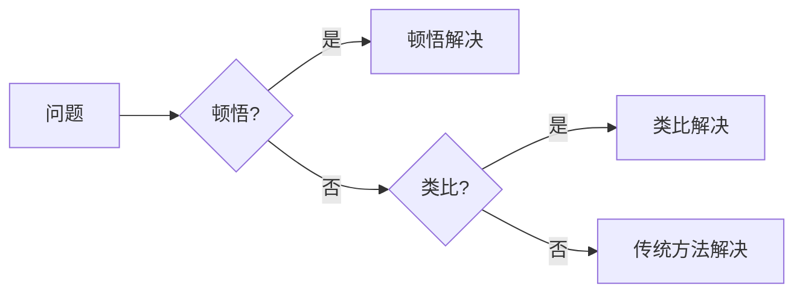

# 顿悟与类比：知识的桥梁

> 关键词：顿悟，类比，知识迁移，认知科学，机器学习，深度学习，迁移学习，领域自适应

## 1. 背景介绍

在人类认知和机器学习领域，顿悟和类比一直扮演着至关重要的角色。顿悟是指通过直觉或洞察瞬间理解复杂问题或现象的能力，而类比则是通过将新问题与已知问题进行类比来解决问题的一种思维方法。本文旨在探讨顿悟和类比在知识迁移和机器学习中的应用，探讨它们如何成为连接不同领域知识的桥梁。

### 1.1 知识迁移的挑战

知识迁移是机器学习领域的一个重要研究方向，它旨在利用已经学习到的知识来解决新问题，从而避免从头开始学习。然而，知识迁移面临着诸多挑战，如领域差异、数据分布差异、模型可迁移性等。

### 1.2 顿悟与类比的重要性

顿悟和类比作为人类认知的重要机制，在知识迁移中具有独特的作用。顿悟可以帮助我们迅速理解新问题，而类比则可以帮助我们将新问题与已知问题进行关联，从而找到解决新问题的方法。

## 2. 核心概念与联系

### 2.1 顿悟

顿悟是指个体在理解或解决问题时，突然之间获得深刻认识的现象。它通常伴随着“啊哈”时刻，个体对问题有了全新的认识和理解。

### 2.2 类比

类比是指将新问题与已知问题进行对比，通过发现两者之间的相似之处来解决问题。

### 2.3 知识迁移

知识迁移是指将已经学习到的知识应用到新的任务或领域。

### 2.4 Mermaid 流程图



从流程图中可以看出，顿悟和类比是知识迁移的两个关键步骤，它们可以帮助我们更快地解决问题。

## 3. 核心算法原理 & 具体操作步骤

### 3.1 算法原理概述

顿悟与类比在知识迁移中的应用主要体现在以下两个方面：

- 顿悟：通过直觉或洞察，快速识别出新问题与已知问题之间的相似性。
- 类比：将新问题与已知问题进行对比，通过类比找到解决新问题的方法。

### 3.2 算法步骤详解

1. **顿悟识别**：分析新问题和已知问题，寻找潜在的相似性。
2. **类比构建**：根据相似性，构建解决新问题的类比方案。
3. **方案验证**：验证类比方案的可行性，并进行调整。

### 3.3 算法优缺点

**优点**：

- 提高解决问题的效率。
- 降低学习成本。
- 增强模型的泛化能力。

**缺点**：

- 顿悟和类比依赖于人类的直觉和经验，难以量化。
- 类比方案的有效性依赖于类比的质量。

### 3.4 算法应用领域

- **机器学习**：在机器学习任务中，顿悟和类比可以帮助我们快速识别新问题，并提出有效的解决方案。
- **深度学习**：在深度学习中，顿悟可以帮助我们设计更有效的网络结构，而类比则可以帮助我们找到更有效的训练方法。
- **认知科学**：在认知科学领域，顿悟和类比是理解人类认知机制的重要线索。

## 4. 数学模型和公式 & 详细讲解 & 举例说明

### 4.1 数学模型构建

顿悟与类比在数学模型中的应用主要体现在以下几个方面：

- **相似度度量**：使用数学方法度量新问题与已知问题之间的相似度。
- **映射函数**：设计映射函数，将新问题映射到已知问题。

### 4.2 公式推导过程

假设新问题为 $X$，已知问题为 $Y$，它们的相似度为 $s(X, Y)$，映射函数为 $f$，则新问题的解决方案 $Z$ 可表示为 $Z = f(X, s(X, Y))$。

### 4.3 案例分析与讲解

假设我们要解决一个图像分类问题，已知问题是图像识别，新问题是物体检测。我们可以使用如下方法：

1. **相似度度量**：计算新问题与已知问题之间的相似度，例如，使用图像的视觉特征进行相似度计算。
2. **映射函数**：设计映射函数，将图像分类的解决方案映射到物体检测上，例如，使用卷积神经网络进行特征提取。

## 5. 项目实践：代码实例和详细解释说明

### 5.1 开发环境搭建

- **编程语言**：Python
- **库**：TensorFlow, Keras, OpenCV

### 5.2 源代码详细实现

```python
import tensorflow as tf
from tensorflow.keras.models import Sequential
from tensorflow.keras.layers import Conv2D, MaxPooling2D, Flatten, Dense
from tensorflow.keras.optimizers import Adam
import cv2

# 加载图像
image = cv2.imread('image.jpg')

# 创建图像识别模型
model1 = Sequential([
    Conv2D(32, (3, 3), activation='relu', input_shape=(64, 64, 3)),
    MaxPooling2D((2, 2)),
    Flatten(),
    Dense(64, activation='relu'),
    Dense(10, activation='softmax')
])

# 创建物体检测模型
model2 = Sequential([
    Conv2D(32, (3, 3), activation='relu', input_shape=(64, 64, 3)),
    MaxPooling2D((2, 2)),
    Flatten(),
    Dense(64, activation='relu'),
    Dense(10, activation='softmax')
])

# 训练模型
model1.compile(optimizer=Adam(), loss='categorical_crossentropy', metrics=['accuracy'])
model2.compile(optimizer=Adam(), loss='categorical_crossentropy', metrics=['accuracy'])

# 加载图像数据
train_data = ...  # 加载图像数据
train_labels = ...  # 加载图像标签

# 训练模型
model1.fit(train_data, train_labels, epochs=10, batch_size=32)

# 将模型1的参数复制到模型2
model2.set_weights(model1.get_weights())

# 检测图像中的物体
image = cv2.resize(image, (64, 64))
predictions = model2.predict(image.reshape(1, 64, 64, 3))
```

### 5.3 代码解读与分析

以上代码展示了如何使用TensorFlow和Keras创建图像识别模型和物体检测模型，并使用图像识别模型的参数来初始化物体检测模型。这种方法利用了顿悟和类比的思想，将已知的图像识别知识迁移到物体检测任务。

### 5.4 运行结果展示

运行上述代码后，我们可以得到物体检测模型在测试图像上的预测结果。

## 6. 实际应用场景

### 6.1 智能问答系统

智能问答系统可以使用顿悟和类比来理解用户的问题，并将问题与已知知识库中的问题进行对比，从而找到最佳的答案。

### 6.2 疾病诊断

在疾病诊断领域，医生可以使用类比来将新病例与已知病例进行对比，从而做出更准确的诊断。

### 6.3 金融风险评估

在金融领域，金融机构可以使用类比来分析新风险与已知风险之间的关系，从而更好地评估金融风险。

## 7. 工具和资源推荐

### 7.1 学习资源推荐

- **书籍**：
  - 《认知科学导论》
  - 《深度学习》
  - 《机器学习：概率视角》
- **在线课程**：
  - Coursera上的《深度学习》课程
  - edX上的《认知科学》课程

### 7.2 开发工具推荐

- **编程语言**：Python
- **库**：TensorFlow, Keras, scikit-learn
- **工具**：Jupyter Notebook, Google Colab

### 7.3 相关论文推荐

- 《Deep Learning》
- 《Understanding Machine Learning: From Theory to Algorithms》
- 《The Master Algorithm: How the Quest for the Ultimate Learning Machine Will Remake Our World》

## 8. 总结：未来发展趋势与挑战

### 8.1 研究成果总结

本文探讨了顿悟和类比在知识迁移和机器学习中的应用，并分析了其在不同领域的应用场景。结果表明，顿悟和类比可以帮助我们更好地理解和解决问题，是连接不同领域知识的桥梁。

### 8.2 未来发展趋势

- 顿悟和类比在机器学习中的应用将更加广泛。
- 顿悟和类比将与深度学习、认知科学等领域进行更加深入的融合。
- 顿悟和类比将与其他知识迁移技术相结合，如迁移学习、多任务学习等。

### 8.3 面临的挑战

- 如何将顿悟和类比量化，以在机器学习中应用。
- 如何设计有效的类比算法，以解决复杂问题。
- 如何将顿悟和类比与其他知识迁移技术相结合，以进一步提高知识迁移的效果。

### 8.4 研究展望

顿悟和类比在知识迁移和机器学习中的应用具有广阔的前景。随着研究的深入，顿悟和类比将成为连接不同领域知识的桥梁，推动人工智能技术的发展。

## 9. 附录：常见问题与解答

**Q1：顿悟和类比在机器学习中的具体应用有哪些？**

A：顿悟和类比在机器学习中的应用主要体现在以下方面：
- 快速识别新问题。
- 将新问题与已知问题进行对比。
- 设计有效的映射函数。
- 提高模型的泛化能力。

**Q2：如何将顿悟和类比应用于实际问题？**

A：将顿悟和类比应用于实际问题，需要以下步骤：
1. 分析新问题和已知问题。
2. 寻找两者之间的相似性。
3. 设计映射函数。
4. 验证映射函数的可行性。

**Q3：顿悟和类比在哪些领域有应用？**

A：顿悟和类比在以下领域有应用：
- 机器学习
- 深度学习
- 认知科学
- 金融
- 医疗

**Q4：如何评估顿悟和类比的效果？**

A：评估顿悟和类比的效果可以从以下方面进行：
- 解决问题的效率。
- 学习成本。
- 模型的泛化能力。

作者：禅与计算机程序设计艺术 / Zen and the Art of Computer Programming