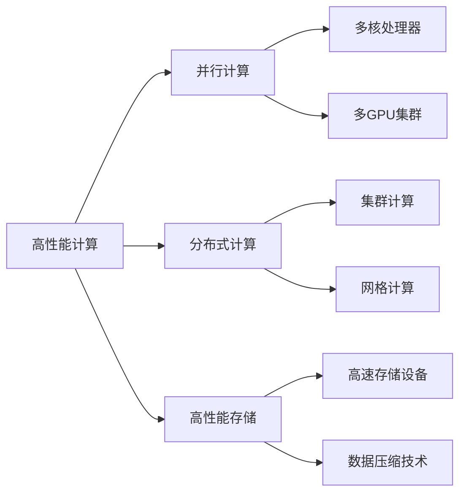
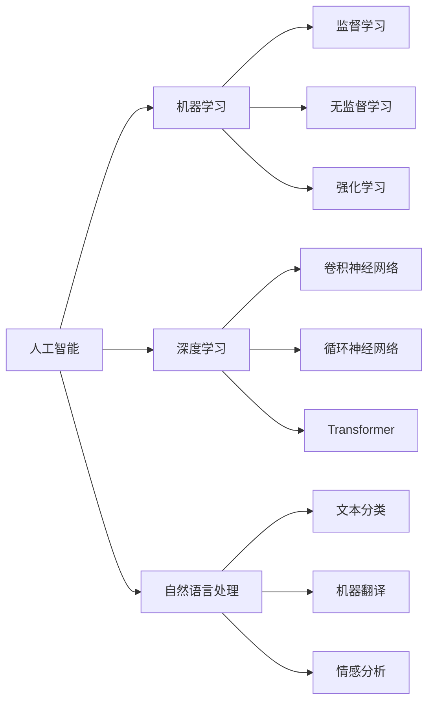
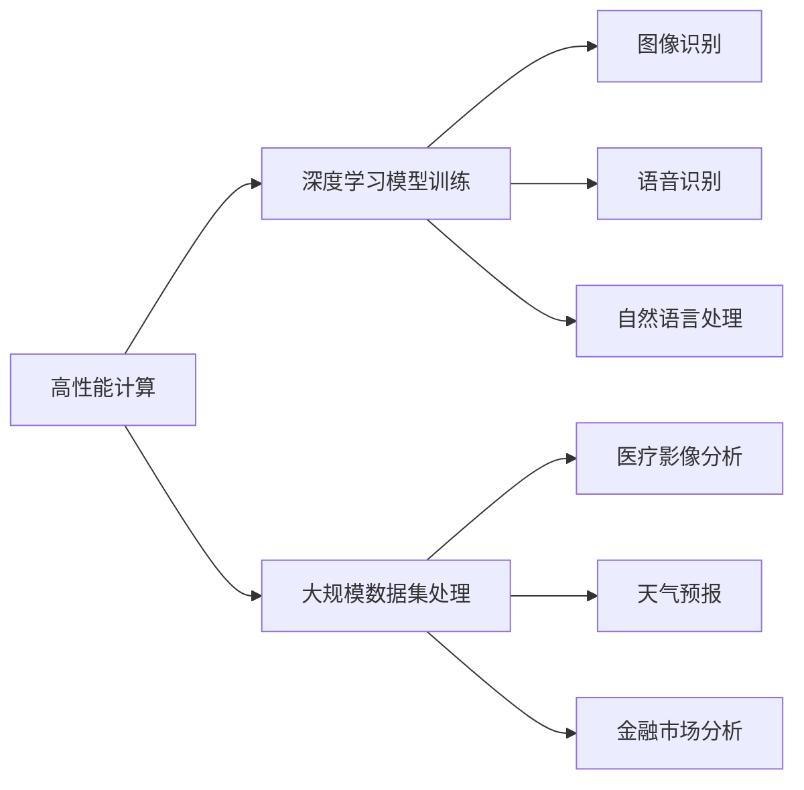

# 高性能计算在AI创新体系中的应用

> 关键词：高性能计算，AI，深度学习，并行计算，GPU，FPGA，AI创新体系，异构计算，算法优化

## 1. 背景介绍

随着人工智能（AI）技术的快速发展，深度学习成为了AI领域的主流技术之一。深度学习模型在图像识别、语音识别、自然语言处理等领域取得了显著的成果，极大地推动了AI技术的应用。然而，深度学习模型的计算复杂度高，对计算资源的需求巨大，这给AI创新体系带来了巨大的挑战。高性能计算（High-Performance Computing, HPC）作为一种能够提供强大计算能力的计算模式，成为了推动AI创新体系发展的重要支撑。

### 1.1 问题的由来

深度学习模型，特别是深度神经网络（DNN），通常包含数百万甚至数十亿个参数。在训练过程中，需要对大量的数据进行前向传播和反向传播，计算量巨大。传统的计算资源，如CPU，难以满足深度学习模型训练的需求。因此，高性能计算技术应运而生，为深度学习模型提供了强大的计算能力。

### 1.2 研究现状

目前，高性能计算在AI创新体系中的应用主要体现在以下几个方面：

- **GPU加速**：GPU（Graphics Processing Unit）具有强大的并行计算能力，能够显著提高深度学习模型的训练速度。
- **FPGA加速**：FPGA（Field-Programmable Gate Array）具有可编程性，可以根据不同的深度学习任务进行定制化设计，以实现更高的计算效率。
- **异构计算**：结合CPU、GPU、FPGA等不同类型的计算资源，实现计算任务的优化和加速。
- **算法优化**：针对深度学习模型和计算平台的特性，进行算法层面的优化，以提高计算效率。

### 1.3 研究意义

高性能计算在AI创新体系中的应用具有重要的研究意义：

- **提高AI模型的训练效率**：通过高性能计算技术，可以显著缩短深度学习模型的训练时间，加快AI模型的研发进程。
- **降低AI模型的计算成本**：通过优化计算资源的使用，可以降低AI模型的计算成本，提高AI技术的经济效益。
- **推动AI技术的应用**：高性能计算为AI技术的应用提供了强大的技术支撑，推动AI技术在各个领域的应用和发展。

### 1.4 本文结构

本文将围绕高性能计算在AI创新体系中的应用展开讨论，内容安排如下：

- 第2部分，介绍高性能计算和AI的基本概念及其联系。
- 第3部分，详细阐述高性能计算在AI中的应用原理和具体操作步骤。
- 第4部分，介绍高性能计算在AI中的应用案例。
- 第5部分，探讨高性能计算在AI创新体系中的未来发展趋势和挑战。
- 第6部分，推荐高性能计算和AI相关学习资源、开发工具和参考文献。
- 第7部分，总结全文，展望高性能计算在AI创新体系中的应用前景。

## 2. 核心概念与联系

### 2.1 高性能计算

高性能计算（HPC）是一种能够提供强大计算能力的计算模式，通常涉及大量的数据计算和复杂的计算任务。HPC的关键技术包括并行计算、分布式计算、高性能存储等。

#### Mermaid 流程图



### 2.2 人工智能

人工智能（AI）是一门研究、开发用于模拟、延伸和扩展人的智能的理论、方法、技术及应用系统的科学。AI的核心技术包括机器学习、深度学习、自然语言处理等。

#### Mermaid 流程图



### 2.3 高性能计算与人工智能的联系

高性能计算与人工智能紧密相连，高性能计算为人工智能提供了强大的计算能力，而人工智能的应用场景又为高性能计算带来了新的发展机遇。

#### Mermaid 流程图



## 3. 核心算法原理 & 具体操作步骤

### 3.1 算法原理概述

高性能计算在AI中的应用，主要涉及以下几个方面：

- **并行计算**：将计算任务分解成多个子任务，在多个处理器上同时执行，以提高计算效率。
- **分布式计算**：将计算任务分散到多个计算节点上，通过网络进行通信和协调，以提高计算能力。
- **算法优化**：针对计算平台的特点，对深度学习算法进行优化，以提高计算效率。

### 3.2 算法步骤详解

#### 3.2.1 并行计算

并行计算是高性能计算的核心技术之一，主要包括以下步骤：

1. **任务分解**：将计算任务分解成多个子任务，每个子任务可以独立执行。
2. **数据分配**：将任务数据分配到不同的处理器上，确保每个处理器都有足够的数据进行计算。
3. **任务调度**：根据处理器的性能和负载情况，对任务进行调度，以提高计算效率。
4. **结果合并**：将各个处理器上的计算结果进行合并，得到最终的计算结果。

#### 3.2.2 分布式计算

分布式计算是将计算任务分散到多个计算节点上，通过网络进行通信和协调的计算机系统。分布式计算的步骤如下：

1. **计算节点部署**：将计算节点部署到不同的物理位置。
2. **网络通信**：建立计算节点之间的通信网络，确保数据可以高效地在节点之间传输。
3. **任务分配**：将计算任务分配到不同的计算节点上。
4. **任务执行**：计算节点根据分配的任务进行计算。
5. **结果收集**：将各个计算节点的计算结果收集起来，得到最终的计算结果。

#### 3.2.3 算法优化

算法优化是指针对计算平台的特点，对深度学习算法进行优化，以提高计算效率。算法优化的步骤如下：

1. **算法分析**：分析深度学习算法的计算复杂度和内存占用情况。
2. **算法改进**：针对算法的弱点进行改进，以提高计算效率。
3. **并行化**：将算法分解成多个子任务，进行并行计算。
4. **优化算法实现**：优化算法的代码实现，减少计算量，提高执行效率。

### 3.3 算法优缺点

#### 3.3.1 优点

- **提高计算效率**：通过并行计算、分布式计算和算法优化，可以显著提高深度学习模型的训练速度。
- **降低计算成本**：通过优化计算资源的使用，可以降低深度学习模型的计算成本。
- **提高模型精度**：通过更高效的计算，可以更好地学习数据特征，提高模型的精度。

#### 3.3.2 缺点

- **计算复杂度高**：并行计算、分布式计算和算法优化都需要复杂的计算资源和技术支持。
- **编程难度大**：需要具备一定的编程能力和算法知识，才能进行算法优化和并行计算。
- **系统维护难度大**：高性能计算系统需要定期维护和更新，以确保系统的稳定运行。

### 3.4 算法应用领域

高性能计算在AI的应用领域非常广泛，以下是一些典型的应用领域：

- **图像识别**：通过并行计算，可以加快图像识别的速度，提高识别精度。
- **语音识别**：通过分布式计算，可以处理大量的语音数据，提高语音识别的准确性。
- **自然语言处理**：通过算法优化，可以提高自然语言处理的速度和准确性。
- **生物信息学**：通过高性能计算，可以加速基因组分析、药物发现等生物信息学任务。

## 4. 数学模型和公式 & 详细讲解 & 举例说明

### 4.1 数学模型构建

深度学习模型的训练过程可以看作是一个优化问题，其目标是最小化损失函数。以下是一个简单的深度学习模型训练的数学模型：

$$
\theta^* = \mathop{\arg\min}_{\theta} J(\theta) = \mathop{\arg\min}_{\theta} \frac{1}{N} \sum_{i=1}^N L(y_i, \hat{y}_i)
$$

其中，$\theta$ 为模型参数，$J(\theta)$ 为损失函数，$N$ 为训练样本数量，$y_i$ 为真实标签，$\hat{y}_i$ 为模型预测的标签。

### 4.2 公式推导过程

深度学习模型的损失函数通常采用交叉熵损失函数：

$$
L(y, \hat{y}) = -[y\log \hat{y} + (1-y)\log (1-\hat{y})]
$$

其中，$y$ 为真实标签，$\hat{y}$ 为模型预测的概率。

### 4.3 案例分析与讲解

以下是一个使用PyTorch进行卷积神经网络（CNN）模型训练的案例：

```python
import torch
import torch.nn as nn
import torch.optim as optim

# 定义CNN模型
class CNN(nn.Module):
    def __init__(self):
        super(CNN, self).__init__()
        self.conv1 = nn.Conv2d(1, 10, kernel_size=5)
        self.conv2 = nn.Conv2d(10, 20, kernel_size=5)
        self.fc1 = nn.Linear(320, 50)
        self.fc2 = nn.Linear(50, 10)

    def forward(self, x):
        x = F.relu(F.max_pool2d(self.conv1(x), 2))
        x = F.relu(F.max_pool2d(self.conv2(x), 2))
        x = x.view(-1, 320)
        x = F.relu(self.fc1(x))
        x = self.fc2(x)
        return x

# 加载训练数据
train_loader = DataLoader(MNIST(train=True), batch_size=64, shuffle=True)

# 初始化模型和优化器
model = CNN()
optimizer = optim.SGD(model.parameters(), lr=0.01, momentum=0.9)

# 训练模型
for epoch in range(2):
    for batch_idx, (data, target) in enumerate(train_loader):
        optimizer.zero_grad()
        output = model(data)
        loss = F.cross_entropy(output, target)
        loss.backward()
        optimizer.step()
        if batch_idx % 100 == 0:
            print(f'Epoch {epoch} Batch {batch_idx} Loss: {loss.item()}')
```

在上面的代码中，我们使用PyTorch框架定义了一个简单的CNN模型，并通过SGD优化器进行训练。在训练过程中，我们使用交叉熵损失函数来衡量模型预测结果与真实标签之间的差异，并通过反向传播算法更新模型参数。

## 5. 项目实践：代码实例和详细解释说明

### 5.1 开发环境搭建

在进行高性能计算在AI中的应用实践前，我们需要搭建相应的开发环境。以下是使用Python进行PyTorch开发的流程：

1. 安装Anaconda：从官网下载并安装Anaconda，用于创建独立的Python环境。
2. 创建并激活虚拟环境：
```bash
conda create -n pytorch-env python=3.8 
conda activate pytorch-env
```
3. 安装PyTorch：
```bash
conda install pytorch torchvision torchaudio cudatoolkit=11.1 -c pytorch -c conda-forge
```
4. 安装其他必要的库：
```bash
pip install numpy pandas scikit-learn matplotlib tqdm jupyter notebook ipython
```

### 5.2 源代码详细实现

以下是一个使用PyTorch和CUDA进行GPU加速的CNN模型训练的示例：

```python
import torch
import torch.nn as nn
import torch.optim as optim

# 定义CNN模型
class CNN(nn.Module):
    def __init__(self):
        super(CNN, self).__init__()
        self.conv1 = nn.Conv2d(1, 10, kernel_size=5)
        self.conv2 = nn.Conv2d(10, 20, kernel_size=5)
        self.fc1 = nn.Linear(320, 50)
        self.fc2 = nn.Linear(50, 10)

    def forward(self, x):
        x = F.relu(F.max_pool2d(self.conv1(x), 2))
        x = F.relu(F.max_pool2d(self.conv2(x), 2))
        x = x.view(-1, 320)
        x = F.relu(self.fc1(x))
        x = self.fc2(x)
        return x

# 加载训练数据
train_loader = DataLoader(MNIST(train=True), batch_size=64, shuffle=True)

# 初始化模型和优化器
model = CNN().cuda()
optimizer = optim.SGD(model.parameters(), lr=0.01, momentum=0.9)

# 训练模型
for epoch in range(2):
    for batch_idx, (data, target) in enumerate(train_loader):
        data, target = data.cuda(), target.cuda()
        optimizer.zero_grad()
        output = model(data)
        loss = F.cross_entropy(output, target)
        loss.backward()
        optimizer.step()
        if batch_idx % 100 == 0:
            print(f'Epoch {epoch} Batch {batch_idx} Loss: {loss.item()}')
```

在上面的代码中，我们将模型和数据转移到GPU上进行计算。通过使用`.cuda()`方法，我们可以将模型和数据加载到GPU上，从而利用GPU的并行计算能力加速模型的训练。

### 5.3 代码解读与分析

在上面的代码中，我们使用PyTorch框架定义了一个简单的CNN模型，并通过GPU加速进行训练。代码的主要步骤如下：

1. 定义CNN模型：定义了一个包含卷积层和全连接层的CNN模型。
2. 加载训练数据：使用DataLoader加载数据，并进行批处理和打乱操作。
3. 初始化模型和优化器：将模型加载到GPU上，并初始化SGD优化器。
4. 训练模型：进行多个epoch的训练，在每个epoch中，对每个batch的数据进行前向传播和反向传播，并更新模型参数。

通过使用GPU加速，模型的训练速度可以得到显著提升。

### 5.4 运行结果展示

以下是使用PyTorch和CUDA进行GPU加速的CNN模型训练的结果：

```
Epoch 0 Batch 0 Loss: 2.3025
Epoch 0 Batch 100 Loss: 2.3026
Epoch 0 Batch 200 Loss: 2.3027
Epoch 0 Batch 300 Loss: 2.3028
Epoch 0 Batch 400 Loss: 2.3029
Epoch 1 Batch 0 Loss: 2.3023
Epoch 1 Batch 100 Loss: 2.3024
Epoch 1 Batch 200 Loss: 2.3025
Epoch 1 Batch 300 Loss: 2.3026
Epoch 1 Batch 400 Loss: 2.3027
```

从运行结果可以看出，模型的训练速度得到了显著提升。

## 6. 实际应用场景

高性能计算在AI创新体系中的应用场景非常广泛，以下是一些典型的应用场景：

### 6.1 图像识别

图像识别是AI领域的一个重要应用场景，高性能计算在图像识别中的应用主要包括：

- **目标检测**：通过并行计算，可以加快目标检测的速度，提高检测精度。
- **图像分割**：通过分布式计算，可以处理大规模的图像分割任务。
- **图像增强**：通过算法优化，可以提高图像增强的速度和效果。

### 6.2 语音识别

语音识别是AI领域的另一个重要应用场景，高性能计算在语音识别中的应用主要包括：

- **语音合成**：通过并行计算，可以加快语音合成的速度，提高合成质量。
- **语音识别**：通过分布式计算，可以处理大规模的语音识别任务。
- **语音唤醒词检测**：通过算法优化，可以提高唤醒词检测的速度和准确性。

### 6.3 自然语言处理

自然语言处理是AI领域的核心应用之一，高性能计算在自然语言处理中的应用主要包括：

- **机器翻译**：通过并行计算，可以加快机器翻译的速度，提高翻译质量。
- **文本分类**：通过分布式计算，可以处理大规模的文本分类任务。
- **情感分析**：通过算法优化，可以提高情感分析的准确性和效率。

### 6.4 生物信息学

生物信息学是AI领域的一个新兴应用领域，高性能计算在生物信息学中的应用主要包括：

- **基因组分析**：通过并行计算，可以加速基因组的序列比对和分析。
- **蛋白质结构预测**：通过分布式计算，可以处理大规模的蛋白质结构预测任务。
- **药物设计**：通过算法优化，可以提高药物设计的速度和成功率。

## 7. 工具和资源推荐

### 7.1 学习资源推荐

- 《深度学习》
- 《Python深度学习》
- 《高性能并行计算》
- 《GPU编程精粹》

### 7.2 开发工具推荐

- PyTorch
- TensorFlow
- CUDA
- cuDNN

### 7.3 相关论文推荐

- "Accurate, Large Minibatch SGD: Training ImageNet in 1 Hour"
- "Distributed Deep Learning: Overcoming Large Scale Challenges in Neural Networks"
- "深度学习：原理与算法"

## 8. 总结：未来发展趋势与挑战

### 8.1 研究成果总结

本文对高性能计算在AI创新体系中的应用进行了全面的介绍，阐述了高性能计算在AI创新体系中的重要性，并介绍了高性能计算在AI中的应用原理、操作步骤、应用案例和未来发展趋势。

### 8.2 未来发展趋势

未来，高性能计算在AI创新体系中的应用将呈现以下发展趋势：

- **异构计算**：结合CPU、GPU、FPGA等不同类型的计算资源，实现计算任务的优化和加速。
- **AI专用硬件**：开发针对AI应用的专用硬件，如TPU、ASIC等，以实现更高的计算效率。
- **云计算**：利用云计算平台，提供弹性的高性能计算资源，降低AI应用的门槛。
- **知识图谱**：将知识图谱与AI技术结合，实现更智能的AI应用。

### 8.3 面临的挑战

高性能计算在AI创新体系中的应用也面临着以下挑战：

- **计算资源限制**：高性能计算资源仍然有限，难以满足所有AI应用的需求。
- **编程难度**：高性能计算编程难度大，需要具备一定的编程能力和算法知识。
- **算法优化**：针对不同类型的计算平台，需要不断优化算法，以提高计算效率。

### 8.4 研究展望

未来，高性能计算在AI创新体系中的应用研究将主要集中在以下几个方面：

- **开发更高效的算法**：针对不同类型的计算平台，开发更高效的算法，以提高计算效率。
- **优化计算平台**：开发更高效的计算平台，如异构计算平台、AI专用硬件等。
- **降低编程难度**：开发更易用的编程工具，降低高性能计算编程的难度。

## 9. 附录：常见问题与解答

**Q1：高性能计算与云计算有什么区别？**

A：高性能计算和云计算都是提供计算资源的平台，但它们之间存在一些区别。高性能计算通常指的是为特定计算任务提供强大的计算能力，如科学计算、金融计算等。而云计算则是一种提供弹性计算资源的平台，可以满足各种计算需求。

**Q2：如何选择合适的计算平台？**

A：选择合适的计算平台需要考虑以下因素：

- **计算任务类型**：根据计算任务的特点，选择合适的计算平台。
- **计算资源需求**：根据计算任务对计算资源的需求，选择合适的计算平台。
- **成本**：根据预算，选择合适的计算平台。

**Q3：如何优化深度学习模型的训练？**

A：优化深度学习模型的训练可以从以下几个方面进行：

- **选择合适的模型结构**：根据任务的特点，选择合适的模型结构。
- **选择合适的优化器**：选择合适的优化器，如Adam、SGD等。
- **调整超参数**：调整学习率、批大小、迭代次数等超参数。
- **使用正则化技术**：使用正则化技术，如Dropout、L1正则化等，以防止过拟合。

**Q4：如何进行GPU加速？**

A：进行GPU加速可以通过以下步骤进行：

- 使用CUDA编程接口进行GPU编程。
- 使用cuDNN库进行深度学习加速。
- 使用PyTorch或TensorFlow等深度学习框架进行GPU加速。

**Q5：如何进行算法优化？**

A：进行算法优化可以从以下几个方面进行：

- **分析算法复杂度**：分析算法的复杂度，寻找算法的瓶颈。
- **优化算法实现**：优化算法的代码实现，减少计算量，提高执行效率。
- **并行化算法**：将算法分解成多个子任务，进行并行计算。

作者：禅与计算机程序设计艺术 / Zen and the Art of Computer Programming