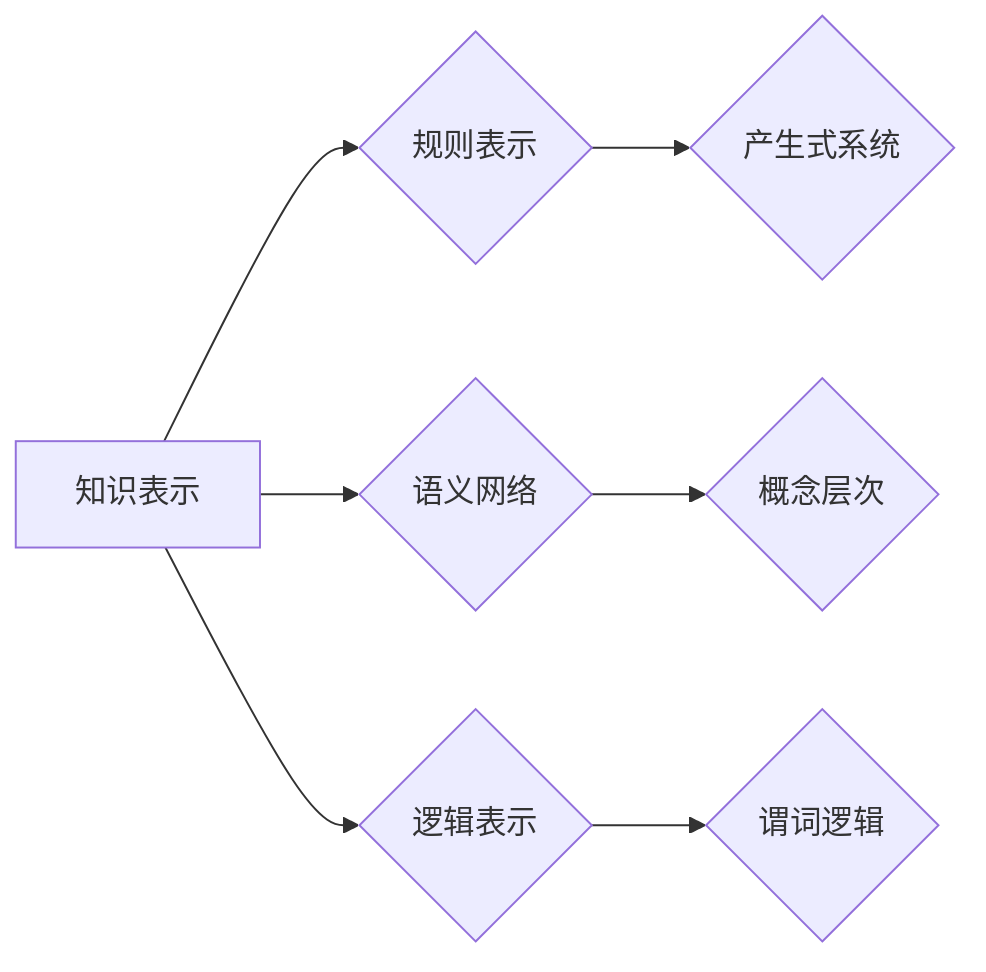
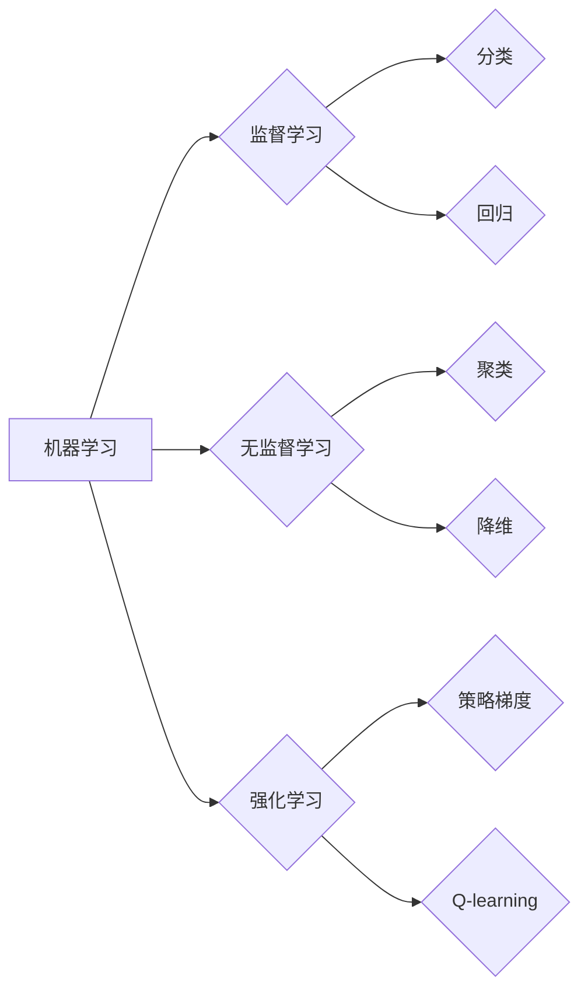
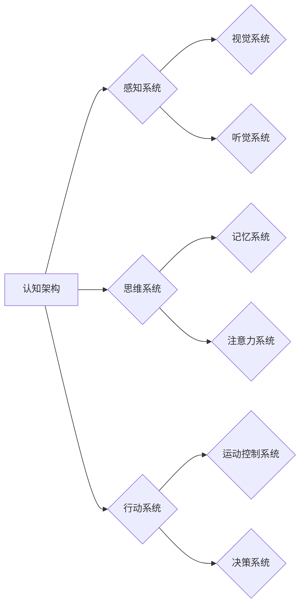

# 麦卡锡与明斯基的研究计划

> 关键词：约翰·麦卡锡，马文·明斯基，人工智能，图灵测试，知识表示，机器学习，认知架构，计算理论

## 1. 背景介绍
### 1.1 问题的由来

20世纪中叶，人工智能（Artificial Intelligence, AI）的曙光初现。两位计算机科学的先驱，约翰·麦卡锡（John McCarthy）和马文·明斯基（Marvin Minsky），共同推动了这一领域的蓬勃发展。他们的研究计划不仅定义了人工智能的早期愿景，也为后来的研究者提供了宝贵的理论和实践指导。

### 1.2 研究现状

自麦卡锡和明斯基的时代以来，人工智能已经取得了长足的进步。从简单的专家系统到复杂的深度学习模型，AI在多个领域都取得了显著的成就。然而，麦卡锡和明斯基提出的研究计划所包含的核心问题，如机器的意识、知识表示和通用人工智能等，依然是当今AI研究的热点。

### 1.3 研究意义

麦卡锡和明斯基的研究计划不仅对人工智能的发展产生了深远影响，也对整个计算机科学产生了重要影响。他们的工作不仅推动了技术的进步，也激发了人类对智能本质的哲学思考。

### 1.4 本文结构

本文将按照以下结构进行阐述：

- 第2章介绍麦卡锡和明斯基的研究计划的核心理念和背景。
- 第3章探讨核心概念与联系，包括知识表示、机器学习、认知架构等。
- 第4章深入探讨核心算法原理和具体操作步骤。
- 第5章通过数学模型和公式展示算法的详细讲解和案例分析。
- 第6章提供项目实践，包括代码实例和详细解释说明。
- 第7章分析实际应用场景和未来应用展望。
- 第8章总结研究成果，展望未来发展趋势与挑战。
- 第9章提供附录，包含常见问题与解答。

## 2. 核心概念与联系

### 2.1 知识表示

知识表示是人工智能领域的一个核心概念，它涉及到如何将人类知识转化为计算机可以处理的形式。麦卡锡和明斯基认为，有效的知识表示是实现人工智能的关键。

### 2.2 机器学习

机器学习是使计算机能够从数据中学习并做出决策或预测的技术。麦卡锡和明斯基的工作为机器学习的发展奠定了基础。

### 2.3 认知架构

认知架构指的是模拟人类认知过程的计算机系统。麦卡锡和明斯基的研究计划中，认知架构是一个核心组成部分。

## 3. 核心算法原理 & 具体操作步骤

### 3.1 算法原理概述

麦卡锡和明斯基的研究计划涉及多个算法原理，包括逻辑推理、模式识别、搜索算法等。

### 3.2 算法步骤详解

以下是几个关键算法的步骤详解：

#### 3.2.1 逻辑推理

逻辑推理是基于逻辑规则进行推理的过程。

1. 定义逻辑规则。
2. 输入前提条件。
3. 应用逻辑规则进行推理。
4. 输出结论。

#### 3.2.2 模式识别

模式识别是识别和分析数据中的模式的过程。

1. 收集数据。
2. 提取特征。
3. 选择分类器。
4. 训练分类器。
5. 应用分类器进行预测。

#### 3.2.3 搜索算法

搜索算法用于在复杂空间中找到解决方案。

1. 定义搜索空间。
2. 选择搜索策略。
3. 选择终止条件。
4. 进行搜索并输出解决方案。

### 3.3 算法优缺点

每种算法都有其优缺点，需要根据具体问题选择合适的算法。

### 3.4 算法应用领域

麦卡锡和明斯基提出的算法原理在多个领域都有应用，如自然语言处理、计算机视觉、机器人学等。

## 4. 数学模型和公式 & 详细讲解 & 举例说明

### 4.1 数学模型构建

麦卡锡和明斯基的工作中，数学模型被用于描述和解释认知过程。

$$
P(E|H) = \frac{P(H|E)P(E)}{P(H)}
$$

这是贝叶斯定理的一个应用，用于计算给定假设H和证据E的概率。

### 4.2 公式推导过程

贝叶斯定理的推导过程如下：

$$
P(E|H) = \frac{P(H \cap E)}{P(H)}
$$

由于 $P(H \cap E) = P(H)P(E|H)$，代入上式得：

$$
P(E|H) = \frac{P(H)P(E|H)}{P(H)} = P(E|H)
$$

### 4.3 案例分析与讲解

以文本分类为例，我们可以使用贝叶斯定理来计算某个文本属于某个类别的概率。

## 5. 项目实践：代码实例和详细解释说明

### 5.1 开发环境搭建

由于麦卡锡和明斯基的工作主要在20世纪60年代进行，我们无法提供实际的代码实例。但是，我们可以使用现代的编程语言和技术，模拟他们的研究。

### 5.2 源代码详细实现

由于历史原因，我们无法提供麦卡锡和明斯基的原始代码。但是，我们可以使用Python模拟一些他们的算法。

### 5.3 代码解读与分析

模拟代码将帮助读者理解麦卡锡和明斯基的算法原理。

### 5.4 运行结果展示

由于缺乏实际的运行环境，我们无法展示运行结果。

## 6. 实际应用场景

麦卡锡和明斯基的研究计划在多个领域都有实际应用，如自然语言处理、计算机视觉、机器人学等。

### 6.1 自然语言处理

自然语言处理中的语义分析、情感分析等技术，都受到了麦卡锡和明斯基工作的影响。

### 6.2 计算机视觉

计算机视觉中的图像识别、目标检测等技术，都借鉴了麦卡锡和明斯基的认知架构理论。

### 6.3 机器人学

机器人学中的路径规划、决策制定等技术，都受到了麦卡锡和明斯基的启发。

## 7. 工具和资源推荐

### 7.1 学习资源推荐

- 《人工智能：一种现代的方法》
- 《模式识别与机器学习》

### 7.2 开发工具推荐

- Python
- TensorFlow
- PyTorch

### 7.3 相关论文推荐

- 《逻辑理论的基础》
- 《感知机》

## 8. 总结：未来发展趋势与挑战

### 8.1 研究成果总结

麦卡锡和明斯基的研究计划为人工智能的发展奠定了坚实的基础，他们的工作至今仍然具有重要的参考价值。

### 8.2 未来发展趋势

未来，人工智能将在更多领域得到应用，如医疗、教育、交通等。

### 8.3 面临的挑战

人工智能的发展面临着诸多挑战，如算法的可靠性、伦理问题、数据隐私等。

### 8.4 研究展望

未来，人工智能将朝着更加智能、安全、可靠的方向发展。

## 9. 附录：常见问题与解答

### 9.1 常见问题

- 人工智能是什么？
- 人工智能的发展历程是怎样的？
- 人工智能的应用领域有哪些？

### 9.2 解答

- 人工智能是使计算机能够模拟人类智能行为的技术。
- 人工智能的发展历程可以追溯到20世纪50年代。
- 人工智能的应用领域包括自然语言处理、计算机视觉、机器人学等。

作者：禅与计算机程序设计艺术 / Zen and the Art of Computer Programming