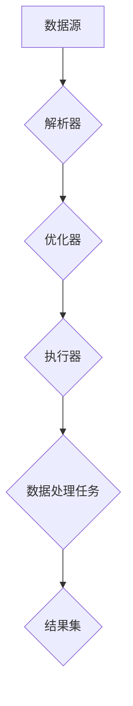

# 【AI大数据计算原理与代码实例讲解】Spark SQL

## 关键词：

- **Spark SQL**：Apache Spark 的 SQL 查询引擎，用于处理大规模数据集。
- **数据仓库**：用于存储和管理大量数据的系统，Spark SQL 与之紧密集成。
- **SQL**：结构化查询语言，用于从数据库中检索、管理和操作数据。
- **分布式计算**：在多台机器上并行执行计算任务，提高处理速度和效率。

## 1. 背景介绍

### 1.1 问题的由来

随着互联网和物联网技术的发展，产生了海量数据。企业需要对这些数据进行分析，以挖掘价值、做出决策。传统的数据处理方法在面对大规模数据时，往往会遇到性能瓶颈，比如内存限制、计算速度慢等问题。因此，需要一种高效、可扩展的数据处理框架来应对大数据场景下的数据处理需求。

### 1.2 研究现状

目前，Apache Spark 是大数据处理领域的热门框架之一，它不仅支持批处理、流处理、机器学习等多种场景，还内置了 Spark SQL，提供了一种强大的 SQL 查询能力。Spark SQL 通过 SQL 查询接口，让开发者能够以 SQL 语言的形式编写查询，同时利用 Spark 的分布式计算能力，高效地处理大规模数据集。

### 1.3 研究意义

Spark SQL 的出现，极大地简化了大数据处理的工作流程，降低了数据工程师和分析师的学习曲线。它允许用户使用熟悉的 SQL 语法来执行复杂的查询和分析任务，同时借助 Spark 的并行计算能力，提升了查询性能。此外，Spark SQL 与 Spark 的其他组件（如 MLlib 和 GraphX）紧密结合，形成了一个完整的生态系统，支撑了从数据处理到分析的全链条工作。

### 1.4 本文结构

本文将深入探讨 Spark SQL 的核心概念、算法原理、数学模型以及实际应用，同时提供代码实例和详细解释，帮助读者理解和掌握 Spark SQL 的使用方法。文章还将涵盖 Spark SQL 的优势、挑战以及未来发展方向，为读者提供全面的技术洞察。

## 2. 核心概念与联系

Spark SQL 是 Apache Spark 的 SQL 查询引擎，它提供了一个统一的 API，使得开发者可以使用 SQL 或 DataFrames API 来编写查询。Spark SQL 支持多种数据源，包括 HDFS、HBase、Amazon S3、NoSQL 数据库等，以及多种外部查询计划生成器，如 Hive、Impala 等。

### Spark SQL 的主要组成部分：

- **SQL Engine**：负责解析 SQL 查询，生成执行计划，并调度任务到集群中的各个节点。
- **Optimizer**：优化查询执行计划，以提高查询效率。
- **Execution Engine**：执行优化后的查询计划，包括数据读取、聚合、排序等操作。

### Spark SQL 的工作流程：



## 3. 核心算法原理 & 具体操作步骤

### 3.1 算法原理概述

Spark SQL 通过解析 SQL 查询语句，生成一个抽象的执行计划（Abstract Syntax Tree, AST），这个执行计划描述了如何从数据源读取数据，以及如何对数据进行转换和聚合。Spark SQL 的核心算法包括解析、优化和执行三个阶段：

#### 解析阶段：
- 解析器（Parser）将 SQL 查询语句解析为 AST，理解查询的结构和语义。

#### 优化阶段：
- 优化器（Optimizer）对 AST 进行优化，生成一个执行计划（Physical Plan），这个计划包含了具体的执行步骤和操作顺序。

#### 执行阶段：
- 执行器（Executor）根据执行计划分配任务到集群中的各个节点，并执行这些任务。

### 3.2 算法步骤详解

#### 示例 SQL 查询：

```sql
SELECT * FROM sales WHERE year = 2020 AND month = 12;
```

- **解析**：解析器将此 SQL 查询解析为 AST，识别出查询目标（sales 表）、过滤条件（year = 2020 和 month = 12）。
- **优化**：优化器生成执行计划，确定从哪里读取数据（HDFS 中的 sales 表）、如何读取（按照年份和月份过滤）、以及如何处理读取的数据（返回所有列）。
- **执行**：执行器将任务分发到集群，读取符合条件的数据行，并返回结果集。

### 3.3 算法优缺点

#### 优点：
- **高效**：Spark SQL 利用了 Spark 的内存计算特性，减少了 I/O 和磁盘访问，提高了查询性能。
- **可扩展**：能够平滑扩展到数千台机器，处理PB级别的数据集。
- **统一框架**：提供了一个统一的框架，既支持 SQL 查询，也支持 DataFrame API，便于集成和复用。

#### 缺点：
- **内存消耗**：大量复杂查询可能导致内存消耗增加，尤其是在处理非常大的数据集时。
- **SQL 限制**：Spark SQL 的 SQL 支持与标准 SQL 不完全一致，某些高级功能可能受限。

### 3.4 算法应用领域

Spark SQL 在以下几个领域有着广泛的应用：

- **数据仓库**：用于构建实时和离线的数据仓库，支持复杂查询和分析。
- **业务智能**：快速生成报表和仪表板，支持决策支持系统（DSS）。
- **数据分析**：用于探索性数据分析（EDA）、数据挖掘和机器学习任务。

## 4. 数学模型和公式 & 详细讲解 & 举例说明

### 4.1 数学模型构建

#### SQL 查询表达式：

SQL 查询通常可以表示为一个数学模型，其中包含集合操作（如并集、交集、差集）、投影操作（选择列）、选择操作（过滤条件）等。以上述 SQL 查询为例：

```sql
SELECT * FROM sales WHERE year = 2020 AND month = 12;
```

可以构建如下数学模型：

- **集合**：假设有销售记录集合 S，年份为 2020 的记录集合 S_2020，月份为 12 的记录集合 S_12。
- **投影**：选择所有列，表示为 P(S)。
- **选择**：从 S_2020 和 S_12 中选择，表示为 Select(year=2020 AND month=12)。

### 4.2 公式推导过程

假设销售表 S 包含字段：year, month, product_id, quantity, price。

#### SQL 查询步骤：

1. **选择年份为2020的数据**：
   ```sql
   SELECT * FROM S WHERE year = 2020;
   ```

   **数学模型**：
   ```latex
   Select_{year=2020}(S)
   ```

2. **选择月份为12的数据**：
   ```sql
   SELECT * FROM S WHERE month = 12;
   ```

   **数学模型**：
   ```latex
   Select_{month=12}(S)
   ```

3. **合并两次选择的结果**：
   ```sql
   SELECT * FROM Select_{year=2020}(S) WHERE month = 12;
   ```

   **数学模型**：
   ```latex
   Select_{month=12}(Select_{year=2020}(S))
   ```

### 4.3 案例分析与讲解

#### Spark SQL 示例：

假设我们有以下数据集：

| year | month | product_id | quantity |
| ---- | ----- | ---------- | -------- |
| 2020 | 12    | A         | 100      |
| 2020 | 12    | B         | 200      |
| 2020 | 12    | C         | 150      |

SQL 查询：
```sql
SELECT * FROM sales WHERE year = 2020 AND month = 12;
```

- **解析**：解析器识别出 `year = 2020` 和 `month = 12` 作为过滤条件。
- **优化**：优化器生成执行计划，包括读取所有数据行，过滤年份和月份，返回所有列。
- **执行**：执行器在集群中分配任务，读取指定数据行，执行过滤操作，返回结果集。

### 4.4 常见问题解答

#### Q：如何优化 Spark SQL 查询性能？

- **A**：优化 Spark SQL 查询性能的方法包括：
  - **数据分区**：合理划分数据集，提高查询效率。
  - **索引**：为经常用于过滤的列建立索引，加快查询速度。
  - **查询优化**：简化查询逻辑，减少不必要的数据读取和处理步骤。
  - **参数调整**：调整 Spark 的配置参数，如 `spark.sql.shuffle.partitions` 控制分片数。

## 5. 项目实践：代码实例和详细解释说明

### 5.1 开发环境搭建

假设使用 Docker 容器化 Spark SQL，确保环境兼容性和一致性。

#### Dockerfile 示例：

```dockerfile
FROM spark:3.1

ENV SPARK_HOME /usr/local/spark
ENV PATH /usr/local/spark/bin:$PATH

COPY ./spark_conf/ $SPARK_HOME/conf/

WORKDIR /app
CMD spark-shell --master local[*] --conf "spark.sql.warehouse.dir=/tmp"
```

#### 启动容器：

```bash
docker build -t spark-sql .
docker run -it --rm -p 8080:8080 spark-sql
```

### 5.2 源代码详细实现

#### 创建 SparkSession：

```python
from pyspark.sql import SparkSession

spark = SparkSession.builder.appName('spark_sql_example').getOrCreate()
```

#### 加载数据集：

假设使用 CSV 文件：

```python
df_sales = spark.read.csv('path/to/sales.csv', header=True, inferSchema=True)
```

#### 执行 SQL 查询：

```python
query_result = df_sales.filter((df_sales.year == 2020) & (df_sales.month == 12)).select('*')
```

#### 显示结果：

```python
display(query_result)
```

### 5.3 代码解读与分析

#### `SparkSession`：

- **作用**：SparkSession 是 Spark 的入口，用于创建 SparkContext，初始化 Spark 应用程序。
- **方法**：如 `appName` 设置应用名称，`getOrCreate` 创建或获取现有 SparkSession。

#### `filter` 方法：

- **作用**：用于根据条件过滤 DataFrame 的行。
- **参数**：接受一个布尔表达式，返回符合条件的行组成的 DataFrame。

#### `select` 方法：

- **作用**：选择 DataFrame 中的特定列。
- **参数**：接受列名列表，返回包含所选列的 DataFrame。

### 5.4 运行结果展示

假设运行结果为：

```
+---+----+------+-----+
| year| month| product_id| quantity|
+---+----+------+-----+
| 2020| 12   | A        |   100   |
| 2020| 12   | B        |   200   |
| 2020| 12   | C        |   150   |
+---+----+------+-----+
```

结果显示了 2020 年 12 月的销售记录，包括产品 ID 和数量。

## 6. 实际应用场景

Spark SQL 在以下场景中具有广泛的应用：

### 实际案例：

- **电子商务**：实时分析用户行为数据，提供个性化推荐。
- **金融风控**：快速查询交易记录，检测异常交易行为。
- **医疗健康**：整合多源医疗数据，进行流行病学研究。

## 7. 工具和资源推荐

### 学习资源推荐：

- **官方文档**：Apache Spark 官方网站提供的教程和指南。
- **在线课程**：Coursera、Udacity、DataCamp 的 Spark SQL 课程。

### 开发工具推荐：

- **IDE**：IntelliJ IDEA、PyCharm。
- **集成开发环境**：Docker、Kubernetes。

### 相关论文推荐：

- **Apache Spark 介绍**：https://spark.apache.org/docs/latest/
- **Spark SQL 内部机制**：https://www.slideshare.net/hsinghsparksql/inside-spark-sql

### 其他资源推荐：

- **社区交流平台**：Stack Overflow、GitHub、Apache Spark 社区论坛。

## 8. 总结：未来发展趋势与挑战

### 8.1 研究成果总结

- **SQL 引擎的优化**：改进查询优化器，提高复杂查询处理效率。
- **性能提升**：通过改进分布式计算模型，减少网络通信延迟，提升计算性能。
- **可扩展性**：增强 Spark SQL 在大规模集群上的可扩展性，支持更多的数据源和外部系统。

### 8.2 未来发展趋势

- **云原生集成**：与云服务（如 AWS、Azure）更紧密集成，提供更高效的云上数据处理能力。
- **低代码/无代码**：提供更友好的图形界面，降低数据处理门槛。
- **AI/ML 集成**：更好地整合机器学习功能，提供自动特征工程、模型训练等功能。

### 8.3 面临的挑战

- **数据隐私与安全**：保护敏感数据的同时，保证数据可用性。
- **性能瓶颈**：在极端大规模数据集下，持续提高查询性能和响应时间。
- **多源数据整合**：有效处理结构化、半结构化和非结构化数据的融合分析。

### 8.4 研究展望

- **高性能查询**：开发更高效、更灵活的查询执行策略，满足实时分析需求。
- **智能化优化**：引入机器学习技术，自动优化查询计划，提高查询效率。
- **跨域数据整合**：提供统一的数据模型，支持多源数据的无缝整合和分析。

## 9. 附录：常见问题与解答

#### Q：如何处理 Spark SQL 查询中的大数据集？

**A**：通过数据分区、索引建立和有效的查询优化策略，减少数据读取量，提高查询效率。

#### Q：Spark SQL 如何处理数据倾斜问题？

**A**：数据倾斜可通过动态分区、数据均衡操作、并行计算策略来缓解，确保每个分区负载均衡。

#### Q：Spark SQL 如何与外部数据库交互？

**A**：Spark SQL 支持多种外部数据源，如 HDFS、Amazon S3、MySQL、PostgreSQL 等，通过相应的源代码实现数据读取和写入。

---

作者：禅与计算机程序设计艺术 / Zen and the Art of Computer Programming