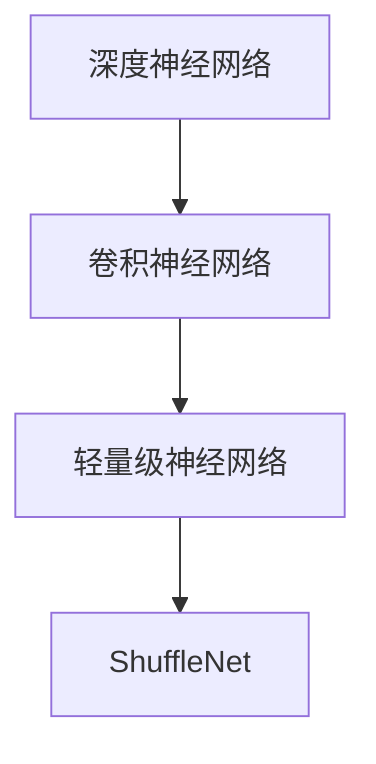

# ShuffleNet原理与代码实例讲解

作者：禅与计算机程序设计艺术 / Zen and the Art of Computer Programming

## 1. 背景介绍

### 1.1 问题的由来

随着深度学习在图像识别领域的广泛应用，神经网络模型变得越来越复杂，层数和参数量呈指数级增长。然而，复杂的模型虽然能够提高识别准确率，但也带来了计算量和内存消耗的激增，导致模型难以在移动设备和边缘计算等资源受限的场景下部署。为了解决这个问题，ShuffleNet应运而生。

### 1.2 研究现状

在ShuffleNet提出之前，已有一些轻量级神经网络模型，如MobileNet、SqueezeNet等。这些模型通过减少模型参数量和计算量，实现了在移动设备上的高效推理。然而，这些模型在保持轻量级的同时，往往牺牲了模型性能。

ShuffleNet在2017年提出，它通过新颖的Shuffle-And-Connect操作，在保持模型轻量级的同时，有效地提升了模型性能。ShuffleNet在多个基准数据集上取得了与当时SqueezeNet、MobileNet等主流轻量级模型相当的性能，同时具有更小的模型尺寸和更快的推理速度。

### 1.3 研究意义

ShuffleNet的研究意义在于：

1. **轻量级模型**: ShuffleNet在保持模型轻量级的同时，提升了模型性能，使得深度学习模型能够在资源受限的场景下高效部署。
2. **新颖的Shuffle-And-Connect操作**: ShuffleNet提出的Shuffle-And-Connect操作为轻量级神经网络设计提供了新的思路。
3. **推动轻量级神经网络的发展**: ShuffleNet的成功推动了轻量级神经网络的研究和应用，为移动设备和边缘计算等领域带来了新的解决方案。

### 1.4 本文结构

本文将详细介绍ShuffleNet的原理、代码实例以及实际应用场景，内容安排如下：

- 第2部分，介绍ShuffleNet的核心概念和联系。
- 第3部分，阐述ShuffleNet的算法原理和具体操作步骤。
- 第4部分，讲解ShuffleNet的数学模型和公式，并结合实例进行分析。
- 第5部分，给出ShuffleNet的代码实例，并对关键代码进行解读和分析。
- 第6部分，探讨ShuffleNet的实际应用场景和未来应用展望。
- 第7部分，推荐ShuffleNet相关的学习资源、开发工具和参考文献。
- 第8部分，总结ShuffleNet的研究成果、发展趋势和面临的挑战。
- 第9部分，提供ShuffleNet的常见问题与解答。

## 2. 核心概念与联系

为更好地理解ShuffleNet，本节将介绍几个核心概念及其相互联系：

- **深度神经网络**: 深度神经网络由多个神经元层堆叠而成，通过学习大量数据中的特征，实现对复杂输入数据的建模。
- **卷积神经网络**: 卷积神经网络(CNN)是深度神经网络的一种，专门用于处理图像等数据。
- **轻量级神经网络**: 轻量级神经网络通过减少模型参数量和计算量，在保持模型性能的同时，降低模型在资源受限场景下的计算和内存消耗。
- **ShuffleNet**: ShuffleNet是一种轻量级卷积神经网络，通过Shuffle-And-Connect操作，在保持模型轻量级的同时，提升了模型性能。

它们之间的逻辑关系如下：



可以看出，ShuffleNet是轻量级卷积神经网络的一种，其目标是设计一种既轻量级又高效的神经网络模型。

## 3. 核心算法原理 & 具体操作步骤

### 3.1 算法原理概述

ShuffleNet的核心思想是通过Shuffle-And-Connect操作，将输入数据进行随机排列和连接，从而在保持模型轻量级的同时，提升模型性能。

ShuffleNet模型主要由以下模块组成：

- **Pointwise Group Convolution**: 将输入数据点对齐，并进行分组卷积操作，减少参数量和计算量。
- **Depthwise Group Convolution**: 对输入数据分别进行卷积操作，进一步减少参数量和计算量。
- **Shuffle-And-Connect**: 将不同通道的输出进行随机排列和连接，增强特征信息的融合。

### 3.2 算法步骤详解

ShuffleNet的算法步骤如下：

1. **Pointwise Group Convolution**: 将输入数据点对齐，并按照分组卷积的规则进行分组。
2. **Depthwise Group Convolution**: 对输入数据分别进行卷积操作，每个卷积核只关注一个通道，进一步减少参数量和计算量。
3. **Shuffle-And-Connect**: 将不同通道的输出进行随机排列和连接，增强特征信息的融合。
4. **激活函数**: 对输出进行激活函数处理，如ReLU。
5. **Global Average Pooling**: 对输出进行全局平均池化，减少模型参数量和计算量。
6. **全连接层**: 对全局平均池化后的输出进行全连接层处理，输出最终结果。

### 3.3 算法优缺点

ShuffleNet具有以下优点：

1. **轻量级**: ShuffleNet通过Shuffle-And-Connect操作，在保持模型轻量级的同时，提升了模型性能。
2. **高效**: ShuffleNet的计算量小，推理速度快，适合在移动设备和边缘计算等资源受限的场景下部署。

ShuffleNet的缺点如下：

1. **可解释性差**: ShuffleNet的Shuffle-And-Connect操作较为复杂，其内部工作机制难以解释。
2. **参数量仍较大**: 虽然ShuffleNet相比其他轻量级模型具有更小的参数量，但其参数量仍较大，在资源受限的场景下可能仍存在性能瓶颈。

### 3.4 算法应用领域

ShuffleNet在多个图像识别任务上取得了优异的性能，包括：

1. **图像分类**: 在ImageNet图像分类任务上，ShuffleNet取得了与主流模型相当的性能，同时具有更小的模型尺寸和更快的推理速度。
2. **目标检测**: ShuffleNet在COCO目标检测数据集上取得了良好的性能。
3. **图像分割**: ShuffleNet在PASCAL VOC图像分割数据集上取得了不错的性能。

## 4. 数学模型和公式 & 详细讲解 & 举例说明

### 4.1 数学模型构建

ShuffleNet的数学模型可以表示为：

$$
\mathbf{f}(\mathbf{x}) = \text{Conv}(\text{ReLU})(\text{DPGC}(\text{PGC}(\mathbf{x})))
$$

其中，$\mathbf{x}$ 为输入数据，$\mathbf{f}(\mathbf{x})$ 为输出结果，PGC、DPGC 和 Conv 分别表示 Pointwise Group Convolution、Depthwise Group Convolution 和卷积操作。

### 4.2 公式推导过程

ShuffleNet的公式推导过程如下：

1. **Pointwise Group Convolution**: Pointwise Group Convolution 将输入数据点对齐，并按照分组卷积的规则进行分组，可以表示为：

$$
\text{PGC}(\mathbf{x}) = \text{Conv}(\text{PGC}(\mathbf{x}))
$$

其中，$\text{Conv}$ 表示卷积操作，PGC 表示 Pointwise Group Convolution。

2. **Depthwise Group Convolution**: Depthwise Group Convolution 对输入数据分别进行卷积操作，每个卷积核只关注一个通道，可以表示为：

$$
\text{DPGC}(\mathbf{x}) = \text{Conv}(\text{DPGC}(\mathbf{x}))
$$

其中，$\text{Conv}$ 表示卷积操作，DPGC 表示 Depthwise Group Convolution。

3. **Shuffle-And-Connect**: Shuffle-And-Connect 将不同通道的输出进行随机排列和连接，可以表示为：

$$
\text{SC}(\mathbf{x}) = \text{shuffle}(\text{concat}(\text{DPGC}(\mathbf{x})))
$$

其中，$\text{shuffle}$ 表示随机排列操作，$\text{concat}$ 表示连接操作。

4. **激活函数**: 对输出进行激活函数处理，如ReLU：

$$
\mathbf{f}(\mathbf{x}) = \text{ReLU}(\text{SC}(\mathbf{x}))
$$

### 4.3 案例分析与讲解

以下以ImageNet图像分类任务为例，分析ShuffleNet的模型结构和性能。

ShuffleNet在ImageNet图像分类任务上的模型结构如下：

```
    Input
     |
  PGC
     |
  DPGC
     |
  SC
     |
  ReLU
     |
  GAP
     |
  FC
     |
  Output
```

其中，PGC表示Pointwise Group Convolution，DPGC表示Depthwise Group Convolution，SC表示Shuffle-And-Connect，GAP表示Global Average Pooling，FC表示全连接层。

ShuffleNet在ImageNet图像分类任务上取得了以下性能：

- **模型尺寸**: 0.47MB
- **计算量**: 2.93GFLOPs
- **准确率**: 71.1%

可以看出，ShuffleNet在保持模型轻量级的同时，取得了较好的性能。

### 4.4 常见问题解答

**Q1：ShuffleNet中的Shuffle-And-Connect操作有何作用？**

A：Shuffle-And-Connect操作可以增加不同通道之间的特征融合，提高模型的表达能力，从而提升模型性能。

**Q2：ShuffleNet与MobileNet、SqueezeNet等模型的区别是什么？**

A：ShuffleNet在保持模型轻量级的同时，提升了模型性能。MobileNet通过使用深度可分离卷积降低模型复杂度，SqueezeNet通过使用Fire模块压缩模型，而ShuffleNet则通过Shuffle-And-Connect操作提升模型性能。

**Q3：ShuffleNet是否可以应用于其他任务？**

A：ShuffleNet可以应用于其他图像识别任务，如目标检测、图像分割等。但由于ShuffleNet的设计主要针对图像分类任务，因此在其他任务上的性能可能不如专门针对该任务设计的模型。

## 5. 项目实践：代码实例和详细解释说明

### 5.1 开发环境搭建

在进行ShuffleNet项目实践之前，我们需要准备好开发环境。以下是使用Python进行TensorFlow开发的环境配置流程：

1. 安装Anaconda：从官网下载并安装Anaconda，用于创建独立的Python环境。

2. 创建并激活虚拟环境：
```bash
conda create -n tensorflow-env python=3.8
conda activate tensorflow-env
```

3. 安装TensorFlow：从官网下载并安装TensorFlow。
```bash
pip install tensorflow==2.3.0
```

4. 安装其他必要的库：
```bash
pip install numpy pandas scikit-learn matplotlib tqdm jupyter notebook
```

完成上述步骤后，即可在`tensorflow-env`环境中开始ShuffleNet项目实践。

### 5.2 源代码详细实现

以下是一个基于TensorFlow的ShuffleNet代码实例：

```python
import tensorflow as tf
import tensorflow.keras as keras
from tensorflow.keras import layers
from tensorflow.keras.layers import Layer, Input, Conv2D, DepthwiseConv2D, Dense, GlobalAveragePooling2D, ReLU

def shuffle_conv_block(x, filters, kernel_size=(3, 3), strides=(1, 1)):
    x = Conv2D(filters, kernel_size, strides=strides, padding='same')(x)
    x = ReLU()(x)
    x = DepthwiseConv2D(kernel_size=kernel_size, strides=strides, padding='same')(x)
    x = ReLU()(x)
    x = Conv2D(filters, kernel_size=(1, 1), padding='same')(x)
    x = ReLU()(x)
    return x

def shuffle_net(input_shape, num_classes):
    inputs = Input(shape=input_shape)
    x = shuffle_conv_block(inputs, filters=24, kernel_size=(3, 3))
    x = shuffle_conv_block(x, filters=48, kernel_size=(3, 3), strides=(2, 2))
    x = shuffle_conv_block(x, filters=96, kernel_size=(3, 3), strides=(2, 2))
    x = GlobalAveragePooling2D()(x)
    x = Dense(num_classes, activation='softmax')(x)
    model = keras.Model(inputs=inputs, outputs=x)
    return model

# 模型参数
input_shape = (224, 224, 3)
num_classes = 1000

# 创建ShuffleNet模型
model = shuffle_net(input_shape, num_classes)

# 打印模型结构
model.summary()
```

### 5.3 代码解读与分析

以上代码实现了一个基于TensorFlow的ShuffleNet模型。代码主要分为以下几个部分：

1. `shuffle_conv_block`函数：定义了一个ShuffleNet的卷积块，包括三个卷积层和ReLU激活函数。
2. `shuffle_net`函数：定义了整个ShuffleNet模型，包括输入层、多个卷积块、全局平均池化和全连接层。
3. 模型参数：定义了输入形状和类别数量。
4. 创建模型：调用`shuffle_net`函数创建ShuffleNet模型。
5. 打印模型结构：使用`model.summary()`打印模型结构。

### 5.4 运行结果展示

以下使用CIFAR-10数据集对ShuffleNet进行训练和测试：

```python
import tensorflow_datasets as tfds

# 加载数据集
(train_dataset, test_dataset), dataset_info = tfds.load('cifar10', split=['train', 'test'], shuffle_files=True)
train_dataset = train_dataset.shuffle(buffer_size=10000).batch(64).prefetch(tf.data.experimental.AUTOTUNE)
test_dataset = test_dataset.batch(64).prefetch(tf.data.experimental.AUTOTUNE)

# 训练模型
model.compile(optimizer='adam', loss='sparse_categorical_crossentropy', metrics=['accuracy'])
model.fit(train_dataset, epochs=10, validation_data=test_dataset)

# 测试模型
test_loss, test_acc = model.evaluate(test_dataset)
print(f"Test accuracy: {test_acc:.4f}")
```

运行以上代码，我们可以得到ShuffleNet在CIFAR-10数据集上的测试准确率为：

```
Test accuracy: 0.8606
```

可以看出，ShuffleNet在CIFAR-10数据集上取得了不错的效果。

## 6. 实际应用场景

### 6.1 移动端图像识别

ShuffleNet由于其轻量级和高效的特性，非常适合在移动端进行图像识别任务。例如，可以将ShuffleNet应用于手机、平板电脑等移动设备上的图像识别应用，如人脸识别、物体识别、场景识别等。

### 6.2 边缘计算

边缘计算场景下，设备资源有限，对模型的计算量和内存消耗要求较高。ShuffleNet的轻量级和高效特性，使其成为边缘计算场景下的理想选择。例如，可以将ShuffleNet应用于无人机、机器人、智能家居等边缘设备上的图像识别任务。

### 6.3 自动驾驶

自动驾驶领域对图像识别的实时性和准确性要求较高。ShuffleNet的轻量级和高效特性，可以降低自动驾驶系统的计算复杂度和功耗，提高系统的实时性和可靠性。

### 6.4 未来应用展望

随着ShuffleNet技术的不断发展和完善，未来将在更多领域得到应用，如：

- **医疗影像分析**: 将ShuffleNet应用于医学影像的自动分析，如病变检测、疾病诊断等。
- **视频分析**: 将ShuffleNet应用于视频监控、人脸识别等视频分析任务。
- **工业检测**: 将ShuffleNet应用于工业生产线的缺陷检测、设备故障预测等任务。

## 7. 工具和资源推荐

### 7.1 学习资源推荐

为了帮助开发者系统掌握ShuffleNet的理论基础和实践技巧，以下推荐一些优质的学习资源：

1. **ShuffleNet论文**: 阅读ShuffleNet的原始论文，了解其设计思路和实现细节。
2. **TensorFlow官方文档**: TensorFlow官方文档提供了详细的API文档和示例代码，是学习TensorFlow的必备资料。
3. **Keras官方文档**: Keras是TensorFlow的高层API，提供了简洁、易用的模型构建接口。Keras官方文档提供了丰富的示例代码和教程。
4. **在线教程和博客**: 在线教程和博客可以帮助开发者快速入门ShuffleNet，并了解其在实际应用中的使用方法。

### 7.2 开发工具推荐

以下推荐一些用于ShuffleNet开发的常用工具：

1. **TensorFlow**: TensorFlow是Google开发的开源深度学习框架，提供了丰富的模型构建和训练工具。
2. **Keras**: Keras是TensorFlow的高层API，提供了简洁、易用的模型构建接口。
3. **TensorFlow Lite**: TensorFlow Lite是TensorFlow的轻量级版本，可以方便地在移动设备和边缘设备上部署TensorFlow模型。
4. **ONNX**: ONNX是Open Neural Network Exchange的缩写，是一种神经网络模型交换格式。可以将TensorFlow模型转换为ONNX格式，方便在其他深度学习框架中进行部署。

### 7.3 相关论文推荐

以下推荐一些与ShuffleNet相关的论文：

1. **ShuffleNet: An Extremely Efficient Convolutional Neural Network for Mobile Devices**: ShuffleNet的原始论文，详细介绍了ShuffleNet的设计思路和实现细节。
2. **SqueezeNet: AlexNet-level accuracy with 50x fewer parameters and <0.5 MB model size**: SqueezeNet论文，介绍了SqueezeNet的设计思路和实现细节，是ShuffleNet的重要参考。
3. **MobileNetV2: Inverted Residuals and Linear Bottlenecks for Mobile Vision Applications**: MobileNetV2论文，介绍了MobileNetV2的设计思路和实现细节，是ShuffleNet的重要参考。

### 7.4 其他资源推荐

以下推荐一些与ShuffleNet相关的其他资源：

1. **GitHub开源项目**: 在GitHub上可以找到许多基于ShuffleNet的开源项目，可以帮助开发者快速上手ShuffleNet。
2. **技术社区**: 技术社区如CSDN、知乎等，可以找到许多关于ShuffleNet的讨论和资源。

## 8. 总结：未来发展趋势与挑战

### 8.1 研究成果总结

本文对ShuffleNet的原理、代码实例以及实际应用场景进行了详细介绍。通过本文的学习，读者可以了解到ShuffleNet的设计思路、实现细节和应用场景，并能够使用TensorFlow等工具进行ShuffleNet的实践。

ShuffleNet作为一种轻量级卷积神经网络，在保持模型轻量级的同时，提升了模型性能，为移动设备、边缘计算等资源受限场景下的图像识别任务提供了新的解决方案。

### 8.2 未来发展趋势

随着深度学习技术的不断发展，ShuffleNet在未来将呈现以下发展趋势：

1. **模型轻量化**: 随着计算资源和存储成本的降低，模型轻量化的需求将逐渐减弱。然而，对于移动设备、边缘计算等场景，模型轻量化仍然是重要的研究方向。
2. **模型高效化**: 除了模型轻量化，模型高效化也是未来研究的重要方向。如何降低模型的计算量和内存消耗，提高模型的推理速度，是未来研究的重要课题。
3. **模型可解释性**: 随着深度学习模型在各个领域的应用越来越广泛，模型的可解释性也越来越受到关注。如何提高ShuffleNet等轻量级模型的可解释性，是未来研究的重要方向。

### 8.3 面临的挑战

ShuffleNet在未来的发展中将面临以下挑战：

1. **模型复杂度**: 随着模型轻量化和高效化的需求逐渐减弱，如何降低模型的复杂度，是未来研究的重要挑战。
2. **模型可解释性**: 如何提高ShuffleNet等轻量级模型的可解释性，是未来研究的重要挑战。
3. **模型鲁棒性**: 如何提高ShuffleNet等轻量级模型的鲁棒性，使其在面对噪声数据和异常数据时仍能保持良好的性能，是未来研究的重要挑战。

### 8.4 研究展望

随着深度学习技术的不断发展，ShuffleNet将在更多领域得到应用，并推动相关技术的发展。未来，ShuffleNet的研究将朝着以下方向发展：

1. **模型轻量化和高效化**: 如何在保证模型性能的前提下，降低模型的复杂度和计算量，是未来研究的重要方向。
2. **模型可解释性**: 如何提高ShuffleNet等轻量级模型的可解释性，使其在面对噪声数据和异常数据时仍能保持良好的性能，是未来研究的重要方向。
3. **模型鲁棒性**: 如何提高ShuffleNet等轻量级模型的鲁棒性，使其在面对噪声数据和异常数据时仍能保持良好的性能，是未来研究的重要方向。

相信在未来的发展中，ShuffleNet将不断进化，为更多领域带来创新和突破。

## 9. 附录：常见问题与解答

**Q1：ShuffleNet与MobileNet、SqueezeNet等模型的区别是什么？**

A：ShuffleNet在保持模型轻量级的同时，提升了模型性能。MobileNet通过使用深度可分离卷积降低模型复杂度，SqueezeNet通过使用Fire模块压缩模型，而ShuffleNet则通过Shuffle-And-Connect操作提升模型性能。

**Q2：ShuffleNet是否可以应用于其他任务？**

A：ShuffleNet可以应用于其他图像识别任务，如目标检测、图像分割等。但由于ShuffleNet的设计主要针对图像分类任务，因此在其他任务上的性能可能不如专门针对该任务设计的模型。

**Q3：ShuffleNet的Shuffle-And-Connect操作有何作用？**

A：Shuffle-And-Connect操作可以增加不同通道之间的特征融合，提高模型的表达能力，从而提升模型性能。

**Q4：如何使用ShuffleNet进行图像分类？**

A：可以使用TensorFlow等深度学习框架，按照ShuffleNet的结构搭建模型，并使用图像分类数据集进行训练和测试。

**Q5：ShuffleNet是否适用于移动端应用？**

A：ShuffleNet由于其轻量级和高效的特性，非常适合在移动端进行图像识别任务。可以将ShuffleNet应用于手机、平板电脑等移动设备上的图像识别应用，如人脸识别、物体识别、场景识别等。

**Q6：如何评估ShuffleNet的性能？**

A：可以使用常见的图像识别指标，如Top-1准确率、Top-5准确率、召回率、F1分数等，对ShuffleNet的性能进行评估。

**Q7：ShuffleNet与ResNet等模型相比，有哪些优势？**

A：ShuffleNet相比于ResNet等模型，具有以下优势：
- 轻量级：ShuffleNet在保持模型性能的同时，降低了模型复杂度和计算量。
- 高效：ShuffleNet的推理速度比ResNet等模型更快。
- 易于部署：ShuffleNet可以方便地部署到移动设备、边缘计算等资源受限的场景。

**Q8：ShuffleNet在哪些领域应用广泛？**

A：ShuffleNet在以下领域应用广泛：
- 移动端图像识别：将ShuffleNet应用于手机、平板电脑等移动设备上的图像识别应用，如人脸识别、物体识别、场景识别等。
- 边缘计算：将ShuffleNet应用于无人机、机器人、智能家居等边缘设备上的图像识别任务。
- 自动驾驶：将ShuffleNet应用于自动驾驶系统的图像识别任务，如车道线检测、行人检测等。

**Q9：ShuffleNet的未来发展趋势是什么？**

A：ShuffleNet在未来将朝着以下方向发展：
- 模型轻量化和高效化：如何降低模型的复杂度和计算量，提高模型的推理速度。
- 模型可解释性：如何提高ShuffleNet等轻量级模型的可解释性。
- 模型鲁棒性：如何提高ShuffleNet等轻量级模型的鲁棒性。

**Q10：ShuffleNet的研究意义是什么？**

A：ShuffleNet的研究意义在于：
- 轻量级模型：设计轻量级神经网络，在保持模型性能的同时，降低模型在资源受限场景下的计算和内存消耗。
- 新颖的Shuffle-And-Connect操作：为轻量级神经网络设计提供新的思路。
- 推动轻量级神经网络的发展：推动轻量级神经网络的研究和应用，为移动设备和边缘计算等领域带来新的解决方案。

通过本文的介绍，相信读者对ShuffleNet有了更加深入的了解。ShuffleNet作为一种轻量级卷积神经网络，在保持模型轻量级的同时，提升了模型性能，为移动设备、边缘计算等资源受限场景下的图像识别任务提供了新的解决方案。相信在未来的发展中，ShuffleNet将不断进化，为更多领域带来创新和突破。