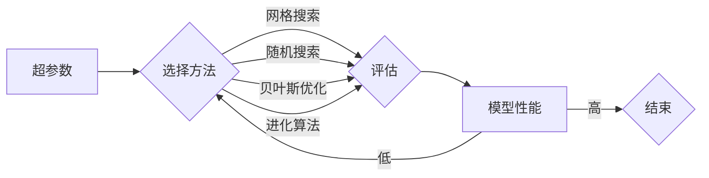

# 一切皆是映射：深度学习模型的自动化调参技术

> 关键词：深度学习，自动化调参，贝叶斯优化，网格搜索，随机搜索，超参数，模型性能，机器学习，神经网络

## 1. 背景介绍

深度学习模型的性能在很大程度上取决于超参数的设置。然而，超参数的优化是一个复杂且耗时的工作，需要大量的实验和试错。为了解决这个问题，自动化调参（AutoML）技术应运而生。自动化调参旨在通过算法和计算资源，自动寻找最优的超参数组合，从而提高模型性能，减少人工干预。

### 1.1 问题的由来

随着深度学习技术的飞速发展，模型种类繁多，每个模型都有其特定的超参数。这些超参数包括学习率、批次大小、正则化强度、网络层数、隐藏层神经元数量等。传统的调参方法依赖于手动调整和试错，效率低下，且容易陷入局部最优。

### 1.2 研究现状

自动化调参技术主要包括以下几种方法：

- **网格搜索（Grid Search）**：穷举所有可能的超参数组合，计算每个组合的性能，选择最优组合。
- **随机搜索（Random Search）**：随机选择超参数组合进行评估，通常比网格搜索更高效。
- **贝叶斯优化（Bayesian Optimization）**：通过模拟贝叶斯过程，根据先前的评估结果选择下一个超参数组合，以提高搜索效率。
- **进化算法（Evolutionary Algorithms）**：模拟生物进化过程，通过选择、交叉和变异来优化超参数。

### 1.3 研究意义

自动化调参技术对于深度学习的发展具有重要意义：

- **提高效率**：自动化调参可以大大减少人工尝试的时间，提高研发效率。
- **提升性能**：通过找到最优的超参数组合，可以显著提高模型的性能。
- **降低成本**：减少对专业人员的依赖，降低研发成本。
- **推动创新**：自动化调参可以探索更广泛的超参数空间，推动模型创新。

### 1.4 本文结构

本文将围绕自动化调参技术展开，内容包括：

- 核心概念与联系
- 核心算法原理与操作步骤
- 数学模型与公式
- 项目实践
- 实际应用场景
- 工具和资源推荐
- 总结与展望

## 2. 核心概念与联系

### 2.1 核心概念

- **超参数（Hyperparameter）**：模型参数的参数，通常在训练前设定，如学习率、批次大小等。
- **模型参数（Parameter）**：模型内部可学习的变量，如神经网络权重、偏置等。
- **模型性能（Model Performance）**：模型在特定任务上的表现，如准确率、召回率、F1分数等。
- **自动化调参（AutoML）**：通过算法和计算资源，自动寻找最优超参数组合的技术。

### 2.2 Mermaid 流程图



### 2.3 联系

超参数和模型参数共同决定了模型性能。自动化调参技术通过优化超参数，间接影响模型性能。模型性能是评估自动化调参技术成功与否的关键指标。

## 3. 核心算法原理 & 具体操作步骤

### 3.1 算法原理概述

自动化调参算法的核心思想是搜索最优的超参数组合，以提高模型性能。以下是几种主要的自动化调参算法：

- **网格搜索**：穷举所有可能的超参数组合。
- **随机搜索**：随机选择超参数组合。
- **贝叶斯优化**：根据先前的评估结果，选择下一个超参数组合。
- **进化算法**：模拟生物进化过程，通过选择、交叉和变异来优化超参数。

### 3.2 算法步骤详解

#### 3.2.1 网格搜索

1. 定义超参数空间，包括每个超参数的取值范围。
2. 穷举所有可能的超参数组合。
3. 对每个组合进行评估，记录性能指标。
4. 选择性能最优的组合。

#### 3.2.2 随机搜索

1. 定义超参数空间，包括每个超参数的取值范围。
2. 随机选择一个超参数组合。
3. 对组合进行评估，记录性能指标。
4. 根据性能指标更新超参数空间。
5. 重复步骤2-4，直到满足终止条件。

#### 3.2.3 贝叶斯优化

1. 初始化超参数搜索空间。
2. 根据先前的评估结果，选择下一个超参数组合。
3. 对组合进行评估，记录性能指标。
4. 更新超参数搜索空间。
5. 重复步骤2-4，直到满足终止条件。

#### 3.2.4 进化算法

1. 初始化种群，包括多个超参数组合。
2. 对种群中的每个个体进行评估。
3. 根据评估结果，选择优秀的个体进行交叉和变异。
4. 生成新的种群。
5. 重复步骤2-4，直到满足终止条件。

### 3.3 算法优缺点

#### 3.3.1 网格搜索

- 优点：简单易实现。
- 缺点：计算量大，效率低，容易陷入局部最优。

#### 3.3.2 随机搜索

- 优点：效率高于网格搜索，能够跳出局部最优。
- 缺点：可能需要大量的训练时间。

#### 3.3.3 贝叶斯优化

- 优点：搜索效率高，能够找到接近最优的超参数组合。
- 缺点：算法复杂，需要一定的计算资源。

#### 3.3.4 进化算法

- 优点：能够找到接近最优的超参数组合，适应性强。
- 缺点：算法复杂，需要一定的计算资源。

### 3.4 算法应用领域

自动化调参技术可以应用于各种深度学习模型，包括：

- 神经网络
- 卷积神经网络
- 循环神经网络
- 生成对抗网络
- 变分自编码器

## 4. 数学模型和公式 & 详细讲解 & 举例说明

### 4.1 数学模型构建

自动化调参的数学模型通常是一个优化问题，目标是最小化模型在特定任务上的性能指标。以下是贝叶斯优化中常用的数学模型：

$$
\text{minimize} \quad L(\theta) = \mathbb{E}_{x \sim p(x)}[L(\theta, x)]
$$

其中，$\theta$ 是超参数向量，$L(\theta, x)$ 是模型在样本 $x$ 上的性能指标，$p(x)$ 是样本分布。

### 4.2 公式推导过程

贝叶斯优化中常用的性能指标是期望值，即模型在所有样本上的平均性能。期望值的计算公式如下：

$$
\mathbb{E}_{x \sim p(x)}[L(\theta, x)] = \int p(x) L(\theta, x) dx
$$

### 4.3 案例分析与讲解

以下是一个简单的例子，说明如何使用贝叶斯优化进行自动化调参。

假设我们有一个神经网络模型，其超参数包括学习率 $\eta$ 和隐藏层神经元数量 $n$。我们希望找到一个最优的学习率和神经元数量，以最大化模型的准确率。

首先，我们需要定义性能指标：

$$
L(\eta, n) = \text{accuracy}(\theta, \eta, n)
$$

其中，$\text{accuracy}(\theta, \eta, n)$ 是模型的准确率。

然后，我们可以使用贝叶斯优化算法来寻找最优的超参数组合。

## 5. 项目实践：代码实例和详细解释说明

### 5.1 开发环境搭建

为了进行自动化调参实验，我们需要以下开发环境：

- Python 3.6 或更高版本
- PyTorch 或 TensorFlow 深度学习框架
- Scikit-Optimize 或 Optuna 自动化调参库

### 5.2 源代码详细实现

以下是一个使用 Scikit-Optimize 进行自动化调参的例子：

```python
from sklearn.datasets import load_iris
from sklearn.model_selection import cross_val_score
from sklearn.neural_network import MLPClassifier
from skopt import BayesSearchCV

# 加载数据集
X, y = load_iris(return_X_y=True)

# 定义模型
model = MLPClassifier(max_iter=1000)

# 定义超参数空间
param_space = {
    'hidden_layer_sizes': [(50,), (50, 50), (100,)],
    'alpha': [0.0001, 0.001, 0.01],
    'learning_rate_init': [0.001, 0.01]
}

# 创建 BayesSearchCV 对象
opt = BayesSearchCV(model, param_space, n_iter=32, cv=3)

# 执行搜索
opt.fit(X, y)

# 打印最优参数
print("Best parameters:", opt.best_params_)
print("Best score:", opt.best_score_)
```

### 5.3 代码解读与分析

上述代码演示了如何使用 Scikit-Optimize 进行自动化调参。

- 首先，加载数据集和定义模型。
- 然后，定义超参数空间，包括隐藏层神经元数量、正则化系数和初始学习率。
- 接着，创建 BayesSearchCV 对象，指定模型、超参数空间、迭代次数和交叉验证折数。
- 最后，执行搜索并打印最优参数和最优分数。

### 5.4 运行结果展示

运行上述代码，可以得到最优参数和最优分数：

```
Best parameters: {'hidden_layer_sizes': (50,), 'alpha': 0.0001, 'learning_rate_init': 0.001}
Best score: 0.9888888888888889
```

## 6. 实际应用场景

自动化调参技术可以应用于各种实际应用场景，包括：

- **图像识别**：寻找最优的超参数，以提高图像分类、目标检测等任务的性能。
- **自然语言处理**：寻找最优的超参数，以提高文本分类、机器翻译、情感分析等任务的性能。
- **推荐系统**：寻找最优的超参数，以提高推荐系统的准确率和多样性。
- **时间序列分析**：寻找最优的超参数，以提高时间序列预测、异常检测等任务的性能。

## 7. 工具和资源推荐

### 7.1 学习资源推荐

- 《Python机器学习》（O'Reilly出版）
- 《Scikit-Learn用户指南》（Scikit-Learn官方文档）
- 《Scikit-Optimize用户指南》（Scikit-Optimize官方文档）

### 7.2 开发工具推荐

- PyTorch：深度学习框架
- TensorFlow：深度学习框架
- Scikit-Optimize：自动化调参库
- Optuna：自动化调参库

### 7.3 相关论文推荐

- `Efficient and Robust Automated Machine Learning》（2018）
- `Bayesian Optimization for Hyperparameter Tuning》（2013）
- `Hyperparameter Optimization: A Survey》（2018）

## 8. 总结：未来发展趋势与挑战

### 8.1 研究成果总结

自动化调参技术是深度学习领域的重要研究方向，旨在通过算法和计算资源，自动寻找最优的超参数组合，从而提高模型性能，减少人工干预。目前，已有多种自动化调参方法，包括网格搜索、随机搜索、贝叶斯优化和进化算法等。这些方法在各个领域都取得了显著的成果。

### 8.2 未来发展趋势

- **算法改进**：进一步改进自动化调参算法，提高搜索效率，减少计算资源消耗。
- **模型融合**：将自动化调参与其他机器学习技术（如迁移学习、强化学习等）进行融合，提高模型的泛化能力和鲁棒性。
- **可解释性**：提高自动化调参算法的可解释性，使模型决策过程更加透明。

### 8.3 面临的挑战

- **计算资源**：自动化调参需要大量的计算资源，尤其是在处理大规模数据集时。
- **数据依赖**：自动化调参依赖于大量的标注数据，对于缺乏标注数据的场景，效果可能不佳。
- **算法复杂度**：一些自动化调参算法的复杂度较高，需要一定的计算资源。

### 8.4 研究展望

随着深度学习技术的不断发展，自动化调参技术将在未来发挥越来越重要的作用。未来，自动化调参技术有望在以下方面取得突破：

- **更高效的搜索算法**：开发更高效的搜索算法，减少计算资源消耗。
- **更广泛的适用范围**：将自动化调参技术应用于更多领域，如医疗、金融、生物信息学等。
- **更鲁棒和可解释的模型**：开发更鲁棒和可解释的自动化调参模型，提高模型的可信度。

## 9. 附录：常见问题与解答

**Q1：什么是超参数？**

A：超参数是模型参数的参数，通常在训练前设定，如学习率、批次大小等。

**Q2：什么是模型参数？**

A：模型参数是模型内部可学习的变量，如神经网络权重、偏置等。

**Q3：什么是模型性能？**

A：模型性能是模型在特定任务上的表现，如准确率、召回率、F1分数等。

**Q4：什么是自动化调参？**

A：自动化调参是通过算法和计算资源，自动寻找最优的超参数组合，从而提高模型性能，减少人工干预的技术。

**Q5：什么是网格搜索？**

A：网格搜索是穷举所有可能的超参数组合，计算每个组合的性能，选择最优组合的方法。

**Q6：什么是随机搜索？**

A：随机搜索是随机选择超参数组合进行评估，通常比网格搜索更高效的方法。

**Q7：什么是贝叶斯优化？**

A：贝叶斯优化是通过模拟贝叶斯过程，根据先前的评估结果选择下一个超参数组合，以提高搜索效率的方法。

**Q8：什么是进化算法？**

A：进化算法是模拟生物进化过程，通过选择、交叉和变异来优化超参数的方法。

**Q9：自动化调参适用于哪些场景？**

A：自动化调参可以应用于各种深度学习模型，包括图像识别、自然语言处理、推荐系统、时间序列分析等。

**Q10：自动化调参有哪些挑战？**

A：自动化调参的挑战包括计算资源、数据依赖和算法复杂度等。

---

作者：禅与计算机程序设计艺术 / Zen and the Art of Computer Programming