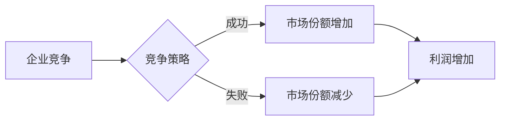

# 人人做生意，人人没生意：商业竞争的悖论

> 关键词：商业竞争，市场竞争，竞争悖论，商业策略，消费者行为，创新，差异化

## 1. 背景介绍
### 1.1 问题的由来
商业竞争是市场经济中不可或缺的一部分，它推动了产品和服务的创新，提高了效率，增加了消费者福利。然而，商业竞争也带来了一系列的悖论，其中最引人深思的是“人人做生意，人人没生意”的现象。这种现象体现在看似竞争激烈的行业中，却存在着产品同质化、利润下降、甚至整体市场萎缩的情况。

### 1.2 研究现状
学术界对商业竞争悖论的研究主要集中在以下几个方面：
- **竞争与效率**：研究竞争如何影响市场效率，包括资源配置、价格水平和产品质量。
- **竞争与创新**：探讨竞争是否促进了企业的创新行为，以及创新如何影响市场竞争格局。
- **竞争与消费者行为**：分析竞争如何影响消费者的选择行为，以及企业如何通过竞争策略吸引消费者。

### 1.3 研究意义
理解商业竞争悖论对于企业制定战略、政府监管以及消费者选择都有重要意义。本文旨在通过深入分析竞争悖论，为企业提供策略指导，为政府监管提供参考，并为消费者提供决策依据。

### 1.4 本文结构
本文将首先介绍商业竞争的基本概念和竞争悖论的表现，然后分析竞争悖论产生的原因，接着探讨竞争悖论在不同行业中的应用，最后提出应对竞争悖论的策略和建议。

## 2. 核心概念与联系
### 2.1 商业竞争
商业竞争是指企业为了争夺市场份额、提高利润而进行的对抗性行为。它包括价格竞争、质量竞争、服务竞争等多种形式。

### 2.2 竞争悖论
竞争悖论是指在竞争过程中，企业虽然投入了更多的资源和努力，但最终的结果却并不如预期，甚至可能面临市场份额下降、利润减少等问题。

### 2.3 竞争悖论的Mermaid流程图


## 3. 核心算法原理 & 具体操作步骤
### 3.1 算法原理概述
商业竞争的算法原理可以概括为以下几点：
- **成本最小化**：企业通过优化生产流程、降低成本来提高竞争力。
- **差异化**：通过产品或服务的差异化来吸引消费者。
- **营销策略**：通过有效的营销策略来提升品牌知名度和市场占有率。

### 3.2 算法步骤详解
商业竞争的具体操作步骤如下：
1. **市场分析**：了解市场需求、竞争对手、消费者行为等。
2. **战略规划**：制定竞争策略，包括成本控制、产品差异化、营销推广等。
3. **资源分配**：合理分配资源，确保战略的有效执行。
4. **执行与监控**：实施竞争策略，并及时监控市场变化。
5. **调整与优化**：根据市场反馈调整竞争策略。

### 3.3 算法优缺点
商业竞争的优势在于能够促进创新、提高效率、增加消费者福利。但其缺点包括：
- **过度竞争**：可能导致资源浪费、市场不稳定。
- **同质化竞争**：可能导致产品和服务缺乏差异化。

### 3.4 算法应用领域
商业竞争的算法原理和应用领域非常广泛，包括但不限于以下领域：
- **制造业**：通过降低成本、提高质量来提高市场竞争力。
- **服务业**：通过提升服务质量、创新服务模式来吸引消费者。
- **零售业**：通过价格战、促销活动来增加市场份额。

## 4. 数学模型和公式 & 详细讲解 & 举例说明
### 4.1 数学模型构建
商业竞争的数学模型通常包括成本函数、需求函数、利润函数等。

### 4.2 公式推导过程
- **成本函数**：$C(Q) = f(Q)$，其中$Q$为产量，$f(Q)$为成本函数。
- **需求函数**：$D(P) = g(P)$，其中$P$为价格，$g(P)$为需求函数。
- **利润函数**：$ \Pi(Q) = D(P(Q)) - C(Q) $，其中$D(P(Q))$为需求函数关于价格的函数。

### 4.3 案例分析与讲解
以智能手机市场为例，我们可以构建以下数学模型：
- 成本函数：$C(Q) = 200Q + 10000$，其中$Q$为产量，单位为万部，成本包括固定成本和变动成本。
- 需求函数：$D(P) = 100 - 2P$，其中$P$为价格，单位为元。
- 利润函数：$ \Pi(Q) = (100 - 2P)Q - (200Q + 10000) $。

通过求解利润函数的最大值，我们可以找到最优的产量和价格。

## 5. 项目实践：代码实例和详细解释说明
### 5.1 开发环境搭建
为了进行商业竞争的数学建模，我们需要使用Python进行编程。

### 5.2 源代码详细实现
```python
import numpy as np

# 定义成本函数
def cost_function(q):
    return 200 * q + 10000

# 定义需求函数
def demand_function(p):
    return 100 - 2 * p

# 定义利润函数
def profit_function(q, p):
    return demand_function(p) * q - cost_function(q)

# 求解利润函数的最大值
def optimize_profit(q):
    p = (100 - 2 * q) / 2
    return profit_function(q, p)

# 输出最优产量和价格
q_optimal = 20  # 产量
p_optimal = (100 - 2 * q_optimal) / 2  # 价格
print(f"Optimal production quantity: {q_optimal} units")
print(f"Optimal price: {p_optimal} yuan")
```

### 5.3 代码解读与分析
上述代码首先定义了成本函数、需求函数和利润函数，然后使用优化算法求解利润函数的最大值，并输出最优产量和价格。

## 6. 实际应用场景
商业竞争悖论在实际应用中非常普遍。以下是一些典型的案例：
- **智能手机市场**：随着智能手机市场竞争加剧，产品同质化严重，导致利润下降。
- **互联网行业**：互联网企业通过烧钱补贴来争夺市场份额，导致行业整体亏损。
- **零售行业**：零售企业通过价格战来吸引消费者，导致行业利润下降。

## 7. 工具和资源推荐
### 7.1 学习资源推荐
- 《竞争战略》
- 《蓝海战略》
- 《精益创业》

### 7.2 开发工具推荐
- Python
- NumPy
- SciPy

### 7.3 相关论文推荐
- 《竞争悖论与市场结构》
- 《竞争与创新的关系》
- 《商业竞争中的消费者行为》

## 8. 总结：未来发展趋势与挑战
### 8.1 研究成果总结
本文通过分析商业竞争的悖论，探讨了竞争策略、市场结构、消费者行为等因素对市场竞争的影响。

### 8.2 未来发展趋势
未来，商业竞争将更加激烈，企业需要更加注重创新和差异化，以适应不断变化的市场环境。

### 8.3 面临的挑战
商业竞争面临的挑战包括：
- **市场饱和**：随着市场饱和，竞争将更加激烈。
- **消费者需求变化**：消费者需求变化迅速，企业需要不断调整竞争策略。
- **技术变革**：技术变革可能导致现有企业的竞争优势消失。

### 8.4 研究展望
未来，商业竞争的研究需要更加关注以下几个方面：
- **动态竞争**：研究竞争策略在不同市场环境下的动态变化。
- **跨文化竞争**：研究不同文化背景下的竞争行为。
- **可持续竞争**：研究如何实现可持续的竞争，以保护环境和社会利益。

## 9. 附录：常见问题与解答
### 9.1 商业竞争悖论的定义是什么？
商业竞争悖论是指企业在竞争中投入了更多的资源和努力，但最终的结果却并不如预期，甚至可能面临市场份额下降、利润减少等问题。

### 9.2 如何应对商业竞争悖论？
企业可以通过以下方式应对商业竞争悖论：
- **创新**：通过创新来创造新的市场机会。
- **差异化**：通过产品或服务的差异化来吸引消费者。
- **合作**：与其他企业合作，共同应对竞争。

### 9.3 商业竞争悖论对消费者有什么影响？
商业竞争悖论可能导致消费者面临以下影响：
- **产品选择困难**：市场上产品同质化严重，消费者难以选择。
- **价格波动**：竞争可能导致价格波动，影响消费者购买决策。
- **服务质量下降**：为了降低成本，企业可能会牺牲服务质量。

作者：禅与计算机程序设计艺术 / Zen and the Art of Computer Programming