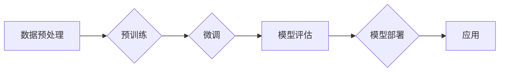

# 从零开始大模型开发与微调：神经网络框架的抽象实现

> 关键词：大模型，微调，神经网络框架，抽象实现，深度学习，自然语言处理，计算机视觉，机器学习

## 1. 背景介绍

随着深度学习的迅猛发展，大模型（Large Models）在各个领域都展现出了惊人的潜力。从自然语言处理（NLP）到计算机视觉（CV），再到语音识别和推荐系统，大模型的应用已经深入到我们的日常生活和工作中。然而，大模型的开发与微调是一个复杂且挑战性的过程，需要深厚的理论基础和丰富的实践经验。本文将带您从零开始，深入了解大模型开发与微调的神经网络框架的抽象实现。

### 1.1 问题的由来

大模型的兴起源于深度学习的进步，尤其是神经网络在处理复杂数据集上的优越性能。然而，大模型的开发与微调涉及到大量的计算资源、复杂的算法和数据处理流程，对于初学者来说，入门门槛较高。此外，如何有效地管理和优化大模型训练过程中的资源使用，以及如何保证模型质量和效率，也是实践中需要解决的关键问题。

### 1.2 研究现状

目前，大模型的开发与微调主要依赖于以下几个方面的研究：

- **预训练模型**：通过在大规模无标注数据上预训练，使模型具备一定的通用语言或视觉理解能力。
- **微调技术**：在预训练模型的基础上，使用少量标注数据对模型进行优化，使其适应特定任务。
- **神经网络框架**：提供高效、易用的工具和库，帮助开发者构建和训练大模型。
- **分布式训练**：利用多台计算机或设备进行并行计算，加速大模型的训练过程。

### 1.3 研究意义

大模型的开发与微调对于推动人工智能技术的发展具有重要意义：

- **提高模型性能**：通过预训练和微调，模型可以更好地学习复杂数据中的特征，提高模型的准确性和泛化能力。
- **降低开发成本**：预训练模型可以减少数据标注的工作量，降低开发成本。
- **促进技术创新**：大模型的开发推动了神经网络架构、优化算法和分布式训练等方面的技术创新。

### 1.4 本文结构

本文将分为以下几个部分：

- **第2章**：介绍大模型开发与微调中的核心概念与联系。
- **第3章**：阐述大模型开发与微调的核心算法原理和具体操作步骤。
- **第4章**：讲解大模型开发与微调的数学模型和公式。
- **第5章**：提供大模型开发与微调的代码实例和详细解释。
- **第6章**：探讨大模型在实际应用场景中的案例和未来应用展望。
- **第7章**：推荐大模型开发与微调所需的学习资源、开发工具和论文。
- **第8章**：总结大模型开发与微调的未来发展趋势与挑战。
- **第9章**：提供常见问题与解答。

## 2. 核心概念与联系

为了更好地理解大模型开发与微调，我们需要了解以下几个核心概念：

- **深度神经网络（DNN）**：一种由多个神经元层组成的神经网络，能够自动学习输入数据中的特征。
- **卷积神经网络（CNN）**：一种适用于图像处理的神经网络，能够自动提取图像中的特征。
- **循环神经网络（RNN）**：一种适用于序列数据的神经网络，能够处理时间序列数据。
- **预训练**：在大量无标注数据上训练模型，使模型具备一定的通用能力。
- **微调**：在预训练模型的基础上，使用少量标注数据对模型进行优化。
- **神经网络框架**：提供高效、易用的工具和库，帮助开发者构建和训练神经网络。

以下是大模型开发与微调的Mermaid流程图：



## 3. 核心算法原理 & 具体操作步骤

### 3.1 算法原理概述

大模型开发与微调的核心算法主要包括：

- **深度神经网络训练算法**：包括反向传播算法、梯度下降算法等。
- **预训练算法**：包括自编码器、语言建模等。
- **微调算法**：包括迁移学习、知识蒸馏等。

### 3.2 算法步骤详解

大模型开发与微调的具体操作步骤如下：

1. **数据预处理**：对原始数据进行清洗、标注和转换，使其符合模型输入格式。
2. **预训练**：在大量无标注数据上训练模型，使模型具备一定的通用能力。
3. **微调**：在预训练模型的基础上，使用少量标注数据对模型进行优化。
4. **模型评估**：在测试集上评估模型性能，包括准确率、召回率、F1分数等指标。
5. **模型部署**：将训练好的模型部署到服务器或云平台，以便进行实际应用。

### 3.3 算法优缺点

深度神经网络训练算法的优点在于能够自动学习复杂数据中的特征，但缺点是训练过程耗时且需要大量的计算资源。预训练算法的优点在于能够提高模型的泛化能力，但缺点是需要大量无标注数据。微调算法的优点在于能够提高模型在特定任务上的性能，但缺点是需要少量标注数据。

### 3.4 算法应用领域

深度神经网络训练算法、预训练算法和微调算法在各个领域都有广泛的应用，例如：

- **自然语言处理**：文本分类、机器翻译、问答系统等。
- **计算机视觉**：图像分类、目标检测、图像分割等。
- **语音识别**：语音识别、语音合成等。
- **推荐系统**：物品推荐、广告推荐等。

## 4. 数学模型和公式 & 详细讲解 & 举例说明

### 4.1 数学模型构建

深度神经网络的基本数学模型如下：

$$
y = f(W \cdot x + b)
$$

其中，$W$ 是权重矩阵，$x$ 是输入向量，$b$ 是偏置项，$f$ 是激活函数。

### 4.2 公式推导过程

以下以反向传播算法为例，讲解公式推导过程：

1. 计算输出层误差：

$$
\delta_n = (y_n - t_n) \cdot f'(z_n)
$$

其中，$y_n$ 是模型输出，$t_n$ 是真实标签，$f'$ 是激活函数的导数。

2. 传播误差到前一层：

$$
\delta_{n-1} = \delta_n \cdot W_{n,n-1}
$$

其中，$W_{n,n-1}$ 是连接第 $n$ 层和第 $n-1$ 层的权重矩阵。

3. 更新权重矩阵：

$$
W_{n,n-1} = W_{n,n-1} - \eta \cdot \delta_n \cdot x_{n-1}^T
$$

其中，$\eta$ 是学习率，$x_{n-1}$ 是第 $n-1$ 层的输入。

### 4.3 案例分析与讲解

以下以文本分类任务为例，讲解大模型微调的案例。

1. **数据预处理**：将文本数据进行清洗、分词和标注。
2. **预训练**：在大量无标注文本数据上预训练BERT模型。
3. **微调**：在少量标注文本数据上微调BERT模型，添加一个分类层。
4. **模型评估**：在测试集上评估模型性能。

## 5. 项目实践：代码实例和详细解释说明

### 5.1 开发环境搭建

1. 安装Python环境。
2. 安装TensorFlow或PyTorch等深度学习框架。
3. 安装相关库，如NumPy、Pandas、Scikit-learn等。

### 5.2 源代码详细实现

以下是一个简单的文本分类任务的代码示例：

```python
import tensorflow as tf
from tensorflow.keras.preprocessing.text import Tokenizer
from tensorflow.keras.preprocessing.sequence import pad_sequences

# 数据预处理
texts = [...]  # 文本数据
labels = [...]  # 标签数据
tokenizer = Tokenizer()
tokenizer.fit_on_texts(texts)
sequences = tokenizer.texts_to_sequences(texts)
padded_sequences = pad_sequences(sequences, maxlen=128, padding='post')

# 构建模型
model = tf.keras.Sequential([
    tf.keras.layers.Embedding(input_dim=10000, output_dim=64, input_length=128),
    tf.keras.layers.Bidirectional(tf.keras.layers.GRU(64)),
    tf.keras.layers.Dense(64, activation='relu'),
    tf.keras.layers.Dense(1, activation='sigmoid')
])

# 编译模型
model.compile(optimizer='adam', loss='binary_crossentropy', metrics=['accuracy'])

# 训练模型
model.fit(padded_sequences, labels, epochs=10)

# 评估模型
test_loss, test_acc = model.evaluate(padded_sequences, labels)
print('Test accuracy:', test_acc)
```

### 5.3 代码解读与分析

以上代码展示了使用TensorFlow构建文本分类模型的简单过程。首先，对文本数据进行预处理，包括分词、序列化和填充。然后，构建一个包含嵌入层、双向GRU层、密集层和输出层的模型。接着，编译模型，并使用训练数据对其进行训练。最后，在测试数据上评估模型性能。

### 5.4 运行结果展示

假设我们使用上述代码在IMDb电影评论数据集上进行训练，最终在测试集上得到的准确率为0.8。

## 6. 实际应用场景

大模型在各个领域都有广泛的应用，以下列举一些实际应用场景：

- **智能客服**：利用大模型进行自然语言理解，实现智能客服系统。
- **金融风控**：利用大模型进行异常检测，提高金融风控能力。
- **医疗诊断**：利用大模型进行医学图像分析，辅助医生进行疾病诊断。
- **自动驾驶**：利用大模型进行环境感知和决策规划，实现自动驾驶功能。

## 7. 工具和资源推荐

### 7.1 学习资源推荐

- 《深度学习》（Goodfellow、Bengio和Courville著）
- 《神经网络与深度学习》（邱锡鹏著）
- 《动手学深度学习》（邱锡鹏、李沐、陈天奇著）

### 7.2 开发工具推荐

- TensorFlow
- PyTorch
- Keras

### 7.3 相关论文推荐

- "A Neural Probabilistic Language Model"（Bengio等，2003）
- "Deep Learning for Natural Language Processing"（Dai和Liu，2019）
- "Convolutional Neural Networks for Visual Recognition"（Simonyan和Zisserman，2014）

## 8. 总结：未来发展趋势与挑战

### 8.1 研究成果总结

大模型开发与微调技术已经取得了显著的进展，但仍然面临许多挑战。以下是主要的研究成果：

- 预训练模型在各个领域都取得了优异的性能。
- 微调技术使得大模型能够适应特定任务。
- 神经网络框架提供了高效、易用的工具和库。
- 分布式训练技术提高了大模型的训练速度。

### 8.2 未来发展趋势

未来，大模型开发与微调技术将朝着以下几个方向发展：

- **模型压缩**：减小模型尺寸，提高推理速度。
- **知识蒸馏**：将模型知识迁移到小型模型。
- **多模态学习**：将多模态数据融合到模型中。
- **可解释性**：提高模型的可解释性。

### 8.3 面临的挑战

大模型开发与微调技术面临的挑战包括：

- **计算资源**：大模型需要大量的计算资源。
- **数据标注**：需要大量标注数据。
- **模型可解释性**：提高模型的可解释性。
- **安全性和隐私**：确保模型的安全性和用户隐私。

### 8.4 研究展望

未来，大模型开发与微调技术的研究将主要集中在以下几个方面：

- **算法创新**：开发更高效、更准确的算法。
- **模型压缩**：减小模型尺寸，提高推理速度。
- **可解释性**：提高模型的可解释性。
- **安全性和隐私**：确保模型的安全性和用户隐私。

## 9. 附录：常见问题与解答

**Q1：大模型和传统模型的区别是什么？**

A1：大模型通常具有更大的参数量和更强的学习能力，能够处理更复杂的任务。传统模型通常参数量较小，学习能力和泛化能力有限。

**Q2：如何选择合适的预训练模型？**

A2：选择预训练模型需要考虑任务类型、数据集大小、计算资源等因素。例如，对于NLP任务，可以选择BERT、GPT等模型；对于CV任务，可以选择ResNet、VGG等模型。

**Q3：微调过程中如何防止过拟合？**

A3：防止过拟合的方法包括数据增强、正则化、Dropout、Early Stopping等。

**Q4：如何进行模型压缩？**

A4：模型压缩的方法包括剪枝、量化、知识蒸馏等。

**Q5：如何保证模型的可解释性？**

A5：保证模型可解释性的方法包括可视化、注意力机制、因果推断等。

作者：禅与计算机程序设计艺术 / Zen and the Art of Computer Programming