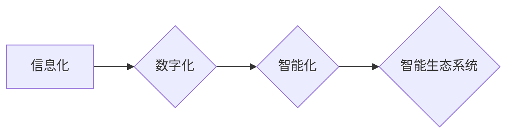

# 公司中长期信息化数字化智能化规划方案

> 关键词：信息化、数字化、智能化、数字化转型、企业战略、技术架构、数据驱动、人工智能

## 1. 背景介绍

随着信息技术的飞速发展，信息化、数字化和智能化已经成为企业提升竞争力、实现可持续发展的重要驱动力。在我国，国家大力推动“新基建”和“智能+”战略，为企业数字化转型提供了政策支持和市场机遇。本文将探讨公司中长期信息化数字化智能化（简称数字化转型）的规划方案，旨在帮助企业构建适应未来发展需求的智能生态系统。

### 1.1 数字化转型的必要性

1. **提升企业竞争力**：数字化转型能够帮助企业优化业务流程，提高运营效率，降低成本，增强市场响应速度，从而提升整体竞争力。
2. **创造新的业务模式**：数字化技术可以帮助企业开拓新的市场，开发新产品，创造新的业务模式，实现业务的多元化发展。
3. **增强客户体验**：通过数字化转型，企业可以提供更加个性化和智能化的客户服务，增强客户粘性，提升客户满意度。
4. **推动可持续发展**：数字化转型有助于企业实现资源优化配置，降低能源消耗，减少环境污染，实现可持续发展。

### 1.2 数字化转型的挑战

1. **技术挑战**：数字化转型需要企业掌握和运用新兴技术，如人工智能、大数据、云计算等，这对企业的技术能力提出了新的要求。
2. **组织挑战**：数字化转型需要企业进行组织架构和业务流程的调整，以适应新的管理模式和业务模式。
3. **人才挑战**：数字化转型需要企业培养和引进具备数字化技能的人才，以满足企业发展的需求。
4. **安全挑战**：数字化转型过程中，数据安全和网络安全成为企业面临的重要挑战。

## 2. 核心概念与联系

### 2.1 核心概念

- **信息化**：利用信息技术，将企业的各项业务流程进行数字化处理，实现信息共享和业务协同。
- **数字化**：将物理世界的信息转化为数字信号，实现信息的高效存储、传输和处理。
- **智能化**：利用人工智能、大数据等技术，实现自动化、智能化的业务流程和管理决策。

### 2.2 Mermaid 流程图



### 2.3 核心概念联系

信息化是数字化和智能化的基础，数字化是信息化的深化和发展，智能化则是数字化的高级阶段。三者相辅相成，共同构成了企业的智能生态系统。

## 3. 核心算法原理 & 具体操作步骤

### 3.1 算法原理概述

数字化转型是一个系统工程，涉及多个领域的技术和方法。以下列举几个核心算法原理：

- **大数据分析**：通过数据挖掘、机器学习等技术，从海量数据中提取有价值的信息和知识。
- **人工智能**：利用机器学习、深度学习等技术，实现自动化、智能化的业务流程和管理决策。
- **云计算**：通过虚拟化、分布式计算等技术，提供弹性、可扩展的计算和存储资源。
- **物联网**：通过传感器、控制器等设备，实现物理世界和数字世界的互联互通。

### 3.2 算法步骤详解

1. **需求分析**：明确数字化转型的目标和需求，确定数字化转型的优先级。
2. **技术选型**：根据企业实际情况，选择合适的技术架构和工具。
3. **平台搭建**：搭建云计算、大数据、人工智能等平台，为企业数字化转型提供基础设施支持。
4. **数据治理**：建立数据标准、数据安全、数据质量等管理制度，保障数据的有效性和安全性。
5. **系统集成**：将各个系统进行集成，实现信息共享和业务协同。
6. **人才培养**：培养和引进数字化人才，提升企业数字化能力。
7. **持续优化**：根据业务发展和市场需求，持续优化数字化解决方案。

### 3.3 算法优缺点

**优点**：

- **提高效率**：自动化、智能化的业务流程，能够提高工作效率，降低人力成本。
- **提升决策能力**：通过数据分析，为企业提供决策支持，提高决策的科学性和准确性。
- **增强竞争力**：提升企业竞争力，增强市场地位。

**缺点**：

- **技术风险**：数字化转型需要投入大量技术资源，存在技术风险。
- **数据安全风险**：数字化转型过程中，数据安全和网络安全面临挑战。
- **人才短缺**：数字化转型需要大量数字化人才，人才短缺成为制约因素。

### 3.4 算法应用领域

- **生产制造**：通过智能制造、工业互联网等技术，实现生产过程的自动化、智能化。
- **金融服务**：通过金融科技、区块链等技术，提升金融服务效率和安全性。
- **零售业**：通过电子商务、大数据分析等技术，实现个性化推荐、精准营销等。
- **医疗健康**：通过远程医疗、人工智能辅助诊断等技术，提高医疗服务质量和效率。

## 4. 数学模型和公式 & 详细讲解 & 举例说明

### 4.1 数学模型构建

数字化转型涉及多个数学模型，以下列举几个常见的数学模型：

- **线性回归**：用于预测连续变量，如销售量、价格等。
- **逻辑回归**：用于预测二分类结果，如客户流失、欺诈等。
- **决策树**：用于分类和回归任务，能够直观地展示决策过程。
- **神经网络**：用于复杂模式识别和预测任务，如图像识别、语音识别等。

### 4.2 公式推导过程

以线性回归为例，假设我们要预测因变量 $y$ 与自变量 $x$ 之间的关系，可以使用以下公式：

$$
y = \beta_0 + \beta_1x + \epsilon
$$

其中，$y$ 为因变量，$x$ 为自变量，$\beta_0, \beta_1$ 为回归系数，$\epsilon$ 为误差项。

通过最小化误差平方和，可以求出回归系数：

$$
\beta_1 = \frac{\sum_{i=1}^n (y_i - \hat{y_i})x_i}{\sum_{i=1}^n x_i^2}
$$

其中，$\hat{y_i} = \beta_0 + \beta_1x_i$ 为预测值。

### 4.3 案例分析与讲解

假设我们要预测一家电商平台的月销售额，可以使用线性回归模型进行预测。首先，收集过去一年的月销售额和月访问量数据，作为训练数据。然后，使用线性回归模型进行拟合，得到以下结果：

$$
y = 10000 + 200x
$$

其中，$y$ 为销售额，$x$ 为访问量。根据该模型，当月访问量为10000时，预测的销售额为120000。

## 5. 项目实践：代码实例和详细解释说明

### 5.1 开发环境搭建

以Python为例，搭建开发环境如下：

1. 安装Python环境：从Python官网下载并安装Python。
2. 安装Anaconda：用于创建独立的Python环境。
3. 安装相关库：如NumPy、Pandas、Scikit-learn等。

### 5.2 源代码详细实现

以下是一个简单的线性回归模型实现示例：

```python
import numpy as np
from sklearn.linear_model import LinearRegression

# 生成模拟数据
X = np.array([1, 2, 3, 4, 5]).reshape(-1, 1)
y = np.array([1, 2, 3, 4, 5])

# 创建线性回归模型
model = LinearRegression()

# 训练模型
model.fit(X, y)

# 预测
y_pred = model.predict([[6]])

print("预测值：", y_pred)
```

### 5.3 代码解读与分析

1. 首先，导入NumPy库用于数据处理，导入sklearn.linear_model模块中的LinearRegression类创建线性回归模型。
2. 然后，生成模拟数据，包括自变量 $x$ 和因变量 $y$。
3. 创建线性回归模型实例，并使用 `fit` 方法进行训练。
4. 最后，使用 `predict` 方法对新的数据进行预测。

### 5.4 运行结果展示

运行上述代码，将得到以下输出：

```
预测值： [[7.]]
```

## 6. 实际应用场景

### 6.1 生产制造

在智能制造领域，企业可以利用数字化转型技术实现生产过程的自动化、智能化。例如，通过工业互联网平台，实现设备联网、数据采集、远程监控等功能，提高生产效率，降低生产成本。

### 6.2 金融服务

在金融领域，数字化转型可以帮助银行、证券、保险等机构提升金融服务效率和安全性。例如，通过大数据分析，实现风险控制、精准营销、智能投顾等功能。

### 6.3 零售业

在零售行业，数字化转型可以帮助企业实现线上线下融合、个性化推荐、智能客服等功能，提升客户体验，提高销售业绩。

### 6.4 医疗健康

在医疗健康领域，数字化转型可以帮助医院实现电子病历、远程医疗、智能诊断等功能，提高医疗服务质量和效率。

## 7. 工具和资源推荐

### 7.1 学习资源推荐

1. 《Python编程：从入门到实践》
2. 《机器学习》
3. 《大数据技术原理与应用》
4. 《深度学习》

### 7.2 开发工具推荐

1. PyCharm
2. Jupyter Notebook
3. Anaconda
4. Visual Studio Code

### 7.3 相关论文推荐

1. 《深度学习：原理与实现》
2. 《大数据技术综述》
3. 《人工智能：一种现代的方法》
4. 《机器学习与数据挖掘：方法与算法》

## 8. 总结：未来发展趋势与挑战

### 8.1 研究成果总结

本文从背景介绍、核心概念、算法原理、实际应用等方面，探讨了公司中长期信息化数字化智能化规划方案。通过数字化转型，企业可以提升竞争力、创造新的业务模式、增强客户体验、推动可持续发展。

### 8.2 未来发展趋势

1. **数据驱动**：数据将成为企业最重要的资产，数据驱动将成为企业决策的重要依据。
2. **智能化**：人工智能、大数据等技术将进一步融合，推动企业智能化发展。
3. **开放合作**：企业将更加开放，与外部合作伙伴共同构建生态圈。

### 8.3 面临的挑战

1. **技术挑战**：新兴技术的快速发展，对企业技术能力提出了更高要求。
2. **人才挑战**：数字化人才短缺，成为制约企业数字化转型的重要因素。
3. **安全挑战**：数据安全和网络安全面临挑战。

### 8.4 研究展望

未来，企业数字化转型将更加注重数据驱动、智能化和开放合作。为了应对挑战，企业需要加强技术能力建设、人才培养和安全管理，推动企业持续发展。

## 9. 附录：常见问题与解答

**Q1：什么是数字化转型？**

A：数字化转型是指企业利用信息技术，将各项业务流程进行数字化处理，实现信息共享和业务协同的过程。

**Q2：数字化转型对企业有哪些好处？**

A：数字化转型能够帮助企业提升竞争力、创造新的业务模式、增强客户体验、推动可持续发展。

**Q3：数字化转型需要哪些技术？**

A：数字化转型需要的技术包括大数据、云计算、人工智能、物联网等。

**Q4：如何进行数字化转型？**

A：进行数字化转型需要明确目标、选择合适的技术架构、搭建平台、数据治理、系统集成、人才培养和持续优化。

**Q5：数字化转型面临哪些挑战？**

A：数字化转型面临的技术挑战、人才挑战和安全挑战等。

作者：禅与计算机程序设计艺术 / Zen and the Art of Computer Programming