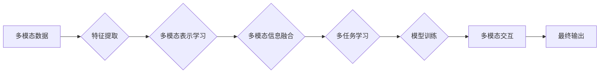

# 跨模态学习技术的最新进展

> 关键词：跨模态学习，多模态信息融合，深度学习，多任务学习，多模态表示学习，多模态交互

## 1. 背景介绍

随着信息技术的飞速发展，人类社会产生了海量的多模态数据，如文本、图像、视频、音频等。这些多模态数据蕴含着丰富的语义信息，对于理解人类世界、辅助决策、提升用户体验等方面具有重要意义。跨模态学习（Cross-modal Learning）作为人工智能领域的一个新兴研究方向，旨在研究如何将不同模态的数据进行有效融合，从而提取出更有价值的信息。

近年来，随着深度学习技术的不断突破，跨模态学习取得了显著进展。本文将深入探讨跨模态学习的最新研究进展，包括核心概念、算法原理、具体操作步骤、数学模型、应用场景以及未来发展趋势等。

## 2. 核心概念与联系

### 2.1 核心概念

#### 多模态信息融合

多模态信息融合是指将来自不同模态的数据进行整合，以获取更全面、更丰富的信息。例如，将图像和文本数据进行融合，可以更好地理解图像中的语义内容。

#### 深度学习

深度学习是一种基于人工神经网络的学习方法，能够从大量数据中自动学习特征表示。在跨模态学习中，深度学习被广泛应用于特征提取、表示学习、模型训练等环节。

#### 多任务学习

多任务学习是指同时学习多个相关任务的模型。在跨模态学习中，多任务学习可以同时学习多个模态的特征表示，从而提高模型的泛化能力和鲁棒性。

#### 多模态表示学习

多模态表示学习是指学习不同模态数据的特征表示方法。有效的表示学习方法可以帮助模型更好地理解和融合多模态信息。

#### 多模态交互

多模态交互是指不同模态数据之间的交互作用。例如，图像中的物体可以与文本中的描述进行交互，以增强模型对语义的理解。

### 2.2 Mermaid 流程图



## 3. 核心算法原理 & 具体操作步骤

### 3.1 算法原理概述

跨模态学习算法通常包括以下几个步骤：

1. 特征提取：从不同模态的数据中提取特征，如图像的像素值、文本的词向量等。
2. 多模态表示学习：学习不同模态数据的特征表示，使得不同模态数据之间的表示能够相互匹配和融合。
3. 多模态信息融合：将不同模态的特征表示进行融合，以获得更丰富的语义信息。
4. 多任务学习：同时学习多个相关任务的模型，以提高模型的泛化能力和鲁棒性。
5. 模型训练：使用标注数据训练模型，以优化模型参数。
6. 多模态交互：在模型训练和推理过程中，考虑不同模态数据之间的交互作用。

### 3.2 算法步骤详解

#### 3.2.1 特征提取

特征提取是跨模态学习的基础，常用的方法包括：

- 图像特征提取：使用卷积神经网络（CNN）提取图像的局部特征、纹理特征、颜色特征等。
- 文本特征提取：使用词袋模型、TF-IDF、Word2Vec、BERT等模型提取文本的词向量表示。
- 音频特征提取：使用梅尔频率倒谱系数（MFCC）、声谱图、CNN等模型提取音频的特征。

#### 3.2.2 多模态表示学习

多模态表示学习旨在学习不同模态数据的特征表示，使得不同模态数据之间的表示能够相互匹配和融合。常用的方法包括：

- 多模态嵌入：将不同模态的数据映射到一个共同的空间，使得不同模态数据之间的表示能够相互匹配。
- 对抗性训练：通过对抗性训练学习不同模态数据的特征表示，使得不同模态数据之间的表示能够相互融合。

#### 3.2.3 多模态信息融合

多模态信息融合是将不同模态的特征表示进行融合，以获得更丰富的语义信息。常用的方法包括：

- 特征级融合：将不同模态的特征进行拼接或平均，形成新的特征表示。
- 决策级融合：在不同的模态上分别进行预测，然后对预测结果进行融合。

#### 3.2.4 多任务学习

多任务学习可以同时学习多个相关任务的模型，以提高模型的泛化能力和鲁棒性。常用的方法包括：

- 多任务共享表示学习：通过共享特征表示层，将不同任务的特征表示进行融合。
- 多任务学习损失函数：将不同任务的损失函数进行融合，以优化模型参数。

#### 3.2.5 模型训练

使用标注数据训练模型，以优化模型参数。常用的训练方法包括：

- 梯度下降：通过计算损失函数的梯度，不断更新模型参数，以最小化损失函数。
- 梯度提升：使用梯度提升算法，如XGBoost、LightGBM等，来训练模型。

#### 3.2.6 多模态交互

在模型训练和推理过程中，考虑不同模态数据之间的交互作用。常用的方法包括：

- 模型结构设计：在模型结构中引入模态间交互层，如注意力机制、交互网络等。
- 损失函数设计：在损失函数中引入模态间交互项，以促进模型学习模态间的交互关系。

### 3.3 算法优缺点

#### 优点

- 提高模型性能：通过融合多模态信息，可以提高模型的准确性和鲁棒性。
- 扩展应用领域：跨模态学习可以应用于各种多模态数据，如图像、文本、音频等。
- 丰富语义信息：跨模态学习可以提取出更丰富的语义信息，提高模型对现实世界的理解。

#### 缺点

- 数据依赖：跨模态学习对数据的质量和数量有较高要求。
- 模型复杂度高：跨模态学习模型的复杂度较高，训练和推理过程需要较多计算资源。
- 模型可解释性差：跨模态学习模型的决策过程往往难以解释。

### 3.4 算法应用领域

跨模态学习在多个领域都有广泛的应用，如：

- 多模态检索：如图像-文本检索、视频-音频检索等。
- 图像识别：如图像分类、物体检测、场景解析等。
- 语音识别：如语音转文本、语音情感分析等。
- 自然语言处理：如文本生成、机器翻译等。

## 4. 数学模型和公式 & 详细讲解 & 举例说明

### 4.1 数学模型构建

跨模态学习模型的数学模型通常包含以下几个部分：

- 特征表示：$X \in \mathbb{R}^{n \times d}$，其中 $n$ 为样本数量，$d$ 为特征维度。
- 模型参数：$\theta \in \mathbb{R}^{d \times c}$，其中 $c$ 为输出维度。
- 损失函数：$\mathcal{L}(\theta, X, Y)$，其中 $Y \in \mathbb{R}^{n \times c}$ 为真实标签。

### 4.2 公式推导过程

假设我们使用神经网络进行特征提取和分类，损失函数为交叉熵损失：

$$
\mathcal{L}(\theta, X, Y) = -\sum_{i=1}^{n} \sum_{j=1}^{c} Y_{ij} \log \left( \frac{e^{\theta^T X_i}}{\sum_{k=1}^{c} e^{\theta^T X_i}} \right)
$$

其中，$\theta^T X_i$ 表示神经网络在输入 $X_i$ 上的输出。

### 4.3 案例分析与讲解

以下是一个简单的跨模态检索的案例：

假设我们有一个包含图像和文本描述的数据库，目标是根据给定的文本查询，检索出与之相关的图像。

首先，使用CNN提取图像的特征表示，使用Word2Vec提取文本的词向量表示。

然后，使用余弦相似度计算图像特征和文本特征之间的相似度：

$$
s(i, j) = \frac{X_i \cdot Y_j}{\|X_i\| \|Y_j\|}
$$

其中，$X_i$ 表示图像 $i$ 的特征表示，$Y_j$ 表示文本 $j$ 的词向量表示。

最后，根据相似度检索出最相关的图像。

## 5. 项目实践：代码实例和详细解释说明

### 5.1 开发环境搭建

为了进行跨模态学习项目实践，我们需要搭建以下开发环境：

- 操作系统：Linux或Windows
- 编程语言：Python
- 深度学习框架：TensorFlow或PyTorch
- 依赖库：NumPy、Pandas、scikit-learn等

### 5.2 源代码详细实现

以下是一个基于TensorFlow和PyTorch的跨模态检索项目的示例代码：

```python
# TensorFlow示例
import tensorflow as tf
from tensorflow.keras.models import Model
from tensorflow.keras.layers import Input, Embedding, Dot, Flatten, Dense

# 输入图像特征和文本特征
image_input = Input(shape=(d_image,))
text_input = Input(shape=(d_text,))

# CNN提取图像特征
image_embedding = Dense(d_image_embedding, activation='relu')(image_input)

# Word2Vec提取文本特征
text_embedding = Embedding(vocab_size, d_text_embedding, input_length=d_text)(text_input)

# 计算余弦相似度
similarity = Dot(axes=1)([image_embedding, text_embedding])

# 模型输出
output = Flatten()(similarity)

# 构建模型
model = Model(inputs=[image_input, text_input], outputs=output)

# 编译模型
model.compile(optimizer='adam', loss='mse')

# 训练模型
model.fit([image_features, text_features], targets, epochs=10)

# 检索
def retrieve(image_features, text_features):
    similarity_scores = model.predict([image_features, text_features])
    return similarity_scores.argmax(axis=1)

# 检索与查询文本最相关的图像
most_related_image = retrieve(image_features, text_features)
```

### 5.3 代码解读与分析

上述代码展示了如何使用TensorFlow构建一个简单的跨模态检索模型。模型使用CNN提取图像特征，使用Word2Vec提取文本特征，并计算两者之间的余弦相似度。通过训练模型，我们可以根据给定的文本查询检索出与之最相关的图像。

### 5.4 运行结果展示

在实际运行过程中，我们需要提供图像特征和文本特征作为输入，并调用`retrieve`函数进行检索。根据相似度分数，我们可以找到与查询文本最相关的图像。

## 6. 实际应用场景

跨模态学习在多个实际应用场景中都有广泛的应用，以下列举一些例子：

- **多模态检索**：如图像-文本检索、视频-音频检索等。
- **图像识别**：如图像分类、物体检测、场景解析等。
- **语音识别**：如语音转文本、语音情感分析等。
- **自然语言处理**：如文本生成、机器翻译等。

## 7. 工具和资源推荐

### 7.1 学习资源推荐

- 《深度学习：原理与实践》
- 《多模态学习：理论与应用》
- 《跨模态信息融合》
- 《深度学习中的多模态学习》

### 7.2 开发工具推荐

- TensorFlow
- PyTorch
- Keras
- OpenCV

### 7.3 相关论文推荐

- **多模态表示学习**：
  - Deep Multimodal Fusion Networks for Visual Question Answering
  - Multimodal Fusion: A Survey
- **多模态信息融合**：
  - A Survey on Multimodal Fusion: From Traditional to Deep Learning
  - Multimodal Fusion by Deep Learning for Visual Question Answering
- **多任务学习**：
  - Multi-Task Learning Using Uncertainty to Weigh Losses for Scene Geometry and Semantics
  - Multi-Task Learning with Deep Neural Networks

## 8. 总结：未来发展趋势与挑战

### 8.1 研究成果总结

跨模态学习技术经过多年的发展，取得了显著的成果。目前，跨模态学习在多个领域都有广泛的应用，如多模态检索、图像识别、语音识别等。未来，跨模态学习技术将继续朝着以下方向发展：

- **多模态数据融合**：探索更有效的多模态数据融合方法，以获得更丰富的语义信息。
- **多模态表示学习**：学习更有效的多模态表示学习方法，以更好地表示不同模态数据之间的相互关系。
- **多模态交互**：研究不同模态数据之间的交互作用，以增强模型对语义的理解。

### 8.2 未来发展趋势

- **多模态数据融合**：随着多模态数据的不断增长，如何有效地融合多模态数据将成为一个重要的研究方向。
- **多模态表示学习**：学习更有效的多模态表示学习方法，以更好地表示不同模态数据之间的相互关系。
- **多模态交互**：研究不同模态数据之间的交互作用，以增强模型对语义的理解。
- **可解释性**：提高跨模态学习模型的可解释性，使其更加可靠和可信。

### 8.3 面临的挑战

- **数据不平衡**：不同模态数据的分布可能存在不平衡，需要研究有效的方法来处理数据不平衡问题。
- **模型复杂度**：跨模态学习模型的复杂度较高，需要研究高效的方法来降低模型复杂度。
- **可解释性**：提高跨模态学习模型的可解释性，使其更加可靠和可信。

### 8.4 研究展望

跨模态学习技术将在未来人工智能领域发挥越来越重要的作用。随着研究的不断深入，跨模态学习技术将取得更多突破，为人类社会带来更多便利和价值。

## 9. 附录：常见问题与解答

**Q1：跨模态学习的目的是什么？**

A：跨模态学习的目的是通过融合不同模态的数据，提取更丰富的语义信息，以解决更复杂的实际问题。

**Q2：跨模态学习的难点有哪些？**

A：跨模态学习的难点主要包括数据不平衡、模型复杂度高、可解释性差等。

**Q3：跨模态学习的应用领域有哪些？**

A：跨模态学习的应用领域包括多模态检索、图像识别、语音识别、自然语言处理等。

**Q4：如何提高跨模态学习的性能？**

A：提高跨模态学习的性能可以从以下几个方面入手：
- 使用更有效的数据融合方法。
- 学习更有效的多模态表示学习方法。
- 引入更多的先验知识。
- 优化模型结构和训练过程。

**Q5：跨模态学习的前景如何？**

A：跨模态学习是人工智能领域的一个重要研究方向，具有广阔的应用前景。随着研究的不断深入，跨模态学习技术将在未来取得更大的突破。

---

作者：禅与计算机程序设计艺术 / Zen and the Art of Computer Programming