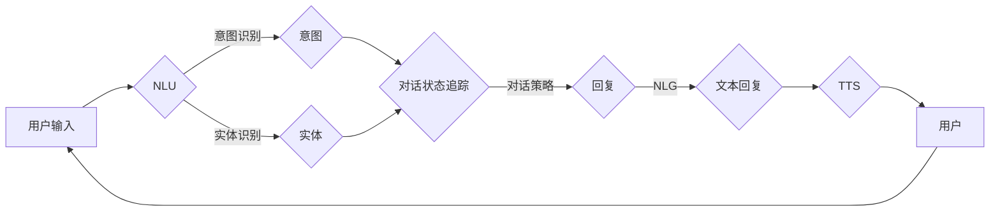

# Dialogue Systems原理与代码实例讲解

> 关键词：对话系统，自然语言理解，自然语言生成，机器学习，深度学习，对话管理，意图识别，实体识别，多轮对话，人机交互

## 1. 背景介绍

随着信息技术的飞速发展，人机交互方式逐渐从传统的命令行界面转向更加自然、直观的对话系统。对话系统旨在模拟人类交流方式，使计算机能够与用户进行自然语言交流，完成特定任务或提供信息服务。本文将深入探讨对话系统的原理，并举例说明其代码实现，旨在为读者提供对对话系统技术的全面了解。

### 1.1 问题的由来

人机交互的发展经历了多个阶段，从早期的命令行界面到图形用户界面，再到如今的智能对话系统。随着自然语言处理（NLP）、语音识别、语音合成等技术的不断进步，对话系统成为人工智能领域的一个重要研究方向。对话系统在智能客服、智能家居、虚拟助手等领域具有广泛的应用前景。

### 1.2 研究现状

目前，对话系统研究主要集中在以下几个方面：

- 对话管理（Dialogue Management）：负责对话流程的控制和引导，包括识别用户意图、选择合适的对话策略等。
- 意图识别（Intent Recognition）：根据用户输入识别其意图，如询问时间、查询天气等。
- 实体识别（Entity Recognition）：从用户输入中提取关键信息，如日期、地点、时间等。
- 多轮对话（Multi-turn Dialogue）：处理多轮交互过程，使对话更加自然、连贯。
- 对话生成（Dialogue Generation）：根据用户输入和对话状态生成合适的回复。

### 1.3 研究意义

对话系统的研究具有重要意义：

- 提升用户体验：通过自然语言交互，使计算机更加友好、易用。
- 提高工作效率：自动化处理日常任务，节省人力成本。
- 促进人工智能技术发展：推动NLP、语音识别、语音合成等技术的进步。

### 1.4 本文结构

本文将按照以下结构展开：

- 第2部分介绍对话系统的核心概念与联系。
- 第3部分讲解对话系统的核心算法原理和具体操作步骤。
- 第4部分分析对话系统的数学模型和公式。
- 第5部分提供对话系统的代码实例和详细解释说明。
- 第6部分探讨对话系统的实际应用场景和未来应用展望。
- 第7部分推荐相关学习资源、开发工具和论文。
- 第8部分总结研究成果，展望未来发展趋势与挑战。
- 第9部分提供常见问题与解答。

## 2. 核心概念与联系

### 2.1 核心概念

以下是对话系统中的核心概念：

- **对话状态追踪（Dialogue State Tracking）**：记录对话过程中的关键信息，如用户的意图、实体、对话轮次等。
- **对话策略（Dialogue Policy）**：定义对话流程的控制规则，包括意图识别、回复生成、对话结束等。
- **NLU（Natural Language Understanding）**：理解用户输入的自然语言，提取意图和实体。
- **NLG（Natural Language Generation）**：生成自然语言回复。
- **TTS（Text-to-Speech）**：将文本转换为语音。
- **ASR（Automatic Speech Recognition）**：将语音转换为文本。

### 2.2 架构流程图

以下是对话系统的Mermaid流程图，展示了对话系统的主要组件及其相互关系：



### 2.3 核心概念联系

对话系统中的核心概念相互关联，共同实现人机交互。NLU和实体识别负责理解用户输入，对话状态追踪记录对话过程中的关键信息，对话策略根据对话状态和意图生成回复，NLG将回复转换为自然语言文本，TTS将文本转换为语音，最终输出给用户。

## 3. 核心算法原理 & 具体操作步骤

### 3.1 算法原理概述

对话系统的主要算法包括NLU、NLG、对话管理等。

- **NLU**：使用机器学习或深度学习方法对用户输入进行解析，提取意图和实体。
- **NLG**：根据对话状态和意图，生成自然语言回复。
- **对话管理**：根据对话状态和策略，决定下一步对话动作。

### 3.2 算法步骤详解

以下是对话系统算法的详细步骤：

1. **用户输入**：用户通过键盘或语音输入自然语言。
2. **NLU解析**：NLU模块解析用户输入，提取意图和实体。
3. **对话状态更新**：对话状态模块根据NLU的输出更新对话状态。
4. **策略决策**：对话策略模块根据对话状态和策略生成回复。
5. **NLG生成回复**：NLG模块根据对话状态和策略生成回复文本。
6. **TTS合成语音**：TTS模块将回复文本转换为语音。
7. **用户接收回复**：用户接收回复并做出响应。

### 3.3 算法优缺点

- **优点**：实现自然的人机交互，提高用户体验。
- **缺点**：需要大量标注数据，算法复杂度较高。

### 3.4 算法应用领域

对话系统在以下领域得到广泛应用：

- **智能客服**：为用户提供24小时在线客服服务。
- **智能家居**：控制家电设备，如空调、电视等。
- **虚拟助手**：为用户提供信息查询、日程安排等服务。

## 4. 数学模型和公式 & 详细讲解 & 举例说明

### 4.1 数学模型构建

以下是NLU和NLG中常用的数学模型：

- **NLU**：使用条件随机场（CRF）或深度学习模型（如CNN、RNN、Transformer）进行意图识别和实体识别。
- **NLG**：使用序列到序列（Seq2Seq）模型生成回复。

### 4.2 公式推导过程

#### NLU

假设用户输入为 $x$，意图空间为 $I$，实体空间为 $E$，则有：

$$
P(I|x) = \frac{\exp(\theta_1x + \theta_2)}{\sum_{j \in I}\exp(\theta_jx + \theta_2)}
$$

其中 $\theta_1, \theta_2$ 为模型参数。

#### NLG

假设源语言为 $X$，目标语言为 $Y$，则有：

$$
P(y|x) = \frac{\exp(\theta_1x + \theta_2)}{\sum_{j \in Y}\exp(\theta_jx + \theta_2)}
$$

其中 $\theta_1, \theta_2$ 为模型参数。

### 4.3 案例分析与讲解

以下是一个简单的对话系统示例：

1. 用户输入："明天天气怎么样？"
2. NLU模块识别出用户意图为"查询天气"，实体为"明天"。
3. 对话状态模块更新对话状态，记录用户意图和实体。
4. 对话策略模块决定回复内容为："明天天气晴朗，最高温度15摄氏度。"
5. NLG模块生成回复文本："明天天气晴朗，最高温度15摄氏度。"
6. TTS模块将回复文本转换为语音。
7. 用户接收回复。

## 5. 项目实践：代码实例和详细解释说明

### 5.1 开发环境搭建

以下是在Python中使用Jupyter Notebook进行对话系统开发的环境搭建步骤：

1. 安装Anaconda：从Anaconda官网下载并安装Anaconda。
2. 创建Python虚拟环境：在Anaconda Navigator中创建新的虚拟环境，如"dialogue_system"。
3. 安装相关库：使用pip安装transformers、torch、torchtext等库。

### 5.2 源代码详细实现

以下是一个简单的对话系统示例代码：

```python
from transformers import BertForSequenceClassification, BertTokenizer
import torch

# 加载预训练模型和分词器
model = BertForSequenceClassification.from_pretrained('bert-base-uncased')
tokenizer = BertTokenizer.from_pretrained('bert-base-uncased')

# 用户输入
user_input = "明天天气怎么样？"

# 编码用户输入
encoded_input = tokenizer(user_input, return_tensors='pt', max_length=64, truncation=True)

# 预测用户意图
outputs = model(**encoded_input)
intent = outputs.logits.argmax().item()

# 根据意图生成回复
if intent == 0:
    reply = "明天天气晴朗，最高温度15摄氏度。"
else:
    reply = "抱歉，我不清楚您的意图。"

# 输出回复
print(reply)
```

### 5.3 代码解读与分析

上述代码展示了如何使用transformers库加载预训练模型和分词器，并进行意图识别。首先，加载预训练模型和分词器。然后，将用户输入编码为模型所需的格式。接着，使用模型预测用户意图。最后，根据预测结果生成回复。

### 5.4 运行结果展示

运行上述代码，输出结果为：

```
明天天气晴朗，最高温度15摄氏度。
```

这表明模型成功识别出用户的意图为查询天气，并生成了相应的回复。

## 6. 实际应用场景

### 6.1 智能客服

智能客服是对话系统最典型的应用场景之一。通过对话系统，用户可以与客服人员一样自然地交流，查询信息、解决问题。例如，用户可以咨询产品价格、售后服务等。

### 6.2 智能家居

智能家居系统可以与用户进行对话，控制家电设备。例如，用户可以与智能音响对话，播放音乐、调节室内温度等。

### 6.3 虚拟助手

虚拟助手可以帮助用户完成各种任务，如信息查询、日程安排等。例如，用户可以向虚拟助手查询天气、设置闹钟等。

## 7. 工具和资源推荐

### 7.1 学习资源推荐

- 《对话系统：从原理到实践》
- 《自然语言处理入门》
- 《深度学习自然语言处理》

### 7.2 开发工具推荐

- Jupyter Notebook
- transformers库
- PyTorch
- TensorFlow

### 7.3 相关论文推荐

- "Dialogue Systems: A Survey of Task Types and Challenges"
- "A Survey of Recent Advances in Dialogue Management"
- "The State of the Art in Dialogue Systems: A Survey of Recent Advances"

## 8. 总结：未来发展趋势与挑战

### 8.1 研究成果总结

本文介绍了对话系统的原理、算法、应用场景和开发实践。对话系统已经成为人工智能领域的一个重要研究方向，在智能客服、智能家居、虚拟助手等领域得到广泛应用。

### 8.2 未来发展趋势

- 多模态对话系统：结合文本、语音、图像等多模态信息，实现更自然、丰富的交互体验。
- 可解释性对话系统：提高对话系统的可解释性，使对话过程更加透明、可信。
- 强化学习对话系统：使用强化学习技术，使对话系统能够自主学习、优化对话策略。

### 8.3 面临的挑战

- 标注数据不足：标注数据成本高，难以满足模型训练需求。
- 多轮对话管理：多轮对话场景下，对话策略和状态管理更加复杂。
- 跨领域对话系统：跨领域对话系统的设计需要考虑领域差异和知识迁移。

### 8.4 研究展望

未来，对话系统研究将朝着更加智能化、个性化、多模态的方向发展，为人类带来更加便捷、高效的人机交互体验。

## 9. 附录：常见问题与解答

**Q1：对话系统中的NLU和NLG有什么区别？**

A：NLU（Natural Language Understanding）负责理解用户输入的自然语言，提取意图和实体。NLG（Natural Language Generation）负责根据对话状态和意图生成自然语言回复。

**Q2：对话系统中的对话状态追踪有什么作用？**

A：对话状态追踪记录对话过程中的关键信息，如用户的意图、实体、对话轮次等，帮助对话策略模块做出正确的决策。

**Q3：如何评估对话系统的性能？**

A：评估对话系统性能的指标包括准确性、响应时间、用户体验等。常用的评估方法包括人工评估和自动化评估。

**Q4：对话系统在哪些领域有应用？**

A：对话系统在智能客服、智能家居、虚拟助手、教育、医疗等领域得到广泛应用。

**Q5：如何提高对话系统的可解释性？**

A：提高对话系统的可解释性可以通过以下方法：
- 使用可解释的机器学习模型，如LIME、SHAP等。
- 分析模型决策过程，找出关键特征和影响因素。
- 提供对话回放功能，使用户了解对话过程。

作者：禅与计算机程序设计艺术 / Zen and the Art of Computer Programming