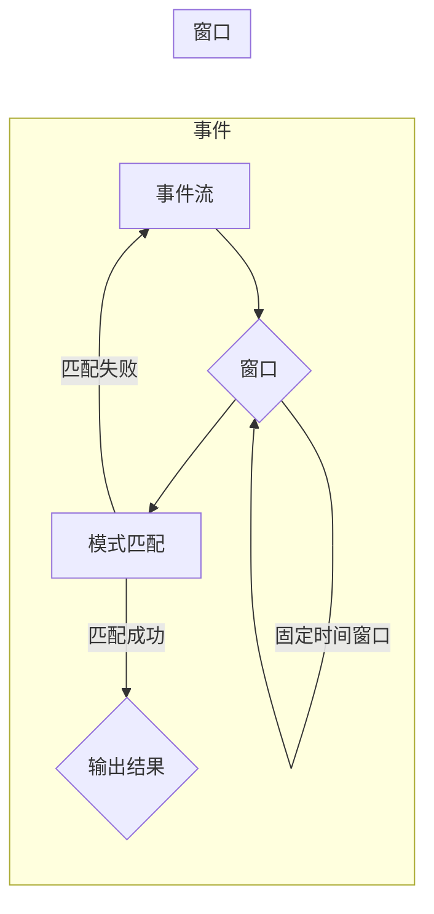

# Flink CEP原理与代码实例讲解

> 关键词：Flink CEP, 实时处理,复杂事件处理,事件时间,窗口函数,状态管理,数据流编程

## 1. 背景介绍

随着大数据技术的发展，实时数据处理成为数据处理领域的一个重要分支。在实时数据处理中，复杂事件处理（Complex Event Processing, CEP）技术应运而生。CEP能够对实时数据流进行解析、模式识别和事件关联，从而为用户提供了实时的业务洞察和决策支持。

Apache Flink 是一个开源的分布式流处理框架，它提供了强大的CEP功能，能够高效地处理和分析实时数据流。Flink CEP基于事件驱动模型，支持事件时间窗口、状态管理和复杂事件模式匹配，是构建实时应用和数据流分析平台的关键技术。

## 2. 核心概念与联系

### 2.1 Flink CEP核心概念

- **事件（Event）**：Flink CEP中的基本数据单元，可以是任何形式的数据，如字符串、数字或自定义对象。
- **事件时间（Event Time）**：事件发生的实际时间，Flink CEP通过Watermark机制来处理乱序事件和时间窗口。
- **窗口（Window）**：对事件进行分组的一种机制，窗口可以是固定时间窗口、滑动时间窗口、会话窗口等。
- **状态（State）**：Flink CEP中的状态存储了事件处理过程中的中间结果，如窗口累积值、计数等。
- **模式（Pattern）**：定义了一组事件之间的时序和关联关系，Flink CEP通过CQL（Complex Event Query Language）来描述模式。

### 2.2 Mermaid流程图



### 2.3 核心概念联系

事件流是Flink CEP处理的基础，通过窗口对事件进行分组，然后根据模式进行匹配。匹配成功后，输出结果；如果匹配失败，事件流继续流动，等待新的事件到来。

## 3. 核心算法原理 & 具体操作步骤

### 3.1 算法原理概述

Flink CEP的核心算法基于事件驱动模型，主要包括以下步骤：

1. 事件采集：从数据源采集事件流。
2. 时间处理：处理事件时间，生成Watermark。
3. 窗口分配：根据事件时间将事件分配到相应的窗口。
4. 模式匹配：在窗口内部进行模式匹配。
5. 输出结果：输出匹配成功的事件。

### 3.2 算法步骤详解

1. **事件采集**：事件采集可以通过Flink的 connectors 完成，如 Kafka、Kinesis、RabbitMQ 等。
2. **时间处理**：Flink CEP使用Watermark机制来处理乱序事件。Watermark是一个时间戳，表示该时间戳之前的事件都已经到达。
3. **窗口分配**：事件根据事件时间分配到不同的窗口中。Flink支持多种窗口类型，如固定时间窗口、滑动时间窗口、会话窗口等。
4. **模式匹配**：使用CQL定义模式，并在窗口内部进行匹配。CQL是一种类似于SQL的查询语言，用于描述事件之间的时序和关联关系。
5. **输出结果**：匹配成功的事件被输出到下游系统。

### 3.3 算法优缺点

**优点**：

- **高吞吐量**：Flink CEP能够处理高吞吐量的数据流。
- **低延迟**：Flink CEP能够提供低延迟的实时处理。
- **容错性**：Flink CEP具有高容错性，能够在发生故障时快速恢复。
- **可扩展性**：Flink CEP能够水平扩展，以处理更大的数据量。

**缺点**：

- **复杂性**：Flink CEP的配置和调试相对复杂。
- **资源消耗**：Flink CEP需要较多的计算资源。

### 3.4 算法应用领域

Flink CEP广泛应用于以下领域：

- **股票市场分析**：实时监控股票价格，识别交易模式。
- **欺诈检测**：实时检测欺诈行为。
- **物联网**：处理和分析物联网设备产生的数据。
- **智能家居**：监控和控制智能家居设备。
- **电信**：分析网络流量，优化网络性能。

## 4. 数学模型和公式 & 详细讲解 & 举例说明

### 4.1 数学模型构建

Flink CEP的数学模型主要包括以下部分：

- **事件时间戳（T）**：事件发生的时间戳。
- **Watermark（W）**：事件时间戳的上界，表示该时间戳之前的事件都已经到达。
- **窗口（Wn）**：事件时间戳在窗口内的所有事件。
- **模式（P）**：事件之间的时序和关联关系。

### 4.2 公式推导过程

假设事件时间戳为 $T$，Watermark为 $W$，窗口为 $Wn$，模式为 $P$，则模式匹配的公式为：

$$
P: W \leq T \in Wn
$$

### 4.3 案例分析与讲解

假设我们有一个电商平台的购物车数据流，包含用户ID、商品ID、加入购物车时间和购买时间。我们需要监控用户在一定时间内加入购物车但未购买商品的行为，并输出这些用户的ID。

首先，定义一个滑动时间窗口，窗口大小为1天：

```java
TimeWindow<CartEvent> slidingWindow = TimeWindows.of(Time.days(1));
```

然后，定义模式：

```java
Pattern<CartEvent> pattern = Pattern.<CartEvent>begin("cart").where(new SimpleCondition<CartEvent>() {
    @Override
    public boolean filter(CartEvent value, long timestamp) {
        return value.getBuyTime() == null;
    }
}).within(slidingWindow);
```

最后，使用CEP API进行模式匹配：

```java
CEP<CartEvent> cep = CEP.pattern(input, pattern);
DataStream<Alert> alertStream = cep.select(new SelectFunction<CartEvent, Alert>() {
    @Override
    public Alert apply(CartEvent value, Collection<Pattern<CartEvent>> pattern) throws Exception {
        return new Alert(value.getUserId());
    }
});
```

在这个案例中，如果用户在1天内加入购物车但未购买商品，将会触发一个警报。

## 5. 项目实践：代码实例和详细解释说明

### 5.1 开发环境搭建

1. 安装Java开发环境（如JDK）。
2. 安装Maven或SBT等构建工具。
3. 添加Flink的依赖库。

### 5.2 源代码详细实现

以下是一个简单的Flink CEP示例代码，用于监控用户在一定时间内加入购物车但未购买商品的行为。

```java
import org.apache.flink.api.common.functions.SimpleFunction;
import org.apache.flink.cep.CEP;
import org.apache.flink.cep.PatternStream;
import org.apache.flink.cep.pattern.Pattern;
import org.apache.flink.cep.pattern.PatternStream;
import org.apache.flink.streaming.api.datastream.DataStream;
import org.apache.flink.streaming.api.environment.StreamExecutionEnvironment;
import org.apache.flink.streaming.api.functions.timestamps.BoundedOutOfOrdernessTimestampExtractor;

public class FlinkCEPExample {
    public static void main(String[] args) throws Exception {
        // 创建Flink流处理环境
        StreamExecutionEnvironment env = StreamExecutionEnvironment.getExecutionEnvironment();

        // 读取数据源
        DataStream<CartEvent> cartStream = env.addSource(new CartSource());

        // 设置事件时间
        cartStream.assignTimestampsAndWatermarks(new BoundedOutOfOrdernessTimestampExtractor<CartEvent>(Time.seconds(10)) {
            @Override
            public long extractTimestamp(CartEvent element) {
                return element.getTimestamp();
            }
        });

        // 定义滑动时间窗口
        TimeWindow slidingWindow = TimeWindows.of(Time.days(1));

        // 定义模式
        Pattern<CartEvent, CartEvent> pattern = Pattern.<CartEvent>begin("cart")
                .where(new SimpleCondition<CartEvent>() {
                    @Override
                    public boolean filter(CartEvent value, long timestamp) {
                        return value.getBuyTime() == null;
                    }
                })
                .within(slidingWindow);

        // 创建PatternStream
        PatternStream<CartEvent> patternStream = CEP.pattern(cartStream, pattern);

        // 输出警报
        patternStream.select(new SimpleFunction<CartEvent, Alert>() {
            @Override
            public Alert apply(CartEvent value, Collection<Pattern<CartEvent>> pattern) throws Exception {
                return new Alert(value.getUserId());
            }
        }).addSink(new AlertSinkFunction());

        // 执行Flink作业
        env.execute("Flink CEP Example");
    }
}
```

### 5.3 代码解读与分析

- `CartEvent`：自定义事件类，包含用户ID、商品ID、加入购物车时间和购买时间。
- `CartSource`：数据源，用于生成购物车事件。
- `assignTimestampsAndWatermarks`：设置事件时间和水印。
- `TimeWindows.of`：创建滑动时间窗口。
- `Pattern.begin`：开始模式定义。
- `SimpleCondition`：简单条件，用于定义模式中的where子句。
- `within`：定义模式中的within子句。
- `CEP.pattern`：创建PatternStream。
- `select`：输出警报。
- `AlertSinkFunction`：警报输出功能。

### 5.4 运行结果展示

运行上述代码后，如果用户在1天内加入购物车但未购买商品，将会在控制台输出警报信息。

## 6. 实际应用场景

### 6.1 电商推荐系统

Flink CEP可以用于电商推荐系统中，监控用户的购物行为，识别用户的兴趣偏好，并实时推荐相关商品。

### 6.2 金融风控系统

Flink CEP可以用于金融风控系统中，实时监控交易行为，识别异常交易，并触发预警。

### 6.3 物联网数据分析

Flink CEP可以用于物联网数据分析中，监控设备状态，识别故障和异常，并采取相应的措施。

## 7. 工具和资源推荐

### 7.1 学习资源推荐

- Flink官方文档：https://flink.apache.org/zh/docs/latest/
- Flink CEP官方文档：https://flink.apache.org/zh/docs/latest/dev/datastream_api/cep.html
- 《Apache Flink: 实时数据流处理》

### 7.2 开发工具推荐

- IntelliJ IDEA：支持Java和Scala开发。
- Maven：项目管理工具。
- Git：版本控制工具。

### 7.3 相关论文推荐

- "Complex Event Processing in Data Stream Management Systems" by Michael J. Carey, et al.
- "FlinkCEP: Event Time CEP Engine for High-Performance Streaming Applications" by Jörg Sander, et al.

## 8. 总结：未来发展趋势与挑战

### 8.1 研究成果总结

Flink CEP是一种强大的实时数据处理技术，能够高效地处理和分析实时数据流。它已经在多个领域得到应用，并取得了显著的效果。

### 8.2 未来发展趋势

- **更加高效的处理能力**：随着硬件性能的提升和算法的改进，Flink CEP的处理能力将进一步提高。
- **更加灵活的模式定义**：Flink CEP将提供更加灵活的模式定义机制，支持更复杂的场景。
- **跨语言支持**：Flink CEP将支持更多编程语言，如Python、JavaScript等。

### 8.3 面临的挑战

- **资源消耗**：Flink CEP需要较多的计算资源，如何降低资源消耗是一个挑战。
- **可扩展性**：如何实现Flink CEP的跨集群部署是一个挑战。

### 8.4 研究展望

Flink CEP将继续在以下方向进行研究和改进：

- **优化资源消耗**：通过算法优化和资源管理，降低Flink CEP的资源消耗。
- **提高可扩展性**：通过分布式部署和集群管理，提高Flink CEP的可扩展性。
- **支持更多应用场景**：Flink CEP将继续扩展其应用范围，支持更多领域的实时数据处理需求。

## 9. 附录：常见问题与解答

**Q1：Flink CEP与传统的批处理系统有何区别？**

A：Flink CEP是针对实时数据处理设计的，能够提供低延迟、高吞吐量的处理能力。而传统的批处理系统主要用于离线数据处理，处理速度较慢，难以满足实时性要求。

**Q2：Flink CEP适用于哪些场景？**

A：Flink CEP适用于需要实时处理和分析数据的应用场景，如股票市场分析、欺诈检测、物联网数据分析、智能家居等。

**Q3：如何处理乱序事件？**

A：Flink CEP通过Watermark机制来处理乱序事件。Watermark是一个时间戳，表示该时间戳之前的事件都已经到达。

**Q4：Flink CEP如何进行模式匹配？**

A：Flink CEP使用CQL（Complex Event Query Language）来描述模式，并使用CEP API进行模式匹配。

**Q5：Flink CEP如何处理状态数据？**

A：Flink CEP使用状态管理来存储事件处理过程中的中间结果，如窗口累积值、计数等。

作者：禅与计算机程序设计艺术 / Zen and the Art of Computer Programming