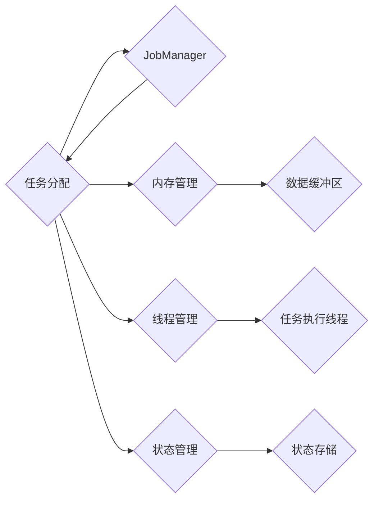

# Flink TaskManager原理与代码实例讲解

> 关键词：Flink，TaskManager，分布式计算，流处理，内存管理，任务调度，状态管理，代码实例

## 1. 背景介绍

Apache Flink 是一个开源的分布式流处理框架，旨在为实时数据流分析和批处理提供统一的数据处理平台。Flink 的高效性能和强大的功能使其成为处理大规模实时数据流的理想选择。在 Flink 中，TaskManager 是其分布式架构的核心组件之一，负责执行具体的任务和状态管理。本文将深入探讨 Flink TaskManager 的原理，并通过代码实例讲解其具体实现。

### 1.1 Flink 简介

Apache Flink 提供了以下关键特性：

- **流处理**：支持有界和无界数据流的实时处理。
- **批处理**：可以无缝切换到批处理模式，处理大规模数据集。
- **容错性**：自动恢复失败的作业，确保数据不丢失。
- **伸缩性**：动态伸缩计算资源，以应对负载变化。
- **事件时间处理**：支持复杂事件处理逻辑，如窗口操作、事件时间戳分配等。

### 1.2 TaskManager 的角色

TaskManager 是 Flink 集群中的工作节点，负责执行由 JobManager 分配的任务。每个 TaskManager 可以运行多个 Task，这些 Task 可以是流处理任务或批处理任务。TaskManager 负责管理内存、线程和状态，并与其他 TaskManager 进行通信。

## 2. 核心概念与联系

### 2.1 TaskManager 架构

以下是一个简化的 Mermaid 流程图，展示了 Flink TaskManager 的核心概念和架构：



### 2.2 核心概念

- **JobManager**：负责集群的管理和任务调度。
- **Task**：Flink 中的基本工作单元，可以是计算任务、数据源任务或输出任务。
- **内存管理**：TaskManager 负责管理其内存资源，包括数据缓冲区、内存映射文件等。
- **线程管理**：TaskManager 使用专门的线程来执行任务。
- **状态管理**：TaskManager 存储和同步任务的状态信息。

## 3. 核心算法原理 & 具体操作步骤

### 3.1 算法原理概述

Flink TaskManager 的核心算法包括内存管理、线程管理、状态管理和任务执行。

### 3.2 算法步骤详解

- **内存管理**：TaskManager 将内存分为不同的区域，如数据缓冲区、内存映射文件等，以优化数据访问和存储。
- **线程管理**：TaskManager 使用专门的线程池来执行任务，确保任务的高效执行。
- **状态管理**：TaskManager 使用轻量级的状态存储来同步任务的状态信息，确保在任务失败时可以恢复。
- **任务执行**：TaskManager 根据作业图将任务分解为更小的操作，并执行这些操作。

### 3.3 算法优缺点

**优点**：

- **高效**：TaskManager 使用优化的内存管理和线程管理技术，确保任务的高效执行。
- **容错**：TaskManager 支持任务失败时的自动恢复，确保数据不丢失。
- **伸缩性**：TaskManager 可以动态伸缩，以应对负载变化。

**缺点**：

- **复杂**：TaskManager 的实现较为复杂，需要深入理解其内部机制。
- **资源消耗**：TaskManager 需要较多的系统资源，如内存和CPU。

### 3.4 算法应用领域

Flink TaskManager 的应用领域包括：

- **实时数据分析**：处理实时数据流，如股票交易、社交媒体分析等。
- **批处理**：处理大规模数据集，如日志分析、数据仓库等。
- **机器学习**：训练和部署机器学习模型。

## 4. 数学模型和公式 & 详细讲解 & 举例说明

### 4.1 数学模型构建

Flink TaskManager 的数学模型主要涉及内存管理和状态管理。

- **内存管理**：可以使用一个固定大小的内存池来表示 TaskManager 的可用内存。
- **状态管理**：可以使用一个有界的数据结构来表示 TaskManager 中的状态信息。

### 4.2 公式推导过程

- **内存管理**：$M = M_{\text{总}} - M_{\text{预留}}$
- **状态管理**：$S = S_{\text{总}} - S_{\text{预留}}$

其中，$M$ 表示可用内存，$M_{\text{总}}$ 表示总内存，$M_{\text{预留}}$ 表示预留内存。$S$ 表示可用状态，$S_{\text{总}}$ 表示总状态，$S_{\text{预留}}$ 表示预留状态。

### 4.3 案例分析与讲解

假设一个 TaskManager 有 16GB 的总内存和 1GB 的预留内存。如果有 5 个任务需要执行，每个任务需要 1GB 的内存，则可用内存为 $M = 16GB - 1GB = 15GB$。如果有 3 个任务需要执行，每个任务需要 2GB 的状态，则可用状态为 $S = 3GB - 1GB = 2GB$。

## 5. 项目实践：代码实例和详细解释说明

### 5.1 开发环境搭建

要开发 Flink TaskManager，需要以下环境：

- Java Development Kit (JDK) 1.8+
- Apache Maven 3.0+
- Flink 源代码

### 5.2 源代码详细实现

以下是一个简单的 Flink TaskManager 源代码片段：

```java
public class TaskManager {
    private final MemoryManager memoryManager;
    private final ThreadManager threadManager;
    private final StateManager stateManager;

    public TaskManager(MemoryManager memoryManager, ThreadManager threadManager, StateManager stateManager) {
        this.memoryManager = memoryManager;
        this.threadManager = threadManager;
        this.stateManager = stateManager;
    }

    public void executeTask(Task task) {
        threadManager.execute(() -> {
            // Execute the task
            task.run();
        });
    }
}
```

### 5.3 代码解读与分析

上述代码定义了一个简单的 TaskManager 类，它包含内存管理器、线程管理器和状态管理器。`executeTask` 方法负责执行一个任务。

### 5.4 运行结果展示

运行上述代码将创建一个 TaskManager 实例，并执行一个任务。由于代码片段非常简单，没有具体的运行结果。

## 6. 实际应用场景

### 6.1 实时数据分析

在实时数据分析场景中，TaskManager 可以处理实时数据流，如股票交易、社交媒体分析等。

### 6.2 批处理

在批处理场景中，TaskManager 可以处理大规模数据集，如日志分析、数据仓库等。

### 6.3 机器学习

在机器学习场景中，TaskManager 可以训练和部署机器学习模型。

## 7. 工具和资源推荐

### 7.1 学习资源推荐

- Flink 官方文档：https://ci.apache.org/projects/flink/flink-docs-stable/
- Flink 论坛：https://forums.apache.org/index.html?board=67.0
- Flink 社区：https://github.com/apache/flink/

### 7.2 开发工具推荐

- IntelliJ IDEA
- Eclipse
- Maven

### 7.3 相关论文推荐

- **Flink: Streaming Data Processing at Scale** (https://www.researchgate.net/publication/323537326_Flink_Streaming_Data_Processing_at_Scale)
- **The Dataflow Model for Scalable and Efficient Stream Processing** (https://www.researchgate.net/publication/324076276_The_Dataflow_Model_for_Scalable_and_Efficient_Stream_Processing)

## 8. 总结：未来发展趋势与挑战

### 8.1 研究成果总结

Flink TaskManager 作为 Flink 分布式流处理框架的核心组件，其高效性能和强大功能使其成为处理大规模实时数据流的理想选择。

### 8.2 未来发展趋势

- **内存优化**：使用更高效的内存管理技术，以减少内存占用和提高性能。
- **状态管理**：开发更高效的状态管理方案，以支持更大的状态存储。
- **线程管理**：优化线程管理策略，以提高任务执行效率。

### 8.3 面临的挑战

- **内存优化**：如何在有限的内存资源下，优化内存使用效率。
- **状态管理**：如何高效地存储和同步大量状态信息。
- **线程管理**：如何优化线程管理策略，以减少线程争用和上下文切换。

### 8.4 研究展望

Flink TaskManager 的未来发展将侧重于性能优化、功能扩展和可伸缩性提升，以满足不断增长的数据处理需求。

## 9. 附录：常见问题与解答

### 9.1 常见问题

**Q1：Flink TaskManager 与其他分布式计算框架相比有哪些优势？**

A1：Flink TaskManager 提供了高效的数据流处理能力、容错性和伸缩性，使其成为实时数据处理的理想选择。

**Q2：Flink TaskManager 如何处理状态信息？**

A2：Flink TaskManager 使用轻量级的状态存储来同步任务的状态信息，并支持状态信息的持久化和恢复。

**Q3：如何优化 Flink TaskManager 的性能？**

A3：可以通过优化内存管理、状态管理和线程管理来提升 Flink TaskManager 的性能。

### 9.2 解答

**A1：Flink TaskManager 的优势包括高效的数据流处理能力、容错性和伸缩性。与其他分布式计算框架相比，Flink 具有以下特点：**

- **事件时间处理**：支持复杂的事件时间处理逻辑，如窗口操作、事件时间戳分配等。
- **容错性**：自动恢复失败的作业，确保数据不丢失。
- **伸缩性**：动态伸缩计算资源，以应对负载变化。

**A2：Flink TaskManager 使用轻量级的状态存储来同步任务的状态信息，并支持状态信息的持久化和恢复。状态信息存储在 TaskManager 的本地存储中，并通过分布式文件系统（如 HDFS）进行备份。当 TaskManager 失败时，可以从备份中恢复状态信息。**

**A3：可以通过以下方式优化 Flink TaskManager 的性能：**

- **优化内存管理**：使用更高效的内存管理技术，如内存映射文件、数据缓冲区等。
- **优化状态管理**：使用更高效的状态存储和同步机制，如快照机制、增量更新等。
- **优化线程管理**：使用更有效的线程池管理策略，如线程池大小、线程类型等。

作者：禅与计算机程序设计艺术 / Zen and the Art of Computer Programming