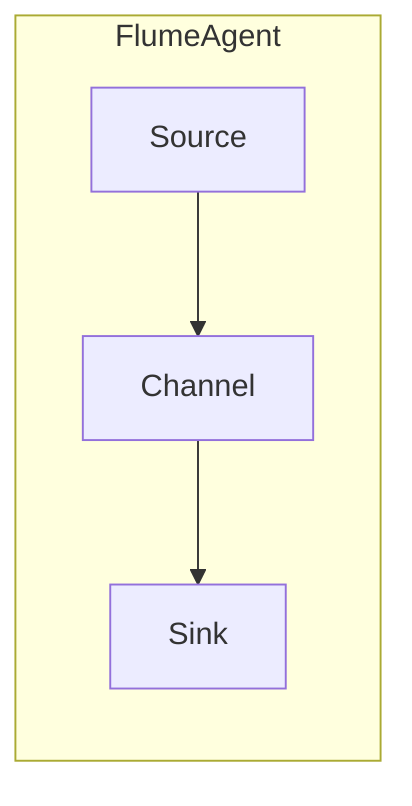

# Flume Source原理与代码实例讲解

> 关键词：Flume, 数据采集, Source, Apache, 数据流, 代码实例, 实时处理, Hadoop

## 1. 背景介绍

Apache Flume 是一个分布式、可靠且可扩展的数据收集系统，用于有效地收集、聚合、移动和存储大量日志数据。Flume 的核心组件之一是 Source，它负责从数据源（如文件、网络、JMS等）收集数据并将其传递到Flume的事件通道中，最终流入Sink，如HDFS、HBase或Kafka等。

在数据采集和传输领域，Flume因其灵活性和可靠性而备受青睐。本文将深入探讨Flume Source的原理，并通过代码实例展示如何实现自定义Source。

## 2. 核心概念与联系

### 2.1 Flume架构

Flume的架构由三个核心组件组成：Source、Channel和Sink。

- **Source**：负责从数据源读取数据，如FlumeAgent、JMS、Thrift等。
- **Channel**：作为Source和Sink之间的缓冲区，用于临时存储事件。
- **Sink**：将事件从Channel传输到目标系统，如HDFS、HBase、Kafka等。

以下是一个Flume架构的Mermaid流程图：



### 2.2 Flume Source类型

Flume支持多种Source类型，包括：

- **ExecSource**：执行外部命令，如shell脚本。
- **SpoolingDirectorySource**：监控文件系统中的目录，文件写入时触发事件。
- **SyslogSource**：监听Syslog消息。
- **NetcatSource**：监听网络套接字。
- **JMSSource**：从JMS消息队列接收消息。

## 3. 核心算法原理 & 具体操作步骤

### 3.1 算法原理概述

Flume Source的核心原理是监听数据源，当检测到数据变化时，读取数据并封装成事件（Event），然后将其放入Channel中。

### 3.2 算法步骤详解

1. **监听数据源**：Source根据配置的监听策略（如轮询、触发等）监听数据源。
2. **读取数据**：当检测到数据变化时，读取数据并将其封装成事件。
3. **封装事件**：事件包含数据本身以及一些元数据，如时间戳、事件ID等。
4. **事件传递**：将事件放入Channel中。
5. **事件传输**：当Sink请求数据时，从Channel中取出事件并传递给Sink。

### 3.3 算法优缺点

#### 优点

- **可靠性**：Flume的高可靠性确保数据不会丢失。
- **可扩展性**：Flume支持水平扩展，可以处理大量数据。
- **灵活性**：Flume支持多种数据源和目标系统。

#### 缺点

- **资源消耗**：Flume的监控和数据处理可能会消耗一定的系统资源。
- **复杂性**：Flume的配置相对复杂，需要一定的学习成本。

### 3.4 算法应用领域

- **日志收集**：收集来自Web服务器、数据库等系统的日志。
- **事件监控**：监控网络流量、系统性能等。
- **数据聚合**：将来自不同源的数据聚合到一起。

## 4. 数学模型和公式 & 详细讲解 & 举例说明

### 4.1 数学模型构建

Flume Source的数学模型可以简化为以下流程：

$$
\text{数据源} \rightarrow \text{Source} \rightarrow \text{Channel} \rightarrow \text{Sink} \rightarrow \text{目标系统}
$$

### 4.2 公式推导过程

由于Flume Source主要涉及数据处理和传输，数学公式相对较少。以下是一个简单的例子：

- **事件大小**：$ S = \sum_{i=1}^{n} \text{size}(e_i) $
  - 其中 $ S $ 是事件的总大小，$ e_i $ 是事件 $ i $ 的大小。

### 4.3 案例分析与讲解

以下是一个简单的Flume Source代码实例，用于监控文件系统中的文件变化：

```java
package org.apache.flume.source;

import org.apache.flume.Context;
import org.apache.flume.Event;
import org.apache.flume.EventDrivenSource;
import org.apache.flume.channel.ChannelProcessor;
import org.apache.flume.conf.Configurable;
import org.apache.flume.event.EventBuilder;

import java.io.File;
import java.nio.file.Files;
import java.nio.file.Paths;
import java.nio.file.StandardWatchEventKinds;
import java.nio.file.WatchKey;
import java.nio.file.WatchService;

public class FileTailSource extends AbstractSource implements EventDrivenSource, Configurable {
    private String directory;
    private WatchService watchService;
    private WatchKey watchKey;

    @Override
    public void configure(Context context) {
        directory = context.getString("directory");
        try {
            watchService = FileSystems.getDefault().newWatchService();
            watchKey = new File(directory).toPath().register(watchService, StandardWatchEventKinds.ENTRY_MODIFY);
        } catch (IOException e) {
            e.printStackTrace();
        }
    }

    @Override
    public void start() {
        super.start();
        Thread thread = new Thread(this::processEvents);
        thread.start();
    }

    @Override
    public void stop() {
        super.stop();
        try {
            if (watchKey != null) {
                watchKey.cancel();
            }
            if (watchService != null) {
                watchService.close();
            }
        } catch (IOException e) {
            e.printStackTrace();
        }
    }

    private void processEvents() {
        try {
            while (true) {
                WatchKey key = watchService.take();
                for (WatchEvent<Path> event : key.pollEvents()) {
                    Path path = event.context();
                    if (Files.isRegularFile(path)) {
                        Event flumeEvent = EventBuilder.withBody(path.toString().getBytes());
                        channel.put(flumeEvent);
                    }
                }
                key.reset();
            }
        } catch (InterruptedException | IOException e) {
            e.printStackTrace();
        }
    }
}
```

这段代码创建了一个监控指定目录下文件变化的Source。当检测到文件变化时，会将文件路径封装成Flume事件，并将其放入Channel中。

## 5. 项目实践：代码实例和详细解释说明

### 5.1 开发环境搭建

为了运行Flume Source代码实例，你需要以下开发环境：

- Java 1.8或更高版本
- Maven 3.0或更高版本
- Apache Flume 1.9或更高版本

### 5.2 源代码详细实现

上述提供的代码实现了一个简单的文件监控Source，当检测到文件变化时，会将文件路径封装成Flume事件。

### 5.3 代码解读与分析

- **配置**：通过`configure`方法读取配置文件中的目录路径。
- **启动**：在`start`方法中启动一个线程，用于处理文件变化事件。
- **处理事件**：在`processEvents`方法中，使用`WatchService`监控文件变化，并将文件路径封装成Flume事件。

### 5.4 运行结果展示

要运行此代码实例，你需要创建一个Flume配置文件，指定Source、Channel和Sink。以下是一个简单的配置文件示例：

```xml
<configuration>
    <agent>
        <name>FileTailSourceAgent</name>
        <sources>
            <source>
                <type>FileTailSource</type>
                <channels>
                    <channel>
                        <type>MemoryChannel</type>
                        <capacity>100</capacity>
                        <transactionCapacity>10</transactionCapacity>
                    </channel>
                </channels>
                <sink>
                    <type>LogSink</type>
                </sink>
            </source>
        </sources>
        <channels>
            <channel>
                <type>MemoryChannel</type>
                <name>fileTailChannel</name>
                <capacity>100</capacity>
                <transactionCapacity>10</transactionCapacity>
            </channel>
        </channels>
        <sinks>
            <sink>
                <type>LogSink</type>
                <channel>fileTailChannel</channel>
            </sink>
        </sinks>
    </agent>
</configuration>
```

运行Flume Agent，并修改配置文件中的目录路径，即可启动文件监控Source。

## 6. 实际应用场景

Flume Source在实际应用中非常灵活，以下是一些常见的应用场景：

- **日志收集**：从Web服务器、数据库等系统收集日志数据。
- **系统监控**：监控网络流量、系统性能等。
- **实时分析**：实时处理和分析数据流。

## 7. 工具和资源推荐

### 7.1 学习资源推荐

- Apache Flume官方文档：[https://flume.apache.org/releases.html](https://flume.apache.org/releases.html)
- Apache Flume用户邮件列表：[https://lists.apache.org/list.html?list=flume-user](https://lists.apache.org/list.html?list=flume-user)
- 《Flume权威指南》

### 7.2 开发工具推荐

- Maven：[https://maven.apache.org/](https://maven.apache.org/)
- IntelliJ IDEA：[https://www.jetbrains.com/idea/](https://www.jetbrains.com/idea/)

### 7.3 相关论文推荐

- Apache Flume官方文档中提供的相关论文

## 8. 总结：未来发展趋势与挑战

### 8.1 研究成果总结

本文深入探讨了Flume Source的原理和代码实例，展示了如何实现自定义Source。Flume Source在数据采集和传输领域具有广泛的应用，是Flume架构中不可或缺的组件。

### 8.2 未来发展趋势

随着大数据技术的发展，Flume Source将会朝着以下方向发展：

- 支持更多类型的数据源。
- 提供更丰富的配置选项。
- 增强Source的可扩展性和可靠性。

### 8.3 面临的挑战

Flume Source在未来的发展中将面临以下挑战：

- 处理更复杂的数据源。
- 提高Source的效率和性能。
- 增强Source的可扩展性和可靠性。

### 8.4 研究展望

随着大数据技术的不断进步，Flume Source将会在数据采集和传输领域发挥更大的作用。未来，Flume Source的研究将朝着更高效、更可靠、更灵活的方向发展。

## 9. 附录：常见问题与解答

**Q1：Flume Source可以处理哪些类型的数据源？**

A: Flume Source可以处理多种类型的数据源，包括文件系统、网络套接字、JMS消息队列等。

**Q2：如何实现自定义Flume Source？**

A: 实现自定义Flume Source需要扩展`AbstractSource`类，并实现`configure`、`start`、`stop`和`processEvents`等接口。

**Q3：Flume Source的性能如何？**

A: Flume Source的性能取决于数据源的类型、系统资源等因素。一般来说，Flume Source可以高效地处理大量数据。

**Q4：Flume Source是否支持并行处理？**

A: Flume支持并行处理，可以通过配置多个Source实例来实现。

**Q5：如何提高Flume Source的性能？**

A: 提高Flume Source的性能可以通过以下方法实现：

- 选择合适的Source类型。
- 优化配置选项。
- 增加系统资源。

作者：禅与计算机程序设计艺术 / Zen and the Art of Computer Programming