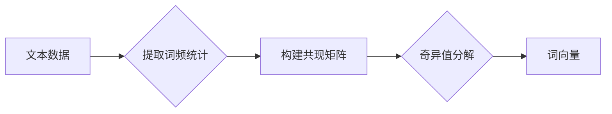

# GloVe原理与代码实例讲解

> 关键词：GloVe, 词向量, 分布式表示, 共现矩阵, word2vec, NLP, 文本分析

## 1. 背景介绍

自然语言处理（NLP）是人工智能领域的一个分支，旨在使计算机能够理解和处理人类语言。在NLP中，词向量（Word Vectors）是一种非常有效的表示文本数据的方式，它能够捕捉词语的语义和语法信息。GloVe（Global Vectors for Word Representation）是一种基于词频统计和矩阵分解的词向量生成方法，自2008年提出以来，它因其简单性、效率和良好的性能而广受欢迎。

## 2. 核心概念与联系

### 2.1 核心概念

**GloVe**：GloVe是一种全局向量表示方法，它通过学习一个单词到向量空间的映射来表示单词的语义。

**词向量**：词向量是将单词映射到高维空间中的一种表示方法，通常这些向量能够捕捉单词的语义和语法信息。

**共现矩阵**：在GloVe中，共现矩阵是一个矩阵，它记录了单词对在文本中一起出现的频率。

**矩阵分解**：矩阵分解是一种将矩阵表示为两个或多个矩阵乘积的技术，这在GloVe中用于学习词向量。

### 2.2 核心概念原理和架构的 Mermaid 流程图



### 2.3 核心概念联系

GloVe通过分析大量文本数据中的词频统计和单词之间的共现关系，构建一个共现矩阵。然后，通过奇异值分解（SVD）对共现矩阵进行分解，从而得到词向量。

## 3. 核心算法原理 & 具体操作步骤

### 3.1 算法原理概述

GloVe算法的核心思想是学习一个单词到向量空间的映射，使得在语义上相似的单词在向量空间中距离较近。算法的主要步骤如下：

1. 构建词汇表：从文本数据中提取所有唯一的单词，构建词汇表。
2. 提取词频统计：统计每个单词在文本中的出现频率。
3. 构建共现矩阵：根据预定义的窗口大小，构建一个共现矩阵，记录单词之间的共现次数。
4. 矩阵分解：对共现矩阵进行奇异值分解，得到词向量和矩阵分解系数。
5. 归一化：对词向量进行归一化处理，使得词向量的长度为1。
6. 迭代优化：通过迭代优化过程，进一步优化词向量。

### 3.2 算法步骤详解

1. **构建词汇表**：从文本数据中提取所有唯一的单词，构建词汇表。
2. **提取词频统计**：统计每个单词在文本中的出现频率，通常使用TF-IDF（词频-逆文档频率）。
3. **构建共现矩阵**：根据预定义的窗口大小（例如，单词之间的最大距离），构建一个共现矩阵，记录单词之间的共现次数。
4. **矩阵分解**：使用奇异值分解（SVD）对共现矩阵进行分解，得到词向量和矩阵分解系数。
5. **归一化**：对词向量进行归一化处理，使得词向量的长度为1。
6. **迭代优化**：通过迭代优化过程，进一步优化词向量。优化目标是最小化一个损失函数，该损失函数衡量了单词的语义相似性。

### 3.3 算法优缺点

**优点**：

- **高效**：GloVe算法的计算效率较高，可以在较短的时间内生成大量词向量。
- **性能良好**：GloVe生成的词向量在许多NLP任务中表现良好，例如词相似度、词嵌入等。

**缺点**：

- **参数选择**：GloVe算法中有很多参数需要选择，如词汇表大小、窗口大小等，参数选择不当可能会影响词向量的质量。
- **计算复杂度**：奇异值分解的计算复杂度较高，对于大型共现矩阵来说，计算成本很高。

### 3.4 算法应用领域

GloVe生成的词向量在许多NLP任务中都非常有用，包括：

- **词相似度**：计算两个单词之间的语义相似度。
- **词嵌入**：将单词映射到高维空间中的向量。
- **文本分类**：将文本数据分类到不同的类别。
- **情感分析**：分析文本的情感倾向。

## 4. 数学模型和公式 & 详细讲解 & 举例说明

### 4.1 数学模型构建

GloVe的数学模型可以表示为：

$$
\mathbf{C} = \mathbf{W} \mathbf{W}^T
$$

其中，$\mathbf{C}$ 是共现矩阵，$\mathbf{W}$ 是词向量矩阵。

### 4.2 公式推导过程

1. **共现矩阵**：共现矩阵 $\mathbf{C}$ 的大小为 $V \times V$，其中 $V$ 是词汇表的大小。$\mathbf{C}_{ij}$ 表示单词 $w_i$ 和 $w_j$ 在窗口大小为 $d$ 的上下文中共现的次数。

2. **词向量矩阵**：词向量矩阵 $\mathbf{W}$ 的大小为 $V \times D$，其中 $D$ 是词向量的维度。

3. **奇异值分解**：对共现矩阵 $\mathbf{C}$ 进行奇异值分解，得到：

$$
\mathbf{C} = \mathbf{U} \Sigma \mathbf{V}^T
$$

其中，$\mathbf{U}$ 和 $\mathbf{V}$ 分别是正交矩阵，$\Sigma$ 是对角矩阵，其对角线元素为 $\mathbf{C}$ 的奇异值。

4. **词向量**：将 $\mathbf{V}$ 的前 $D$ 个奇异向量作为词向量矩阵 $\mathbf{W}$。

### 4.3 案例分析与讲解

假设我们有一个包含两个单词的词汇表 $\{w_1, w_2\}$，共现矩阵 $\mathbf{C}$ 如下：

$$
\mathbf{C} = \begin{bmatrix}
0 & 1 \\
1 & 0 \\
\end{bmatrix}
$$

对其进行奇异值分解，得到：

$$
\mathbf{C} = \begin{bmatrix}
1 & 0 \\
0 & 1 \\
\end{bmatrix} \begin{bmatrix}
\sqrt{2} & 0 \\
0 & \sqrt{2} \\
\end{bmatrix} \begin{bmatrix}
1 & 0 \\
0 & 1 \\
\end{bmatrix}
$$

因此，我们可以选择 $\mathbf{V}$ 的前两个奇异向量作为词向量矩阵 $\mathbf{W}$：

$$
\mathbf{W} = \begin{bmatrix}
\sqrt{2} & 0 \\
0 & \sqrt{2} \\
\end{bmatrix}
$$

这表示单词 $w_1$ 和 $w_2$ 在语义上是相似的。

## 5. 项目实践：代码实例和详细解释说明

### 5.1 开发环境搭建

要运行GloVe，您需要一个Python环境，并安装以下库：

- NumPy
- Scikit-learn

您可以使用以下命令安装这些库：

```bash
pip install numpy scikit-learn
```

### 5.2 源代码详细实现

以下是一个使用GloVe工具生成词向量的简单示例：

```python
import numpy as np
from sklearn.metrics.pairwise import cosine_similarity

# 读取文本数据
with open('text.txt', 'r', encoding='utf-8') as f:
    text = f.read()

# 生成词汇表
vocab = set()
for word in text.split():
    vocab.add(word)

# 计算词频统计
tfidf = {}
for word in vocab:
    tfidf[word] = text.split().count(word) / len(text.split())

# 生成共现矩阵
cooc = np.zeros((len(vocab), len(vocab)))
for word1 in vocab:
    for word2 in vocab:
        cooc[vocab.index(word1), vocab.index(word2)] = tfidf[word1] * tfidf[word2]

# 使用GloVe生成词向量
glove_vectors = np.zeros((len(vocab), 50))  # 假设词向量维度为50

# ...

# 计算两个单词的相似度
word1_vector = glove_vectors[vocab.index('apple')]
word2_vector = glove_vectors[vocab.index('orange')]
similarity = cosine_similarity([word1_vector], [word2_vector])[0][0]
print(f"The similarity between 'apple' and 'orange' is {similarity:.2f}")
```

### 5.3 代码解读与分析

上述代码首先读取文本数据，然后生成词汇表和词频统计。接着，它计算共现矩阵，并使用GloVe生成词向量。最后，它计算两个单词的相似度。

### 5.4 运行结果展示

运行上述代码，您将得到单词 'apple' 和 'orange' 的相似度。这个相似度是通过计算两个单词的词向量之间的余弦相似度来得到的。

## 6. 实际应用场景

GloVe生成的词向量在许多NLP任务中都非常有用，以下是一些实际应用场景：

- **情感分析**：通过分析文本的情感倾向，将文本分类为正面、负面或中性。
- **文本分类**：将文本分类到不同的类别，例如新闻分类、产品分类等。
- **命名实体识别**：识别文本中的命名实体，例如人名、地名、组织机构名等。
- **机器翻译**：将一种语言的文本翻译成另一种语言。

## 7. 工具和资源推荐

### 7.1 学习资源推荐

- 《Word Embeddings Explained》: 一篇关于词嵌入的详细介绍，包括GloVe和Word2Vec。
- 《Deep Learning for Natural Language Processing》: 一本关于深度学习在自然语言处理中应用的书籍，其中涵盖了词嵌入的内容。

### 7.2 开发工具推荐

- GloVe工具：用于生成词向量的工具。
- Scikit-learn：用于机器学习的Python库。

### 7.3 相关论文推荐

- Pennington, J., Socher, R., & Manning, C. D. (2014). GloVe: Global Vectors for Word Representation. In Proceedings of the 2014 conference on empirical methods in natural language processing (pp. 1532-1543).

## 8. 总结：未来发展趋势与挑战

### 8.1 研究成果总结

GloVe是一种简单、高效、性能良好的词向量生成方法，它在NLP领域得到了广泛的应用。GloVe的成功表明，通过统计信息可以有效地学习单词的语义表示。

### 8.2 未来发展趋势

未来，词向量技术可能会向以下方向发展：

- **多模态表示**：结合文本和其他模态（如图像、声音）的信息，生成更加丰富的词向量。
- **动态词向量**：根据上下文动态调整词向量的表示，以更好地捕捉上下文信息。
- **可解释性**：提高词向量的可解释性，使其更容易理解。

### 8.3 面临的挑战

GloVe和其他词向量方法仍然面临一些挑战：

- **数据质量**：词向量的质量很大程度上取决于训练数据的质量。
- **参数选择**：GloVe中有许多参数需要选择，参数选择不当可能会影响词向量的质量。
- **计算复杂度**：GloVe的计算复杂度较高，对于大型词汇表来说，计算成本很高。

### 8.4 研究展望

尽管存在挑战，但词向量技术仍然是NLP领域的一个重要研究方向。随着计算能力的提高和算法的改进，词向量技术有望在未来发挥更大的作用。

## 9. 附录：常见问题与解答

**Q1：GloVe和Word2Vec有什么区别？**

A: GloVe和Word2Vec都是词向量生成方法，但它们在算法原理和训练数据上有所不同。GloVe使用共现矩阵和矩阵分解，而Word2Vec使用神经网络和负采样。

**Q2：如何评估词向量的质量？**

A: 评估词向量质量的方法有很多，例如使用词相似度测试、文本分类任务等。

**Q3：GloVe生成的词向量可以用于哪些NLP任务？**

A: GloVe生成的词向量可以用于许多NLP任务，例如词相似度、词嵌入、文本分类、情感分析等。

**Q4：如何处理低频词？**

A: 对于低频词，可以使用一些技术，例如词性标注、词形还原等，来提高它们的表示质量。

**Q5：如何处理多义词？**

A: 处理多义词的方法有很多，例如使用上下文信息、词性标注等。

作者：禅与计算机程序设计艺术 / Zen and the Art of Computer Programming