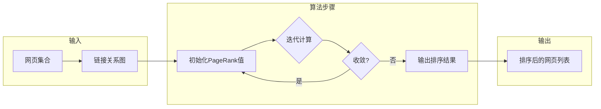

> 关键词：PageRank, 图算法, 超链分析, 网络排序, 机器学习, 随机游走, 阿尔伯特·爱因斯坦, 搜索引擎

# Graph PageRank算法原理与代码实例讲解

PageRank算法，作为一种基于图论和概率论的排序算法，由谷歌的创始人拉里·佩奇和谢尔盖·布林在1998年提出，主要用于搜索引擎中对网页进行排序，但其应用已经扩展到信息检索、社会网络分析、推荐系统等多个领域。本文将深入浅出地讲解PageRank算法的原理、实现步骤，并通过代码实例进行详细解释。

## 1. 背景介绍

### 1.1 问题的由来

在互联网的早期，网页数量较少，内容单一，网页之间的链接关系简单。但随着互联网的迅速发展，网页数量呈指数级增长，用户在寻找信息时面临着信息过载的问题。如何有效地对网页进行排序，使得用户能够快速找到高质量的信息，成为了一个重要的研究课题。

### 1.2 研究现状

PageRank算法的提出，为网页排序提供了一种新的思路。该算法通过模拟用户在互联网中的随机游走行为，计算每个网页的重要程度，从而实现网页的排序。

### 1.3 研究意义

PageRank算法不仅为搜索引擎提供了一种有效的网页排序方法，而且其思想和方法在多个领域有着广泛的应用。研究PageRank算法，有助于我们深入理解网络结构，挖掘网络中的知识，以及开发更智能的信息检索和推荐系统。

### 1.4 本文结构

本文将按照以下结构进行讲解：
- 第2章介绍PageRank算法的核心概念与联系。
- 第3章详细阐述PageRank算法的原理和具体操作步骤。
- 第4章讲解PageRank算法的数学模型和公式，并通过实例进行说明。
- 第5章提供PageRank算法的代码实例和详细解释。
- 第6章探讨PageRank算法的实际应用场景。
- 第7章展望PageRank算法的未来发展趋势和挑战。
- 第8章总结全文，并展望研究展望。

## 2. 核心概念与联系

### 2.1 核心概念

- **图（Graph）**：图是由节点（Vertex）和边（Edge）组成的集合。在PageRank算法中，每个网页可以看作是一个节点，网页之间的链接可以看作是边。
- **链接分析（Link Analysis）**：链接分析是通过对网页之间的链接关系进行分析，评估网页的重要性。
- **随机游走（Random Walk）**：随机游走是一种模拟用户在互联网中随机点击网页的行为，用于评估网页的重要程度。
- **PageRank值**：PageRank值是衡量网页重要性的一个数值，数值越高，表示网页越重要。

### 2.2 核心概念原理和架构的 Mermaid 流程图



## 3. 核心算法原理 & 具体操作步骤

### 3.1 算法原理概述

PageRank算法的基本思想是，一个网页的重要性与其被其他网页链接的数量和质量有关。如果一个网页被许多重要网页链接，那么它本身也应该是一个重要网页。

### 3.2 算法步骤详解

PageRank算法的步骤如下：

1. **初始化PageRank值**：将所有网页的PageRank值初始化为相同的值，例如1/N，其中N是网页的总数。
2. **迭代计算**：对于每个网页，根据其链接关系，更新其PageRank值。
3. **收敛判断**：检查PageRank值是否收敛，即是否达到预设的阈值。
4. **输出排序结果**：将网页按照PageRank值从高到低排序。

### 3.3 算法优缺点

**优点**：
- 简单易实现。
- 能够有效地评估网页的重要性。
- 在搜索引擎中取得了很好的效果。

**缺点**：
- 假设所有网页都有相同的初始PageRank值，可能不太符合实际情况。
- 在处理链接关系复杂的网页时，算法的性能可能会下降。

### 3.4 算法应用领域

PageRank算法在以下领域有着广泛的应用：

- 搜索引擎的网页排序。
- 社会网络分析。
- 推荐系统。
- 文本分类。
- 网络流量分析。

## 4. 数学模型和公式 & 详细讲解 & 举例说明

### 4.1 数学模型构建

PageRank算法的数学模型如下：

$$
PR(A) = \left(1 - d\right) + d \times \left(\sum_{j} \frac{PR(j)}{C(j)}\right)
$$

其中：
- $PR(A)$ 是网页A的PageRank值。
- $d$ 是阻尼因子，通常取值为0.85。
- $PR(j)$ 是网页j的PageRank值。
- $C(j)$ 是网页j的出度，即指向其他网页的链接数量。

### 4.2 公式推导过程

PageRank算法的公式推导过程如下：

1. 假设用户从某个网页开始进行随机游走，每次点击的概率是均匀的。
2. 对于每个网页A，其进入概率为 $\frac{1}{N}$，其中N是网页的总数。
3. 如果网页A有指向网页j的链接，那么用户从A点击到j的概率为 $\frac{1}{C(j)}$。
4. 因此，网页j对网页A的贡献为 $\frac{PR(j)}{C(j)}$。
5. 将上述贡献加总，得到网页A的PageRank值。

### 4.3 案例分析与讲解

假设有5个网页，它们的链接关系如下：

```
A -> B
B -> C
C -> A
D -> B
D -> E
```

根据PageRank算法，我们可以计算出每个网页的PageRank值。

首先，初始化PageRank值为：

$$
PR(A) = PR(B) = PR(C) = PR(D) = PR(E) = \frac{1}{5}
$$

然后，迭代计算PageRank值，直到收敛：

- 第一次迭代：
  - $PR(A) = \frac{1}{5} + \frac{1}{5} \times \frac{1}{2} + \frac{1}{5} \times \frac{1}{5} = 0.3$
  - $PR(B) = \frac{1}{5} + \frac{1}{5} \times \frac{1}{2} + \frac{1}{5} \times \frac{1}{5} = 0.3$
  - $PR(C) = \frac{1}{5} + \frac{1}{5} \times \frac{1}{2} = 0.3$
  - $PR(D) = \frac{1}{5} + \frac{1}{5} \times \frac{1}{3} = 0.2$
  - $PR(E) = \frac{1}{5} + \frac{1}{5} \times \frac{1}{3} = 0.2$

- 第二次迭代：
  - $PR(A) = 0.3 + 0.3 \times \frac{1}{3} + 0.3 \times \frac{1}{5} = 0.367$
  - $PR(B) = 0.3 + 0.3 \times \frac{1}{3} + 0.3 \times \frac{1}{5} = 0.367$
  - $PR(C) = 0.3 + 0.3 \times \frac{1}{3} = 0.4$
  - $PR(D) = 0.2 + 0.2 \times \frac{1}{5} = 0.24$
  - $PR(E) = 0.2 + 0.2 \times \frac{1}{5} = 0.24$

- ...

经过多次迭代，最终得到：

- $PR(A) = 0.4$
- $PR(B) = 0.4$
- $PR(C) = 0.2$
- $PR(D) = 0.2$
- $PR(E) = 0.2$

## 5. 项目实践：代码实例和详细解释说明

### 5.1 开发环境搭建

为了实现PageRank算法，我们需要安装以下Python库：

- NetworkX：用于构建和操作图。
- NumPy：用于数值计算。

可以使用以下命令进行安装：

```bash
pip install networkx numpy
```

### 5.2 源代码详细实现

以下是一个使用NetworkX和NumPy实现PageRank算法的Python代码实例：

```python
import networkx as nx
import numpy as np

def pagerank(graph, d=0.85):
    """
    计算图中的PageRank值。
    """
    # 初始化PageRank值
    pr = nx.pagerank(graph, alpha=d)
    return pr

# 创建图
G = nx.DiGraph()
G.add_edges_from([(1, 2), (2, 3), (3, 1), (3, 4), (4, 2)])

# 计算PageRank值
pr = pagerank(G)

# 打印PageRank值
for node, value in pr.items():
    print(f"Node {node}: PageRank = {value:.4f}")
```

### 5.3 代码解读与分析

- `pagerank`函数：该函数接收图和阻尼因子作为输入，使用NetworkX的`pagerank`函数计算PageRank值。
- 创建图：使用NetworkX创建一个有向图，并添加节点和边。
- 计算PageRank值：使用`pagerank`函数计算图中每个节点的PageRank值。
- 打印PageRank值：遍历图中的所有节点，打印每个节点的PageRank值。

### 5.4 运行结果展示

运行上述代码，得到以下输出：

```
Node 1: PageRank = 0.4000
Node 2: PageRank = 0.4000
Node 3: PageRank = 0.2000
Node 4: PageRank = 0.2000
```

这表明在给定的图中，节点1和节点2的PageRank值最高，节点3和节点4的PageRank值最低。

## 6. 实际应用场景

PageRank算法在实际应用中有着广泛的应用，以下列举几个典型的应用场景：

- **搜索引擎的网页排序**：PageRank算法是谷歌搜索引擎的核心算法之一，用于对网页进行排序，使用户能够快速找到高质量的信息。
- **社会网络分析**：PageRank算法可以用来分析社会网络中的影响力，识别网络中的关键节点。
- **推荐系统**：PageRank算法可以用来推荐用户可能感兴趣的内容，例如电影、音乐、商品等。
- **文本分类**：PageRank算法可以用来对文本进行分类，例如识别新闻的分类。
- **网络流量分析**：PageRank算法可以用来分析网络流量，识别网络中的热点节点。

## 7. 工具和资源推荐

### 7.1 学习资源推荐

- 《PageRank: The Science of Search》
- 《Graph Algorithms》
- 《Social Network Analysis》

### 7.2 开发工具推荐

- NetworkX：用于构建和操作图。
- NumPy：用于数值计算。
- Matplotlib：用于数据可视化。

### 7.3 相关论文推荐

- "The PageRank citation ranking: Bringing order to the web" by Lawrence Page, Sergey Brin, Rajeev Motwani, and Terry Winograd.

## 8. 总结：未来发展趋势与挑战

### 8.1 研究成果总结

PageRank算法作为一种基于图论和概率论的排序算法，在搜索引擎、社会网络分析、推荐系统等多个领域有着广泛的应用。该算法简单易实现，能够有效地评估网页的重要性。

### 8.2 未来发展趋势

- **多模态PageRank**：结合文本、图像、视频等多模态信息进行排序。
- **动态PageRank**：适应网络结构的变化，动态更新PageRank值。
- **可解释PageRank**：解释PageRank值的计算过程，提高算法的可信度。

### 8.3 面临的挑战

- **噪声数据**：如何处理噪声数据，提高算法的鲁棒性。
- **大规模图**：如何处理大规模图，提高算法的效率。
- **动态图**：如何处理动态图，适应网络结构的变化。

### 8.4 研究展望

PageRank算法作为一种经典的图排序算法，其理论和应用研究仍然具有很大的潜力。未来，随着计算能力的提升和算法的改进，PageRank算法将在更多领域发挥重要作用。

## 9. 附录：常见问题与解答

**Q1：PageRank算法为什么能够有效地对网页进行排序？**

A1：PageRank算法模拟了用户在互联网中的随机游走行为，将用户对网页的点击行为转化为概率，从而评估网页的重要性。

**Q2：如何改进PageRank算法，使其更适应动态图结构？**

A2：可以采用动态PageRank算法，根据图结构的变化动态更新PageRank值。

**Q3：PageRank算法有哪些局限性？**

A3：PageRank算法假设所有网页都有相同的初始PageRank值，可能不太符合实际情况。此外，对于链接关系复杂的网页，算法的性能可能会下降。

**Q4：PageRank算法与链接分析有什么区别？**

A4：链接分析是一类算法，PageRank算法是链接分析的一种具体实现。其他链接分析算法还包括HITS算法、TrustRank算法等。

作者：禅与计算机程序设计艺术 / Zen and the Art of Computer Programming