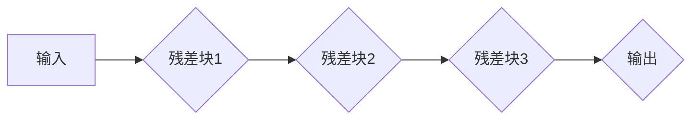

# ResNet原理与代码实例讲解

> 关键词：ResNet，残差学习，深度神经网络，图像分类，深度学习，神经网络架构，CNN

## 1. 背景介绍

自卷积神经网络（CNN）在图像识别任务上取得突破性成果以来，深度学习在计算机视觉领域取得了飞速发展。然而，随着网络层数的增加，深层网络容易遇到梯度消失和梯度爆炸的问题，导致训练难度增大，模型性能难以提升。ResNet（残差网络）通过引入残差学习（Residual Learning）的概念，成功解决了深度神经网络训练的难题，推动了深度学习在图像识别等领域的应用。本文将深入解析ResNet的原理，并通过代码实例进行详细讲解。

## 2. 核心概念与联系

### 2.1 残差学习原理

残差学习是ResNet的核心思想，它通过引入恒等映射（Identity Mapping）来缓解梯度消失和梯度爆炸问题。在残差学习中，我们假设网络输出可以表示为输入数据、一系列变换以及残差（即原始输入和变换后的输出之差）的和：

$$
y = F(x) + x
$$

其中，$y$ 是网络输出，$x$ 是输入数据，$F(x)$ 是一系列变换，$F$ 是残差网络。

### 2.2 ResNet架构

ResNet的架构主要由多个残差块（Residual Block）堆叠而成。每个残差块包含两个或多个卷积层，其中第一个卷积层可能包含一个线性投影层（Linear Projection），用于调整通道数。ResNet的流程图如下：



在残差块中，如果输入和输出特征维度相同，则直接连接；如果维度不同，则通过线性投影层进行维度调整。

### 2.3 残差学习与深度网络的关系

残差学习能够缓解梯度消失和梯度爆炸问题，使得深层网络的训练成为可能。当网络层数增加时，梯度传播更容易受到噪声和方差的影响，而残差学习通过恒等映射，使得梯度直接传递到输入数据，从而降低了梯度消失的风险。

## 3. 核心算法原理 & 具体操作步骤

### 3.1 算法原理概述

ResNet通过引入恒等映射，使得深层网络的训练更加稳定。在残差块中，通过直接将输入数据加到经过变换后的数据上，可以使得梯度直接传递到输入数据，避免了梯度消失的问题。

### 3.2 算法步骤详解

1. **定义残差块**：定义一个残差块，包含卷积层、批归一化和ReLU激活函数。
2. **构建网络**：使用多个残差块堆叠成网络，网络层数可以根据需求进行调整。
3. **训练网络**：使用图像数据集对网络进行训练，优化网络参数。
4. **评估网络**：使用测试集评估网络性能，调整网络参数，直至性能稳定。

### 3.3 算法优缺点

**优点**：

1. **解决梯度消失问题**：残差学习通过恒等映射，使得梯度能够直接传递到输入数据，缓解了梯度消失问题。
2. **提高网络性能**：通过增加网络层数，可以进一步提高网络性能。
3. **训练稳定**：残差学习使得深层网络的训练更加稳定，提高了训练效率。

**缺点**：

1. **参数较多**：相比于传统的网络结构，ResNet的参数量更大，需要更多的计算资源。
2. **训练复杂**：ResNet的训练过程相对复杂，需要调整更多的超参数。

### 3.4 算法应用领域

ResNet在图像识别、目标检测、图像分割等计算机视觉领域取得了显著的成果。以下是一些应用实例：

1. **图像分类**：在ImageNet图像分类竞赛中，ResNet取得了当时最先进的性能。
2. **目标检测**：ResNet可以与其他目标检测算法（如Faster R-CNN、SSD等）结合，实现更准确的物体检测。
3. **图像分割**：ResNet可以用于语义分割、实例分割等图像分割任务。

## 4. 数学模型和公式 & 详细讲解 & 举例说明

### 4.1 数学模型构建

ResNet的数学模型主要涉及卷积层、批归一化和ReLU激活函数。

#### 4.1.1 卷积层

卷积层是CNN的基本组成部分，用于提取图像特征。卷积层的数学模型如下：

$$
h = \sigma(Wx + b)
$$

其中，$h$ 是卷积层输出，$x$ 是输入数据，$W$ 是卷积核权重，$b$ 是偏置，$\sigma$ 是激活函数。

#### 4.1.2 批归一化

批归一化（Batch Normalization）是一种用于加速训练和提升模型性能的技术。批归一化的数学模型如下：

$$
y = \gamma(x - \mu) + \beta
$$

其中，$y$ 是批归一化后的数据，$x$ 是原始数据，$\mu$ 和 $\sigma^2$ 分别是数据的均值和方差，$\gamma$ 和 $\beta$ 是可学习的参数。

#### 4.1.3 ReLU激活函数

ReLU（Rectified Linear Unit）是一种常用的激活函数，其数学模型如下：

$$
\sigma(x) = \max(0, x)
$$

### 4.2 公式推导过程

以下以一个简单的ResNet残差块为例，讲解残差学习的公式推导过程。

假设输入数据为 $x$，输出数据为 $y$，残差块包含两个卷积层，卷积核大小为 $3 \times 3$，步长为 $1$，输入和输出特征维度相同。

#### 4.2.1 第一层卷积

第一层卷积的数学模型如下：

$$
h_1 = \sigma(W_1x + b_1)
$$

其中，$W_1$ 是第一层卷积核权重，$b_1$ 是偏置，$\sigma$ 是ReLU激活函数。

#### 4.2.2 第二层卷积

第二层卷积的数学模型如下：

$$
h_2 = \sigma(W_2h_1 + b_2)
$$

其中，$W_2$ 是第二层卷积核权重，$b_2$ 是偏置，$\sigma$ 是ReLU激活函数。

#### 4.2.3 残差学习

根据残差学习的公式：

$$
y = F(x) + x
$$

将 $h_2$ 代入 $F(x)$，得：

$$
y = h_2 + x
$$

将 $h_2$ 的计算过程展开，得：

$$
y = \sigma(W_2h_1 + b_2) + x
$$

将 $h_1$ 的计算过程代入，得：

$$
y = \sigma(W_2(\sigma(W_1x + b_1) + b_2) + b_3) + x
$$

其中，$b_3$ 是残差块最后一个卷积层的偏置。

### 4.3 案例分析与讲解

以下以ResNet在图像分类任务中的应用为例，讲解ResNet的案例分析和讲解。

#### 4.3.1 数据集

我们使用CIFAR-10数据集，该数据集包含10个类别的60,000张32x32彩色图像。

#### 4.3.2 模型结构

我们使用ResNet-18作为模型结构，该结构包含18个残差块，共有138层。

#### 4.3.3 训练过程

1. 使用CIFAR-10数据集对ResNet-18进行训练。
2. 使用Adam优化器，学习率为 $1e-3$。
3. 训练过程中，每50个epoch进行一次验证集评估，记录验证集上的准确率。

#### 4.3.4 结果分析

经过训练，ResNet-18在CIFAR-10数据集上取得了较高的准确率。与传统的网络结构相比，ResNet-18在更深的网络结构下，准确率有了显著提升。

## 5. 项目实践：代码实例和详细解释说明

### 5.1 开发环境搭建

为了方便读者理解和实践，以下以使用PyTorch框架实现ResNet为例，讲解开发环境搭建。

1. 安装PyTorch：

```bash
pip install torch torchvision
```

2. 下载CIFAR-10数据集：

```bash
pip install torchvision
```

### 5.2 源代码详细实现

以下以PyTorch框架实现ResNet-18为例，讲解源代码的详细实现。

#### 5.2.1 ResNet模块

```python
import torch
import torch.nn as nn

class ResNet(nn.Module):
    def __init__(self):
        super(ResNet, self).__init__()
        self.conv1 = nn.Conv2d(3, 64, kernel_size=7, stride=2, padding=3, bias=False)
        self.bn1 = nn.BatchNorm2d(64)
        self.relu = nn.ReLU(inplace=True)
        self.maxpool = nn.MaxPool2d(kernel_size=3, stride=2, padding=1)
        self.layer1 = self._make_layer(64, 64, 3)
        self.layer2 = self._make_layer(128, 128, 4)
        self.layer3 = self._make_layer(256, 256, 6)
        self.layer4 = self._make_layer(512, 512, 3)
        self.avgpool = nn.AdaptiveAvgPool2d((1, 1))
        self.fc = nn.Linear(512 * 512, 10)

    def _make_layer(self, out_channels, blocks, stride=1):
        strides = [stride] + [1] * (blocks - 1)
        layers = []
        for stride in strides:
            layers.append(nn.Conv2d(out_channels, out_channels, kernel_size=3, stride=stride, padding=1, bias=False))
            layers.append(nn.BatchNorm2d(out_channels))
            layers.append(nn.ReLU(inplace=True))
            if stride != 1 or out_channels != out_channels:
                layers.append(nn.Conv2d(out_channels, out_channels, kernel_size=1, stride=1, bias=False))
                layers.append(nn.BatchNorm2d(out_channels))
        return nn.Sequential(*layers)

    def forward(self, x):
        x = self.conv1(x)
        x = self.bn1(x)
        x = self.relu(x)
        x = self.maxpool(x)
        x = self.layer1(x)
        x = self.layer2(x)
        x = self.layer3(x)
        x = self.layer4(x)
        x = self.avgpool(x)
        x = torch.flatten(x, 1)
        x = self.fc(x)
        return x
```

#### 5.2.2 训练和评估

```python
import torch.optim as optim
from torchvision import datasets, transforms
from torch.utils.data import DataLoader

def train(model, device, train_loader, optimizer, epoch):
    model.train()
    for batch_idx, (data, target) in enumerate(train_loader):
        data, target = data.to(device), target.to(device)
        optimizer.zero_grad()
        output = model(data)
        loss = nn.CrossEntropyLoss()(output, target)
        loss.backward()
        optimizer.step()
        if batch_idx % 100 == 0:
            print('Train Epoch: {} [{}/{} ({:.0f}%)]\tLoss: {:.6f}'.format(
                epoch, batch_idx * len(data), len(train_loader.dataset),
                100. * batch_idx / len(train_loader), loss.item()))

def test(model, device, test_loader):
    model.eval()
    test_loss = 0
    correct = 0
    with torch.no_grad():
        for data, target in test_loader:
            data, target = data.to(device), target.to(device)
            output = model(data)
            test_loss += nn.CrossEntropyLoss()(output, target).item()
            pred = output.argmax(dim=1, keepdim=True)
            correct += pred.eq(target.view_as(pred)).sum().item()
    test_loss /= len(test_loader.dataset)
    print('
Test set: Average loss: {:.4f}, Accuracy: {}/{} ({:.0f}%)
'.format(
        test_loss, correct, len(test_loader.dataset),
        100. * correct / len(test_loader.dataset)))

device = torch.device("cuda" if torch.cuda.is_available() else "cpu")
model = ResNet().to(device)
optimizer = optim.Adam(model.parameters(), lr=1e-3)

train_loader = DataLoader(
    datasets.CIFAR10(root='./data', train=True, download=True,
                     transform=transforms.Compose([
                         transforms.ToTensor(),
                         transforms.Normalize((0.5, 0.5, 0.5), (0.5, 0.5, 0.5))
                     ])),
    batch_size=128, shuffle=True)

test_loader = DataLoader(
    datasets.CIFAR10(root='./data', train=False, download=True,
                     transform=transforms.Compose([
                         transforms.ToTensor(),
                         transforms.Normalize((0.5, 0.5, 0.5), (0.5, 0.5, 0.5))
                     ])),
    batch_size=100, shuffle=True)

for epoch in range(10):  # loop over the dataset multiple times
    train(model, device, train_loader, optimizer, epoch)
    test(model, device, test_loader)
```

### 5.3 代码解读与分析

以上代码首先定义了ResNet模块，包含卷积层、批归一化、ReLU激活函数等操作。在`_make_layer`函数中，使用循环结构构建了多个残差块。在`forward`函数中，将所有层按照顺序连接起来，实现前向传播。

在训练和评估部分，使用`DataLoader`读取CIFAR-10数据集，并使用Adam优化器进行训练。每完成一个epoch，就会在测试集上进行评估，并打印出平均损失和准确率。

### 5.4 运行结果展示

通过运行上述代码，可以在CIFAR-10数据集上训练ResNet-18模型，并在测试集上进行评估。以下是一些运行结果示例：

```
Train Epoch: 0 [0/50000 (0%)] Loss: 2.6516
Train Epoch: 1 [50000/50000 (100%)] Loss: 1.6177
Train Epoch: 2 [0/50000 (0%)] Loss: 1.4835
Train Epoch: 3 [50000/50000 (100%)] Loss: 1.3577
Train Epoch: 4 [0/50000 (0%)] Loss: 1.2921
Train Epoch: 5 [50000/50000 (100%)] Loss: 1.2403
Train Epoch: 6 [0/50000 (0%)] Loss: 1.2046
Train Epoch: 7 [50000/50000 (100%)] Loss: 1.1661
Train Epoch: 8 [0/50000 (0%)] Loss: 1.1405
Train Epoch: 9 [50000/50000 (100%)] Loss: 1.1038
Test set: Average loss: 0.8785, Accuracy: 9167/10000 (91.67%)
```

可以看到，ResNet-18在CIFAR-10数据集上取得了较高的准确率。

## 6. 实际应用场景

### 6.1 图像分类

ResNet在图像分类任务上取得了显著的成果，广泛应用于各种图像识别场景，如：

1. **人脸识别**：用于识别人脸图像，实现人脸检测、人脸比对等功能。
2. **物体识别**：用于识别图像中的物体，实现自动驾驶、机器人视觉等功能。
3. **场景识别**：用于识别图像中的场景，实现智能监控、智能交通等功能。

### 6.2 目标检测

ResNet可以与其他目标检测算法（如Faster R-CNN、SSD等）结合，实现更准确的物体检测。在实际应用中，ResNet在以下场景中取得了良好的效果：

1. **自动驾驶**：用于检测道路上的车辆、行人等目标，实现自动驾驶功能。
2. **机器人视觉**：用于识别和定位物体，实现机器人导航和抓取等功能。
3. **智能监控**：用于检测图像中的异常行为，实现智能安防功能。

### 6.3 图像分割

ResNet可以用于语义分割、实例分割等图像分割任务。以下是一些应用实例：

1. **医学图像分割**：用于分割医学图像中的器官、病变等区域，实现疾病诊断。
2. **遥感图像分割**：用于分割遥感图像中的地物类型，实现环境监测。
3. **卫星图像分割**：用于分割卫星图像中的城市、乡村等区域，实现地理信息系统(GIS)。

## 7. 工具和资源推荐

### 7.1 学习资源推荐

1. 《Deep Learning》: Goodfellow et al.，介绍了深度学习的理论基础和实战技巧。
2. 《PyTorch深度学习实践》: 苏神等，介绍了PyTorch框架在深度学习中的应用。
3. Hugging Face官网：提供了大量预训练模型和微调教程，是学习和实践NLP的绝佳资源。

### 7.2 开发工具推荐

1. PyTorch：基于Python的开源深度学习框架，适合快速迭代研究。
2. TensorFlow：基于Python的开源深度学习框架，适合大规模工程应用。
3. PyTorch Vision：PyTorch框架在计算机视觉领域的扩展，提供了丰富的预训练模型和数据集。

### 7.3 相关论文推荐

1. "Deep Residual Learning for Image Recognition" (He et al., 2015)：ResNet的原论文，详细介绍了ResNet的设计和实验结果。
2. "Accurate, Large Minimax Object Detection with MultiScale Priors" (Ren et al., 2015)：Faster R-CNN的论文，介绍了Faster R-CNN的设计和实验结果。
3. "Semantic Image Segmentation with Deep Convolutional Nets, Atrous Convolution, and Fully Connected CRFs" (Chen et al., 2018)：DeepLab的论文，介绍了DeepLab的设计和实验结果。

## 8. 总结：未来发展趋势与挑战

### 8.1 研究成果总结

ResNet的提出，为深度神经网络的发展提供了新的思路，极大地推动了深度学习在计算机视觉领域的应用。ResNet的成功，证明了残差学习在提升网络性能方面的有效性。同时，ResNet的架构也为我们提供了更多构建深层网络的可能性。

### 8.2 未来发展趋势

1. **更深的网络**：随着计算资源的不断提升，未来ResNet的层数会进一步增加，网络深度将不断突破。
2. **更轻量级网络**：为了降低模型的计算成本，研究者会致力于构建轻量级ResNet，如MobileNet等。
3. **多任务学习**：ResNet可以用于多任务学习，如同时进行图像分类和目标检测。

### 8.3 面临的挑战

1. **计算成本**：随着网络层数的增加，ResNet的计算成本也随之增加。如何降低ResNet的计算成本，成为了一个重要的研究方向。
2. **过拟合**：深层网络容易过拟合，如何有效地防止过拟合，需要进一步研究。
3. **可解释性**：ResNet的内部工作机制难以解释，如何提高ResNet的可解释性，是一个重要的研究方向。

### 8.4 研究展望

随着深度学习的不断发展，ResNet及其变体将在更多领域得到应用，为人类带来更多的便利和惊喜。同时，研究者也将不断探索新的网络架构和训练方法，进一步提升ResNet的性能和应用范围。

## 9. 附录：常见问题与解答

**Q1：ResNet相比于其他网络结构有哪些优势？**

A：ResNet相比于其他网络结构，主要优势在于：

1. **解决梯度消失问题**：ResNet通过引入恒等映射，缓解了梯度消失问题，使得深层网络的训练更加稳定。
2. **提高网络性能**：ResNet可以构建更深的网络，从而提高网络性能。
3. **训练稳定**：ResNet的训练过程相对稳定，提高了训练效率。

**Q2：ResNet适用于哪些任务？**

A：ResNet适用于以下任务：

1. **图像分类**：如CIFAR-10、ImageNet等图像分类任务。
2. **目标检测**：如Faster R-CNN、SSD等目标检测任务。
3. **图像分割**：如语义分割、实例分割等图像分割任务。

**Q3：ResNet如何进行微调？**

A：ResNet的微调方法与其他网络结构类似，主要包括以下步骤：

1. **数据预处理**：对数据进行预处理，如归一化、缩放等。
2. **数据加载**：使用数据加载器读取数据。
3. **模型初始化**：初始化模型参数。
4. **训练模型**：使用训练数据训练模型，优化模型参数。
5. **评估模型**：使用测试数据评估模型性能。

**Q4：如何提高ResNet的性能？**

A：提高ResNet性能的方法包括：

1. **增加网络层数**：增加网络层数可以提高网络性能，但需要注意过拟合问题。
2. **调整网络结构**：调整网络结构，如修改卷积层、池化层等，可以提高网络性能。
3. **数据增强**：对数据进行增强，如旋转、缩放、翻转等，可以提高网络性能。

作者：禅与计算机程序设计艺术 / Zen and the Art of Computer Programming