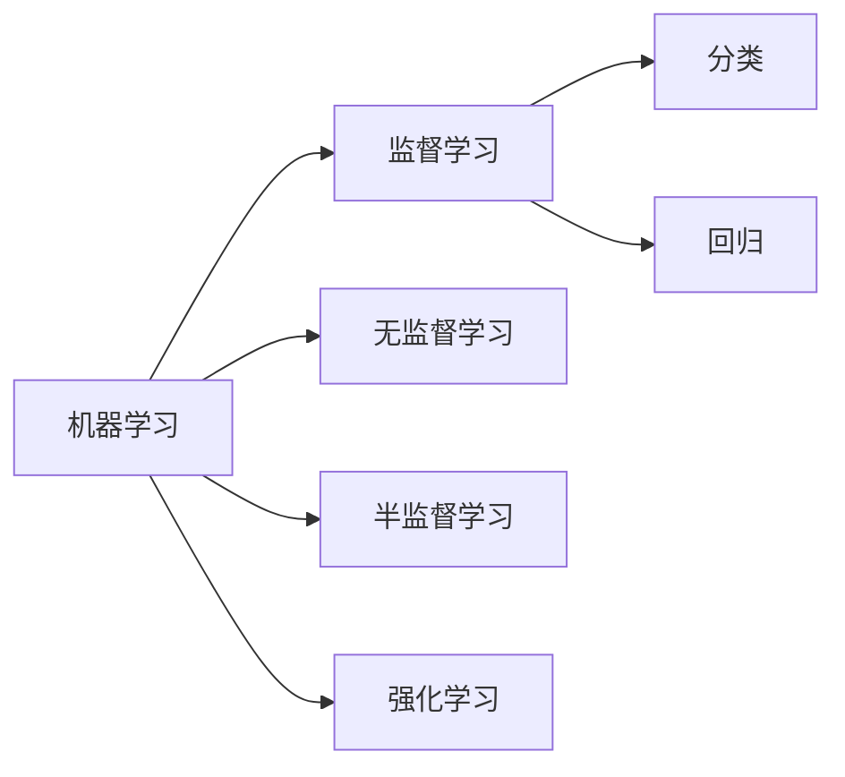

# AI人工智能核心算法原理与代码实例讲解：监督学习

## 1. 背景介绍
### 1.1 问题的由来
人工智能(Artificial Intelligence,AI)是计算机科学的一个重要分支,它致力于研究如何让机器像人一样思考和行动。机器学习(Machine Learning,ML)作为实现人工智能的一种重要手段,其中的监督学习(Supervised Learning)在图像分类、语音识别、自然语言处理等领域取得了巨大成功。然而,对于很多初学者来说,监督学习算法的原理和实现过程还有很多不清晰的地方,本文将对此进行详细阐述。

### 1.2 研究现状
目前,监督学习已经成为机器学习和人工智能领域的研究热点。各大科技公司和高校纷纷投入大量资源,希望在该领域取得突破。谷歌的AlphaGo、微软的小冰、百度的DuerOS等,都是利用监督学习算法实现的人工智能应用。近年来,深度学习的兴起更是推动了监督学习的快速发展。

### 1.3 研究意义
监督学习作为机器学习的重要分支,对于人工智能的发展具有重要意义。一方面,深入理解监督学习算法的原理,有助于我们设计出性能更优的模型;另一方面,熟练掌握监督学习算法的实现过程,可以让我们更好地将其应用到实际问题中去。总之,监督学习研究对于推动人工智能的进步具有重要价值。

### 1.4 本文结构
本文将分为以下几个部分:
- 第2部分介绍监督学习的核心概念及其与其他机器学习范式的联系
- 第3部分详细讲解几种常见的监督学习算法原理和具体步骤
- 第4部分给出监督学习常用的数学模型和公式推导过程
- 第5部分提供完整的代码实例,并对关键部分进行解释说明
- 第6部分总结监督学习的实际应用场景
- 第7部分推荐一些学习监督学习的工具和资源
- 第8部分对全文进行总结,并展望监督学习未来的发展趋势和挑战
- 第9部分列出一些监督学习的常见问题解答

## 2. 核心概念与联系
监督学习是一种常见的机器学习范式,它的目标是学习一个模型,使模型能够对未知数据做出正确的预测。具体来说,给定一个训练数据集,其中每个样本都有相应的标签(label)或目标值(target),监督学习算法通过学习训练集中的模式,构建一个预测模型,当输入一个新的样本时,模型可以预测其对应的标签或目标值。

根据预测任务的类型,监督学习可以分为分类(classification)和回归(regression)两大类:
- 分类:预测样本的离散标签,如判断一封邮件是否为垃圾邮件
- 回归:预测样本的连续目标值,如预测房屋价格

除了监督学习,常见的机器学习范式还有:
- 无监督学习(Unsupervised Learning):训练样本没有标签,算法通过学习数据的内在结构和关联来发现模式,如聚类、降维等
- 半监督学习(Semi-supervised Learning):同时使用有标签和无标签的样本进行训练
- 强化学习(Reinforcement Learning):智能体(Agent)在与环境的交互中学习最优策略,通过奖励(reward)来指导学习过程

下图展示了监督学习与其他机器学习范式的联系:



## 3. 核心算法原理 & 具体操作步骤
### 3.1 算法原理概述
监督学习的核心思想是通过学习已标注数据来预测未知数据。常见的监督学习算法包括:
- k近邻(k-Nearest Neighbor,kNN):根据样本的特征空间中的k个最近邻居的标签来预测该样本的标签
- 决策树(Decision Tree):通过递归地划分特征空间,构建一个树形结构的分类器
- 朴素贝叶斯(Naive Bayes):基于贝叶斯定理和特征独立性假设,通过先验概率和条件概率来预测样本的后验概率
- 支持向量机(Support Vector Machine,SVM):寻找最优的分类超平面,使得不同类别的样本能够被超平面很好地分开
- 逻辑回归(Logistic Regression):通过sigmoid函数将样本特征映射到0-1之间,预测样本属于某一类别的概率
- 人工神经网络(Artificial Neural Network,ANN):模拟人脑的神经元连接,通过多层感知机(MLP)等结构来拟合复杂的非线性函数

### 3.2 算法步骤详解
以kNN算法为例,其具体步骤如下:
1. 计算测试样本与每个训练样本之间的距离(如欧氏距离)
2. 选取距离最近的k个训练样本
3. 根据k个近邻的标签,通过投票等方式预测测试样本的标签
4. 重复步骤1-3,直到所有测试样本的标签都被预测

以决策树算法为例,其具体步骤如下:
1. 选择最优划分特征,如信息增益、基尼指数等
2. 根据该特征对训练集进行划分,生成子节点
3. 对每个子节点递归地执行步骤1-2,直到满足停止条件(如所有样本属于同一类别,或达到最大深度)
4. 将每个叶子节点标记为其所含样本最多的类别

### 3.3 算法优缺点
以SVM算法为例,其优点如下:
- 可以处理高维特征,并且不易陷入局部最优
- 可以很好地处理非线性数据,通过核函数将样本映射到高维空间
- 模型的泛化能力强,对未知数据的预测效果好

其缺点如下:
- 对参数和核函数的选择比较敏感
- 训练时间较长,尤其是对大规模数据集
- 不适合处理多分类问题,需要进行组合或转化

### 3.4 算法应用领域
监督学习算法在很多领域都有广泛应用,例如:
- 计算机视觉:图像分类、目标检测、语义分割等
- 自然语言处理:文本分类、情感分析、机器翻译等
- 语音识别:语音-文本转换、说话人识别等
- 生物信息学:基因表达数据分析、蛋白质结构预测等
- 金融领域:信用评分、股票趋势预测、反欺诈等

## 4. 数学模型和公式 & 详细讲解 & 举例说明
### 4.1 数学模型构建
以逻辑回归为例,假设有m个训练样本$\{(x^{(1)},y^{(1)}),(x^{(2)},y^{(2)}),...,(x^{(m)},y^{(m)})\}$,其中$x^{(i)}\in \mathbb{R}^n$为第i个样本的特征向量,$y^{(i)}\in \{0,1\}$为其对应的二元标签。逻辑回归模型定义为:

$$
h_{\theta}(x)=\frac{1}{1+e^{-\theta^Tx}}
$$

其中$\theta \in \mathbb{R}^n$为模型参数。该模型预测样本x属于正类(y=1)的概率为$h_{\theta}(x)$,属于负类(y=0)的概率为$1-h_{\theta}(x)$。

### 4.2 公式推导过程
逻辑回归的目标是找到最优参数$\theta$,使得模型在训练集上的似然函数最大化:

$$
\begin{aligned}
L(\theta)&=\prod_{i=1}^{m}P(y^{(i)}|x^{(i)};\theta) \
&=\prod_{i=1}^{m}(h_{\theta}(x^{(i)}))^{y^{(i)}}(1-h_{\theta}(x^{(i)}))^{1-y^{(i)}}
\end{aligned}
$$

为了便于求解,我们对似然函数取对数,得到对数似然函数:

$$
\begin{aligned}
l(\theta)&=\log L(\theta) \
&=\sum_{i=1}^{m}y^{(i)}\log h_{\theta}(x^{(i)})+(1-y^{(i)})\log (1-h_{\theta}(x^{(i)}))
\end{aligned}
$$

进一步,我们希望最小化对数似然函数的相反数,即最小化损失函数:

$$
J(\theta)=-\frac{1}{m}l(\theta)=-\frac{1}{m}\sum_{i=1}^{m}y^{(i)}\log h_{\theta}(x^{(i)})+(1-y^{(i)})\log (1-h_{\theta}(x^{(i)}))
$$

可以通过梯度下降法来最小化损失函数,求解出最优参数$\theta$。

### 4.3 案例分析与讲解
下面我们以一个简单的二元分类问题为例,来说明逻辑回归的应用。假设我们要根据学生的考试成绩(x)来预测其是否能被大学录取(y),训练集如下:

| 考试成绩(x) | 是否录取(y) |
|------------|-------------|
| 45         | 0           |
| 55         | 0           |
| 65         | 0           |
| 75         | 1           |
| 85         | 1           |

我们可以用逻辑回归模型来拟合这个问题:
$$
h_{\theta}(x)=\frac{1}{1+e^{-(\theta_0+\theta_1x)}}
$$

其中$\theta_0$和$\theta_1$为待学习的参数。通过最小化损失函数,我们可以得到最优参数值,从而得到决策边界:
$$
\theta_0+\theta_1x=0
$$

当$\theta_0=-40,\theta_1=0.6$时,决策边界为$x=66.7$,即考试成绩大于66.7分的学生将被预测为录取。这与训练集的分布情况是一致的。

### 4.4 常见问题解答
Q: 逻辑回归能否处理多分类问题?
A: 标准的二元逻辑回归只能处理两类问题,但可以通过一对多(One-vs-Rest)或一对一(One-vs-One)的方式将其推广到多分类问题。一对多是训练k个二元分类器,第i个分类器将第i类样本作为正类,其余所有样本作为负类;一对一是训练$C_k^2$个二元分类器,每个分类器用于区分两个类别,最后通过投票来决定样本的类别。

Q: 逻辑回归的优缺点是什么?
A: 优点:
- 模型简单,易于理解和实现
- 训练速度较快,计算代价不高
- 可以输出概率,便于解释预测结果
缺点:
- 容易欠拟合,需要引入正则化等手段
- 对特征之间的相关性敏感,需要对特征进行预处理
- 对非线性问题的拟合效果不好,需要引入高阶或交叉特征

## 5. 项目实践：代码实例和详细解释说明
### 5.1 开发环境搭建
本文使用Python语言和scikit-learn库来实现监督学习算法。读者需要安装以下工具和库:
- Python 3.x
- NumPy
- Pandas
- Matplotlib
- scikit-learn

可以通过以下命令来安装这些库:

```bash
pip install numpy pandas matplotlib scikit-learn
```

### 5.2 源代码详细实现
下面我们以决策树算法为例,给出完整的代码实现。首先,我们从sklearn.datasets中加载iris数据集,它包含了3种鸢尾花的萼片长度、萼片宽度、花瓣长度、花瓣宽度等特征,以及对应的类别标签。

```python
from sklearn.datasets import load_iris
from sklearn.model_selection import train_test_split
from sklearn.tree import DecisionTreeClassifier
from sklearn.metrics import accuracy_score

# 加载数据集
iris = load_iris()
X = iris.data
y = iris.target

# 划分训练集和测试集
X_train, X_test, y_train, y_test = train_test_split(X, y, test_size=0.2, random_state=42)

# 创建决策树分类器
clf = DecisionTreeClassifier(criterion='entropy', max_depth=3,