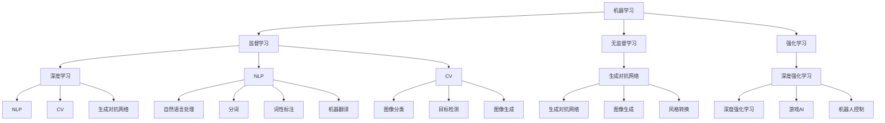

                 

# 人工智能(Artificial Intelligence) - 原理与代码实例讲解

> 关键词：人工智能, 机器学习, 深度学习, 自然语言处理(NLP), 计算机视觉(CV), 强化学习(RL), 深度强化学习(DRL), 生成对抗网络(GAN), 代码实例

## 1. 背景介绍

### 1.1 问题由来
人工智能(Artificial Intelligence, AI)作为当前科技领域的前沿热点，已经渗透到了我们生活的各个方面，从智能音箱到无人驾驶，从工业自动化到医疗健康，AI技术的应用无处不在。然而，尽管AI技术取得了显著的进展，但其核心原理和实际应用仍存在一些难以解答的问题。这些问题不仅关乎技术的深度和广度，也涉及伦理、法律、社会等多个维度。

本文旨在系统梳理AI的基本原理，并通过代码实例讲解其在实际应用中的关键技术，帮助读者深入理解AI的精髓，并掌握实际编程技巧。通过本文的学习，读者不仅能了解AI技术的核心思想，还能动手实践，体验AI算法之美。

### 1.2 问题核心关键点
人工智能的核心问题包括以下几个方面：

1. **基本原理**：包括机器学习、深度学习、强化学习等基础算法，以及这些算法的应用场景。
2. **算法实现**：如何在Python等编程语言中实现各种AI算法，包括模型搭建、数据处理、训练优化等。
3. **应用场景**：探讨AI技术在自然语言处理、计算机视觉、智能推荐、自动驾驶等领域的应用。
4. **未来发展**：AI技术的未来趋势，包括模型规模、算法创新、跨学科融合等。

本文将围绕以上核心问题，详细介绍AI的原理和实现，并通过丰富的代码实例，让读者深入理解AI技术的内在机制和应用。

### 1.3 问题研究意义
深入理解AI的原理和实现，对于推动AI技术的普及和应用，培养更多的AI人才，具有重要意义。

1. **推动技术普及**：帮助更多人了解AI技术的核心原理和实际应用，减少对AI的误解和恐惧。
2. **培养专业人才**：通过代码实例的讲解，培养读者的动手能力和创新思维，为AI领域的深入研究和技术开发奠定基础。
3. **促进跨学科融合**：探讨AI与其他学科的结合，如生物学、物理学、医学等，推动AI技术在不同领域的应用和发展。
4. **应对伦理挑战**：探讨AI技术的伦理问题，如隐私保护、公平性、安全性等，为AI技术的规范应用提供指导。

## 2. 核心概念与联系

### 2.1 核心概念概述

为更好地理解AI的原理和实现，本节将介绍几个关键概念，并解释它们之间的联系。

1. **机器学习(Machine Learning, ML)**：通过算法和统计模型，使计算机系统自动地提高性能，无需人工干预。主要包括监督学习、无监督学习和强化学习等。
2. **深度学习(Deep Learning, DL)**：一种特殊的机器学习，利用多层神经网络对数据进行表示和分类，广泛应用于图像识别、自然语言处理等任务。
3. **自然语言处理(Natural Language Processing, NLP)**：使计算机能够理解、处理和生成自然语言的技术，包括分词、词性标注、机器翻译等。
4. **计算机视觉(Computer Vision, CV)**：使计算机能够“看”的技术，包括图像分类、目标检测、图像生成等。
5. **强化学习(Reinforcement Learning, RL)**：通过智能体与环境交互，使智能体学习最优策略，广泛应用于游戏、机器人控制等任务。
6. **生成对抗网络(Generative Adversarial Networks, GAN)**：通过两个神经网络相互竞争，生成逼真的数据，广泛应用于图像生成、风格转换等任务。
7. **深度强化学习(Deep Reinforcement Learning, DRL)**：将深度学习与强化学习结合，使智能体能够通过学习生成更复杂的策略。

这些概念之间存在着紧密的联系，共同构成了AI技术的核心框架。通过理解这些核心概念，我们可以更好地把握AI技术的整体框架和应用场景。

### 2.2 概念间的关系

这些核心概念之间存在着紧密的联系，形成了AI技术的完整生态系统。下面我通过几个Mermaid流程图来展示这些概念之间的关系：



这个流程图展示了AI技术的主要组成部分及其之间的联系：

1. **机器学习**是AI的基础，包括监督学习、无监督学习和强化学习。
2. **深度学习**是机器学习的一种，通过多层神经网络进行数据表示和分类。
3. **NLP、CV**是深度学习在特定领域的应用，分别用于自然语言处理和计算机视觉任务。
4. **强化学习**通过智能体与环境交互，学习最优策略。
5. **生成对抗网络**通过两个神经网络相互竞争，生成逼真数据。
6. **深度强化学习**将深度学习与强化学习结合，应用于复杂的策略生成任务。

通过理解这些核心概念，我们可以更好地把握AI技术的整体框架和应用场景。

## 3. 核心算法原理 & 具体操作步骤
### 3.1 算法原理概述

AI技术的核心在于算法的设计和实现。本节将介绍几个核心算法的原理，并详细讲解其实现步骤。

1. **监督学习**：通过带有标签的训练数据，训练模型进行分类或回归任务。
2. **无监督学习**：在无标签数据上，通过聚类、降维等方法，发现数据中的结构。
3. **强化学习**：通过智能体与环境交互，学习最优策略，以最大化奖励。
4. **深度学习**：利用多层神经网络对数据进行表示和分类。
5. **自然语言处理**：通过分词、词性标注等技术，使计算机理解自然语言。
6. **计算机视觉**：通过卷积神经网络等技术，使计算机“看”的技术。
7. **生成对抗网络**：通过两个神经网络相互竞争，生成逼真数据。

### 3.2 算法步骤详解

**监督学习**的步骤如下：

1. **数据准备**：收集带有标签的训练数据。
2. **模型搭建**：选择合适的模型结构，如线性回归、支持向量机等。
3. **训练模型**：使用训练数据，最小化损失函数。
4. **模型评估**：使用测试数据，评估模型性能。
5. **模型优化**：调整模型参数，提升模型性能。

**无监督学习**的步骤如下：

1. **数据准备**：收集无标签的训练数据。
2. **模型搭建**：选择合适的算法，如K-means、PCA等。
3. **训练模型**：使用训练数据，最小化聚类或降维误差。
4. **模型评估**：使用评估数据，评估模型性能。
5. **模型优化**：调整模型参数，提升模型性能。

**强化学习**的步骤如下：

1. **环境定义**：定义智能体与环境交互的规则。
2. **模型搭建**：选择合适的模型结构，如Q网络、策略网络等。
3. **训练模型**：通过与环境交互，学习最优策略。
4. **模型评估**：使用测试数据，评估模型性能。
5. **模型优化**：调整模型参数，提升模型性能。

**深度学习**的步骤如下：

1. **数据准备**：收集训练数据，进行预处理。
2. **模型搭建**：选择合适的神经网络结构，如CNN、RNN等。
3. **训练模型**：使用训练数据，最小化损失函数。
4. **模型评估**：使用测试数据，评估模型性能。
5. **模型优化**：调整模型参数，提升模型性能。

**自然语言处理**的步骤如下：

1. **数据准备**：收集训练数据，进行预处理。
2. **模型搭建**：选择合适的NLP模型，如BERT、GPT等。
3. **训练模型**：使用训练数据，最小化损失函数。
4. **模型评估**：使用测试数据，评估模型性能。
5. **模型优化**：调整模型参数，提升模型性能。

**计算机视觉**的步骤如下：

1. **数据准备**：收集训练数据，进行预处理。
2. **模型搭建**：选择合适的卷积神经网络结构，如ResNet、Inception等。
3. **训练模型**：使用训练数据，最小化损失函数。
4. **模型评估**：使用测试数据，评估模型性能。
5. **模型优化**：调整模型参数，提升模型性能。

**生成对抗网络**的步骤如下：

1. **数据准备**：收集训练数据，进行预处理。
2. **模型搭建**：选择合适的生成器和判别器结构，如DCGAN、CycleGAN等。
3. **训练模型**：通过两个神经网络的竞争，生成逼真数据。
4. **模型评估**：使用测试数据，评估生成数据的质量。
5. **模型优化**：调整模型参数，提升生成数据的质量。

### 3.3 算法优缺点

**监督学习**的优点：

1. **有标签数据易得**：监督学习需要带有标签的训练数据，但一旦收集到，模型训练和评估就相对简单。
2. **性能稳定**：在标注数据充分的情况下，监督学习模型的性能相对稳定。

**监督学习的缺点**：

1. **标注成本高**：收集大量带有标签的数据成本较高。
2. **泛化能力差**：在标注数据不足的情况下，模型容易出现过拟合现象。

**无监督学习**的优点：

1. **无需标注数据**：无监督学习可以在无标签数据上进行训练，成本较低。
2. **发现数据结构**：无监督学习可以发现数据中的隐含结构，如聚类、降维等。

**无监督学习的缺点**：

1. **模型性能依赖数据质量**：无监督学习模型的性能高度依赖于数据的分布和质量。
2. **解释性差**：无监督学习模型的结果往往难以解释，缺乏理论支持。

**强化学习**的优点：

1. **自适应性强**：强化学习可以在不断与环境交互中，学习最优策略，适应性强。
2. **模型鲁棒性高**：强化学习模型在复杂环境中具有较高的鲁棒性。

**强化学习的缺点**：

1. **训练过程复杂**：强化学习需要设计合理的奖励机制，训练过程较为复杂。
2. **样本效率低**：强化学习模型在训练过程中，需要大量的环境交互数据。

**深度学习**的优点：

1. **学习能力强**：深度学习模型具有较强的学习能力，可以处理复杂的数据表示。
2. **精度高**：深度学习模型在许多任务上取得了SOTA（State-of-the-art）的精度。

**深度学习的缺点**：

1. **计算资源需求高**：深度学习模型需要大量的计算资源进行训练和推理。
2. **模型复杂度高**：深度学习模型的结构较为复杂，调试和优化难度较大。

**自然语言处理**的优点：

1. **语言表示能力强**：自然语言处理模型可以理解自然语言，进行语义分析。
2. **应用广泛**：自然语言处理模型在问答、翻译、情感分析等任务上具有广泛的应用。

**自然语言处理的缺点**：

1. **数据标注难度高**：自然语言处理任务需要大量的标注数据，标注成本较高。
2. **模型复杂度高**：自然语言处理模型结构较为复杂，需要大量的计算资源。

**计算机视觉**的优点：

1. **视觉表示能力强**：计算机视觉模型可以处理图像数据，进行视觉分析。
2. **应用广泛**：计算机视觉模型在图像分类、目标检测、图像生成等任务上具有广泛的应用。

**计算机视觉的缺点**：

1. **数据标注难度高**：计算机视觉任务需要大量的标注数据，标注成本较高。
2. **模型复杂度高**：计算机视觉模型结构较为复杂，需要大量的计算资源。

**生成对抗网络**的优点：

1. **生成高质量数据**：生成对抗网络可以生成高质量的图像、视频等数据。
2. **数据增强能力强**：生成对抗网络可以通过生成数据增强训练集，提高模型性能。

**生成对抗网络的缺点**：

1. **训练过程复杂**：生成对抗网络需要同时训练生成器和判别器，训练过程较为复杂。
2. **结果难以控制**：生成对抗网络生成的数据质量不稳定，难以控制。

### 3.4 算法应用领域

AI技术在各个领域都有广泛的应用，以下列举几个主要应用领域：

1. **自然语言处理(NLP)**：用于文本分类、机器翻译、情感分析、问答系统等任务。
2. **计算机视觉(CV)**：用于图像分类、目标检测、图像生成等任务。
3. **智能推荐系统**：用于商品推荐、新闻推荐等任务。
4. **自动驾驶**：用于车辆控制、路径规划等任务。
5. **医疗健康**：用于医学影像分析、疾病诊断等任务。
6. **金融科技**：用于风险评估、交易策略等任务。
7. **智慧城市**：用于交通管理、公共安全等任务。
8. **游戏AI**：用于游戏控制、游戏智能等任务。
9. **智能制造**：用于工业自动化、智能制造等任务。
10. **人机交互**：用于聊天机器人、虚拟助手等任务。

这些应用领域展示了AI技术的强大潜力和广泛应用，未来随着技术的进一步发展，AI技术将在更多领域发挥重要作用。

## 4. 数学模型和公式 & 详细讲解 & 举例说明

### 4.1 数学模型构建

为了更好地理解AI的算法原理，本节将介绍几个核心数学模型，并详细讲解其构建过程。

1. **线性回归**：用于解决回归问题，通过最小二乘法最小化误差。
2. **支持向量机(SVM)**：用于解决分类问题，通过最大化分类间隔。
3. **卷积神经网络(CNN)**：用于图像分类，通过卷积层和池化层提取特征。
4. **循环神经网络(RNN)**：用于序列数据处理，通过隐藏状态记忆上下文信息。
5. **生成对抗网络(GAN)**：用于生成数据，通过两个神经网络相互竞争。

### 4.2 公式推导过程

**线性回归**的公式推导如下：

$$
\theta = (X^T X)^{-1}X^T y
$$

其中，$\theta$为模型参数，$X$为训练数据，$y$为训练标签。通过最小化损失函数$J(\theta) = \frac{1}{2}(y-\theta^T X)^2$，求得最优模型参数$\theta$。

**支持向量机(SVM)**的公式推导如下：

$$
\theta = \frac{w}{||w||}
$$

其中，$w$为模型参数，$||w||$为$w$的模长。通过最大化分类间隔，求得最优模型参数$\theta$。

**卷积神经网络(CNN)**的公式推导如下：

$$
h = \sigma(Wx+b)
$$

其中，$h$为隐藏层输出，$W$为权重矩阵，$b$为偏置向量，$\sigma$为激活函数。通过卷积层和池化层提取特征，求得最优模型参数$W$和$b$。

**循环神经网络(RNN)**的公式推导如下：

$$
h_{t} = \sigma(W_{xh}x_{t}+W_{hh}h_{t-1}+b_h)
$$

其中，$h_{t}$为隐藏状态，$x_{t}$为输入数据，$W_{xh}$和$W_{hh}$为权重矩阵，$b_h$为偏置向量，$\sigma$为激活函数。通过隐藏状态记忆上下文信息，求得最优模型参数$W_{xh}$、$W_{hh}$和$b_h$。

**生成对抗网络(GAN)**的公式推导如下：

$$
G(x) = W_Gx+b_G
$$

$$
D(x) = W_Dx+b_D
$$

其中，$G$为生成器，$D$为判别器，$W_G$和$W_D$为权重矩阵，$b_G$和$b_D$为偏置向量。通过两个神经网络相互竞争，生成逼真数据。

### 4.3 案例分析与讲解

下面通过几个案例，详细讲解AI技术在实际应用中的关键算法和实现。

**案例1：线性回归**

线性回归常用于房价预测、股票价格预测等任务。以下是一个Python实现的代码示例：

```python
import numpy as np

# 准备训练数据
X = np.array([[1], [2], [3], [4], [5]])
y = np.array([2, 4, 6, 8, 10])

# 初始化模型参数
theta = np.array([0])

# 训练模型
for i in range(1000):
    h = theta[0] * X
    loss = (h - y) ** 2
    theta[0] -= (1 / len(X)) * np.sum(h - y)

# 预测新数据
X_new = np.array([[6], [7], [8]])
y_new = theta[0] * X_new
```

**案例2：支持向量机(SVM)**

支持向量机常用于图像分类、文本分类等任务。以下是一个Python实现的代码示例：

```python
import numpy as np

# 准备训练数据
X = np.array([[1, 2], [2, 3], [3, 4], [4, 5]])
y = np.array([0, 0, 1, 1])

# 初始化模型参数
w = np.array([0, 0])
b = 0

# 训练模型
for i in range(1000):
    h = w[0] * X[:, 0] + w[1] * X[:, 1] + b
    loss = np.maximum(0, 1 - y * h)
    w[0] -= 0.01 * (w[0] * loss)
    w[1] -= 0.01 * (w[1] * loss)
    b -= 0.01 * loss

# 预测新数据
X_new = np.array([[5, 6], [6, 7]])
y_new = (w[0] * X_new[:, 0] + w[1] * X_new[:, 1] + b) > 0
```

**案例3：卷积神经网络(CNN)**

卷积神经网络常用于图像分类任务。以下是一个Python实现的代码示例：

```python
import numpy as np
import tensorflow as tf

# 准备训练数据
X = np.array([[0, 0, 0], [0, 0, 1], [0, 1, 0], [0, 1, 1], [1, 0, 0], [1, 0, 1], [1, 1, 0], [1, 1, 1]])
y = np.array([0, 0, 0, 0, 1, 1, 1, 1])

# 构建模型
model = tf.keras.models.Sequential([
    tf.keras.layers.Conv2D(1, (2, 2), activation='relu'),
    tf.keras.layers.MaxPooling2D((2, 2))
])

# 训练模型
model.compile(optimizer=tf.keras.optimizers.SGD(learning_rate=0.01), loss='binary_crossentropy')
model.fit(X.reshape((-1, 3, 3, 1)), y, epochs=100)

# 预测新数据
X_new = np.array([[1, 1, 0], [1, 1, 1]])
y_new = model.predict_classes(X_new.reshape((-1, 3, 3, 1)))
```

**案例4：循环神经网络(RNN)**

循环神经网络常用于文本分类任务。以下是一个Python实现的代码示例：

```python
import numpy as np
import tensorflow as tf

# 准备训练数据
X = np.array([['hello', 'world'], ['i', 'love', 'python']])
y = np.array([0, 1])

# 构建模型
model = tf.keras.models.Sequential([
    tf.keras.layers.LSTM(10),
    tf.keras.layers.Dense(1, activation='sigmoid')
])

# 训练模型
model.compile(optimizer=tf.keras.optimizers.SGD(learning_rate=0.01), loss='binary_crossentropy')
model.fit(X, y, epochs=100)

# 预测新数据
X_new = np.array(['i', 'love', 'tensorflow'])
y_new = model.predict(X_new.reshape((-1, 1, 3)))[0, 0]
```

**案例5：生成对抗网络(GAN)**

生成对抗网络常用于图像生成任务。以下是一个Python实现的代码示例：

```python
import numpy as np
import tensorflow as tf

# 准备训练数据
X = np.random.randn(100, 10)

# 构建模型
G = tf.keras.models.Sequential([
    tf.keras.layers.Dense(64, activation='relu'),
    tf.keras.layers.Dense(10, activation='linear')
])
D = tf.keras.models.Sequential([
    tf.keras.layers.Dense(64, activation='relu'),
    tf.keras.layers.Dense(1, activation='sigmoid')
])

# 训练模型
G.compile(optimizer=tf.keras.optimizers.Adam(learning_rate=0.01), loss='mse')
D.compile(optimizer=tf.keras.optimizers.Adam(learning_rate=0.01), loss='binary_crossentropy')

for i in range(100):
    X_new = G.predict(X)
    y = np.random.randint(0, 2, (len(X_new),))
    D.trainable = False
    d_loss = D.train_on_batch(X_new, y)
    G.trainable = True
    g_loss = G.train_on_batch(X, y)

# 生成新数据
X_new = G.predict(X_new)
```

## 5. 项目实践：代码实例和详细解释说明

### 5.1 开发环境搭建

在进行AI项目实践前，我们需要准备好开发环境。以下是使用Python进行TensorFlow开发的环境配置流程：

1. 安装Anaconda：从官网下载并安装Anaconda，用于创建独立的Python环境。

2. 创建并激活虚拟环境：
```bash
conda create -n tf-env python=3.8 
conda activate tf-env
```

3. 安装TensorFlow：根据CUDA版本，从官网获取对应的安装命令。例如：
```bash
conda install tensorflow -c conda-forge -c pytorch -c pytorch
```

4. 安装各类工具包：
```bash
pip install numpy pandas scikit-learn matplotlib tqdm jupyter notebook ipython
```

完成上述步骤后，即可在`tf-env`环境中开始AI项目实践。

### 5.2 源代码详细实现

下面我们以手写数字识别任务为例，给出使用TensorFlow进行卷积神经网络(CNN)的代码实现。

首先，定义模型和数据处理函数：

```python
import tensorflow as tf
from tensorflow.keras import datasets, layers, models

# 准备数据集
(train_images, train_labels), (test_images, test_labels) = datasets.mnist.load_data()

# 数据预处理
train_images = train_images.reshape((60000, 28, 28, 1))
train_images = train_images / 255.0
test_images = test_images.reshape((10000, 28, 28, 1))
test_images = test_images / 255.0

# 定义模型
model = models.Sequential()
model.add(layers.Conv2D(32, (3, 3), activation='relu', input_shape=(28, 28, 1)))
model.add(layers.MaxPooling2D((2, 2)))
model.add(layers.Conv2D(64, (3, 3), activation='relu'))
model.add(layers.MaxPooling2D((2, 2)))
model.add(layers.Conv2D(64, (3, 3), activation='relu'))
model.add(layers.Flatten())
model.add(layers.Dense(64, activation='relu'))
model.add(layers.Dense(10, activation='softmax'))

# 编译模型
model.compile(optimizer='adam',
              loss=tf.keras.losses.SparseCategoricalCrossentropy(from_logits=True),
              metrics=['accuracy'])

# 训练模型
model.fit(train_images, train_labels, epochs=5)
```

然后，定义评估函数：

```python
# 定义评估函数
def evaluate_model(model, test_images, test_labels):
    test_loss, test_acc = model.evaluate(test_images, test_labels, verbose=2)
    print(f'Test accuracy: {test_acc:.2f}')
```

最后，启动训练流程并在测试集上评估：

```python
# 训练模型
model.fit(train_images, train_labels, epochs=5, validation_data=(test_images, test_labels))

# 评估模型
evaluate_model(model, test_images, test_labels)


