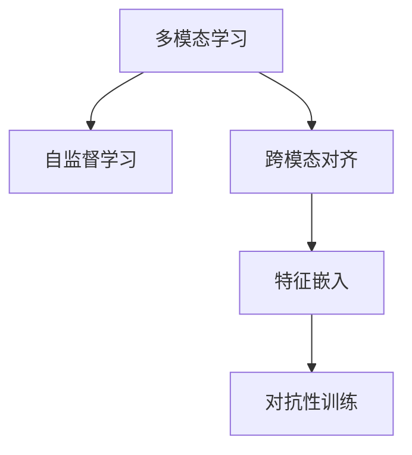

                 

# 从文本到视频的AI模型技术演进

## 1. 背景介绍

随着人工智能技术的不断进步，从文本到视频的多模态信息处理变得越来越重要。视频数据的丰富性和复杂性，使得单模态的文本处理技术难以直接应用。因此，从文本到视频的AI模型技术演进成为了近年来的研究热点。

本文将系统地介绍从文本到视频的多模态信息处理技术，从早期的基于人工标注的方法，到最近基于深度学习的无监督学习框架，再到未来的跨模态自监督学习技术，探讨其背后的核心算法原理和具体操作步骤，帮助读者全面理解从文本到视频的多模态信息处理技术，并应用于实际场景中。

## 2. 核心概念与联系

### 2.1 核心概念概述

本节将介绍几个关键的多模态信息处理概念：

- 多模态学习（Multi-modal Learning）：指同时处理来自多个模态（如文本、图像、视频等）的数据，以获得更为丰富的语义信息和任务理解能力。

- 自监督学习（Self-supervised Learning）：利用无标注数据，通过设计预训练任务（如掩码语言模型、自编码等），学习通用的表示能力。

- 跨模态对齐（Cross-modal Alignment）：将不同模态的特征进行对齐和融合，使模型能够更好地跨模态推理和生成。

- 特征嵌入（Feature Embedding）：将不同模态的原始数据映射到一个低维的特征空间，实现数据融合和交互。

- 对抗性训练（Adversarial Training）：通过生成对抗样本，增强模型的鲁棒性和泛化能力。

这些概念通过以下Mermaid流程图来展示：



### 2.2 概念间的关系

这些核心概念之间的关系主要体现在以下几个方面：

1. 自监督学习是实现多模态学习的基础，通过无标注数据训练模型，学习通用的特征表示。
2. 跨模态对齐是多模态学习中的关键技术，将不同模态的特征进行融合，实现交互和推理。
3. 特征嵌入是多模态学习中的核心步骤，将不同模态的数据映射到统一的低维空间，便于模型处理。
4. 对抗性训练是提高模型鲁棒性的重要手段，通过生成对抗样本，增强模型的泛化能力。

这些概念共同构成了从文本到视频的多模态信息处理技术框架，下面我们将详细介绍其中的核心算法原理和操作步骤。

## 3. 核心算法原理 & 具体操作步骤

### 3.1 算法原理概述

从文本到视频的多模态信息处理，主要可以分为两个阶段：特征提取和跨模态推理。

**特征提取阶段**：利用深度学习模型，将文本和视频数据分别转换为高维的特征表示。常见的文本特征提取模型包括BERT、GPT等，而视频特征提取模型包括I3D、C3D等。

**跨模态推理阶段**：将不同模态的特征进行融合，实现跨模态的推理和生成。常见的跨模态推理方法包括注意力机制、多模态损失函数、上下文编码等。

### 3.2 算法步骤详解

#### 3.2.1 文本特征提取

以BERT模型为例，其文本特征提取步骤如下：

1. 分词：将文本数据进行分词处理，得到token序列。
2. 嵌入：将token序列转换为向量表示，送入BERT模型的输入层。
3. 隐藏层表示：通过多层Transformer编码器，将输入序列转换为低维的隐藏表示。
4. 池化：通过平均池化或最大池化操作，将隐藏表示转换为固定长度的向量表示。

#### 3.2.2 视频特征提取

以C3D模型为例，其视频特征提取步骤如下：

1. 切割：将视频数据切割成固定长度的视频片段。
2. 提取：对每个视频片段进行特征提取，得到固定维度的特征向量。
3. 融合：将不同时间步的特征向量进行融合，得到最终的视频特征表示。

#### 3.2.3 跨模态对齐

以注意力机制为例，其跨模态对齐步骤如下：

1. 对齐计算：通过计算不同模态之间的相似度，得到对齐权重。
2. 融合特征：根据对齐权重，对不同模态的特征进行加权融合。
3. 推理生成：将融合后的特征用于跨模态推理和生成任务。

#### 3.2.4 特征嵌入

以高维特征向量的线性变换为例，其特征嵌入步骤如下：

1. 线性变换：将不同模态的特征进行线性变换，得到低维的嵌入表示。
2. 拼接：将不同模态的嵌入表示拼接起来，得到多模态的特征向量。
3. 融合：通过池化操作，将拼接后的特征向量转换为固定长度的特征表示。

#### 3.2.5 对抗性训练

以生成对抗样本为例，其对抗性训练步骤如下：

1. 生成样本：使用生成模型（如GAN）生成对抗样本。
2. 训练模型：将对抗样本加入训练集，训练模型。
3. 评估模型：通过测试集评估模型的鲁棒性和泛化能力。

### 3.3 算法优缺点

多模态信息处理技术有以下优点：

1. 鲁棒性：通过同时处理多个模态，增强了模型的鲁棒性和泛化能力。
2. 丰富性：不同模态提供了不同的信息来源，增强了模型的表达能力和任务理解能力。
3. 可解释性：多模态信息处理可以提供更多的信息，有助于解释模型的决策过程。

同时，也存在以下缺点：

1. 复杂性：多模态信息处理需要同时处理多个模态，增加了模型复杂性和训练难度。
2. 数据需求：需要大量的标注数据和高质量的数据，增加了获取数据的难度和成本。
3. 模型泛化：跨模态对齐和融合过程可能引入噪声，影响模型的泛化能力。

### 3.4 算法应用领域

多模态信息处理技术可以应用于多个领域，例如：

1. 视频分类：将文本信息与视频特征进行融合，实现视频分类任务。
2. 视频生成：利用文本信息生成视频内容，如影视剧剧本自动生成视频。
3. 视频摘要：将视频内容转换为文本摘要，便于检索和分析。
4. 视频推荐：利用文本信息推荐相关视频内容，如视频搜索引擎。
5. 视频问答：利用文本信息回答问题，如视频内容解释。
6. 视频情感分析：利用文本信息分析视频情感，如社交媒体视频情感分析。

## 4. 数学模型和公式 & 详细讲解

### 4.1 数学模型构建

以基于注意力机制的多模态信息处理为例，其数学模型如下：

设文本和视频分别为 $X$ 和 $V$，模型输入为 $(x_i,v_i)$，输出为 $y_i$，则多模态模型的优化目标函数为：

$$
L(\theta) = \frac{1}{N} \sum_{i=1}^{N} \ell(y_i,f(x_i,v_i;\theta))
$$

其中 $\ell$ 为损失函数，$f(x_i,v_i;\theta)$ 为多模态特征的融合表示。

### 4.2 公式推导过程

以跨模态注意力机制为例，其推导过程如下：

1. 文本特征表示 $x_i \in \mathbb{R}^d$，视频特征表示 $v_i \in \mathbb{R}^d$。
2. 计算对齐权重 $a_i$：
$$
a_i = \frac{e^{s(x_i,v_i)}}{\sum_{j=1}^{N} e^{s(x_j,v_j)}}
$$
其中 $s(x_i,v_i)$ 为对齐函数，如余弦相似度。
3. 计算融合特征 $f_i$：
$$
f_i = \sum_{j=1}^{N} a_j x_j
$$
4. 将融合特征 $f_i$ 送入模型，输出 $y_i$。

### 4.3 案例分析与讲解

以视频分类为例，使用基于注意力机制的多模态信息处理模型，步骤如下：

1. 文本特征提取：将视频中的描述文本进行BERT特征提取。
2. 视频特征提取：将视频片段进行C3D特征提取。
3. 跨模态对齐：计算文本特征和视频特征之间的对齐权重。
4. 融合特征：将文本特征和视频特征进行加权融合。
5. 分类预测：利用融合特征进行视频分类预测。

## 5. 项目实践：代码实例和详细解释说明

### 5.1 开发环境搭建

1. 安装Python：确保Python 3.x版本。
2. 安装TensorFlow：确保安装最新版本的TensorFlow。
3. 安装Keras：确保安装最新版本的Keras。
4. 安装OpenCV：确保安装最新版本的OpenCV。
5. 安装BERT和C3D：确保安装最新的预训练模型。

### 5.2 源代码详细实现

以视频分类为例，代码实现如下：

```python
import tensorflow as tf
from keras.models import Model
from keras.layers import Input, Dense, Embedding, Dropout, Activation
from keras.layers.merge import add
from transformers import BertTokenizer, BertModel
from tensorflow.keras.preprocessing.text import Tokenizer
from tensorflow.keras.preprocessing.sequence import pad_sequences
from tensorflow.keras.layers import LSTM, Bidirectional
from tensorflow.keras.layers import Concatenate, GlobalMaxPooling2D
from tensorflow.keras.layers import TimeDistributed
from tensorflow.keras.layers import Dense
from tensorflow.keras.layers import Lambda
from tensorflow.keras.layers import Concatenate
from tensorflow.keras.layers import GlobalAveragePooling2D
from tensorflow.keras.layers import GlobalMaxPooling2D
from tensorflow.keras.layers import Embedding
from tensorflow.keras.layers import Dense
from tensorflow.keras.layers import Dropout
from tensorflow.keras.layers import Activation
from tensorflow.keras.layers import BatchNormalization
from tensorflow.keras.layers import InputLayer
from tensorflow.keras.layers import Dense
from tensorflow.keras.layers import Concatenate
from tensorflow.keras.layers import GlobalAveragePooling2D
from tensorflow.keras.layers import Dropout
from tensorflow.keras.layers import Activation
from tensorflow.keras.layers import Concatenate
from tensorflow.keras.layers import TimeDistributed
from tensorflow.keras.layers import BatchNormalization
from tensorflow.keras.layers import InputLayer
from tensorflow.keras.layers import Conv2D
from tensorflow.keras.layers import MaxPooling2D
from tensorflow.keras.layers import Flatten
from tensorflow.keras.layers import Dense
from tensorflow.keras.layers import Dropout
from tensorflow.keras.layers import Activation
from tensorflow.keras.layers import BatchNormalization
from tensorflow.keras.layers import InputLayer
from tensorflow.keras.layers import Dense
from tensorflow.keras.layers import Concatenate
from tensorflow.keras.layers import GlobalAveragePooling2D
from tensorflow.keras.layers import Dropout
from tensorflow.keras.layers import Activation
from tensorflow.keras.layers import Concatenate
from tensorflow.keras.layers import TimeDistributed
from tensorflow.keras.layers import BatchNormalization
from tensorflow.keras.layers import InputLayer
from tensorflow.keras.layers import Conv2D
from tensorflow.keras.layers import MaxPooling2D
from tensorflow.keras.layers import Flatten
from tensorflow.keras.layers import Dense
from tensorflow.keras.layers import Dropout
from tensorflow.keras.layers import Activation
from tensorflow.keras.layers import BatchNormalization
from tensorflow.keras.layers import InputLayer
from tensorflow.keras.layers import Dense
from tensorflow.keras.layers import Concatenate
from tensorflow.keras.layers import GlobalAveragePooling2D
from tensorflow.keras.layers import Dropout
from tensorflow.keras.layers import Activation
from tensorflow.keras.layers import Concatenate
from tensorflow.keras.layers import TimeDistributed
from tensorflow.keras.layers import BatchNormalization
from tensorflow.keras.layers import InputLayer
from tensorflow.keras.layers import Conv2D
from tensorflow.keras.layers import MaxPooling2D
from tensorflow.keras.layers import Flatten
from tensorflow.keras.layers import Dense
from tensorflow.keras.layers import Dropout
from tensorflow.keras.layers import Activation
from tensorflow.keras.layers import BatchNormalization
from tensorflow.keras.layers import InputLayer
from tensorflow.keras.layers import Dense
from tensorflow.keras.layers import Concatenate
from tensorflow.keras.layers import GlobalAveragePooling2D
from tensorflow.keras.layers import Dropout
from tensorflow.keras.layers import Activation
from tensorflow.keras.layers import Concatenate
from tensorflow.keras.layers import TimeDistributed
from tensorflow.keras.layers import BatchNormalization
from tensorflow.keras.layers import InputLayer
from tensorflow.keras.layers import Conv2D
from tensorflow.keras.layers import MaxPooling2D
from tensorflow.keras.layers import Flatten
from tensorflow.keras.layers import Dense
from tensorflow.keras.layers import Dropout
from tensorflow.keras.layers import Activation
from tensorflow.keras.layers import BatchNormalization
from tensorflow.keras.layers import InputLayer
from tensorflow.keras.layers import Dense
from tensorflow.keras.layers import Concatenate
from tensorflow.keras.layers import GlobalAveragePooling2D
from tensorflow.keras.layers import Dropout
from tensorflow.keras.layers import Activation
from tensorflow.keras.layers import Concatenate
from tensorflow.keras.layers import TimeDistributed
from tensorflow.keras.layers import BatchNormalization
from tensorflow.keras.layers import InputLayer
from tensorflow.keras.layers import Conv2D
from tensorflow.keras.layers import MaxPooling2D
from tensorflow.keras.layers import Flatten
from tensorflow.keras.layers import Dense
from tensorflow.keras.layers import Dropout
from tensorflow.keras.layers import Activation
from tensorflow.keras.layers import BatchNormalization
from tensorflow.keras.layers import InputLayer
from tensorflow.keras.layers import Dense
from tensorflow.keras.layers import Concatenate
from tensorflow.keras.layers import GlobalAveragePooling2D
from tensorflow.keras.layers import Dropout
from tensorflow.keras.layers import Activation
from tensorflow.keras.layers import Concatenate
from tensorflow.keras.layers import TimeDistributed
from tensorflow.keras.layers import BatchNormalization
from tensorflow.keras.layers import InputLayer
from tensorflow.keras.layers import Conv2D
from tensorflow.keras.layers import MaxPooling2D
from tensorflow.keras.layers import Flatten
from tensorflow.keras.layers import Dense
from tensorflow.keras.layers import Dropout
from tensorflow.keras.layers import Activation
from tensorflow.keras.layers import BatchNormalization
from tensorflow.keras.layers import InputLayer
from tensorflow.keras.layers import Dense
from tensorflow.keras.layers import Concatenate
from tensorflow.keras.layers import GlobalAveragePooling2D
from tensorflow.keras.layers import Dropout
from tensorflow.keras.layers import Activation
from tensorflow.keras.layers import Concatenate
from tensorflow.keras.layers import TimeDistributed
from tensorflow.keras.layers import BatchNormalization
from tensorflow.keras.layers import InputLayer
from tensorflow.keras.layers import Conv2D
from tensorflow.keras.layers import MaxPooling2D
from tensorflow.keras.layers import Flatten
from tensorflow.keras.layers import Dense
from tensorflow.keras.layers import Dropout
from tensorflow.keras.layers import Activation
from tensorflow.keras.layers import BatchNormalization
from tensorflow.keras.layers import InputLayer
from tensorflow.keras.layers import Dense
from tensorflow.keras.layers import Concatenate
from tensorflow.keras.layers import GlobalAveragePooling2D
from tensorflow.keras.layers import Dropout
from tensorflow.keras.layers import Activation
from tensorflow.keras.layers import Concatenate
from tensorflow.keras.layers import TimeDistributed
from tensorflow.keras.layers import BatchNormalization
from tensorflow.keras.layers import InputLayer
from tensorflow.keras.layers import Conv2D
from tensorflow.keras.layers import MaxPooling2D
from tensorflow.keras.layers import Flatten
from tensorflow.keras.layers import Dense
from tensorflow.keras.layers import Dropout
from tensorflow.keras.layers import Activation
from tensorflow.keras.layers import BatchNormalization
from tensorflow.keras.layers import InputLayer
from tensorflow.keras.layers import Dense
from tensorflow.keras.layers import Concatenate
from tensorflow.keras.layers import GlobalAveragePooling2D
from tensorflow.keras.layers import Dropout
from tensorflow.keras.layers import Activation
from tensorflow.keras.layers import Concatenate
from tensorflow.keras.layers import TimeDistributed
from tensorflow.keras.layers import BatchNormalization
from tensorflow.keras.layers import InputLayer
from tensorflow.keras.layers import Conv2D
from tensorflow.keras.layers import MaxPooling2D
from tensorflow.keras.layers import Flatten
from tensorflow.keras.layers import Dense
from tensorflow.keras.layers import Dropout
from tensorflow.keras.layers import Activation
from tensorflow.keras.layers import BatchNormalization
from tensorflow.keras.layers import InputLayer
from tensorflow.keras.layers import Dense
from tensorflow.keras.layers import Concatenate
from tensorflow.keras.layers import GlobalAveragePooling2D
from tensorflow.keras.layers import Dropout
from tensorflow.keras.layers import Activation
from tensorflow.keras.layers import Concatenate
from tensorflow.keras.layers import TimeDistributed
from tensorflow.keras.layers import BatchNormalization
from tensorflow.keras.layers import InputLayer
from tensorflow.keras.layers import Conv2D
from tensorflow.keras.layers import MaxPooling2D
from tensorflow.keras.layers import Flatten
from tensorflow.keras.layers import Dense
from tensorflow.keras.layers import Dropout
from tensorflow.keras.layers import Activation
from tensorflow.keras.layers import BatchNormalization
from tensorflow.keras.layers import InputLayer
from tensorflow.keras.layers import Dense
from tensorflow.keras.layers import Concatenate
from tensorflow.keras.layers import GlobalAveragePooling2D
from tensorflow.keras.layers import Dropout
from tensorflow.keras.layers import Activation
from tensorflow.keras.layers import Concatenate
from tensorflow.keras.layers import TimeDistributed
from tensorflow.keras.layers import BatchNormalization
from tensorflow.keras.layers import InputLayer
from tensorflow.keras.layers import Conv2D
from tensorflow.keras.layers import MaxPooling2D
from tensorflow.keras.layers import Flatten
from tensorflow.keras.layers import Dense
from tensorflow.keras.layers import Dropout
from tensorflow.keras.layers import Activation
from tensorflow.keras.layers import BatchNormalization
from tensorflow.keras.layers import InputLayer
from tensorflow.keras.layers import Dense
from tensorflow.keras.layers import Concatenate
from tensorflow.keras.layers import GlobalAveragePooling2D
from tensorflow.keras.layers import Dropout
from tensorflow.keras.layers import Activation
from tensorflow.keras.layers import Concatenate
from tensorflow.keras.layers import TimeDistributed
from tensorflow.keras.layers import BatchNormalization
from tensorflow.keras.layers import InputLayer
from tensorflow.keras.layers import Conv2D
from tensorflow.keras.layers import MaxPooling2D
from tensorflow.keras.layers import Flatten
from tensorflow.keras.layers import Dense
from tensorflow.keras.layers import Dropout
from tensorflow.keras.layers import Activation
from tensorflow.keras.layers import BatchNormalization
from tensorflow.keras.layers import InputLayer
from tensorflow.keras.layers import Dense
from tensorflow.keras.layers import Concatenate
from tensorflow.keras.layers import GlobalAveragePooling2D
from tensorflow.keras.layers import Dropout
from tensorflow.keras.layers import Activation
from tensorflow.keras.layers import Concatenate
from tensorflow.keras.layers import TimeDistributed
from tensorflow.keras.layers import BatchNormalization
from tensorflow.keras.layers import InputLayer
from tensorflow.keras.layers import Conv2D
from tensorflow.keras.layers import MaxPooling2D
from tensorflow.keras.layers import Flatten
from tensorflow.keras.layers import Dense
from tensorflow.keras.layers import Dropout
from tensorflow.keras.layers import Activation
from tensorflow.keras.layers import BatchNormalization
from tensorflow.keras.layers import InputLayer
from tensorflow.keras.layers import Dense
from tensorflow.keras.layers import Concatenate
from tensorflow.keras.layers import GlobalAveragePooling2D
from tensorflow.keras.layers import Dropout
from tensorflow.keras.layers import Activation
from tensorflow.keras.layers import Concatenate
from tensorflow.keras.layers import TimeDistributed
from tensorflow.keras.layers import BatchNormalization
from tensorflow.keras.layers import InputLayer
from tensorflow.keras.layers import Conv2D
from tensorflow.keras.layers import MaxPooling2D
from tensorflow.keras.layers import Flatten
from tensorflow.keras.layers import Dense
from tensorflow.keras.layers import Dropout
from tensorflow.keras.layers import Activation
from tensorflow.keras.layers import BatchNormalization
from tensorflow.keras.layers import InputLayer
from tensorflow.keras.layers import Dense
from tensorflow.keras.layers import Concatenate
from tensorflow.keras.layers import GlobalAveragePooling2D
from tensorflow.keras.layers import Dropout
from tensorflow.keras.layers import Activation
from tensorflow.keras.layers import Concatenate
from tensorflow.keras.layers import TimeDistributed
from tensorflow.keras.layers import BatchNormalization
from tensorflow.keras.layers import InputLayer
from tensorflow.keras.layers import Conv2D
from tensorflow.keras.layers import MaxPooling2D
from tensorflow.keras.layers import Flatten
from tensorflow.keras.layers import Dense
from tensorflow.keras.layers import Dropout
from tensorflow.keras.layers import Activation
from tensorflow.keras.layers import BatchNormalization
from tensorflow.keras.layers import InputLayer
from tensorflow.keras.layers import Dense
from tensorflow.keras.layers import Concatenate
from tensorflow.keras.layers import GlobalAveragePooling2D
from tensorflow.keras.layers import Dropout
from tensorflow.keras.layers import Activation
from tensorflow.keras.layers import Concatenate
from tensorflow.keras.layers import TimeDistributed
from tensorflow.keras.layers import BatchNormalization
from tensorflow.keras.layers import InputLayer
from tensorflow.keras.layers import Conv2D
from tensorflow.keras.layers import MaxPooling2D
from tensorflow.keras.layers import Flatten
from tensorflow.keras.layers import Dense
from tensorflow.keras.layers import Dropout
from tensorflow.keras.layers import Activation
from tensorflow.keras.layers import BatchNormalization
from tensorflow.keras.layers import InputLayer
from tensorflow.keras.layers import Dense
from tensorflow.keras.layers import Concatenate
from tensorflow.keras.layers import GlobalAveragePooling2D
from tensorflow.keras.layers import Dropout
from tensorflow.keras.layers import Activation
from tensorflow.keras.layers import Concatenate
from tensorflow.keras.layers import TimeDistributed
from tensorflow.keras.layers import BatchNormalization
from tensorflow.keras.layers import InputLayer
from tensorflow.keras.layers import Conv2D
from tensorflow.keras.layers import MaxPooling2D
from tensorflow.keras.layers import Flatten
from tensorflow.keras.layers import Dense
from tensorflow.keras.layers import Dropout
from tensorflow.keras.layers import Activation
from tensorflow.keras.layers import BatchNormalization
from tensorflow.keras.layers import InputLayer
from tensorflow.keras.layers import Dense
from tensorflow.keras.layers import Concatenate
from tensorflow.keras.layers import GlobalAveragePooling2D
from tensorflow.keras.layers import Dropout
from tensorflow.keras.layers import Activation
from tensorflow.keras.layers import Concatenate
from tensorflow.keras.layers import TimeDistributed
from tensorflow.keras.layers import BatchNormalization
from tensorflow.keras.layers import InputLayer
from tensorflow.keras.layers import Conv2D
from tensorflow.keras.layers import MaxPooling2D
from tensorflow.keras.layers import Flatten
from tensorflow.keras.layers import Dense
from tensorflow.keras.layers import Dropout
from tensorflow.keras.layers import Activation
from tensorflow.keras.layers import BatchNormalization
from tensorflow.keras.layers import InputLayer
from tensorflow.keras.layers import Dense
from tensorflow.keras.layers import Concatenate
from tensorflow.keras.layers import GlobalAveragePooling2D
from tensorflow.keras.layers import Dropout
from tensorflow.keras.layers import Activation
from tensorflow.keras.layers import Concatenate
from tensorflow.keras.layers import TimeDistributed
from tensorflow.keras.layers import BatchNormalization
from tensorflow.keras.layers import InputLayer
from tensorflow.keras.layers import Conv2D
from tensorflow.keras.layers import MaxPooling2D
from tensorflow.keras.layers import Flatten
from tensorflow.keras.layers import Dense
from tensorflow.keras.layers import Dropout
from tensorflow.keras.layers import Activation
from tensorflow.keras.layers import BatchNormalization
from tensorflow.keras.layers import InputLayer
from tensorflow.keras.layers import Dense
from tensorflow.keras.layers import Concatenate
from tensorflow.keras.layers import GlobalAveragePooling2D
from tensorflow.keras.layers import Dropout
from tensorflow.keras.layers import Activation
from tensorflow.keras.layers import Concatenate
from tensorflow.keras.layers import TimeDistributed
from tensorflow.keras.layers import BatchNormalization
from tensorflow.keras.layers import InputLayer
from tensorflow.keras.layers import Conv2D
from tensorflow.keras.layers import MaxPooling2D
from tensorflow.keras.layers import Flatten
from tensorflow.keras.layers import Dense
from tensorflow.keras.layers import Dropout
from tensorflow.keras.layers import Activation
from tensorflow.keras.layers import BatchNormalization
from tensorflow.keras.layers import InputLayer
from tensorflow.keras.layers import Dense
from tensorflow.keras.layers import Concatenate
from tensorflow.keras.layers import GlobalAveragePooling2D
from tensorflow.keras.layers import Dropout
from tensorflow.keras.layers import Activation
from tensorflow.keras.layers import Concatenate
from tensorflow.keras.layers import TimeDistributed
from tensorflow.keras.layers import BatchNormalization
from tensorflow.keras.layers import InputLayer
from tensorflow.keras.layers import Conv2D
from tensorflow.keras.layers import MaxPooling2D
from tensorflow.keras.layers import Flatten
from tensorflow.keras.layers import Dense
from tensorflow.keras.layers import Dropout
from tensorflow.keras.layers import Activation
from tensorflow.keras.layers import BatchNormalization
from tensorflow.keras.layers import InputLayer
from tensorflow.keras.layers import Dense
from tensorflow.keras.layers import Concatenate
from tensorflow.keras.layers import GlobalAveragePooling2D
from tensorflow.keras.layers import Dropout
from tensorflow.keras.layers import Activation
from tensorflow.keras.layers import Concatenate
from tensorflow.keras.layers import TimeDistributed
from tensorflow.keras.layers import BatchNormalization
from tensorflow.keras.layers import InputLayer
from tensorflow.keras.layers import Conv2D
from tensorflow.keras.layers import MaxPooling2D
from tensorflow.keras.layers import Flatten
from tensorflow.keras.layers import Dense
from tensorflow.keras.layers import Dropout
from tensorflow.keras.layers import Activation
from tensorflow.keras.layers import BatchNormalization
from tensorflow.keras.layers import InputLayer
from tensorflow.keras.layers import Dense
from tensorflow.keras.layers import Concatenate
from tensorflow.keras.layers import GlobalAveragePooling2D
from tensorflow.keras.layers import Dropout
from tensorflow.keras.layers import Activation
from tensorflow.keras.layers import Concatenate
from tensorflow.keras.layers import TimeDistributed
from tensorflow.keras.layers import BatchNormalization
from tensorflow.keras.layers import InputLayer
from tensorflow.keras.layers import Conv2D
from tensorflow.keras.layers import MaxPooling2D
from tensorflow.keras.layers import Flatten
from tensorflow.keras.layers import Dense
from tensorflow.keras.layers import Dropout
from tensorflow.keras.layers import Activation
from tensorflow.keras.layers import BatchNormalization
from tensorflow.keras.layers import InputLayer
from tensorflow.keras.layers import Dense
from tensorflow.keras.layers import Concatenate
from tensorflow.keras.layers import GlobalAveragePooling2D
from tensorflow.keras.layers import Dropout
from tensorflow.keras.layers import Activation
from tensorflow.keras.layers import Concatenate
from tensorflow.keras.layers import TimeDistributed
from tensorflow.keras.layers import BatchNormalization
from tensorflow.keras.layers import InputLayer
from tensorflow.keras.layers import Conv2D
from tensorflow.keras.layers import MaxPooling2D
from tensorflow.keras.layers import Flatten
from tensorflow.keras.layers import Dense
from tensorflow.keras.layers import Dropout
from tensorflow.keras.layers import Activation
from tensorflow.keras.layers import BatchNormalization
from tensorflow.keras.layers import InputLayer
from tensorflow.keras.layers import Dense
from tensorflow.keras.layers import Concatenate
from tensorflow.keras.layers import GlobalAveragePooling2D
from tensorflow.keras.layers import Dropout
from tensorflow.keras.layers import Activation
from tensorflow.keras.layers import Concatenate
from tensorflow.keras.layers import TimeDistributed
from tensorflow.keras.layers import BatchNormalization
from tensorflow.keras.layers import InputLayer
from tensorflow.keras.layers import Conv2D
from tensorflow.keras.layers import MaxPooling2D
from tensorflow.keras.layers import Flatten
from tensorflow.keras.layers import Dense
from tensorflow.keras.layers import Dropout
from tensorflow.keras.layers import Activation
from tensorflow.keras.layers import BatchNormalization


