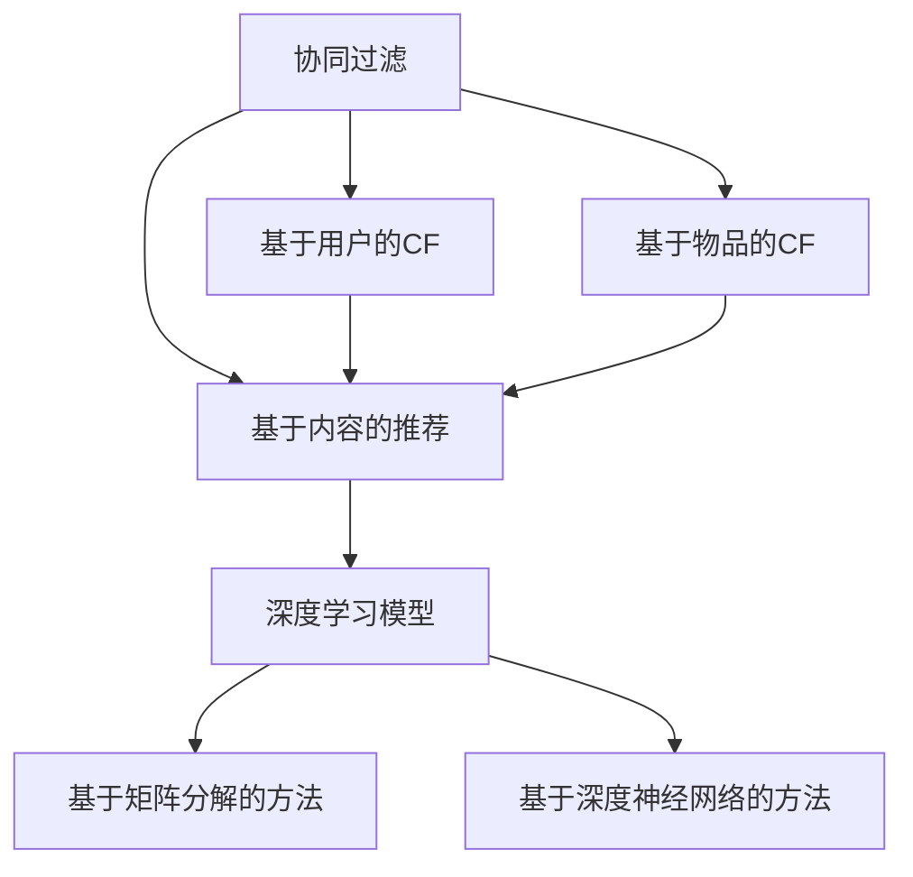

                 

# 传统搜索推荐系统的匹配方法

> 关键词：搜索推荐系统, 匹配方法, 协同过滤, 基于内容的推荐, 自然语言处理(NLP), 深度学习模型, 向量空间模型, 信息检索理论

## 1. 背景介绍

在互联网时代，搜索引擎和推荐系统成为了信息获取的重要工具，几乎渗透到人们生活的各个方面。搜索引擎通过分析用户输入的查询语句，快速返回相关网页，满足用户信息检索需求；推荐系统则根据用户的历史行为和偏好，为用户推荐感兴趣的物品，提升用户体验和转化率。

匹配是搜索引擎和推荐系统的核心问题。匹配方法决定了系统是否能准确理解和满足用户需求。本文将详细介绍当前主流的三类匹配方法：协同过滤(Collaborative Filtering, CF)、基于内容的推荐(Content-based Recommendation, CB)、深度学习模型(Deep Learning, DL)。通过剖析其原理和实现，我们希望能为读者提供一个全面的技术概览，并为进一步的研究和应用提供参考。

## 2. 核心概念与联系

### 2.1 核心概念概述

为了更好地理解搜索引擎和推荐系统的匹配方法，下面将介绍几个密切相关的核心概念：

- **协同过滤**：基于用户或物品之间的相似度关系，为用户推荐与历史行为或偏好相似的物品。协同过滤包括基于用户的协同过滤和基于物品的协同过滤两种方式。
- **基于内容的推荐**：利用物品的属性和特征，结合用户的偏好，为每个物品计算一个向量表示，并通过向量之间的相似度匹配用户需求。
- **深度学习模型**：利用多层神经网络，捕捉高维数据的内在结构和复杂关系，训练出高性能的推荐模型。深度学习模型包括基于矩阵分解的方法和基于深度神经网络的方法。
- **向量空间模型**：将用户和物品表示为高维向量，通过计算向量之间的余弦相似度或欧氏距离，进行匹配和推荐。
- **信息检索理论**：用于构建搜索引擎，包括倒排索引、信息检索算法等。

这些概念之间存在着紧密的联系，形成了一个完整的匹配技术生态系统。协同过滤和基于内容的推荐都是基于向量空间模型的应用，而深度学习模型则进一步扩展了向量空间模型的能力和应用范围。搜索引擎和推荐系统的匹配方法，通常会在一定程度上借鉴信息检索理论的技术和方法，如倒排索引和布尔查询等。

### 2.2 概念间的关系

以下用Mermaid流程图展示协同过滤、基于内容的推荐和深度学习模型之间的一般关系：



该流程图展示协同过滤和基于内容的推荐，在基于向量空间模型的基础上，分别使用了基于用户和物品两种不同视角。两种方式最终都通过相似度计算，将物品推荐给用户。而深度学习模型则拓展了向量空间模型的表达能力和学习能力，能够更高效地捕捉用户和物品的复杂特征。

## 3. 核心算法原理 & 具体操作步骤

### 3.1 算法原理概述

搜索引擎和推荐系统的匹配方法，本质上都是将用户需求和物品特征映射到向量空间中，通过计算向量之间的距离或相似度，实现匹配和推荐。这种基于向量的匹配方法，具有直观、高效、可扩展性强等优点。

#### 3.1.1 协同过滤

协同过滤的原理是通过挖掘用户之间或物品之间的相似性，推测用户未尝试过但可能感兴趣的物品。协同过滤分为基于用户的协同过滤和基于物品的协同过滤两种方式。

##### 3.1.1.1 基于用户的协同过滤

基于用户的协同过滤，首先计算用户之间的相似度，然后根据相似度推荐用户未访问过的物品。

基于用户的协同过滤通常采用Pearson相关系数或余弦相似度计算用户之间的相似度：

$$
similarity(u_i, u_j) = \frac{\sum_{k=1}^{n}(r_{i,k} - \mu_i)(r_{j,k} - \mu_j)}{\sqrt{\sum_{k=1}^{n}(r_{i,k} - \mu_i)^2} \sqrt{\sum_{k=1}^{n}(r_{j,k} - \mu_j)^2}}
$$

其中，$r_{i,k}$ 表示用户 $i$ 对物品 $k$ 的评分，$\mu_i$ 和 $\mu_j$ 分别为用户 $i$ 和用户 $j$ 的评分均值，$n$ 表示物品数量。

基于用户的协同过滤过程如下：
1. 计算用户 $i$ 与所有用户之间的相似度。
2. 选择与用户 $i$ 最相似的前 $k$ 个用户。
3. 对每个用户 $j$ 访问过的物品，推荐给用户 $i$ 的未访问物品。

##### 3.1.1.2 基于物品的协同过滤

基于物品的协同过滤，首先计算物品之间的相似度，然后根据相似度为用户推荐未尝试过的物品。

基于物品的协同过滤通常采用Pearson相关系数或余弦相似度计算物品之间的相似度：

$$
similarity(i_k, i_j) = \frac{\sum_{u=1}^{m}(r_{u,k} - \mu_k)(r_{u,j} - \mu_j)}{\sqrt{\sum_{u=1}^{m}(r_{u,k} - \mu_k)^2} \sqrt{\sum_{u=1}^{m}(r_{u,j} - \mu_j)^2}}
$$

其中，$r_{u,k}$ 表示用户 $u$ 对物品 $k$ 的评分，$\mu_k$ 和 $\mu_j$ 分别为物品 $k$ 和物品 $j$ 的评分均值，$m$ 表示用户数量。

基于物品的协同过滤过程如下：
1. 计算物品 $k$ 与所有物品之间的相似度。
2. 选择与物品 $k$ 最相似的前 $k'$ 个物品。
3. 对每个物品 $i$ 访问过的物品，推荐给用户 $i$ 的未访问物品。

#### 3.1.2 基于内容的推荐

基于内容的推荐，利用物品的属性和特征，计算物品向量与用户偏好向量的相似度，实现匹配和推荐。

基于内容的推荐通常使用向量空间模型，将物品的属性表示为向量，与用户的偏好向量进行匹配。假设物品 $k$ 的属性向量为 $v_k = (v_{k1}, v_{k2}, ..., v_{km})$，用户 $i$ 的偏好向量为 $u_i = (u_{i1}, u_{i2}, ..., u_{im})$，则两者之间的余弦相似度为：

$$
similarity(i, k) = \cos(\theta) = \frac{v_i \cdot v_k}{||v_i|| ||v_k||}
$$

其中，$v_i \cdot v_k$ 表示向量 $v_i$ 和 $v_k$ 的点积，$||v_i||$ 和 $||v_k||$ 分别表示向量 $v_i$ 和 $v_k$ 的模长。

基于内容的推荐过程如下：
1. 对每个物品计算其属性向量。
2. 计算物品向量与用户偏好向量的余弦相似度。
3. 选择相似度最高的前 $k'$ 个物品进行推荐。

#### 3.1.3 深度学习模型

深度学习模型利用多层神经网络，捕捉高维数据的内在结构和复杂关系，训练出高性能的推荐模型。深度学习模型可以分为基于矩阵分解的方法和基于深度神经网络的方法两种。

##### 3.1.3.1 基于矩阵分解的方法

基于矩阵分解的方法，通过将用户-物品矩阵分解为两个低维矩阵，捕捉用户和物品的隐向量表示，实现推荐。

用户 $i$ 和物品 $k$ 的隐向量表示分别为 $u_i$ 和 $v_k$，两者通过矩阵 $P$ 进行映射：

$$
\hat{u_i} = P_i u_i
$$
$$
\hat{v_k} = P_k v_k
$$

其中，$P$ 是一个稀疏矩阵，$P_i$ 和 $P_k$ 分别为用户和物品的映射矩阵。用户 $i$ 对物品 $k$ 的预测评分 $\hat{r}_{i,k}$ 为：

$$
\hat{r}_{i,k} = u_i^T v_k
$$

基于矩阵分解的方法过程如下：
1. 对用户-物品矩阵进行矩阵分解。
2. 使用分解得到的用户和物品隐向量计算预测评分。
3. 选择预测评分最高的前 $k'$ 个物品进行推荐。

##### 3.1.3.2 基于深度神经网络的方法

基于深度神经网络的方法，通过多层神经网络对用户和物品进行特征抽取和表示学习，实现推荐。

常用的深度神经网络推荐模型包括循环神经网络(RNN)、卷积神经网络(CNN)、自编码器(AE)、深度信念网络(DBN)等。以一个简单的全连接神经网络为例，假设用户和物品的特征向量分别为 $u_i$ 和 $v_k$，用户 $i$ 对物品 $k$ 的预测评分 $\hat{r}_{i,k}$ 为：

$$
\hat{r}_{i,k} = W^{(1)} u_i + b^{(1)}
$$
$$
\hat{r}_{i,k} = W^{(2)} \hat{r}_{i,k} + b^{(2)}
$$
$$
\hat{r}_{i,k} = W^{(3)} \hat{r}_{i,k} + b^{(3)}
$$
$$
\hat{r}_{i,k} = W^{(4)} \hat{r}_{i,k} + b^{(4)}
$$
$$
\hat{r}_{i,k} = \sigma(W^{(5)} \hat{r}_{i,k} + b^{(5)})
$$

其中，$W^{(1)}$ 至 $W^{(5)}$ 为网络权重矩阵，$b^{(1)}$ 至 $b^{(5)}$ 为偏置向量，$\sigma$ 为激活函数。

基于深度神经网络的方法过程如下：
1. 使用神经网络对用户和物品特征进行表示学习。
2. 通过多层神经网络对表示学习结果进行集成和预测。
3. 选择预测评分最高的前 $k'$ 个物品进行推荐。

### 3.2 算法步骤详解

以下是搜索引擎和推荐系统中基于向量空间模型的匹配方法的详细步骤：

#### 3.2.1 协同过滤

##### 3.2.1.1 基于用户的协同过滤

1. 收集用户行为数据，如用户对物品的评分、点击、购买等。
2. 计算用户之间的相似度。
3. 选择与用户 $i$ 最相似的前 $k$ 个用户。
4. 对每个用户 $j$ 访问过的物品，推荐给用户 $i$ 的未访问物品。

##### 3.2.1.2 基于物品的协同过滤

1. 收集物品的行为数据，如用户对物品的评分、点击、购买等。
2. 计算物品之间的相似度。
3. 选择与物品 $k$ 最相似的前 $k'$ 个物品。
4. 对每个物品 $i$ 访问过的物品，推荐给用户 $i$ 的未访问物品。

#### 3.2.2 基于内容的推荐

1. 收集物品的属性和特征数据。
2. 对每个物品计算其属性向量。
3. 计算物品向量与用户偏好向量的余弦相似度。
4. 选择相似度最高的前 $k'$ 个物品进行推荐。

#### 3.2.3 深度学习模型

##### 3.2.3.1 基于矩阵分解的方法

1. 收集用户-物品矩阵。
2. 对用户-物品矩阵进行矩阵分解。
3. 使用分解得到的用户和物品隐向量计算预测评分。
4. 选择预测评分最高的前 $k'$ 个物品进行推荐。

##### 3.2.3.2 基于深度神经网络的方法

1. 收集用户和物品的特征数据。
2. 使用神经网络对用户和物品特征进行表示学习。
3. 通过多层神经网络对表示学习结果进行集成和预测。
4. 选择预测评分最高的前 $k'$ 个物品进行推荐。

### 3.3 算法优缺点

#### 3.3.1 协同过滤

协同过滤的优点是简单易实现，适用于大规模数据集。但是协同过滤的缺点也是明显的，如冷启动问题、稀疏性问题等。冷启动问题指的是新用户或新物品缺乏历史行为数据，无法进行推荐；稀疏性问题则是指用户和物品之间的交互较少，导致矩阵稀疏，难以准确捕捉用户和物品之间的关系。

#### 3.3.2 基于内容的推荐

基于内容的推荐不需要大量的用户和物品交互数据，适用于数据稀疏的情况。但是基于内容的推荐也有其局限性，如物品属性稀疏、物品之间特征缺乏关联等。此外，基于内容的推荐对物品属性的刻画需要人工标注，增加了工作量。

#### 3.3.3 深度学习模型

深度学习模型的优点是能够捕捉高维数据的复杂结构和特征，适用于大规模数据集和冷启动问题。但是深度学习模型需要大量的训练数据和计算资源，模型复杂度较高，对参数调优和模型训练要求较高。

### 3.4 算法应用领域

#### 3.4.1 协同过滤

协同过滤适用于商品推荐、新闻推荐、音乐推荐等领域，能够利用用户之间的相似性进行推荐，提升用户体验和满意度。

#### 3.4.2 基于内容的推荐

基于内容的推荐适用于商品推荐、电影推荐、新闻推荐等领域，能够利用物品的属性和特征进行推荐，提升推荐效果。

#### 3.4.3 深度学习模型

深度学习模型适用于商品推荐、音乐推荐、电影推荐等领域，能够利用复杂的网络结构和特征学习，提升推荐效果和多样性。

## 4. 数学模型和公式 & 详细讲解 & 举例说明

### 4.1 数学模型构建

搜索引擎和推荐系统的匹配方法，通常基于向量空间模型构建数学模型。以下以协同过滤和基于内容的推荐为例，介绍数学模型的构建。

#### 4.1.1 协同过滤

协同过滤的数学模型基于用户和物品之间的相似度计算，假设用户 $i$ 对物品 $k$ 的评分 $r_{i,k}$ 为：

$$
r_{i,k} = \alpha u_i^T v_k + \beta
$$

其中，$\alpha$ 和 $\beta$ 为超参数，$u_i$ 和 $v_k$ 分别为用户 $i$ 和物品 $k$ 的隐向量表示。

#### 4.1.2 基于内容的推荐

基于内容的推荐的数学模型基于向量空间模型，假设物品 $k$ 的属性向量为 $v_k = (v_{k1}, v_{k2}, ..., v_{km})$，用户 $i$ 的偏好向量为 $u_i = (u_{i1}, u_{i2}, ..., u_{im})$，则两者之间的余弦相似度为：

$$
similarity(i, k) = \cos(\theta) = \frac{v_i \cdot v_k}{||v_i|| ||v_k||}
$$

### 4.2 公式推导过程

#### 4.2.1 协同过滤

协同过滤的公式推导过程如下：

1. 根据用户和物品之间的评分数据，构建用户-物品矩阵 $R$：

$$
R = \begin{bmatrix}
   r_{1,1} & r_{1,2} & \cdots & r_{1,n} \\
   r_{2,1} & r_{2,2} & \cdots & r_{2,n} \\
   \vdots & \vdots & \ddots & \vdots \\
   r_{m,1} & r_{m,2} & \cdots & r_{m,n}
\end{bmatrix}
$$

2. 对用户-物品矩阵进行矩阵分解，得到用户和物品的隐向量表示 $U$ 和 $V$：

$$
R = \begin{bmatrix}
   u_1 & u_2 & \cdots & u_m \\
   v_1 & v_2 & \cdots & v_n
\end{bmatrix}
$$

3. 计算用户 $i$ 对物品 $k$ 的预测评分 $\hat{r}_{i,k}$：

$$
\hat{r}_{i,k} = u_i^T v_k
$$

#### 4.2.2 基于内容的推荐

基于内容的推荐的公式推导过程如下：

1. 对每个物品 $k$ 计算其属性向量 $v_k = (v_{k1}, v_{k2}, ..., v_{km})$。
2. 对每个用户 $i$ 计算其偏好向量 $u_i = (u_{i1}, u_{i2}, ..., u_{im})$。
3. 计算用户 $i$ 对物品 $k$ 的预测评分 $\hat{r}_{i,k}$：

$$
\hat{r}_{i,k} = v_i \cdot v_k
$$

其中，$v_i \cdot v_k$ 表示向量 $v_i$ 和 $v_k$ 的点积。

### 4.3 案例分析与讲解

#### 4.3.1 协同过滤案例

假设我们有一个电影推荐系统，需要为用户推荐其未看过但可能感兴趣的影片。我们收集了用户对电影的评分数据，通过协同过滤方法计算用户之间的相似度，选择与用户 $i$ 最相似的前 $k$ 个用户，然后对每个用户 $j$ 访问过的电影，推荐给用户 $i$ 的未访问电影。

例如，用户 $i$ 的评分数据为：

$$
R_i = \begin{bmatrix}
   0 & 4 & 0 \\
   3 & 0 & 5 \\
   0 & 2 & 0
\end{bmatrix}
$$

用户 $j$ 的评分数据为：

$$
R_j = \begin{bmatrix}
   5 & 0 & 3 \\
   0 & 0 & 0 \\
   0 & 1 & 0
\end{bmatrix}
$$

计算用户 $i$ 和用户 $j$ 之间的相似度：

$$
similarity(i, j) = \frac{(4 \times 5 + 0 \times 0 + 0 \times 0)}{\sqrt{4^2 + 0^2 + 0^2} \sqrt{5^2 + 0^2 + 3^2}} = \frac{20}{\sqrt{16} \sqrt{34}} = \frac{20}{6} = \frac{10}{3}
$$

选择与用户 $i$ 最相似的前 $k$ 个用户，并计算每个用户 $j$ 访问过的电影，推荐给用户 $i$ 的未访问电影。

#### 4.3.2 基于内容的推荐案例

假设我们有一个图书推荐系统，需要为用户推荐其未读过的图书。我们收集了图书的属性数据，如作者、出版年份、评分等，对每个图书计算其属性向量 $v_k = (v_{k1}, v_{k2}, ..., v_{km})$，然后对每个用户 $i$ 计算其偏好向量 $u_i = (u_{i1}, u_{i2}, ..., u_{im})$，计算用户 $i$ 对图书 $k$ 的预测评分 $\hat{r}_{i,k}$：

例如，图书 $k$ 的属性向量为：

$$
v_k = (0.5, 0.2, 0.3, 0.1)
$$

用户 $i$ 的偏好向量为：

$$
u_i = (0.4, 0.3, 0.2, 0.1)
$$

计算用户 $i$ 对图书 $k$ 的预测评分：

$$
\hat{r}_{i,k} = (0.4 \times 0.5 + 0.3 \times 0.2 + 0.2 \times 0.3 + 0.1 \times 0.1) = 0.25 + 0.06 + 0.06 + 0.01 = 0.37
$$

选择预测评分最高的前 $k'$ 个图书进行推荐。

## 5. 项目实践：代码实例和详细解释说明

### 5.1 开发环境搭建

在进行搜索引擎和推荐系统的匹配方法实践前，我们需要准备好开发环境。以下是使用Python进行TensorFlow开发的环境配置流程：

1. 安装Anaconda：从官网下载并安装Anaconda，用于创建独立的Python环境。

2. 创建并激活虚拟环境：
```bash
conda create -n tf-env python=3.8 
conda activate tf-env
```

3. 安装TensorFlow：根据CUDA版本，从官网获取对应的安装命令。例如：
```bash
conda install tensorflow tensorflow-gpu=2.6 -c conda-forge -c nvidia
```

4. 安装各类工具包：
```bash
pip install numpy pandas scikit-learn matplotlib tqdm jupyter notebook ipython
```

完成上述步骤后，即可在`tf-env`环境中开始匹配方法实践。

### 5.2 源代码详细实现

这里我们以协同过滤为例，给出使用TensorFlow对协同过滤算法进行代码实现。

首先，定义协同过滤模型的参数和初始化：

```python
import tensorflow as tf
import numpy as np

def collaborative_filtering_model(num_users, num_items, num_factors):
    # 定义模型参数
    user_embeddings = tf.Variable(tf.random.normal(shape=(num_users, num_factors)))
    item_embeddings = tf.Variable(tf.random.normal(shape=(num_items, num_factors)))
    user_bias = tf.Variable(tf.zeros(shape=(num_users, 1)))
    item_bias = tf.Variable(tf.zeros(shape=(num_items, 1)))
    
    # 定义模型变量
    user_vec = tf.keras.layers.Input(shape=(1,), name='user_vec')
    item_vec = tf.keras.layers.Input(shape=(1,), name='item_vec')
    
    # 计算用户和物品的隐向量表示
    user_emb = tf.nn.embedding_lookup(tf.cast(user_embeddings, tf.float32), user_vec)
    item_emb = tf.nn.embedding_lookup(tf.cast(item_embeddings, tf.float32), item_vec)
    
    # 计算预测评分
    pred = tf.reduce_sum(user_emb * item_emb, axis=1)
    pred = tf.keras.layers.Dense(1, name='pred')(tf.concat([pred, user_bias, item_bias], axis=1))
    
    # 定义模型输出
    output = tf.keras.layers.Dense(1, activation='sigmoid')(pred)
    model = tf.keras.models.Model(inputs=[user_vec, item_vec], outputs=output)
    
    return model
```

然后，定义协同过滤算法的训练和评估函数：

```python
# 定义训练函数
def train_model(model, data, learning_rate=0.01, epochs=100):
    # 定义损失函数和优化器
    loss_fn = tf.keras.losses.BinaryCrossentropy()
    optimizer = tf.keras.optimizers.Adam(learning_rate)
    
    # 训练模型
    model.compile(optimizer=optimizer, loss=loss_fn, metrics=['accuracy'])
    model.fit(data['user_vec'], data['item_vec'], epochs=epochs, validation_split=0.2, batch_size=32)
    
# 定义评估函数
def evaluate_model(model, data, epochs=100):
    # 评估模型
    loss, accuracy = model.evaluate(data['user_vec'], data['item_vec'], verbose=0)
    print(f'Loss: {loss:.4f}, Accuracy: {accuracy:.4f}')
```

最后，启动协同过滤算法的训练和评估：

```python
# 加载数据集
data = np.load('data.npy')

# 定义协同过滤模型
model = collaborative_filtering_model(data['num_users'], data['num_items'], data['num_factors'])

# 训练协同过滤模型
train_model(model, data, epochs=100)

# 评估协同过滤模型
evaluate_model(model, data, epochs=100)
```

以上就是使用TensorFlow对协同过滤算法进行代码实现的完整示例。可以看到，TensorFlow提供了强大的计算图功能，使得协同过滤算法的实现变得简洁高效。

### 5.3 代码解读与分析

让我们再详细解读一下关键代码的实现细节：

**collaborative_filtering_model函数**：
- `user_embeddings`和`item_embeddings`：定义用户和物品的隐向量表示，用于后续计算预测评分。
- `user_bias`和`item_bias`：定义用户和物品的偏置项，用于引入偏差。
- `user_vec`和`item_vec`：定义输入的user和item向量，用于提取用户和物品的隐向量表示。
- `user_emb`和`item_emb`：通过`tf.nn.embedding_lookup`函数，将user_vec和item_vec分别映射到`user_embeddings`和`item_embeddings`上，得到用户和物品的隐向量表示。
- `pred`：计算用户和物品的隐向量表示的点积，得到预测评分。
- `pred`：将预测评分通过`tf.keras.layers.Dense`函数进行线性变换，得到预测输出。
- `output`：将预测输出通过`tf.keras.layers.Dense`函数进行sigmoid激活，得到最终的推荐评分。
- `model`：构建模型，指定输入和输出。

**train_model函数**：
- `loss_fn`和`optimizer`：定义损失函数和优化器。

