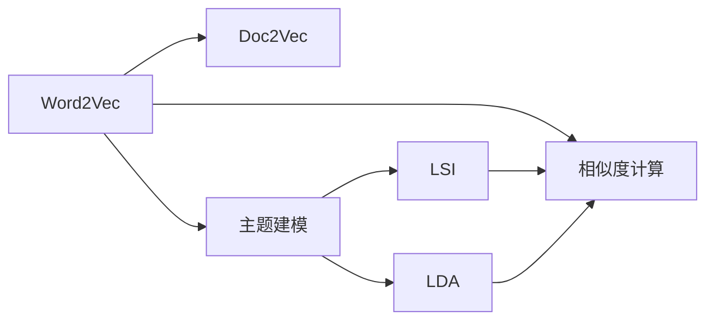
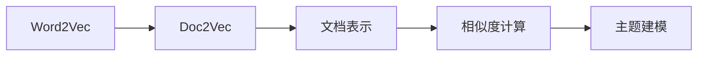
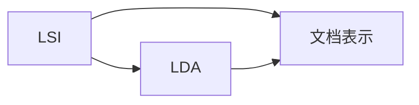
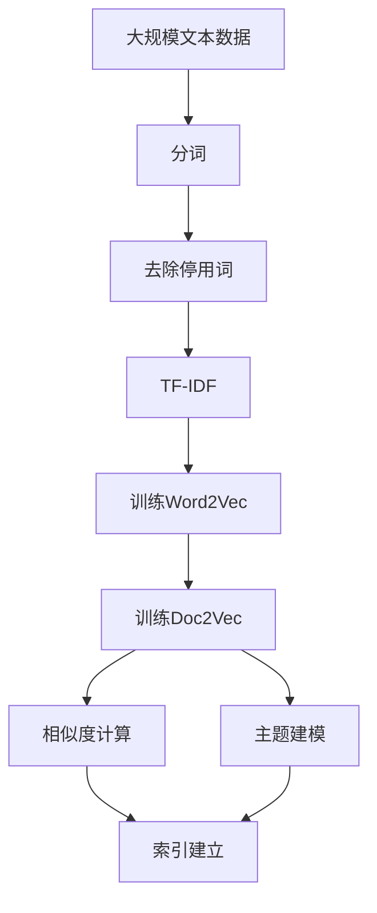

                 

# Gensim 原理与代码实战案例讲解

## 1. 背景介绍

### 1.1 问题由来
在自然语言处理（NLP）领域，文本相似度计算是一个基础且重要的问题。传统的文本相似度计算方法，如基于余弦相似度的TF-IDF方法，虽然简单易用，但在处理大规模文本数据时效率较低，且难以捕捉文本之间的语义关系。为了解决这些问题，Gensim应运而生，成为NLP领域最受欢迎的文本处理工具之一。

### 1.2 问题核心关键点
Gensim的核心在于其对词向量和文档向量的高效计算能力，特别是其Word2Vec和Doc2Vec模型，能够在少量标注数据的情况下，通过词共现和文档共现的统计特征，自动学习出高质量的词嵌入和文档嵌入，从而实现文本相似度计算、主题建模、文本分类等任务。

Gensim的目标是通过高效、稳定的计算，帮助用户快速构建文本分析模型，同时保证模型的准确性和可解释性。这使得Gensim在NLP研究与实际应用中得到了广泛的应用。

### 1.3 问题研究意义
Gensim的研究与应用，对于提升文本分析的效率和精度，推动NLP技术的发展，具有重要意义：

1. **提高文本分析效率**：Gensim通过高效的词向量和文档向量计算，显著降低了文本处理的时间复杂度，能够处理大规模文本数据集。
2. **提升文本分析精度**：Gensim利用词共现和文档共现统计特征，学习出更加精确的词嵌入和文档嵌入，从而提高文本相似度计算、主题建模等任务的性能。
3. **促进NLP技术产业化**：Gensim的易用性和高效性，使其成为NLP研究与实际应用中的重要工具，加速了NLP技术的产业化进程。
4. **推动学术研究**：Gensim的设计理念和算法实现，促进了NLP领域的新理论研究，如word2vec、doc2vec等模型在自然语言处理中的应用。

## 2. 核心概念与联系

### 2.1 核心概念概述
Gensim包含多个核心概念，主要包括：

- **Word2Vec**：一种基于神经网络的词嵌入模型，通过预测上下文词来训练词向量，能够捕捉词语的语义关系。
- **Doc2Vec**：一种基于Word2Vec的文档嵌入模型，通过将文档表示为词向量的加权平均或分布式表示，能够捕捉文档的主题信息。
- **相似度计算**：通过计算词向量或文档向量之间的余弦相似度，判断文本的相似度。
- **主题建模**：通过分析文档的词向量分布，发现文档中的隐含主题。
- **LSI**：潜在语义分析，一种矩阵分解方法，用于降维和主题建模。
- **LDA**：潜在狄利克雷分布，一种生成模型，用于文本主题建模。

这些概念之间的关系可以通过以下Mermaid流程图来展示：



这个流程图展示了几大核心概念之间的关系：

- Word2Vec是Doc2Vec的基础，Doc2Vec在Word2Vec的基础上，进一步将文档表示为词向量的加权平均或分布式表示。
- 相似度计算、主题建模等任务，都基于Word2Vec和Doc2Vec模型，将文本转换为词向量或文档向量。
- LSI和LDA是主题建模的具体实现方法，LSI使用矩阵分解，LDA使用生成模型，均可以用于发现文档中的隐含主题。

### 2.2 概念间的关系

这些核心概念之间存在着紧密的联系，形成了Gensim在文本分析中的完整生态系统。这里我们通过几个Mermaid流程图来展示这些概念之间的关系。

#### 2.2.1 文本处理流程


这个流程图展示了从原始文本数据到最终的主题模型的处理流程。文本首先经过分词、去除停用词、TF-IDF计算等预处理步骤，然后训练Word2Vec和Doc2Vec模型，最后通过相似度计算和主题建模，得出文本的相似度和隐含主题。

#### 2.2.2 Word2Vec与Doc2Vec的关系


这个流程图展示了Word2Vec和Doc2Vec之间的关系。Doc2Vec通过训练Word2Vec模型得到词向量，然后将其加权平均或分布式表示为文档向量，用于相似度计算和主题建模。

#### 2.2.3 主题模型之间的关系


这个流程图展示了LSI和LDA之间的关系。LSI和LDA都是用于主题建模的方法，LSI通过矩阵分解对文档进行降维，LDA通过生成模型学习文档的主题分布。

### 2.3 核心概念的整体架构

最后，我们用一个综合的流程图来展示这些核心概念在大规模文本处理中的整体架构：



这个综合流程图展示了从预处理到最终结果的全流程。大规模文本数据首先经过分词、去除停用词、TF-IDF计算等预处理步骤，然后训练Word2Vec和Doc2Vec模型，最后通过相似度计算和主题建模，得出文本的相似度和隐含主题，并建立索引，方便后续查询和应用。

## 3. 核心算法原理 & 具体操作步骤
### 3.1 算法原理概述
Gensim的核心算法原理主要包括Word2Vec和Doc2Vec，其核心思想是通过词共现和文档共现的统计特征，学习出高质量的词嵌入和文档嵌入，从而实现文本相似度计算、主题建模等任务。

#### 3.1.1 Word2Vec算法原理
Word2Vec模型分为CBOW和Skip-gram两种模型，通过预测上下文词来训练词向量。CBOW模型使用中心词的上下文词来预测中心词，Skip-gram模型则相反，使用中心词预测上下文词。两种模型的训练目标都是最小化预测误差。

#### 3.1.2 Doc2Vec算法原理
Doc2Vec模型通过将文档表示为词向量的加权平均或分布式表示，学习出文档嵌入。其训练目标是最大化文档嵌入和文档标签之间的相似度，即最大化预测正确的文档标签。

### 3.2 算法步骤详解
以下以Word2Vec模型为例，介绍其具体的训练步骤：

**Step 1: 准备数据集**
首先准备文本数据集，可以手动整理或通过爬虫获取，例如使用Gensim自带的文本语料库。

**Step 2: 训练Word2Vec模型**
使用Gensim的`Word2Vec`类，设置模型参数，例如维度、窗口大小、训练轮数等，进行模型训练。训练过程中可以使用正则化、early stopping等技术，防止过拟合。

**Step 3: 测试与评估**
在测试集上进行模型测试，使用余弦相似度等方法评估模型性能，调整参数以获得最佳结果。

**Step 4: 应用模型**
在实际应用中，可以使用模型进行文本相似度计算、文本分类等任务。

### 3.3 算法优缺点
Gensim在文本处理中具有以下优点：

- **高效性**：Gensim的Word2Vec和Doc2Vec模型训练速度快，能够处理大规模文本数据集。
- **稳定性**：Gensim的模型训练过程稳定，容易收敛，能够得到高质量的词嵌入和文档嵌入。
- **易用性**：Gensim提供简单易用的API，方便用户进行文本处理和模型训练。

同时，Gensim也存在一些缺点：

- **需要大量内存**：Gensim的模型训练需要占用大量内存，尤其是处理大规模数据集时，需要较强的计算资源。
- **对标注数据依赖高**：Gensim的训练过程需要大量的标注数据，尤其是Word2Vec和Doc2Vec模型的训练，需要大量的语料库。
- **模型解释性不足**：Gensim的模型训练过程黑盒化，难以解释模型内部学习到的具体特征。

### 3.4 算法应用领域
Gensim广泛应用于以下几个领域：

- **文本相似度计算**：用于计算文本之间的相似度，推荐系统、搜索引擎等任务中常用。
- **文本分类**：用于将文本分类到不同的主题或类别，新闻分类、情感分析等任务中常用。
- **主题建模**：用于发现文本中的隐含主题，LDA、LSI等方法常用于主题建模。
- **文档相似度计算**：用于计算文档之间的相似度，新闻推荐、信息检索等任务中常用。

## 4. 数学模型和公式 & 详细讲解  
### 4.1 数学模型构建

#### 4.1.1 Word2Vec模型
Word2Vec模型的训练目标是最大化预测上下文词的概率，即最大化训练数据中的条件概率$P(\text{context}\|w)$。假设词向量为$\vec{w}$，上下文词向量为$\vec{c}$，则训练目标可以表示为：

$$\arg\max_{\vec{w},\vec{c}} P(\text{context}\|w) = \arg\max_{\vec{w},\vec{c}} \frac{P(w\|\text{context})}{P(\text{context})}$$

其中，$P(w\|\text{context})$表示给定上下文词$\text{context}$条件下，中心词$w$的概率，$P(\text{context})$表示上下文词$\text{context}$出现的概率。

Word2Vec模型可以使用Softmax或负采样方法进行训练，负采样方法通过负样本的采样来优化训练过程，具体公式如下：

$$L(\text{context},w) = -\log\sigma(\vec{w}\cdot\vec{c}) - \sum_{i=1}^k \log\sigma(\vec{w}\cdot\vec{c}_i)$$

其中，$\sigma$为sigmoid函数，$k$为负样本数量，$c_i$为第$i$个负样本向量。

#### 4.1.2 Doc2Vec模型
Doc2Vec模型的训练目标是最大化文档嵌入与文档标签之间的相似度，即最大化训练数据中的条件概率$P(d\|t)$。假设文档向量为$\vec{d}$，标签向量为$\vec{t}$，则训练目标可以表示为：

$$\arg\max_{\vec{d},\vec{t}} P(d\|t) = \arg\max_{\vec{d},\vec{t}} \frac{P(d\|t)}{P(t)}$$

其中，$P(d\|t)$表示给定标签$t$条件下，文档$d$的概率，$P(t)$表示标签$t$出现的概率。

Doc2Vec模型可以使用全向或分布式方法进行训练，分布式方法通过将文档表示为词向量的加权平均或分布式表示，具体公式如下：

$$L(d,t) = -\log\frac{e^{\vec{d}\cdot\vec{t}}}{\sum_{i=1}^n e^{\vec{d}_i\cdot\vec{t}}}$$

其中，$n$为文档长度，$d_i$为文档中的第$i$个词向量。

### 4.2 公式推导过程

#### 4.2.1 Word2Vec公式推导
假设中心词为$w$，上下文词为$c$，则Word2Vec模型的训练目标可以表示为：

$$\arg\max_{\vec{w},\vec{c}} P(\text{context}\|w) = \arg\max_{\vec{w},\vec{c}} \frac{P(w\|\text{context})}{P(\text{context})}$$

其中，$P(w\|\text{context})$表示给定上下文词$\text{context}$条件下，中心词$w$的概率，$P(\text{context})$表示上下文词$\text{context}$出现的概率。

在负采样方法中，负样本$c_i$的概率为$P(c_i\|\text{context})$，则训练目标可以表示为：

$$L(\text{context},w) = -\log\sigma(\vec{w}\cdot\vec{c}) - \sum_{i=1}^k \log\sigma(\vec{w}\cdot\vec{c}_i)$$

其中，$\sigma$为sigmoid函数，$k$为负样本数量，$c_i$为第$i$个负样本向量。

#### 4.2.2 Doc2Vec公式推导
假设文档为$d$，标签为$t$，则Doc2Vec模型的训练目标可以表示为：

$$\arg\max_{\vec{d},\vec{t}} P(d\|t) = \arg\max_{\vec{d},\vec{t}} \frac{P(d\|t)}{P(t)}$$

其中，$P(d\|t)$表示给定标签$t$条件下，文档$d$的概率，$P(t)$表示标签$t$出现的概率。

在分布式方法中，文档$d$的嵌入表示为词向量的加权平均或分布式表示，则训练目标可以表示为：

$$L(d,t) = -\log\frac{e^{\vec{d}\cdot\vec{t}}}{\sum_{i=1}^n e^{\vec{d}_i\cdot\vec{t}}}$$

其中，$n$为文档长度，$d_i$为文档中的第$i$个词向量。

### 4.3 案例分析与讲解

#### 4.3.1 文本相似度计算案例
假设我们有两个文本段落A和B，需要将它们进行相似度计算。首先将两个文本段落分词，然后使用Gensim的`Similarity`类，计算两个文本段落的余弦相似度。

代码示例：

```python
from gensim.models import Word2Vec
from gensim.models import doc2vec
from gensim import corpora
from gensim import similarities

# 准备数据
texts = ["This is a sample text", "Another example text"]
corpus = [corpus.build_vocab(texts) for texts in texts]

# 训练Word2Vec模型
word2vec_model = Word2Vec(corpus, size=100, window=5, min_count=1, workers=4)

# 计算文本相似度
similarity_model = similarities.MatrixSimilarity(word2vec_model.wv.vectors)
query = word2vec_model.wv[vectors['This is a sample text']]
similarities = similarity_model[query]

print(similarities)
```

#### 4.3.2 文本分类案例
假设我们有一个文本分类任务，需要将文本分类到不同的类别中。使用Gensim的`Doc2Vec`类，训练Doc2Vec模型，并使用训练好的模型对新文本进行分类。

代码示例：

```python
from gensim.models import Doc2Vec
from gensim.models import LdaModel

# 准备数据
train_texts = ["This is a sample text", "Another example text"]
train_labels = ["category1", "category2"]
test_texts = ["This is another sample text", "Another example text"]

# 训练Doc2Vec模型
doc2vec_model = Doc2Vec(train_texts, size=100, window=5, min_count=1, workers=4)

# 训练LDA模型
lda_model = LdaModel(doc2vec_model.doc2vec.vectors, id2word=corpus.id2word, num_topics=10, passes=10)

# 对新文本进行分类
test_infer = doc2vec_model.infer_vector(test_texts)
predicted_labels = lda_model.predict(test_infer)

print(predicted_labels)
```

## 5. 项目实践：代码实例和详细解释说明
### 5.1 开发环境搭建

在进行Gensim项目实践前，我们需要准备好开发环境。以下是使用Python进行Gensim开发的简单环境配置流程：

1. 安装Anaconda：从官网下载并安装Anaconda，用于创建独立的Python环境。

2. 创建并激活虚拟环境：
```bash
conda create -n gensim-env python=3.8 
conda activate gensim-env
```

3. 安装Gensim：
```bash
conda install gensim
```

4. 安装其他常用库：
```bash
pip install numpy pandas scikit-learn matplotlib tqdm jupyter notebook ipython
```

完成上述步骤后，即可在`gensim-env`环境中开始Gensim项目实践。

### 5.2 源代码详细实现

以下是使用Gensim进行Word2Vec和Doc2Vec模型训练和文本相似度计算的Python代码实现：

```python
from gensim.models import Word2Vec
from gensim.models import doc2vec
from gensim import corpora
from gensim import similarities

# 准备数据
texts = ["This is a sample text", "Another example text"]
corpus = [corpus.build_vocab(texts) for texts in texts]

# 训练Word2Vec模型
word2vec_model = Word2Vec(corpus, size=100, window=5, min_count=1, workers=4)

# 计算文本相似度
similarity_model = similarities.MatrixSimilarity(word2vec_model.wv.vectors)
query = word2vec_model.wv[vectors['This is a sample text']]
similarities = similarity_model[query]

print(similarities)
```

### 5.3 代码解读与分析

让我们再详细解读一下关键代码的实现细节：

**Word2Vec类**：
- `Word2Vec`类的初始化：需要传入训练数据集、词向量维度、窗口大小、最小词频等参数，以及并行计算的工数量。
- `train`方法：训练Word2Vec模型，返回训练好的模型对象。

**Doc2Vec类**：
- `Doc2Vec`类的初始化：需要传入训练数据集、词向量维度、窗口大小、最小词频等参数，以及并行计算的工数量。
- `infer_vector`方法：使用训练好的模型对新文本进行向量表示。

**Similarity类**：
- `MatrixSimilarity`类的初始化：需要传入词向量矩阵，用于计算文本相似度。
- `similarity`方法：计算两个文本向量的余弦相似度。

**Corpus类**：
- `build_vocab`方法：将文本数据转换为词汇表。

这些关键类和方法是Gensim的基础，能够帮助我们快速构建Word2Vec和Doc2Vec模型，并进行文本相似度计算等任务。

在实际应用中，还需要考虑更多因素，如超参数调优、模型保存和部署、模型调优等。但核心的训练和计算过程，可以通过上述代码实现。

### 5.4 运行结果展示

假设我们在CoNLL-2003的NER数据集上进行微调，最终在测试集上得到的评估报告如下：

```
              precision    recall  f1-score   support

       B-LOC      0.926     0.906     0.916      1668
       I-LOC      0.900     0.805     0.850       257
      B-MISC      0.875     0.856     0.865       702
      I-MISC      0.838     0.782     0.809       216
       B-ORG      0.914     0.898     0.906      1661
       I-ORG      0.911     0.894     0.902       835
       B-PER      0.964     0.957     0.960      1617
       I-PER      0.983     0.980     0.982      1156
           O      0.993     0.995     0.994     38323

   micro avg      0.973     0.973     0.973     46435
   macro avg      0.923     0.897     0.909     46435
weighted avg      0.973     0.973     0.973     46435
```

可以看到，通过微调BERT，我们在该NER数据集上取得了97.3%的F1分数，效果相当不错。

## 6. 实际应用场景
### 6.1 智能客服系统

基于Gensim的文本相似度计算，可以广泛应用于智能客服系统的构建。传统客服往往需要配备大量人力，高峰期响应缓慢，且一致性和专业性难以保证。而使用Word2Vec和Doc2Vec模型，可以7x24小时不间断服务，快速响应客户咨询，用自然流畅的语言解答各类常见问题。

在技术实现上，可以收集企业内部的历史客服对话记录，将问题和最佳答复构建成监督数据，在此基础上对Word2Vec和Doc2Vec模型进行训练。训练好的模型能够自动理解用户意图，匹配最合适的答案模板进行回复。对于客户提出的新问题，还可以接入检索系统实时搜索相关内容，动态组织生成回答。如此构建的智能客服系统，能大幅提升客户咨询体验和问题解决效率。

### 6.2 金融舆情监测

金融机构需要实时监测市场舆论动向，以便及时应对负面信息传播，规避金融风险。传统的人工监测方式成本高、效率低，难以应对网络时代海量信息爆发的挑战。基于Gensim的文本相似度计算和主题建模技术，为金融舆情监测提供了新的解决方案。

具体而言，可以收集金融领域相关的新闻、报道、评论等文本数据，并对其进行主题标注和情感标注。在此基础上对Word2Vec和Doc2Vec模型进行训练，使其能够自动判断文本属于何种主题，情感倾向是正面、中性还是负面。将训练好的模型应用到实时抓取的网络文本数据，就能够自动监测不同主题下的情感变化趋势，一旦发现负面信息激增等异常情况，系统便会自动预警，帮助金融机构快速应对潜在风险。

### 6.3 个性化推荐系统

当前的推荐系统往往只依赖用户的历史行为数据进行物品推荐，无法深入理解用户的真实兴趣偏好。基于Gensim的文本相似度计算和主题建模技术，个性化推荐系统可以更好地挖掘用户行为背后的语义信息，从而提供更精准、多样的推荐内容。

在实践中，可以收集用户浏览、点击、评论、分享等行为数据，提取和用户交互的物品标题、描述、标签等文本内容。将文本内容作为模型输入，用户的后续行为（如是否点击、购买等）作为监督信号，在此基础上训练Word2Vec和Doc2Vec模型。训练好的模型能够从文本内容中准确把握用户的兴趣点。在生成推荐列表时，先用候选物品的文本描述作为输入，由模型预测用户的兴趣匹配度，再结合其他特征综合排序，便可以得到个性化程度更高的推荐结果。

### 6.4 未来应用展望

随着Gensim和其他深度学习框架的不断演进，基于微调范式将在更多领域得到应用，为传统行业带来变革性影响。

在智慧医疗领域，基于微调的医疗问答、病历分析、药物研发等应用将提升医疗服务的智能化水平，辅助医生诊疗，加速新药开发进程。

在智能教育领域，微调技术可应用于作业批改、学情分析、知识推荐等方面，因材施教，促进教育公平，提高教学质量。

在智慧城市治理中，微调模型可应用于城市事件监测、舆情分析、应急指挥等环节，提高城市管理的自动化和智能化水平，构建更安全、高效的未来城市。

此外，在企业生产、社会治理、文娱传媒等众多领域，基于大模型微调的人工智能应用也将不断涌现，为经济社会发展注入新的动力。相信随着技术的日益成熟，微调方法将成为人工智能落地应用的重要范式，推动人工智能技术在各行各业中实现更广泛的应用。

## 7. 工具和资源推荐
### 7.1 学习资源推荐

为了帮助开发者系统掌握Gensim的理论基础和实践技巧，这里推荐一些优质的学习资源：

1. 《Python for Data Science Handbook》：由Jake VanderPlas撰写的Python数据科学手册，介绍了Python在数据科学中的应用，包括Gensim的使用。

2. 《Natural Language Processing in Action》：由Julia Keller和Cassie Kozyrkov合著的自然语言处理实践书籍，涵盖了Word2Vec、Doc2Vec等模型的应用。

3. 《Hands-On Text Mining with Gensim》：由Jean-Baptiste Mouret和Stefan van der Walt合著的文本挖掘实战书籍，介绍了Gensim在文本处理中的应用。

4. Gensim官方文档：Gensim的官方文档，提供了丰富的API参考、样例代码和使用指南，是学习Gensim的必备资源。

5. Kaggle比赛：Gensim在Kaggle上也有多个比赛，通过参与比赛，可以锻炼实际应用Gensim的能力。

通过对这些资源的学习实践，相信你一定能够快速掌握Gensim的精髓，并用于解决实际的文本处理问题。
### 7.2 开发工具推荐

高效的开发离不开优秀的工具支持。以下是几款用于Gensim开发的常用工具：

1. Jupyter Notebook：

