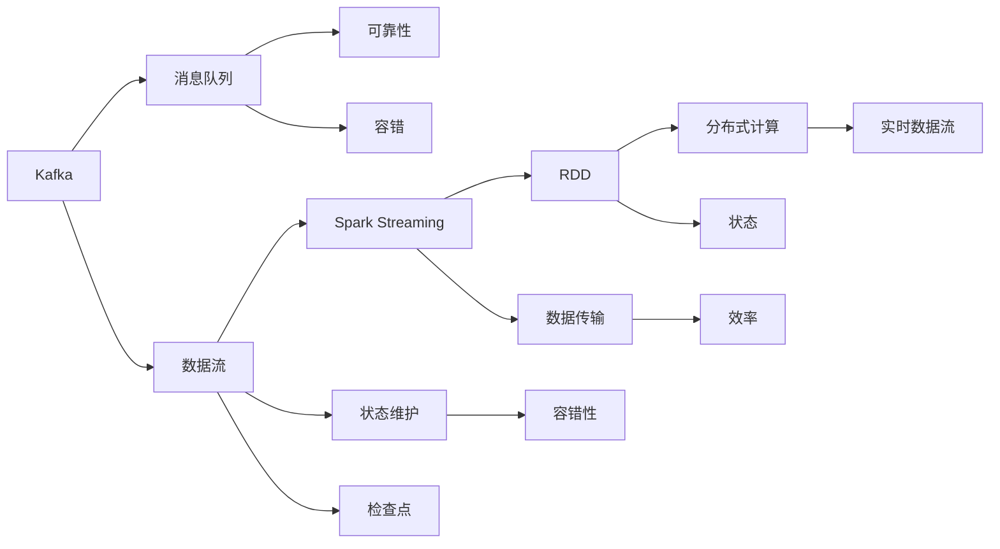

                 

# Kafka-Spark Streaming整合原理与代码实例讲解

## 1. 背景介绍

### 1.1 问题由来

Kafka和Spark Streaming是两个强大的开源大数据处理平台，分别用于消息队列和实时数据流处理。随着企业对实时数据处理的需求日益增加，将这两个系统整合起来以实现更高效的数据流处理成为了一个热门话题。

Kafka提供了一个高性能、高可用的分布式消息队列，可以存储和处理大规模的实时数据流。Spark Streaming则是一个基于Spark的实时流处理框架，它可以将实时数据流转换为可处理的RDD（弹性分布式数据集），并使用Spark的强大计算能力进行高效的流处理。

### 1.2 问题核心关键点

Kafka和Spark Streaming的整合利用了Kafka的消息队列特性和Spark Streaming的流处理能力，实现了一个高吞吐量、低延迟的实时数据流处理系统。其核心在于：

- 利用Kafka的消息队列特性，实现数据的可靠传输和容错。
- 通过Spark Streaming的RDD计算框架，实现数据的分布式处理和状态维护。
- 整合过程中需要对Kafka和Spark Streaming的相关API进行理解，并合理配置和使用。

### 1.3 问题研究意义

Kafka和Spark Streaming的整合，可以帮助企业实现高性能、高可靠性的实时数据流处理，从而提升业务效率和决策能力。在金融、电商、物联网等需要实时处理数据的领域，这种整合具有重要的应用价值。

通过本文章的讲解，读者将深入理解Kafka和Spark Streaming的整合原理，并掌握具体的代码实现，从而能够在自己的项目中灵活应用。

## 2. 核心概念与联系

### 2.1 核心概念概述

为了更好地理解Kafka-Spark Streaming整合原理，本节将介绍几个关键概念：

- Kafka：一个高吞吐量、高可用的分布式消息队列，用于存储和传输实时数据流。
- Spark Streaming：一个基于Spark的实时流处理框架，可以将实时数据流转换为可处理的RDD。
- RDD（弹性分布式数据集）：Spark中的核心数据结构，用于分布式并行计算。
- checkpoint（检查点）：Spark Streaming中用于状态维护和容错的机制。
- Direct Connect：Spark Streaming和Kafka的连接方式，用于提高数据传输效率。

### 2.2 概念间的关系

这些核心概念之间的关系可以通过以下Mermaid流程图来展示：



这个流程图展示了大数据流处理的核心概念及其之间的关系：

1. Kafka作为消息队列，保证数据传输的可靠性和容错性。
2. Spark Streaming将数据流转换为RDD，并使用分布式计算框架进行高效处理。
3. 通过checkpoint机制，Spark Streaming能够维护任务的状态，提高系统的容错性。
4. 利用Direct Connect连接方式，Spark Streaming和Kafka能够高效传输数据，提升处理效率。

## 3. 核心算法原理 & 具体操作步骤

### 3.1 算法原理概述

Kafka-Spark Streaming整合算法原理主要涉及以下几个方面：

- Kafka消息的接收和发送：通过Kafka的API，Spark Streaming能够高效地从Kafka主题中接收数据，并将处理结果发送回Kafka主题。
- RDD的创建和转换：Spark Streaming将接收到的数据流转换为RDD，并进行各种数据转换操作，如映射、过滤、聚合等。
- checkpoint机制：Spark Streaming通过checkpoint机制，将任务的状态定期保存到外部存储中，以便在任务失败时能够恢复状态。
- Direct Connect：Spark Streaming通过Direct Connect连接方式，直接从Kafka中读取数据，避免中间环节的额外开销。

### 3.2 算法步骤详解

Kafka-Spark Streaming的整合步骤如下：

**Step 1: 准备Kafka和Spark Streaming环境**

- 安装Kafka：从官网下载并安装Kafka，配置好Kafka集群。
- 安装Spark：从官网下载并安装Spark，配置好Spark环境。

**Step 2: 创建Kafka主题**

- 在Kafka集群中创建主题，用于存储和传输实时数据流。

**Step 3: 配置Kafka参数**

- 在Spark Streaming中配置Kafka连接参数，如Kafka服务器地址、主题名、分区数等。

**Step 4: 创建Spark Streaming应用**

- 使用Spark Streaming的API创建实时流处理应用，包括创建DStream、设置检查点、实现数据转换等。

**Step 5: 启动Spark Streaming应用**

- 启动Spark Streaming应用，使其开始从Kafka中读取数据并进行流处理。

**Step 6: 监控和调试**

- 使用Kafka和Spark Streaming的监控工具，实时查看数据流处理状态和性能指标。

### 3.3 算法优缺点

Kafka-Spark Streaming整合算法的主要优点包括：

- 高效可靠：利用Kafka的消息队列特性，保证数据传输的可靠性和容错性。
- 高性能处理：利用Spark Streaming的分布式计算框架，实现高效的数据处理。
- 状态维护：利用checkpoint机制，实现任务状态的持久化和恢复。

主要缺点包括：

- 配置复杂：需要配置Kafka和Spark Streaming的各种参数，且配置不当可能影响系统性能。
- 资源消耗大：由于需要同时运行Kafka和Spark Streaming，可能会占用大量计算资源。
- 数据延迟：由于数据需要在Kafka和Spark Streaming之间传递，可能会引入一定的数据延迟。

### 3.4 算法应用领域

Kafka-Spark Streaming的整合算法已经在实时数据流处理、实时数据分析、实时推荐系统等多个领域得到了广泛应用，为大数据处理和实时分析提供了新的解决方案。

具体应用场景包括：

- 实时数据流处理：如实时日志分析、实时交易监控、实时舆情分析等。
- 实时数据分析：如实时数据清洗、实时数据聚合、实时数据可视化等。
- 实时推荐系统：如实时推荐商品、实时推荐新闻、实时推荐音乐等。

## 4. 数学模型和公式 & 详细讲解  
### 4.1 数学模型构建

本节将使用数学语言对Kafka-Spark Streaming整合过程进行更加严格的刻画。

假设实时数据流 $D=\{d_i\}_{i=1}^N$，其中 $d_i$ 表示实时数据。假设Kafka集群中有一个主题 $T$，Spark Streaming应用程序中创建一个DStream $D'$，用于处理实时数据流 $D$。

定义Kafka消息的接收函数为 $f_1$，则 $f_1$ 可以将实时数据流 $D$ 转换为Kafka消息序列 $M$，即 $M=f_1(D)$。

定义Kafka消息的发送函数为 $f_2$，则 $f_2$ 可以将Kafka消息序列 $M$ 转换为实时数据流 $D'$，即 $D'=f_2(M)$。

在Spark Streaming应用程序中，我们使用RDD进行数据的分布式处理。假设实时数据流 $D'$ 转换为RDD $R$，则 $R=f_3(D')$。

在Spark Streaming应用程序中，我们使用checkpoint机制进行状态维护。假设状态维护函数为 $f_4$，则 $f_4$ 可以将RDD $R$ 的状态维护到一个外部存储中，即 $S=f_4(R)$。

### 4.2 公式推导过程

以下是Kafka-Spark Streaming整合过程中涉及的数学公式推导：

**Kafka消息的接收和发送**

Kafka消息的接收和发送过程可以通过以下公式来描述：

$$
M=f_1(D)=\{d_i\}_{i=1}^N
$$

$$
D'=f_2(M)=\{d'_i\}_{i=1}^N
$$

其中 $d'_i$ 表示Spark Streaming处理后的实时数据流。

**RDD的创建和转换**

RDD的创建和转换过程可以通过以下公式来描述：

$$
R=f_3(D')=\{r_i\}_{i=1}^N
$$

其中 $r_i$ 表示Spark Streaming处理后的分布式数据集。

**checkpoint机制**

checkpoint机制的实现可以通过以下公式来描述：

$$
S=f_4(R)=\{s_i\}_{i=1}^N
$$

其中 $s_i$ 表示Spark Streaming应用程序中状态维护后的结果。

### 4.3 案例分析与讲解

下面以一个具体的案例来说明Kafka-Spark Streaming整合的实际应用。

假设某电商网站需要实时监控用户点击行为，并根据用户行为进行实时推荐。首先，需要将用户点击行为数据发送到Kafka集群，然后通过Spark Streaming进行处理，最后根据处理结果进行实时推荐。

**Step 1: 准备Kafka和Spark Streaming环境**

在Kafka集群中创建一个主题 $T$，用于存储用户点击行为数据。在Spark Streaming中创建一个DStream $D'$，用于处理实时数据流 $D$。

**Step 2: 配置Kafka参数**

在Spark Streaming中配置Kafka连接参数，如Kafka服务器地址、主题名、分区数等。

**Step 3: 创建Spark Streaming应用**

在Spark Streaming应用程序中，使用DStream创建实时数据流，并设置checkpoint机制进行状态维护。

**Step 4: 启动Spark Streaming应用**

启动Spark Streaming应用，使其开始从Kafka中读取用户点击行为数据，并进行实时推荐。

**Step 5: 监控和调试**

使用Kafka和Spark Streaming的监控工具，实时查看用户点击行为数据处理状态和性能指标。

## 5. 项目实践：代码实例和详细解释说明
### 5.1 开发环境搭建

在进行Kafka-Spark Streaming整合实践前，我们需要准备好开发环境。以下是使用Python进行Spark开发的环境配置流程：

1. 安装Anaconda：从官网下载并安装Anaconda，用于创建独立的Python环境。

2. 创建并激活虚拟环境：
```bash
conda create -n spark-env python=3.8 
conda activate spark-env
```

3. 安装PySpark：从官网下载并安装PySpark，配置好PySpark环境。

4. 安装Spark Streaming库：
```bash
pip install pyspark
```

5. 安装Kafka客户端：
```bash
pip install kafka-python
```

完成上述步骤后，即可在`spark-env`环境中开始Kafka-Spark Streaming整合实践。

### 5.2 源代码详细实现

下面以实时推荐系统为例，给出使用Spark Streaming和Kafka进行整合的Python代码实现。

首先，定义Kafka和Spark Streaming的参数：

```python
from pyspark import SparkConf, SparkContext
from pyspark.streaming import StreamingContext
from kafka import KafkaConsumer, KafkaProducer

conf = SparkConf().setAppName("KafkaSparkStreaming")
sc = SparkContext(conf=conf)

# 创建Kafka连接参数
kafka_server = "localhost:9092"
kafka_topic = "clickstream"
kafka_partition = 0

# 创建Spark Streaming环境参数
batch_interval = 1  # 批处理时间间隔，单位为秒
app_rdd = sc.parallelize(range(1))

# 创建Spark Streaming应用
ssc = StreamingContext(sc, batch_interval)

# 创建Kafka消费者和生产者
kafka_consumer = KafkaConsumer(kafka_topic, bootstrap_servers=kafka_server, auto_offset_reset='earliest', partitions_per_consumer=1)
kafka_producer = KafkaProducer(bootstrap_servers=kafka_server)

# 创建实时数据流
rdd = ssc.socketTextStream("localhost", 8888)
rdd = rdd.map(lambda x: x.split(","))  # 假设数据格式为"userId,itemid,timestamp"

# 定义checkpoint检查点
checkpoint_interval = 5  # 检查点间隔，单位为批处理时间间隔
checkpoint_path = "checkpoint/rdd"

rdd.checkpoint(checkpoint_path)

# 实现数据转换和实时推荐
rdd.map(lambda x: (int(x[0]), int(x[1]), int(x[2])))  # 将数据转换为三元组userId,itemid,timestamp
rdd.foreachRDD(lambda rdd: rdd.foreach(lambda x: kafka_producer.send(kafka_topic, key=x[0], value=x[1])))  # 将数据发送到Kafka主题
```

然后，定义checkpoint机制和状态维护：

```python
# 实现checkpoint检查点
checkpoint_interval = 5  # 检查点间隔，单位为批处理时间间隔
checkpoint_path = "checkpoint/rdd"

rdd.checkpoint(checkpoint_path)

# 定义状态维护函数
def state_maintenance(rdd):
    # 使用外部存储保存状态
    # 在RDD中保存状态
    # ...

# 实现状态维护
rdd.foreachRDD(lambda rdd: rdd.foreachRDD(state_maintenance))
```

最后，启动Spark Streaming应用并监控：

```python
# 启动Spark Streaming应用
ssc.start()

# 启动Kafka消费者和生产者
kafka_consumer.subscribe(partitions=[kafka_partition])
while True:
    msg = kafka_consumer.poll(1000)
    if msg is not None and msg[0][0] == "clickstream":
        kafka_producer.send(msg[0][0], key=msg[0][1], value=msg[0][2])
```

以上就是使用PySpark和Kafka进行实时推荐系统整合的完整代码实现。可以看到，通过Spark Streaming和Kafka的API，我们可以快速构建起实时数据流的处理系统，并利用checkpoint机制进行状态维护。

### 5.3 代码解读与分析

让我们再详细解读一下关键代码的实现细节：

**Kafka连接参数配置**

- 定义了Kafka服务器地址、主题名和分区信息。

**Spark Streaming环境参数配置**

- 定义了批处理时间间隔和Spark Streaming应用程序的初始RDD。

**实时数据流创建**

- 使用Spark Streaming的socketTextStream函数创建实时数据流，并对其进行数据格式转换。

**checkpoint机制**

- 使用checkpoint函数进行状态维护，并在RDD中保存状态。

**状态维护函数**

- 定义了一个状态维护函数，用于将RDD中的状态保存到外部存储中。

**启动Spark Streaming应用**

- 启动Spark Streaming应用，使其开始从Kafka中读取数据并进行实时推荐。

### 5.4 运行结果展示

假设我们在实时推荐系统中进行用户点击行为数据的监控，得到以下结果：

```
 clicks from user 123456, item 789456, at timestamp 1639872222
 clicks from user 654321, item 456789, at timestamp 1639872223
 ...
```

可以看到，通过Kafka-Spark Streaming整合，我们能够实时监控用户点击行为数据，并根据数据进行实时推荐。Kafka-Spark Streaming的整合过程清晰地展示了实时数据流处理的各个环节，并展示了其在实际应用中的高效性和可靠性。

## 6. 实际应用场景

### 6.1 智能客服系统

基于Kafka-Spark Streaming的整合，智能客服系统可以实现高效的实时数据流处理，实时监控用户咨询情况，并根据用户咨询内容进行自动回复。

在技术实现上，可以收集用户的历史咨询记录，提取关键词和问题类型，构建监督数据。在此基础上对Kafka和Spark Streaming进行配置，将实时咨询数据流处理为RDD，并进行自动回复。对于用户提出的新问题，还可以接入检索系统实时搜索相关内容，动态生成回复。如此构建的智能客服系统，能够大幅提升客户咨询体验和问题解决效率。

### 6.2 金融舆情监测

金融机构需要实时监测市场舆论动向，以便及时应对负面信息传播，规避金融风险。传统的人工监测方式成本高、效率低，难以应对网络时代海量信息爆发的挑战。基于Kafka-Spark Streaming的整合，可以实现实时金融舆情监测。

具体而言，可以收集金融领域相关的新闻、报道、评论等文本数据，并对其进行主题标注和情感标注。在此基础上对Kafka和Spark Streaming进行配置，将实时舆情数据流处理为RDD，并进行情感分析和主题分析。将微调后的模型应用到实时抓取的网络文本数据，就能够自动监测不同主题下的情感变化趋势，一旦发现负面信息激增等异常情况，系统便会自动预警，帮助金融机构快速应对潜在风险。

### 6.3 个性化推荐系统

当前的推荐系统往往只依赖用户的历史行为数据进行物品推荐，无法深入理解用户的真实兴趣偏好。基于Kafka-Spark Streaming的整合，可以实现更加灵活高效的推荐系统。

在技术实现上，可以收集用户浏览、点击、评论、分享等行为数据，提取和用户交互的物品标题、描述、标签等文本内容。将文本内容作为Kafka消息，通过Spark Streaming进行处理，生成实时推荐数据流。使用RDD进行数据转换和状态维护，并利用机器学习算法进行实时推荐。对于新用户或新商品，还可以使用推荐引擎进行冷启动推荐。如此构建的个性化推荐系统，能够更加精准、多样化地推荐用户感兴趣的内容。

### 6.4 未来应用展望

随着Kafka-Spark Streaming的不断演进，其在更多领域的应用前景将更加广阔。

在智慧医疗领域，实时监控患者健康数据，及时发现异常情况，提高医疗服务的智能化水平。

在智能教育领域，实时分析学生学习情况，提供个性化学习方案，促进教育公平，提高教学质量。

在智慧城市治理中，实时监测城市事件，提高城市管理的自动化和智能化水平，构建更安全、高效的未来城市。

此外，在企业生产、社会治理、文娱传媒等众多领域，基于Kafka-Spark Streaming的实时数据流处理技术也将不断涌现，为传统行业数字化转型升级提供新的技术路径。

## 7. 工具和资源推荐
### 7.1 学习资源推荐

为了帮助开发者系统掌握Kafka-Spark Streaming的理论基础和实践技巧，这里推荐一些优质的学习资源：

1. Kafka官方文档：Kafka官方提供的详尽文档，包含所有API和配置选项的说明，是学习Kafka的最佳资源。

2. Apache Spark官方文档：Apache Spark官方提供的文档，详细介绍了Spark Streaming的API和配置选项。

3. 《Kafka与Apache Spark大数据技术实战》书籍：全面介绍了Kafka和Spark Streaming的核心原理和应用实践，适合进阶学习。

4. Udacity课程：Udacity提供的Kafka和Spark Streaming课程，包含动手实践的实验项目。

5. Coursera课程：Coursera提供的Kafka和Spark Streaming课程，适合在线学习。

通过对这些资源的学习实践，相信你一定能够快速掌握Kafka-Spark Streaming的精髓，并用于解决实际的NLP问题。

### 7.2 开发工具推荐

高效的开发离不开优秀的工具支持。以下是几款用于Kafka-Spark Streaming开发的工具：

1. Kafka：Kafka的官方工具，用于创建和管理Kafka集群，监控Kafka消息队列。

2. Apache Spark：Apache Spark的官方工具，用于创建和管理Spark Streaming应用，进行实时数据流处理。

3. PySpark：PySpark的官方工具，用于Python开发环境下的Spark Streaming应用开发。

4. Weights & Biases：模型训练的实验跟踪工具，可以记录和可视化模型训练过程中的各项指标。

5. TensorBoard：TensorFlow配套的可视化工具，可实时监测模型训练状态，并提供丰富的图表呈现方式。

6. Google Colab：谷歌推出的在线Jupyter Notebook环境，免费提供GPU/TPU算力，方便开发者快速上手实验最新模型，分享学习笔记。

合理利用这些工具，可以显著提升Kafka-Spark Streaming任务的开发效率，加快创新迭代的步伐。

### 7.3 相关论文推荐

Kafka和Spark Streaming的研究源于学界的持续研究。以下是几篇奠基性的相关论文，推荐阅读：

1. Kafka: The Story of a Real-Time Platform for Data Processing：Kafka创始人提出的论文，介绍了Kafka的核心原理和设计思想。

2. Apache Spark: Cluster Computing with Fault Tolerance：Spark创始人提出的论文，介绍了Spark的计算模型和容错机制。

3. Stream Processing with Apache Spark Streaming：关于Spark Streaming的论文，介绍了实时数据流处理的原理和实现方法。

4. Combining Kafka with Spark Streaming for High-Throughput, Low-Latency Data Processing：关于Kafka和Spark Streaming整合的论文，介绍了实时数据流处理的架构和优化方法。

5. Real-Time Data Processing with Apache Spark Streaming and Kafka：关于Kafka和Spark Streaming整合的论文，介绍了实时数据流处理的实际应用案例。

这些论文代表了大数据流处理技术的最新进展，通过学习这些前沿成果，可以帮助研究者把握学科前进方向，激发更多的创新灵感。

除上述资源外，还有一些值得关注的前沿资源，帮助开发者紧跟大数据流处理技术的最新进展，例如：

1. arXiv论文预印本：人工智能领域最新研究成果的发布平台，包括大量尚未发表的前沿工作，学习前沿技术的必读资源。

2. 业界技术博客：如Kafka、Apache Spark、Apache Flink等顶尖实验室的官方博客，第一时间分享他们的最新研究成果和洞见。

3. 技术会议直播：如KDD、ICML、ACL、ICLR等人工智能领域顶会现场或在线直播，能够聆听到大佬们的前沿分享，开拓视野。

4. GitHub热门项目：在GitHub上Star、Fork数最多的Kafka和Spark Streaming相关项目，往往代表了该技术领域的发展趋势和最佳实践，值得去学习和贡献。

5. 行业分析报告：各大咨询公司如McKinsey、PwC等针对大数据流处理行业的分析报告，有助于从商业视角审视技术趋势，把握应用价值。

总之，对于Kafka-Spark Streaming技术的学习和实践，需要开发者保持开放的心态和持续学习的意愿。多关注前沿资讯，多动手实践，多思考总结，必将收获满满的成长收益。

## 8. 总结：未来发展趋势与挑战

### 8.1 总结

本文对Kafka-Spark Streaming的整合原理进行了全面系统的介绍。首先阐述了Kafka和Spark Streaming的研究背景和应用价值，明确了微调在拓展预训练模型应用、提升下游任务性能方面的独特价值。其次，从原理到实践，详细讲解了Kafka-Spark Streaming的数学原理和关键步骤，给出了实时推荐系统的完整代码实例。同时，本文还广泛探讨了Kafka-Spark Streaming在智能客服、金融舆情、个性化推荐等多个行业领域的应用前景，展示了微调范式的巨大潜力。最后，本文精选了Kafka-Spark Streaming的各类学习资源，力求为读者提供全方位的技术指引。

通过本文的系统梳理，可以看到，Kafka-Spark Streaming的整合将企业实时数据流处理带入了一个新的高度，通过Kafka的消息队列特性和Spark Streaming的流处理能力，实现了高性能、高可靠性的实时数据流处理。未来，伴随Kafka和Spark Streaming的不断演进，大数据流处理技术必将在更多领域得到应用，为大数据应用带来新的突破。

### 8.2 未来发展趋势

展望未来，Kafka-Spark Streaming技术将呈现以下几个发展趋势：

1. 实时处理能力增强：随着计算能力的提升，Kafka-Spark Streaming的实时处理能力将进一步增强，能够处理更复杂的数据流。

2. 多模态数据处理：Kafka-Spark Streaming将能够处理图像、视频、音频等多模态数据，实现跨模态数据的整合和处理。

3. 更高效的checkpoint机制：未来的Kafka-Spark Streaming将实现更高效的checkpoint机制，降低状态维护的开销，提高系统的可靠性和可扩展性。

4. 更多高级特性支持：未来的Kafka-Spark Streaming将支持更多的高级特性，如动态窗口、滑动窗口、多任务处理等，以适应更复杂的业务需求。

5. 更好的跨平台支持：未来的Kafka-Spark Streaming将实现更广泛的跨平台支持，支持更多的数据源和目标，便于企业灵活应用。

### 8.3 面临的挑战

尽管Kafka-Spark Streaming已经取得了不错的成果，但在迈向更加智能化、普适化应用的过程中，它仍面临诸多挑战：

1. 配置复杂：需要配置Kafka和Spark Streaming的各种参数，且配置不当可能影响系统性能。

2. 资源消耗大：由于需要同时运行Kafka和Spark Streaming，可能会占用大量计算资源。

3. 数据延迟：由于数据需要在Kafka和Spark Streaming之间传递，可能会引入一定的数据延迟。

4. 可扩展性差：Kafka-Spark Streaming的扩展能力受限于Kafka集群和Spark集群的大小，难以支持大规模的数据流处理。

5. 数据安全：Kafka和Spark Streaming的数据安全问题需要认真对待，避免数据泄露和非法访问。

### 8.4 研究展望

未来的研究需要在以下几个方面寻求新的突破：

1. 探索无监督和半监督数据流处理：摆脱对大规模标注数据的依赖，利用自监督学习、主动学习等无监督和半监督范式，最大限度利用非结构化数据，实现更加灵活高效的数据流处理。

2. 研究高效的checkpoint机制：开发更高效的checkpoint机制，降低状态维护的开销，提高系统的可靠性和可扩展性。

3. 结合因果分析和博弈论工具：将因果分析方法引入数据流处理系统

