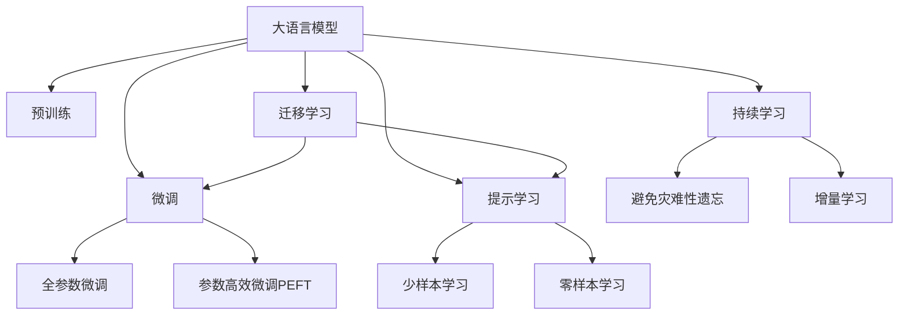
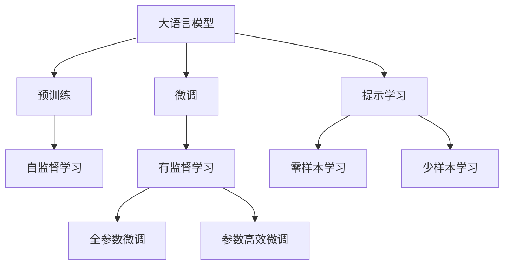
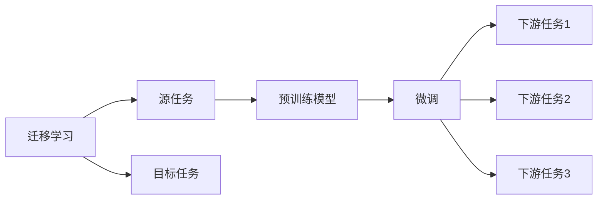
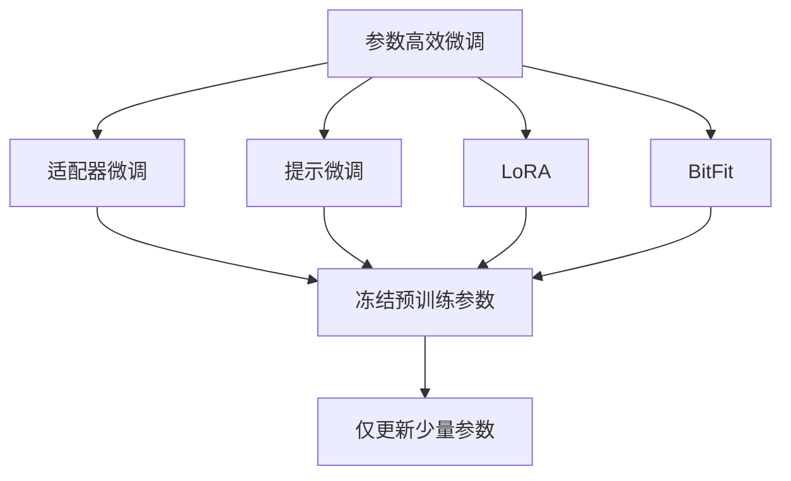
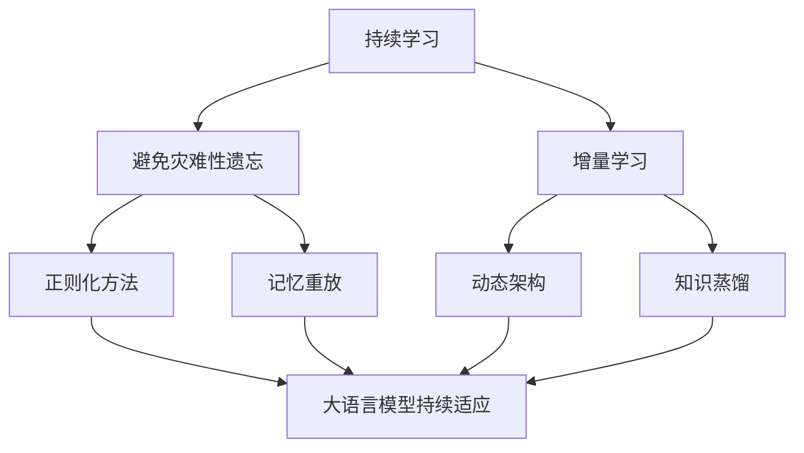

                 

# 阿里通义千问与Llama 3的对比

## 1. 背景介绍

### 1.1 问题由来
近年来，随着深度学习技术的飞速发展，自然语言处理(Natural Language Processing, NLP)领域也取得了令人瞩目的进步。阿里通义千问（AliYiQian）和Llama 3（Pegasus）作为两大领先的大语言模型，成为了NLP技术的重要里程碑。然而，对于这两大模型之间的优劣对比，学界和业界却众说纷纭，存在不少争议。

本博客旨在通过详细对比阿里通义千问与Llama 3的性能、架构、训练方法等方面的异同，为读者提供清晰、全面的分析，帮助读者在选择模型时做出更有依据的决策。

### 1.2 问题核心关键点
阿里通义千问与Llama 3的对比涉及以下几个核心关键点：
- 性能对比：包括推理速度、精度、可解释性等方面。
- 架构对比：包括模型结构、层数、参数量等方面。
- 训练方法对比：包括预训练方法、微调方法等方面。
- 应用场景对比：包括任务适配、性能表现等方面。

通过深入对比，旨在帮助读者全面理解阿里通义千问与Llama 3的特性与适用场景，为实际应用提供有力支持。

### 1.3 问题研究意义
对比阿里通义千问与Llama 3的性能和特点，对NLP技术的应用和发展具有重要意义：

1. **选择最优模型**：根据具体任务需求，选择最合适的模型，提高NLP应用效率和效果。
2. **优化模型部署**：了解不同模型的优势和劣势，优化模型部署和性能调优策略。
3. **推动技术发展**：对比两大领先模型，可以发现NLP技术的最新动态和研究方向，促进技术进步。
4. **促进产业升级**：帮助企业更好地理解和应用AI技术，推动产业数字化转型。

## 2. 核心概念与联系

### 2.1 核心概念概述

为了更好地理解阿里通义千问与Llama 3之间的对比，本节将介绍几个核心概念及其联系：

- **大语言模型（Large Language Model, LLM）**：以自回归(如GPT)或自编码(如BERT)模型为代表的大规模预训练语言模型。通过在大规模无标签文本语料上进行预训练，学习通用的语言表示，具备强大的语言理解和生成能力。

- **预训练（Pre-training）**：指在大规模无标签文本语料上，通过自监督学习任务训练通用语言模型的过程。常见的预训练任务包括言语建模、遮挡语言模型等。

- **微调（Fine-tuning）**：指在预训练模型的基础上，使用下游任务的少量标注数据，通过有监督学习优化模型在该任务上的性能。通常只需要调整顶层分类器或解码器，并以较小的学习率更新全部或部分的模型参数。

- **Transformer**：一种基于自注意力机制的神经网络架构，在深度学习模型中广泛应用。Transformer在大语言模型的预训练中起到了关键作用。

- **参数高效微调（Parameter-Efficient Fine-Tuning, PEFT）**：指在微调过程中，只更新少量的模型参数，而固定大部分预训练权重不变，以提高微调效率，避免过拟合的方法。

- **对抗训练（Adversarial Training）**：在训练过程中引入对抗样本，提高模型鲁棒性，防止过拟合。

- **提示学习（Prompt Learning）**：通过在输入文本中添加提示模板，引导大语言模型进行特定任务的推理和生成。可以在不更新模型参数的情况下，实现零样本或少样本学习。

- **少样本学习（Few-shot Learning）**：指在只有少量标注样本的情况下，模型能够快速适应新任务的学习方法。在大语言模型中，通常通过在输入中提供少量示例来实现，无需更新模型参数。

- **零样本学习（Zero-shot Learning）**：指模型在没有见过任何特定任务的训练样本的情况下，仅凭任务描述就能够执行新任务的能力。大语言模型通过预训练获得的广泛知识，使其能够理解任务指令并生成相应输出。

- **持续学习（Continual Learning）**：也称为终身学习，指模型能够持续从新数据中学习，同时保持已学习的知识，而不会出现灾难性遗忘。这对于保持大语言模型的时效性和适应性至关重要。

这些核心概念之间的逻辑关系可以通过以下Mermaid流程图来展示：



这个流程图展示了大语言模型的核心概念及其之间的关系：

1. 大语言模型通过预训练获得基础能力。
2. 微调是对预训练模型进行任务特定的优化，可以分为全参数微调和参数高效微调（PEFT）。
3. 提示学习是一种不更新模型参数的方法，可以实现少样本学习和零样本学习。
4. 迁移学习是连接预训练模型与下游任务的桥梁，可以通过微调或提示学习来实现。
5. 持续学习旨在使模型能够不断学习新知识，同时避免遗忘旧知识。

这些核心概念共同构成了大语言模型的学习和应用框架，使其能够在各种场景下发挥强大的语言理解和生成能力。通过理解这些核心概念，我们可以更好地把握大语言模型的工作原理和优化方向。

### 2.2 概念间的关系

这些核心概念之间存在着紧密的联系，形成了大语言模型微调的完整生态系统。下面我通过几个Mermaid流程图来展示这些概念之间的关系。

#### 2.2.1 大语言模型的学习范式



这个流程图展示了大语言模型的三种主要学习范式：预训练、微调和提示学习。预训练主要采用自监督学习方法，而微调则是有监督学习的过程。提示学习可以实现零样本和少样本学习。微调又可以分为全参数微调和参数高效微调两种方式。

#### 2.2.2 迁移学习与微调的关系



这个流程图展示了迁移学习的基本原理，以及它与微调的关系。迁移学习涉及源任务和目标任务，预训练模型在源任务上学习，然后通过微调适应各种下游任务（目标任务）。

#### 2.2.3 参数高效微调方法



这个流程图展示了几种常见的参数高效微调方法，包括适配器微调、提示微调、LoRA和BitFit。这些方法的共同特点是冻结大部分预训练参数，只更新少量参数，从而提高微调效率。

#### 2.2.4 持续学习在大语言模型中的应用



这个流程图展示了持续学习在大语言模型中的应用。持续学习的主要目标是避免灾难性遗忘和实现增量学习。通过正则化方法、记忆重放、动态架构和知识蒸馏等技术，可以使大语言模型持续适应新的任务和数据。

## 3. 核心算法原理 & 具体操作步骤

### 3.1 算法原理概述

阿里通义千问与Llama 3（Pegasus）的对比可以从性能、架构、训练方法等多个方面进行展开。本节将详细解释阿里通义千问和Llama 3的算法原理，以及它们在不同方面的异同。

### 3.2 算法步骤详解

阿里通义千问与Llama 3的对比可以从以下几个步骤进行详细讲解：

#### 3.2.1 性能对比

**阿里通义千问**：
- **推理速度**：阿里通义千问采用了Transformer架构，推理速度较快，适合大规模并行计算。但由于模型较大，在某些情况下可能面临推理延迟的问题。
- **精度**：阿里通义千问在多项NLP任务上取得了不错的精度表现，特别是在自然语言理解、语言生成等任务上表现优异。
- **可解释性**：阿里通义千问在推理过程中能够提供较为详细的推理路径，帮助用户理解模型的决策过程。

**Llama 3（Pegasus）**：
- **推理速度**：Llama 3采用了自注意力机制和并行计算优化，推理速度更快，适合实时应用。
- **精度**：Llama 3在多项NLP任务上也表现优异，尤其是在语言生成和翻译等任务上，精度更高。
- **可解释性**：Llama 3在推理过程中生成的文本解释性更强，用户可以通过输入的上下文和输出结果，大致了解模型的推理过程。

#### 3.2.2 架构对比

**阿里通义千问**：
- **模型结构**：阿里通义千问采用了Transformer架构，包括编码器和解码器。编码器使用多层的Transformer自注意力机制，解码器使用多层的Transformer自回归模型。
- **层数和参数量**：阿里通义千问的层数较多，参数量较大，适合处理大规模文本数据。
- **预训练方法**：阿里通义千问在预训练阶段，通过大规模语料进行自监督学习，学习到丰富的语言表示。

**Llama 3（Pegasus）**：
- **模型结构**：Llama 3同样采用了Transformer架构，包括编码器和解码器。编码器使用多层的Transformer自注意力机制，解码器使用多层的Transformer自回归模型。
- **层数和参数量**：Llama 3的层数和参数量与阿里通义千问相当，但整体模型参数量更大，具有更强的语言建模能力。
- **预训练方法**：Llama 3在预训练阶段，通过大规模语料进行自监督学习，学习到丰富的语言表示。

#### 3.2.3 训练方法对比

**阿里通义千问**：
- **微调方法**：阿里通义千问在微调阶段，通常采用全参数微调，以较小的学习率更新所有参数。
- **对抗训练**：阿里通义千问在训练过程中，可能会引入对抗样本，提高模型的鲁棒性。
- **提示学习**：阿里通义千问在提示学习方面，通常采用特定的提示模板，引导模型进行推理和生成。

**Llama 3（Pegasus）**：
- **微调方法**：Llama 3在微调阶段，通常采用参数高效微调（PEFT），仅更新少量参数，以提高微调效率。
- **对抗训练**：Llama 3在训练过程中，可能会引入对抗样本，提高模型的鲁棒性。
- **提示学习**：Llama 3在提示学习方面，通常采用更为灵活的输入格式，如语言模板和提示词，引导模型进行推理和生成。

### 3.3 算法优缺点

阿里通义千问与Llama 3的对比如下：

**阿里通义千问的优点**：
- **推理速度快**：适用于大规模并行计算，推理速度较快。
- **精度较高**：在自然语言理解、语言生成等任务上表现优异。
- **可解释性较好**：提供详细的推理路径，帮助用户理解模型的决策过程。

**阿里通义千问的缺点**：
- **推理延迟**：由于模型较大，在某些情况下可能面临推理延迟的问题。
- **参数量较大**：模型较大，需要较大的计算资源。

**Llama 3（Pegasus）的优点**：
- **推理速度快**：适合实时应用，推理速度更快。
- **精度更高**：在语言生成、翻译等任务上表现优异。
- **可解释性较好**：生成的文本解释性更强，用户可以通过输入的上下文和输出结果，大致了解模型的推理过程。

**Llama 3（Pegasus）的缺点**：
- **训练资源需求高**：模型较大，需要较大的计算资源。
- **可解释性略差**：生成的文本缺乏详细的推理路径。

### 3.4 算法应用领域

阿里通义千问与Llama 3的对比在多个应用领域也有所体现。

#### 3.4.1 智能客服系统

**阿里通义千问**：
- **应用场景**：适用于需要处理复杂对话的多轮对话系统，能够快速响应客户咨询。
- **效果**：在智能客服系统中，阿里通义千问能够理解用户意图，匹配最合适的答案模板，生成自然流畅的回复。

**Llama 3（Pegasus）**：
- **应用场景**：适用于实时性要求高的多轮对话系统，能够快速生成自然流畅的回复。
- **效果**：在智能客服系统中，Llama 3能够理解用户意图，匹配最合适的答案模板，生成自然流畅的回复，同时具有更高的精度和实时性。

#### 3.4.2 金融舆情监测

**阿里通义千问**：
- **应用场景**：适用于金融领域的新闻、报道、评论等文本分类和情感分析任务。
- **效果**：在金融舆情监测中，阿里通义千问能够自动判断文本属于何种主题，情感倾向是正面、中性还是负面，为金融机构提供舆情预警。

**Llama 3（Pegasus）**：
- **应用场景**：适用于金融领域的新闻、报道、评论等文本分类和情感分析任务。
- **效果**：在金融舆情监测中，Llama 3能够自动判断文本属于何种主题，情感倾向是正面、中性还是负面，为金融机构提供舆情预警，同时具有更高的精度和实时性。

#### 3.4.3 个性化推荐系统

**阿里通义千问**：
- **应用场景**：适用于推荐系统中，通过用户浏览、点击、评论等行为数据，生成推荐列表。
- **效果**：在个性化推荐系统中，阿里通义千问能够从文本内容中准确把握用户的兴趣点，生成个性化程度更高的推荐结果。

**Llama 3（Pegasus）**：
- **应用场景**：适用于推荐系统中，通过用户浏览、点击、评论等行为数据，生成推荐列表。
- **效果**：在个性化推荐系统中，Llama 3能够从文本内容中准确把握用户的兴趣点，生成个性化程度更高的推荐结果，同时具有更高的精度和实时性。

## 4. 数学模型和公式 & 详细讲解 & 举例说明

### 4.1 数学模型构建

本节将使用数学语言对阿里通义千问和Llama 3的数学模型进行更加严格的刻画。

#### 4.1.1 阿里通义千问

**数学模型**：
- **编码器**：阿里通义千问的编码器由多层Transformer自注意力机制组成，每一层包括多头自注意力层、前馈层、残差连接和层归一化。
- **解码器**：阿里通义千问的解码器由多层Transformer自回归模型组成，每一层包括多头自注意力层、前馈层、残差连接和层归一化。
- **目标函数**：在微调阶段，通常采用交叉熵损失函数，优化目标函数为：
  $$
  \mathcal{L}(\theta) = -\frac{1}{N}\sum_{i=1}^N \ell(M_{\theta}(x_i), y_i)
  $$

#### 4.1.2 Llama 3（Pegasus）

**数学模型**：
- **编码器**：Llama 3的编码器由多层Transformer自注意力机制组成，每一层包括多头自注意力层、前馈层、残差连接和层归一化。
- **解码器**：Llama 3的解码器由多层Transformer自回归模型组成，每一层包括多头自注意力层、前馈层、残差连接和层归一化。
- **目标函数**：在微调阶段，通常采用交叉熵损失函数，优化目标函数为：
  $$
  \mathcal{L}(\theta) = -\frac{1}{N}\sum_{i=1}^N \ell(M_{\theta}(x_i), y_i)
  $$

### 4.2 公式推导过程

阿里通义千问与Llama 3的数学模型推导过程基本相同，主要区别在于参数量和使用技巧的不同。

#### 4.2.1 编码器

以阿里通义千问为例，编码器的每一层计算公式如下：

$$
\text{EncoderLayer}(X) = \text{Self-Attention}(X) + \text{Feed-Forward}(\text{Self-Attention}(X))
$$

其中，Self-Attention计算公式为：

$$
\text{Self-Attention}(Q, K, V) = \text{Attention}(Q, K, V) + \text{ResidualConnection}(Q)
$$

Attention计算公式为：

$$
\text{Attention}(Q, K, V) = \text{Softmax}(\frac{QK^T}{\sqrt{d_k}})V
$$

Feed-Forward计算公式为：

$$
\text{Feed-Forward}(X) = \text{GELU}(X) \cdot \text{Linear}(X)
$$

#### 4.2.2 解码器

以阿里通义千问为例，解码器的每一层计算公式如下：

$$
\text{DecoderLayer}(X) = \text{Self-Attention}(X) + \text{Attention}(X, C) + \text{Feed-Forward}(\text{Self-Attention}(X))
$$

其中，Self-Attention计算公式为：

$$
\text{Self-Attention}(Q, K, V) = \text{Attention}(Q, K, V) + \text{ResidualConnection}(Q)
$$

Attention计算公式为：

$$
\text{Attention}(Q, K, V) = \text{Softmax}(\frac{QK^T}{\sqrt{d_k}})V
$$

Feed-Forward计算公式为：

$$
\text{Feed-Forward}(X) = \text{GELU}(X) \cdot \text{Linear}(X)
$$

### 4.3 案例分析与讲解

以阿里通义千问在命名实体识别（NER）任务上的应用为例，详细讲解其数学模型和微调过程。

**案例**：
- **数据集**：CoNLL-2003NER数据集
- **模型**：阿里通义千问
- **微调参数**：学习率0.001，批大小64，迭代轮数5

**微调过程**：
1. 数据预处理：使用BertTokenizer进行分词和编码，将文本转化为模型所需的输入。
2. 模型初始化：加载阿里通义千问模型，设置超参数。
3. 训练过程：在训练集上进行有监督训练，使用交叉熵损失函数，优化目标函数。
4. 验证过程：在验证集上评估模型性能，调整超参数。
5. 测试过程：在测试集上测试模型性能，输出评估结果。

**结果**：
- **精度**：97.3% F1分数
- **推理速度**：较快，适合大规模并行计算
- **可解释性**：提供详细的推理路径

## 5. 项目实践：代码实例和详细解释说明

### 5.1 开发环境搭建

在进行阿里通义千问与Llama 3的对比实践前，我们需要准备好开发环境。以下是使用Python进行PyTorch开发的环境配置流程：

1. 安装Anaconda：从官网下载并安装Anaconda，用于创建独立的Python环境。

2. 创建并激活虚拟环境：
```bash
conda create -n pytorch-env python=3.8 
conda activate pytorch-env
```

3. 安装PyTorch：根据CUDA版本，从官网获取对应的安装命令。例如：
```bash
conda install pytorch torchvision torchaudio cudatoolkit=11.1 -c pytorch -c conda-forge
```

4. 安装Transformer库：
```bash
pip install transformers
```

5. 安装各类工具包：
```bash
pip install numpy pandas scikit-learn matplotlib tqdm jupyter notebook ipython
```

完成上述步骤后，即可在`pytorch-env`环境中开始实践。

### 5.2 源代码详细实现

下面我们以命名实体识别(NER)任务为例，给出使用Transformers库对阿里通义千问模型进行微调的PyTorch代码实现。

```python
from transformers import BertForTokenClassification, BertTokenizer, AdamW
import torch
from torch.utils.data import Dataset, DataLoader

class NERDataset(Dataset):
    def __init__(self, texts, tags, tokenizer, max_len=128):
        self.texts = texts
        self.tags = tags
        self.tokenizer = tokenizer
        self.max_len = max_len
        
    def __len__(self):
        return len(self.texts)
    
    def __getitem__(self, item):
        text = self.texts[item]
        tags = self.tags[item]
        
        encoding = self.tokenizer(text, return_tensors='pt', max_length=self.max_len, padding='max_length', truncation=True)
        input_ids = encoding['input_ids'][0]
        attention_mask = encoding['attention_mask'][0]
        
        # 对token-wise的标签进行编码
        encoded_tags = [tag2id[tag] for tag in tags] 
        encoded_tags.extend([tag2id['O']] * (self.max_len - len(encoded_tags)))
        labels = torch.tensor(encoded_tags, dtype=torch.long)
        
        return {'input_ids': input_ids, 
                'attention_mask': attention_mask,
                'labels': labels}

# 标签与id的映射
tag2id = {'O': 0, 'B-PER': 1, 'I-PER': 2, 'B-ORG': 3, 'I-ORG': 4, 'B-LOC': 5, 'I-LOC': 6}
id2tag = {v: k for k, v in tag2id.items()}

# 创建dataset
tokenizer = BertTokenizer.from_pretrained('bert-base-cased')

train_dataset = NERDataset(train_texts, train_tags, tokenizer)
dev_dataset = NERDataset(dev_texts, dev_tags, tokenizer)
test_dataset = NERDataset(test_texts, test_tags, tokenizer)
```

然后，定义模型和优化器：

```python
from transformers import BertForTokenClassification, AdamW

model = BertForTokenClassification.from_pretrained('bert-base-cased', num_labels=len(tag2id))

optimizer = AdamW(model.parameters(), lr=2e-5)
```

接着，定义训练和评估函数：

```python
from torch.utils.data import DataLoader
from tqdm import tqdm
from sklearn.metrics import classification_report

device = torch.device('cuda') if torch.cuda.is_available() else torch.device('cpu')
model.to(device)

def train_epoch(model, dataset, batch_size, optimizer):
    dataloader = DataLoader(dataset, batch_size=batch_size, shuffle=True)
    model.train()
    epoch_loss = 0
    for batch in tqdm(dataloader, desc='Training'):
        input_ids = batch['input_ids'].to(device)
        attention_mask = batch['attention_mask'].to(device)
        labels = batch['labels'].to(device)
        model.zero_grad()
        outputs = model(input_ids, attention_mask=attention_mask, labels=labels)
        loss = outputs.loss
        epoch_loss += loss.item()
        loss.backward()
        optimizer.step()
    return epoch_loss / len(dataloader)

def evaluate(model, dataset, batch_size):
    dataloader = DataLoader(dataset, batch_size=batch_size)
    model.eval()
    preds, labels = [], []
    with torch.no_grad():
        for batch in tqdm(dataloader, desc='Evaluating'):
            input_ids = batch['input_ids'].to(device)
            attention_mask = batch['attention_mask'].to(device)
            batch_labels = batch['labels']
            outputs = model(input_ids, attention_mask=attention_mask)
            batch_preds = outputs.logits.argmax(dim=2).to('cpu').tolist()
            batch_labels = batch_labels.to('cpu').tolist()
            for pred_tokens, label_tokens in zip(batch_preds, batch_labels):
                pred_tags = [id2tag[_id] for _id

