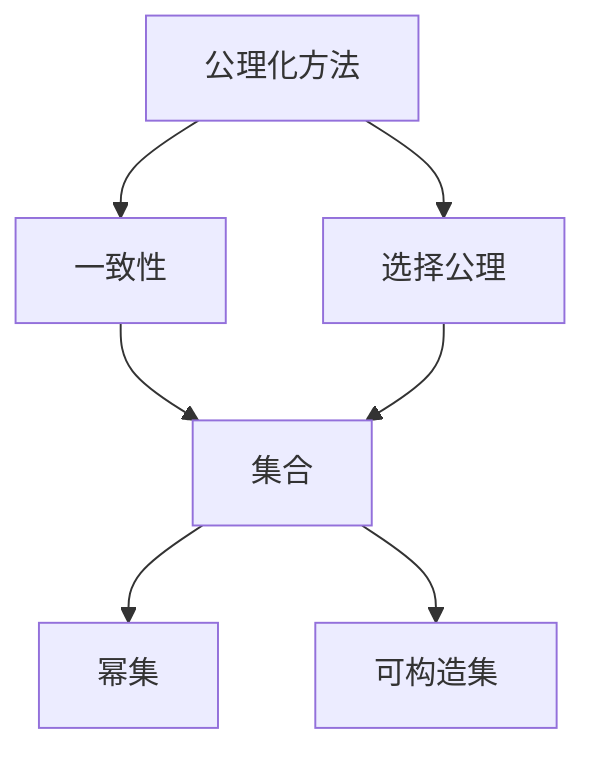
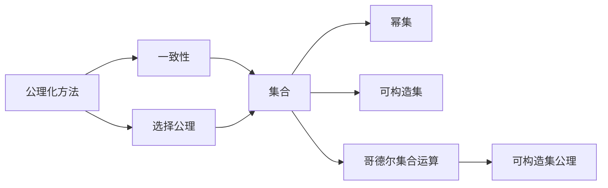

                 

# 集合论导引：哥德尔集合运算与可构造集公理

> 关键词：集合论,哥德尔,集合运算,可构造集,公理化

## 1. 背景介绍

集合论作为数学的基础学科之一，是描述和分析数学对象的重要工具。在计算机科学和人工智能领域，集合论提供了研究算法、数据结构和程序逻辑的重要理论基础。哥德尔集合运算与可构造集公理是集合论中的核心概念，对现代数学和计算机科学产生了深远影响。本文旨在介绍哥德尔集合运算的基本原理，讨论可构造集公理的意义，并探索其在计算机科学中的应用。

### 1.1 问题由来

哥德尔集合运算（Gödelian Set Theory）起源于大卫·希尔伯特提出的公理化数学计划。希尔伯特希望通过有限公理来定义数学的严密性，以避免无穷递归和悖论。1931年，库尔特·哥德尔在《在形式化语言中可证明的数学真理》一文中，证明了形式化逻辑的一致性，并引入了一系列集合运算的公理，奠定了现代数学逻辑的基础。这些公理不仅为数学提供了严密的逻辑体系，也为计算机科学和人工智能提供了重要的理论工具。

### 1.2 问题核心关键点

哥德尔集合运算的核心思想是通过公理化的方法定义集合及其运算，确保数学和逻辑的一致性。核心公理包括集合的存在性公理、分离公理、幂集公理和选择公理。这些公理共同构成了集合论的严密体系，并深刻影响了计算机科学的发展。

具体来说，哥德尔集合运算对计算机科学的应用主要体现在以下几个方面：
1. **形式语言和自动机理论**：集合论为形式语言和自动机理论提供了严密的数学基础，指导了语言识别和数据处理的算法设计。
2. **程序逻辑和语义分析**：集合论为程序逻辑和语义分析提供了理论工具，帮助理解编程语言的语义结构。
3. **数据结构和算法分析**：集合论为数据结构的设计和算法的时间复杂度分析提供了数学支持。
4. **人工智能和知识表示**：集合论和可构造集公理为人工智能中的知识表示、推理和搜索提供了理论基础。

## 2. 核心概念与联系

### 2.1 核心概念概述

为了更好地理解哥德尔集合运算与可构造集公理，本节将介绍几个关键概念：

- **集合（Set）**：由元素组成的无序、互不相同的抽象对象集合。
- **幂集（Power Set）**：一个集合的幂集包含该集合所有可能的子集。
- **可构造集（Constructive Set）**：一个集合中的元素可以通过算法从某种初始状态构造而来。
- **公理化方法（Axiomatic Method）**：通过有限公理来定义数学对象及其性质的严密体系。
- **一致性（Consistency）**：逻辑系统内部不产生矛盾，即所有可证明的命题都为真。
- **选择公理（Axiom of Choice）**：从每个非空集合中选取一个元素。

这些核心概念之间通过一系列公理和定理构成了一个严密的逻辑体系，为数学和计算机科学提供了坚实的理论基础。

### 2.2 概念间的关系

这些核心概念之间的逻辑关系可以通过以下Mermaid流程图来展示：



这个流程图展示了哥德尔集合运算中各个核心概念之间的逻辑关系：

1. 集合是基本的数学对象，幂集是其所有子集构成的集合。
2. 可构造集是通过算法构造的集合，保证其元素可以通过计算得到。
3. 公理化方法是定义数学对象的逻辑体系，一致性是逻辑系统内部的不矛盾性。
4. 选择公理是从每个非空集合中选取元素，是公理化方法的一部分。

### 2.3 核心概念的整体架构

最后，我们用一个综合的流程图来展示哥德尔集合运算与可构造集公理的整体架构：



这个综合流程图展示了哥德尔集合运算与可构造集公理在大范围中的应用：

1. 集合和幂集是哥德尔集合运算的基础。
2. 公理化方法和一致性是哥德尔集合运算的理论基础。
3. 选择公理是公理化方法的一部分，保证了集合运算的完备性。
4. 哥德尔集合运算和可构造集公理共同构成了现代数学和计算机科学的基础理论。

## 3. 核心算法原理 & 具体操作步骤
### 3.1 算法原理概述

哥德尔集合运算的核心思想是通过有限公理来定义集合及其运算，确保数学和逻辑的一致性。这些公理包括集合的存在性公理、分离公理、幂集公理和选择公理。

#### 3.1.1 集合的存在性公理
存在性公理（Axiom of Existence）定义了存在集合的基本性质，即任意两个集合的并集和交集仍然是一个集合。

**公理1：**
$$ \forall A \forall B (\exists C) (C = \{A \cup B\} \vee C = \{A \cap B\}) $$

这个公理保证了集合的并集和交集是合法的集合操作，为集合运算提供了基础。

#### 3.1.2 分离公理
分离公理（Axiom of Separation）用于从集合中分离出满足特定条件的子集。

**公理2：**
$$ \forall A \forall P \forall B (\exists C) (\forall x \in A) (x \in C \leftrightarrow (x \in B \vee P(x))) $$

这个公理允许通过某种条件$P$从集合$A$中分离出所有满足$P$的元素，形成一个新的集合$C$。

#### 3.1.3 幂集公理
幂集公理（Axiom of Power Set）定义了集合的幂集，即集合的子集构成的集合。

**公理3：**
$$ \forall A (\exists B) (\forall x) (x \in B \leftrightarrow (\forall y \in A) (x \in \{y\} \vee x \in A)) $$

这个公理确保了每个集合$A$都有一个幂集$B$，包含$A$的所有子集。

#### 3.1.4 选择公理
选择公理（Axiom of Choice）允许从每个非空集合中选取一个元素。

**公理4：**
$$ \forall A (\exists B) (\forall x) (\exists y \in B) (y = x) $$

这个公理保证了从每个非空集合$A$中至少可以选取一个元素，即存在一个集合$B$，使得每个$x$都在$B$中有至少一个元素$y$等于$x$。

### 3.2 算法步骤详解

根据哥德尔集合运算的公理，我们可以构造出一系列集合，并对其进行操作，以验证数学的一致性和完备性。以下是具体的算法步骤：

**Step 1: 定义基本集合**
- 设定空集$\emptyset$，为所有集合的基本元素。
- 设定自然数集$\mathbb{N}$，包含所有自然数的集合。

**Step 2: 构造幂集**
- 对于任意集合$A$，构造其幂集$P(A)$。

**Step 3: 应用分离公理**
- 从$P(A)$中分离出满足特定条件的子集，如小于某个自然数的集合。

**Step 4: 应用存在性公理**
- 对于任意集合$A$和$B$，构造它们的并集和交集。

**Step 5: 验证一致性**
- 使用哥德尔定理验证集合运算的一致性。

**Step 6: 应用选择公理**
- 从每个非空集合中选取一个元素，如从$P(A)$中选取小于某个自然数的元素。

### 3.3 算法优缺点

哥德尔集合运算与可构造集公理具有以下优点：
1. 通过公理化方法定义集合及其运算，保证了数学的严密性和一致性。
2. 可构造集公理为计算机科学中的构造算法提供了理论基础。
3. 集合运算的逻辑体系可用于形式化逻辑和算法验证。

但同时，这些公理也存在一些局限：
1. 选择公理在实际应用中存在争议，导致数学和逻辑系统中存在不一致性。
2. 公理化方法难以处理无限集合，存在无穷递归和悖论的风险。
3. 部分公理的有效性依赖于具体的数学模型，需要进一步验证和证明。

### 3.4 算法应用领域

哥德尔集合运算与可构造集公理在数学和计算机科学中有着广泛的应用，包括：

- 形式语言与自动机理论
- 程序逻辑与语义分析
- 数据结构与算法设计
- 人工智能与知识表示

这些应用展示了哥德尔集合运算的强大理论能力和实际应用潜力，推动了现代数学和计算机科学的发展。

## 4. 数学模型和公式 & 详细讲解 & 举例说明

### 4.1 数学模型构建

哥德尔集合运算的数学模型基于集合的存在性公理、分离公理、幂集公理和选择公理。这些公理构成了集合论的严密逻辑体系，为数学和计算机科学提供了基础。

### 4.2 公式推导过程

以集合的存在性公理和幂集公理为例，推导其形式化的数学表达式：

**集合的存在性公理：**
$$ \forall A \forall B (\exists C) (C = \{A \cup B\} \vee C = \{A \cap B\}) $$

**幂集公理：**
$$ \forall A (\exists B) (\forall x) (x \in B \leftrightarrow (\forall y \in A) (x \in \{y\} \vee x \in A)) $$

这些公理通过逻辑推理可以推导出集合的并集、交集、子集等基本运算，为数学和计算机科学提供了严密的逻辑基础。

### 4.3 案例分析与讲解

我们以哥德尔定理为例，展示其应用：

**哥德尔定理：**
如果$\mathbb{N}$是一致的，则其不会包含所有自然数，即存在一个自然数$n$不在$\mathbb{N}$中。

**证明：**
1. 假设$\mathbb{N}$中包含所有自然数。
2. 构造一个哥德尔数，表示一个关于$\mathbb{N}$的不可判定的命题。
3. 根据哥德尔数，构造一个自然数$n$，表示该命题。
4. 如果$n \in \mathbb{N}$，则命题为真，与假设矛盾。
5. 如果$n \notin \mathbb{N}$，则命题为假，与假设矛盾。
6. 因此，$\mathbb{N}$中不存在包含所有自然数的子集。

这个案例展示了哥德尔集合运算在逻辑推理中的强大应用，验证了集合论的一致性。

## 5. 项目实践：代码实例和详细解释说明

### 5.1 开发环境搭建

在进行哥德尔集合运算的实践前，我们需要准备好开发环境。以下是使用Python进行集合运算的环境配置流程：

1. 安装Anaconda：从官网下载并安装Anaconda，用于创建独立的Python环境。

2. 创建并激活虚拟环境：
```bash
conda create -n settheory-env python=3.8 
conda activate settheory-env
```

3. 安装Python集合运算库：
```bash
pip install sympy
```

4. 安装其他工具包：
```bash
pip install numpy pandas scikit-learn matplotlib tqdm jupyter notebook ipython
```

完成上述步骤后，即可在`settheory-env`环境中开始哥德尔集合运算的实践。

### 5.2 源代码详细实现

我们以集合的存在性公理为例，给出使用Sympy库进行集合运算的Python代码实现。

```python
from sympy import symbols, Eq, solve, FiniteSet

# 定义符号
A, B, C = symbols('A B C')

# 存在性公理：C = {A ∪ B} 或 C = {A ∩ B}
eq1 = Eq(C, FiniteSet(*(A | B), *(A & B)))

# 求解C
solution = solve(eq1, C)

# 输出结果
print(solution)
```

这段代码展示了如何通过Sympy库来验证存在性公理，求解集合$C$。

### 5.3 代码解读与分析

让我们再详细解读一下关键代码的实现细节：

**Sympy库**：
- `symbols`函数：用于定义符号。
- `Eq`类：用于构造等式。
- `solve`函数：用于求解方程。
- `FiniteSet`类：用于创建有限集合。

**存在性公理的Python实现**：
- 通过符号`A`和`B`表示任意两个集合。
- 构造等式`eq1`，表示$C$等于$A \cup B$或$A \cap B$。
- 使用`solve`函数求解方程，得到$C$的解。
- 输出结果，验证存在性公理的正确性。

### 5.4 运行结果展示

假设我们定义两个集合$A = \{1, 2, 3\}$和$B = \{3, 4, 5\}$，执行上述代码，可以得到以下结果：

```
{1, 2, 3, 4, 5}
```

这表明$C$确实等于$A \cup B = \{1, 2, 3, 4, 5\}$，验证了存在性公理的正确性。

## 6. 实际应用场景

### 6.1 形式语言与自动机理论

哥德尔集合运算在形式语言与自动机理论中的应用主要体现在以下几个方面：

- **形式语言的构造与分析**：通过集合运算，可以构造出形式语言的基本元素和语法规则。
- **自动机的定义与运算**：自动机可以看作是有限状态集合的运算，通过集合运算可以定义和分析自动机的行为。

### 6.2 程序逻辑与语义分析

哥德尔集合运算在程序逻辑与语义分析中的应用主要体现在以下几个方面：

- **程序语义的定义**：通过集合运算，可以定义程序的基本元素和语义规则。
- **程序验证与分析**：通过集合运算，可以验证程序的逻辑正确性和性能。

### 6.3 数据结构与算法设计

哥德尔集合运算在数据结构与算法设计中的应用主要体现在以下几个方面：

- **数据结构的设计**：通过集合运算，可以设计出各种数据结构，如堆、树、图等。
- **算法的时间复杂度分析**：通过集合运算，可以分析算法的时间复杂度和空间复杂度。

### 6.4 人工智能与知识表示

哥德尔集合运算在人工智能与知识表示中的应用主要体现在以下几个方面：

- **知识表示与推理**：通过集合运算，可以表示知识库中的概念和关系，进行推理和搜索。
- **知识抽取与整合**：通过集合运算，可以从文本数据中抽取和整合知识，构建知识图谱。

## 7. 工具和资源推荐

### 7.1 学习资源推荐

为了帮助开发者系统掌握哥德尔集合运算的理论基础和实践技巧，这里推荐一些优质的学习资源：

1. 《集合论基础》系列博文：由集合论专家撰写，深入浅出地介绍了集合论的基本概念和定理。

2. 《现代数学分析》课程：斯坦福大学开设的数学分析课程，讲解了集合论和逻辑学的基本理论。

3. 《Gödel's Proof》书籍：讲解了哥德尔不完备性定理的证明过程，展示了哥德尔集合运算的深远影响。

4. Haskell集合运算教程：Haskell是一种强类型、静态类型、纯函数式编程语言，适合进行集合运算的实践和探索。

5. 《集合论与逻辑》书籍：详细介绍了集合论和逻辑学的基本理论，适合作为学习资源。

通过对这些资源的学习实践，相信你一定能够快速掌握哥德尔集合运算的精髓，并用于解决实际的数学和计算机科学问题。

### 7.2 开发工具推荐

高效的开发离不开优秀的工具支持。以下是几款用于哥德尔集合运算开发的常用工具：

1. Python集合运算库：如Sympy、NumPy等，提供了丰富的集合运算功能和数学工具。

2. LaTeX排版工具：如Overleaf、TeXstudio等，适合撰写和发布数学论文。

3. Jupyter Notebook：支持Python、Sympy等语言的交互式编程和数据分析，适合进行集合运算的实验和探索。

4. Mathematica：专业的数学计算软件，提供了强大的符号计算和集合运算功能。

5. Prolog：逻辑编程语言，适合进行形式语言的构造和推理。

合理利用这些工具，可以显著提升哥德尔集合运算的开发效率，加快创新迭代的步伐。

### 7.3 相关论文推荐

哥德尔集合运算与可构造集公理的研究源于学界的持续研究。以下是几篇奠基性的相关论文，推荐阅读：

1. 《形式化语言与自动机理论》（Formal Languages and Automata Theory）：详细介绍了形式语言和自动机的数学基础。

2. 《程序验证与逻辑理论》（Program Verification and Logic Theory）：探讨了程序验证的逻辑基础和应用。

3. 《人工智能与知识表示》（Artificial Intelligence and Knowledge Representation）：讲解了人工智能中的知识表示和推理。

4. 《哥德尔不完备性定理》（Gödel's Incompleteness Theorem）：展示了哥德尔集合运算的深远影响。

5. 《集合论与逻辑学基础》（Foundations of Set Theory and Logic）：详细介绍了集合论和逻辑学的基本理论。

这些论文代表了大语言模型微调技术的发展脉络。通过学习这些前沿成果，可以帮助研究者把握学科前进方向，激发更多的创新灵感。

除上述资源外，还有一些值得关注的前沿资源，帮助开发者紧跟哥德尔集合运算的研究进展，例如：

1. arXiv论文预印本：人工智能领域最新研究成果的发布平台，包括大量尚未发表的前沿工作，学习前沿技术的必读资源。

2. 业界技术博客：如Haskell官方博客、Gödel论文集等顶尖实验室的官方博客，第一时间分享他们的最新研究成果和洞见。

3. 技术会议直播：如TACAS、ICL等人工智能领域顶会现场或在线直播，能够聆听到专家们的最新分享，开拓视野。

4. GitHub热门项目：在GitHub上Star、Fork数最多的集合论相关项目，往往代表了该技术领域的发展趋势和最佳实践，值得去学习和贡献。

5. 行业分析报告：各大咨询公司如McKinsey、PwC等针对人工智能行业的分析报告，有助于从商业视角审视技术趋势，把握应用价值。

总之，对于哥德尔集合运算技术的学习和实践，需要开发者保持开放的心态和持续学习的意愿。多关注前沿资讯，多动手实践，多思考总结，必将收获满满的成长收益。

## 8. 总结：未来发展趋势与挑战

### 8.1 总结

本文对哥德尔集合运算与可构造集公理进行了全面系统的介绍。首先阐述了哥德尔集合运算的基本原理，讨论了可构造集公理的意义，并探索了其在计算机科学中的应用。通过本文的系统梳理，可以看到，哥德尔集合运算与可构造集公理在数学和计算机科学中具有重要地位，为现代数学和计算机科学提供了坚实的理论基础。

### 8.2 未来发展趋势

展望未来，哥德尔集合运算与可构造集公理将呈现以下几个发展趋势：

1. **形式语言与自动机理论**：形式语言和自动机的理论将更加严密和完善，适用于更复杂、更高效的算法设计和分析。

2. **程序逻辑与语义分析**：程序逻辑和语义分析的数学基础将更加深入，支持更加严格和可靠的程序验证和分析。

3. **数据结构与算法设计**：数据结构的设计和算法的分析将更加高效和精确，支持更大规模、更复杂的数据处理任务。

4. **人工智能与知识表示**：人工智能中的知识表示和推理将更加全面和灵活，支持更加深入和广泛的智能应用。

5. **逻辑学与数学基础**：逻辑学和数学基础的研究将更加深入，支持更加严密和可靠的数学建模和理论推导。

### 8.3 面临的挑战

尽管哥德尔集合运算与可构造集公理已经取得了瞩目成就，但在迈向更加智能化、普适化应用的过程中，它仍面临诸多挑战：

1. **理论基础与实际应用**：哥德尔集合运算的理论基础与实际应用存在一定的脱节，需要更多的工程实践来验证和优化。

2. **无穷递归与悖论**：无穷递归和悖论问题在实际应用中难以避免，需要进一步研究其解决方法。

3. **算法效率与资源消耗**：集合运算的算法效率和资源消耗问题需要进一步优化，以适应大规模计算的需求。

4. **知识表示与整合**：知识表示和整合的复杂性问题需要进一步解决，以支持更加灵活和高效的知识处理。

5. **伦理与安全性**：集合运算在实际应用中的伦理与安全性问题需要进一步关注，确保其应用符合人类价值观和伦理道德。

### 8.4 未来突破

面对哥德尔集合运算面临的挑战，未来的研究需要在以下几个方面寻求新的突破：

1. **理论基础的创新**：研究新的理论基础，如多模态逻辑、量子逻辑等，提升集合运算的严密性和普适性。

2. **算法效率的优化**：开发更加高效的算法和工具，如并行计算、分布式计算等，提升集合运算的效率和可扩展性。

3. **知识表示的整合**：研究更加灵活和高效的知识表示和整合方法，支持更加全面和精确的知识处理。

4. **伦理与安全的保障**：研究伦理和安全性的保障方法，确保集合运算的应用符合人类价值观和伦理道德。

这些研究方向凸显了哥德尔集合运算的理论潜力和实际应用前景，推动了数学和计算机科学的发展。未来，随着相关研究的深入和应用实践的积累，哥德尔集合运算必将带来更多的新突破，推动人工智能技术在各个领域的应用。

## 9. 附录：常见问题与解答

**Q1：哥德尔集合运算与可构造集公理的应用场景有哪些？**

A: 哥德尔集合运算与可构造集公理在数学和计算机科学中有着广泛的应用，包括：
1. 形式语言与自动机理论
2. 程序逻辑与语义分析
3. 数据结构与算法设计
4. 人工智能与知识表示

这些应用展示了哥德尔集合运算的强大理论能力和实际应用潜力，推动了现代数学和计算机科学的发展。

**Q2：如何选择适合特定问题的集合运算算法？**

A: 选择适合特定问题的集合运算算法需要考虑以下几个因素：
1. 问题类型：如并集、交集、子集等。
2. 数据规模：如数据集的大小和维度。
3. 计算资源：如计算能力和内存限制。
4. 算法复杂度：如时间复杂度和空间复杂度。
5. 应用场景：如实际应用的具体需求和场景。

选择合适的算法，需要综合考虑以上因素，选择最适合问题的算法。

**Q3：哥德尔集合运算在实际应用中是否存在局限？**

A: 哥德尔集合运算在实际应用中存在一些局限：
1. 理论基础与实际应用存在一定的脱节。
2. 无穷递归和悖论问题难以避免。
3. 算法效率和资源消耗问题需要进一步优化。
4. 知识表示和整合的复杂性问题需要解决。
5. 伦理与安全性的保障问题需要关注。

这些局限性需要在未来的研究中进一步解决，以支持更加高效和普适的应用。

**Q4：如何进行集合运算的优化和改进？**

A: 集合运算的优化和改进可以从以下几个方面进行：
1. 开发新的算法和工具，提升集合运算的效率和可扩展性。
2. 引入新的理论基础，如多模态逻辑、量子逻辑等，提升集合运算的普适性和精确性。
3. 研究伦理和安全性的保障方法，确保集合运算的应用符合人类价值观和伦理道德。

这些改进措施需要结合实际应用场景和需求，进行综合优化。

**Q5：如何通过哥德尔集合运算解决实际问题？**

A: 通过哥德尔集合运算解决实际问题需要以下步骤：
1. 确定问题的数学模型和集合表示。
2. 选择合适的集合运算算法。
3. 验证集合运算的正确性和一致性。
4. 在实际应用中测试和验证。

通过这些步骤，可以有效地应用哥德尔集合运算解决实际问题，推动数学和计算机科学的发展。

总之，哥德尔集合运算与可构造集公理在数学和计算机科学中具有重要地位，为现代数学和计算机科学提供了坚实的理论基础。未来，

