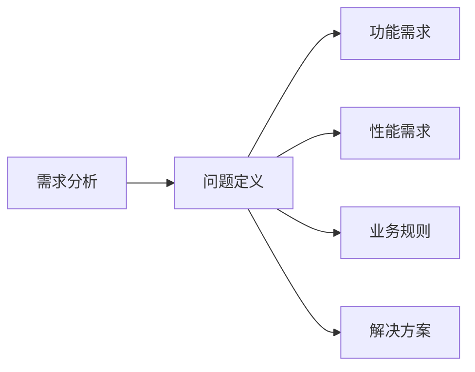

                 

# 需求分析与问题定义原理与代码实战案例讲解

## 1. 背景介绍

在软件开发过程中，需求分析和问题定义是至关重要的前期步骤，直接影响到后续的开发过程、代码实现和项目成功率。本文将详细介绍需求分析与问题定义的基本原理，并通过实战案例讲解具体的实施步骤和代码实现，旨在帮助开发者掌握这一关键技能，提升项目管理效率。

## 2. 核心概念与联系

### 2.1 核心概念概述

- **需求分析**：确定软件产品或系统的目标、功能、性能、业务规则及其他方面，以及相应的解决方案。需求分析的目的是确保项目开发符合预期目标。
- **问题定义**：明确问题的本质和具体需求，包括问题范围、目标、约束条件和解决方案。问题定义的目的是为后续的开发提供明确的方向和依据。

### 2.2 核心概念的关系

需求分析与问题定义紧密相连，相辅相成。需求分析提供了问题定义的基础，问题定义则指导需求分析的方向。通过需求分析明确了产品的功能需求，通过问题定义明确了问题的具体表现和解决方案，从而形成了一套完整的项目开发框架。

通过以下Mermaid流程图，可以更直观地理解需求分析与问题定义之间的关系：



### 2.3 核心概念的整体架构

核心概念的整体架构如下：


## 3. 核心算法原理 & 具体操作步骤

### 3.1 算法原理概述

需求分析与问题定义的原理主要基于系统工程学的理论框架，通过系统化的方法确保需求的全面性和准确性。基本步骤包括：

1. **收集需求**：通过问卷调查、用户访谈等方式收集用户需求。
2. **分析需求**：对收集到的需求进行分类、优先级排序和验证。
3. **定义问题**：明确问题的本质和具体需求，包括问题范围、目标、约束条件和解决方案。

### 3.2 算法步骤详解

需求分析与问题定义的步骤详解如下：

**Step 1: 收集需求**

- 与用户或相关方进行交流，了解其需求。
- 使用问卷调查、访谈等方式收集用户反馈。
- 整理并记录收集到的需求信息。

**Step 2: 分析需求**

- 对收集到的需求进行分类，如功能需求、性能需求、业务规则等。
- 进行优先级排序，确定哪些需求最重要。
- 验证需求是否合理，避免遗漏或重复。

**Step 3: 定义问题**

- 明确问题的本质和具体需求，包括问题范围、目标、约束条件和解决方案。
- 使用问题定义模板，如"What是问题？Why需要解决？Who解决问题？How解决问题？When解决问题？"。
- 与相关方确认问题定义，确保理解一致。

### 3.3 算法优缺点

**优点**：

- 系统化、规范化的方法确保需求全面、准确。
- 明确的问题定义有助于后续的开发和测试。
- 提高了项目管理和团队协作的效率。

**缺点**：

- 可能过于繁琐，增加前期准备工作。
- 对需求分析人员的专业能力要求较高。
- 可能需要多次沟通和验证，周期较长。

### 3.4 算法应用领域

需求分析与问题定义广泛应用于软件工程、项目管理、系统设计等多个领域。具体应用包括但不限于：

- 软件开发项目：收集用户需求，明确功能与性能要求。
- 系统设计与架构：定义系统的目标、范围和约束条件。
- 项目管理：制定项目计划、确定优先级、评估风险。

## 4. 数学模型和公式 & 详细讲解 & 举例说明

### 4.1 数学模型构建

需求分析与问题定义可以通过以下数学模型来表示：

- **需求集**： $D=\{d_1, d_2, ..., d_n\}$，其中每个 $d_i$ 表示一项需求。
- **需求优先级**： $P=\{p_1, p_2, ..., p_n\}$，表示各项需求的优先级。
- **问题定义**： $PDEF=\{P, C, O, R, S\}$，其中 $P$ 表示问题描述，$C$ 表示约束条件，$O$ 表示目标，$R$ 表示解决方案。

### 4.2 公式推导过程

通过以下公式，可以推导出需求分析与问题定义的数学表达：

- **需求分析**：

$$
A = \bigcup_{i=1}^n \{d_i | d_i \in D\}
$$

- **问题定义**：

$$
PDEF = (P, C, O, R)
$$

其中 $P = \{p_1, p_2, ..., p_n\}$，$C = \{c_1, c_2, ..., c_m\}$，$O = \{o_1, o_2, ..., o_k\}$，$R = \{r_1, r_2, ..., r_l\}$。

### 4.3 案例分析与讲解

假设我们要开发一个电商网站，需要编写以下问题定义：

- **问题描述**：网站的注册和登录功能存在性能瓶颈，导致用户体验差。
- **约束条件**：要求在2秒内完成注册和登录过程，确保用户体验良好。
- **目标**：提升注册和登录功能的响应速度，增强用户体验。
- **解决方案**：优化数据库查询，使用缓存技术，增加并发处理能力。

通过这个案例，可以更清晰地理解需求分析与问题定义的数学模型和推导过程。

## 5. 项目实践：代码实例和详细解释说明

### 5.1 开发环境搭建

为了进行需求分析与问题定义的代码实现，我们需要搭建一个开发环境。以下是Python环境配置的步骤：

1. 安装Python：从官网下载并安装Python，确保版本为3.6以上。
2. 安装PyCharm：下载并安装PyCharm IDE，用于编写和管理代码。
3. 安装Git：安装Git版本控制系统，用于代码管理。

### 5.2 源代码详细实现

以下是一个需求分析与问题定义的Python代码实现：

```python
# 需求收集
def collect_requirements():
    # 使用问卷调查等方式收集用户需求
    # 将收集到的需求记录到需求列表D中
    D = []
    # 例如：D.append('需求1')
    # D.append('需求2')
    # ...

# 需求分析
def analyze_requirements(D):
    # 对需求进行分类、排序和验证
    # 返回需求集合A
    A = set(D)  # 去除重复需求
    return A

# 问题定义
def define_problem(A):
    # 根据需求定义问题
    PDEF = {}  # 问题定义字典
    PDEF['P'] = '问题描述'  # 问题描述
    PDEF['C'] = '约束条件'  # 约束条件
    PDEF['O'] = '目标'  # 目标
    PDEF['R'] = '解决方案'  # 解决方案
    return PDEF

# 主函数
if __name__ == '__main__':
    # 收集需求
    D = collect_requirements()

    # 分析需求
    A = analyze_requirements(D)

    # 定义问题
    PDEF = define_problem(A)

    # 输出结果
    print('需求列表：', D)
    print('需求集合：', A)
    print('问题定义：', PDEF)
```

### 5.3 代码解读与分析

- **需求收集函数`collect_requirements()`**：通过问卷调查、访谈等方式收集用户需求，并将需求记录到列表`D`中。
- **需求分析函数`analyze_requirements(D)`**：对收集到的需求进行分类、排序和验证，返回去重后的需求集合`A`。
- **问题定义函数`define_problem(A)`**：根据需求定义问题，包括问题描述、约束条件、目标和解决方案，返回问题定义字典`PDEF`。
- **主函数**：调用上述三个函数，最终输出需求列表、需求集合和问题定义。

### 5.4 运行结果展示

假设我们已经收集到以下需求：

- 注册登录功能优化
- 搜索功能改进
- 购物车功能增强

经过分析，我们将需求集合`A`定义为：

```
A = {'注册登录功能优化', '搜索功能改进', '购物车功能增强'}
```

根据需求，我们定义了以下问题：

```
PDEF = {
    'P': '网站的注册和登录功能存在性能瓶颈，导致用户体验差。',
    'C': '要求在2秒内完成注册和登录过程，确保用户体验良好。',
    'O': '提升注册和登录功能的响应速度，增强用户体验。',
    'R': '优化数据库查询，使用缓存技术，增加并发处理能力。'
}
```

输出结果如下：

```
需求列表： ['注册登录功能优化', '搜索功能改进', '购物车功能增强']
需求集合： {'注册登录功能优化', '搜索功能改进', '购物车功能增强'}
问题定义： {'P': '网站的注册和登录功能存在性能瓶颈，导致用户体验差。', 'C': '要求在2秒内完成注册和登录过程，确保用户体验良好。', 'O': '提升注册和登录功能的响应速度，增强用户体验。', 'R': '优化数据库查询，使用缓存技术，增加并发处理能力。'}
```

## 6. 实际应用场景

### 6.1 软件开发项目

在软件开发项目中，需求分析和问题定义是不可或缺的环节。通过系统化的方法，可以确保项目开发符合用户需求，提升开发效率和产品质量。例如，在电商网站的开发中，需求分析和问题定义有助于明确功能需求，指导后续的编码和测试工作。

### 6.2 系统设计与架构

在系统设计和架构阶段，需求分析和问题定义同样重要。通过明确系统的目标和约束条件，可以设计出合理的系统架构，满足业务需求。例如，在构建电商平台时，需求分析和问题定义可以帮助确定系统的功能模块和性能指标。

### 6.3 项目管理

在项目管理中，需求分析和问题定义也是核心步骤。通过明确问题的本质和具体需求，可以制定项目计划，确定优先级，评估风险。例如，在项目管理软件的设计中，需求分析和问题定义可以帮助制定项目进度计划，确保项目按时完成。

## 7. 工具和资源推荐

### 7.1 学习资源推荐

为了帮助开发者掌握需求分析和问题定义的方法，以下是几本推荐书籍：

1. 《需求分析与系统设计》（Robert C. Martin著）：介绍需求分析和系统设计的经典书籍，详细讲解了需求分析的基本原理和实践技巧。
2. 《软件需求工程》（Glen J. Wittig著）：介绍了软件需求工程的基本概念和方法，适合系统化学习需求分析和问题定义。
3. 《用户故事与需求分析》（Mike Cohn著）：介绍了用户故事和需求分析的实用技巧，适合日常项目管理实践。

### 7.2 开发工具推荐

以下是几款常用的需求分析和问题定义工具：

1. JIRA：项目管理工具，支持需求管理、问题追踪等功能。
2. Trello：敏捷开发工具，支持看板管理和任务分配。
3. Confluence：知识管理工具，支持需求文档的编写和共享。

### 7.3 相关论文推荐

以下是几篇关于需求分析和问题定义的推荐论文：

1. 《需求分析和设计模式》（Jill F. Koziol著）：介绍了需求分析和设计模式的理论基础和实践案例。
2. 《基于UML的需求分析方法》（Nicholas A. Petazzoni著）：介绍了基于UML（统一建模语言）的需求分析方法。
3. 《需求工程实践指南》（Tony K. Begin著）：详细介绍了需求工程的实践方法和工具。

## 8. 总结：未来发展趋势与挑战

### 8.1 总结

本文详细介绍了需求分析和问题定义的基本原理和实现步骤，通过代码实例和案例分析，帮助开发者掌握这一关键技能。需求分析和问题定义是软件开发和项目管理的重要基础，直接影响到后续的开发过程和项目成功率。

### 8.2 未来发展趋势

需求分析和问题定义技术将持续发展和进步，主要趋势包括：

1. **自动化工具的普及**：随着AI和机器学习技术的发展，自动化的需求分析和问题定义工具将更加普及，提升需求分析的效率和准确性。
2. **跨领域应用的拓展**：需求分析和问题定义将逐步应用于更多领域，如医疗、金融、教育等，提供更全面的需求分析服务。
3. **数据驱动的需求分析**：大数据和人工智能技术的应用，将使需求分析更加依赖数据，提升分析的全面性和深度。

### 8.3 面临的挑战

尽管需求分析和问题定义技术在不断发展，但仍面临一些挑战：

1. **需求不明确**：部分需求描述不清晰，难以准确理解用户需求。
2. **沟通不充分**：不同部门和团队之间沟通不畅，导致需求理解偏差。
3. **需求变化频繁**：项目需求和市场变化频繁，需求管理难度大。

### 8.4 研究展望

未来需求分析和问题定义研究需要在以下几个方面取得突破：

1. **自动化工具的优化**：提高自动化工具的智能度和准确性，减少人工干预。
2. **多领域的需求分析方法**：开发适用于不同领域的需求分析方法和工具，提升通用性和灵活性。
3. **数据驱动的需求分析技术**：利用大数据和人工智能技术，提升需求分析的全面性和深度。

## 9. 附录：常见问题与解答

**Q1：如何进行需求收集？**

A: 需求收集可以通过问卷调查、用户访谈、原型设计等方式进行。收集过程中需要详细记录用户反馈，确保需求的全面性和准确性。

**Q2：如何验证需求是否合理？**

A: 需求验证可以通过用户体验测试、专家评审等方式进行。通过实际测试和专家评审，可以发现需求中的问题和不足，确保需求的合理性和可行性。

**Q3：如何处理需求冲突？**

A: 处理需求冲突通常需要综合考虑业务目标、用户需求和技术实现等因素。可以通过需求优先级排序和决策委员会的方式，平衡不同需求之间的关系。

**Q4：如何管理需求变更？**

A: 需求管理需要建立规范的变更流程和变更记录，确保变更信息的透明性和可追溯性。可以通过版本控制系统和变更日志等方式，记录和管理需求变更。

**Q5：如何提高需求分析的效率？**

A: 提高需求分析效率可以通过标准化需求文档、使用自动化工具、建立需求管理平台等方式实现。通过规范化管理和工具辅助，可以提升需求分析的效率和准确性。

---

作者：禅与计算机程序设计艺术 / Zen and the Art of Computer Programming

