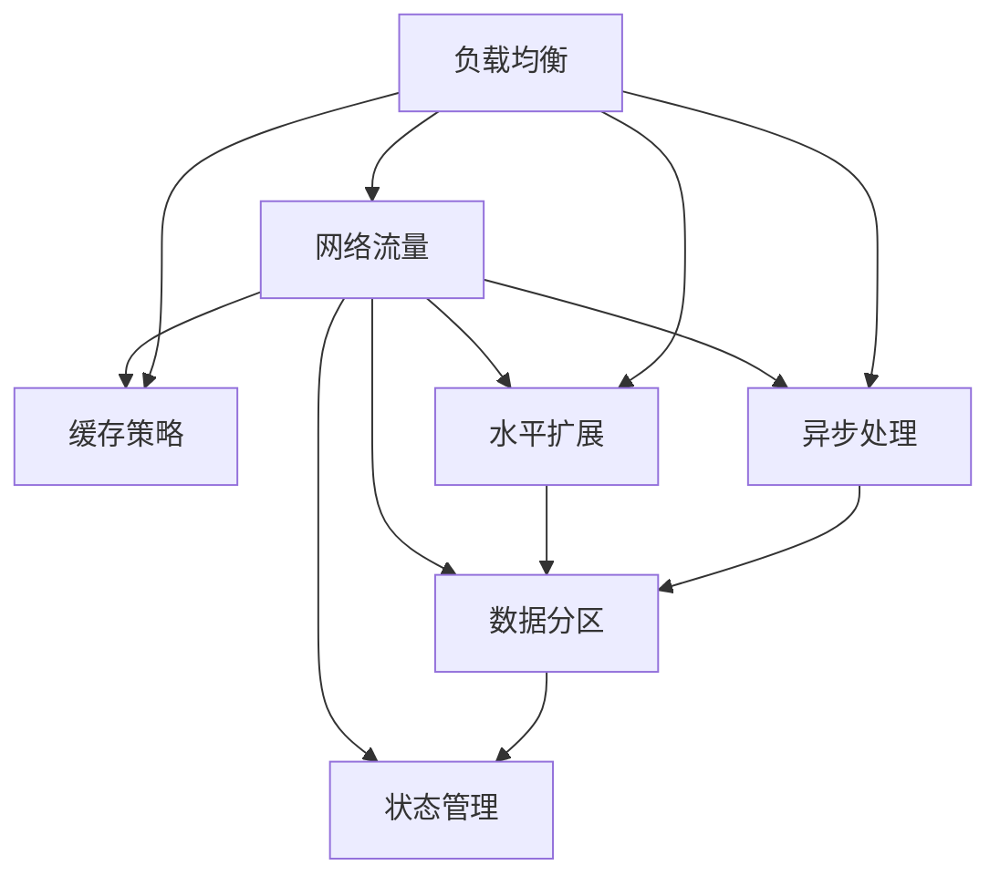

                 

# 高吞吐量系统设计的最佳实践

在现代互联网和企业应用中，系统的吞吐量（即单位时间内处理的事务或请求数量）已经成为了衡量系统性能的重要指标之一。无论是Web应用、微服务架构、分布式系统，还是云计算平台，高吞吐量的设计都是核心关注点。本文将从背景介绍、核心概念与联系、核心算法原理及操作步骤、数学模型与公式、项目实践、实际应用场景、工具和资源推荐等多个方面，深入探讨高吞吐量系统设计的最佳实践。

## 1. 背景介绍

### 1.1 问题由来
随着互联网的飞速发展和用户需求的快速变化，系统的吞吐量要求也在不断提高。Web应用的点击流、微服务架构的调用链、分布式系统的数据流转，以及云计算平台的服务请求，都面临着巨大的流量压力。系统设计的目标是保证高效稳定地处理大规模请求，提升用户体验，降低系统资源消耗，并保障系统可扩展性和弹性。

### 1.2 问题核心关键点
高吞吐量系统设计需要考虑的关键点包括：
1. **负载均衡**：合理分配流量，避免单点故障和瓶颈。
2. **缓存策略**：减少对数据库的频繁访问，提升响应速度。
3. **异步处理**：处理长时间耗时操作，提高系统并发能力。
4. **水平扩展**：通过增加资源节点来提升系统的处理能力。
5. **数据分区**：根据数据特征进行合理分区，提高查询效率。
6. **状态管理**：合理处理数据状态，避免数据不一致和性能瓶颈。

### 1.3 问题研究意义
高吞吐量系统设计对于提升应用系统的可用性、响应速度和用户体验，具有重要意义。具体而言：
1. **提升用户体验**：快速响应和稳定的系统能够显著提升用户满意度。
2. **降低资源消耗**：合理设计可以大幅减少系统资源占用，降低运营成本。
3. **增强系统可扩展性**：通过高吞吐量设计，系统可以灵活扩展，适应未来流量增长。
4. **增强系统可靠性**：分散处理负载，减少单点故障和宕机风险。
5. **支持分布式架构**：高吞吐量设计是构建分布式系统、微服务架构的基础。

## 2. 核心概念与联系

### 2.1 核心概念概述

在探讨高吞吐量系统设计时，需要理解以下关键概念：

- **负载均衡**：通过算法和硬件，将网络流量在多个服务器之间平均分配，避免单点故障和瓶颈。
- **缓存策略**：使用缓存来存储频繁访问的数据，减少对后端的查询压力。
- **异步处理**：通过异步操作来处理长时间耗时操作，提高系统并发能力。
- **水平扩展**：通过增加资源节点来提升系统的处理能力，提高系统的可扩展性和弹性。
- **数据分区**：根据数据的分布特性进行合理分区，提高查询效率。
- **状态管理**：管理系统的状态，避免数据不一致和性能瓶颈。

### 2.2 概念间的关系

这些核心概念之间的联系紧密，通过合理的设计可以形成完整的高吞吐量系统架构。以下通过几个Mermaid流程图来展示这些概念之间的联系：



这个流程图展示了高吞吐量系统设计的主要概念及其相互关系：

1. **负载均衡**：负责网络流量的分配，直接影响系统的吞吐量和稳定性。
2. **缓存策略**：通过缓存降低对数据库的频繁访问，提升响应速度。
3. **异步处理**：处理长时间耗时操作，提高系统的并发能力。
4. **水平扩展**：通过增加资源节点来提升系统的处理能力。
5. **数据分区**：根据数据特征进行合理分区，提高查询效率。
6. **状态管理**：管理系统的状态，避免数据不一致和性能瓶颈。

通过合理设计这些核心概念，可以构建高效稳定的高吞吐量系统。

## 3. 核心算法原理 & 具体操作步骤

### 3.1 算法原理概述
高吞吐量系统设计的核心算法原理包括以下几个方面：

1. **负载均衡算法**：通过算法将流量在多个服务器之间平均分配，避免单点故障和瓶颈。
2. **缓存策略**：使用缓存来存储频繁访问的数据，减少对后端的查询压力。
3. **异步处理算法**：通过异步操作来处理长时间耗时操作，提高系统并发能力。
4. **水平扩展算法**：通过增加资源节点来提升系统的处理能力，提高系统的可扩展性和弹性。
5. **数据分区算法**：根据数据的分布特性进行合理分区，提高查询效率。
6. **状态管理算法**：管理系统的状态，避免数据不一致和性能瓶颈。

### 3.2 算法步骤详解
以下详细讲解高吞吐量系统设计的具体步骤：

**Step 1: 设计系统架构**
- 确定系统的功能需求和负载特征。
- 选择合适的负载均衡、缓存、异步处理等组件。
- 设计数据分区策略，划分数据存储和查询逻辑。
- 设计状态管理机制，确保数据一致性。

**Step 2: 实现负载均衡**
- 选择合适的负载均衡算法，如轮询、最小连接数、IP散列等。
- 配置负载均衡硬件或软件，确保流量在服务器间均衡分配。
- 实时监控流量和服务器负载，自动调整负载均衡策略。

**Step 3: 实现缓存策略**
- 选择合适的缓存组件，如Redis、Memcached等。
- 设计缓存策略，确定缓存的失效机制和更新策略。
- 缓存热点数据，减少数据库的查询压力。
- 实时监控缓存命中率和缓存失效情况，优化缓存策略。

**Step 4: 实现异步处理**
- 选择合适的异步处理框架，如Node.js、Python的asyncio等。
- 设计异步处理流程，将长时间耗时操作异步化。
- 实现消息队列和事件驱动机制，提高系统并发能力。
- 实时监控异步任务状态，优化异步处理效率。

**Step 5: 实现水平扩展**
- 选择合适的扩展策略，如容器化部署、Kubernetes等。
- 设计服务发现和负载均衡策略，确保新节点的快速加入和稳定运行。
- 实现自动扩展机制，根据流量动态调整资源节点。
- 实时监控系统负载，优化资源配置。

**Step 6: 实现数据分区**
- 选择合适的分区策略，如哈希分区、范围分区等。
- 设计数据存储和查询逻辑，确保数据分区合理。
- 实现分布式数据库和分布式存储，提升查询效率。
- 实时监控数据分区状态，优化查询效率。

**Step 7: 实现状态管理**
- 选择合适的状态管理方案，如分布式锁、ETCD等。
- 设计状态同步和更新机制，确保数据一致性。
- 实现状态监控和告警机制，及时处理状态异常。
- 实时监控系统状态，优化状态管理效率。

### 3.3 算法优缺点
高吞吐量系统设计的主要优点包括：
1. **提升系统稳定性**：通过负载均衡和缓存策略，避免单点故障和瓶颈，提升系统稳定性。
2. **提高响应速度**：通过缓存策略和异步处理，减少数据库查询次数，提升响应速度。
3. **增强系统可扩展性**：通过水平扩展和数据分区，提升系统处理能力，支持未来流量增长。
4. **降低资源消耗**：通过合理设计，大幅减少系统资源占用，降低运营成本。

主要缺点包括：
1. **复杂度增加**：系统设计需要考虑多方面因素，设计复杂度较高。
2. **实现难度大**：负载均衡、缓存、异步处理等技术实现难度较大。
3. **成本较高**：硬件和软件资源投入较大，需要较高的成本支持。

### 3.4 算法应用领域
高吞吐量系统设计广泛应用于各种应用场景，如：

1. **Web应用**：通过负载均衡和缓存策略，提升Web应用的响应速度和稳定性。
2. **微服务架构**：通过异步处理和水平扩展，提升微服务的处理能力和并发性。
3. **分布式系统**：通过数据分区和状态管理，提升分布式系统的处理能力和可扩展性。
4. **云计算平台**：通过高吞吐量设计，支持大规模用户请求，提升平台的用户体验。
5. **实时数据处理系统**：通过缓存和异步处理，提升系统对实时数据的高效处理能力。

## 4. 数学模型和公式 & 详细讲解 & 举例说明

### 4.1 数学模型构建

在高吞吐量系统设计中，常用的数学模型包括：
- **负载均衡模型**：通过数学模型描述流量在服务器间的分配情况。
- **缓存失效模型**：通过数学模型描述缓存数据的失效和更新机制。
- **异步处理模型**：通过数学模型描述异步任务的调度和执行机制。
- **水平扩展模型**：通过数学模型描述资源节点的添加和移除策略。
- **数据分区模型**：通过数学模型描述数据的存储和查询逻辑。
- **状态管理模型**：通过数学模型描述数据状态的同步和更新机制。

### 4.2 公式推导过程

以下以缓存策略为例，推导其数学模型：

假设缓存组件为Redis，当前缓存容量为$C$，缓存失效时间$\tau$，每单位时间生成的缓存请求为$R$。

设$t$为时间，$t_k$为缓存中命中数据的数量，$t_{k+1}$为缓存中命中数据的数量。则缓存策略的数学模型为：

$$
t_{k+1} = t_k - \frac{t_k}{\tau} \Delta t + R \Delta t
$$

其中$\Delta t$为单位时间长度，$k$为缓存命中的次数。

### 4.3 案例分析与讲解

以Redis缓存策略为例，进行案例分析：

假设Redis当前缓存容量为10，缓存失效时间$\tau=60s$，每单位时间生成的缓存请求为100。

设$t_0=0$，$t_1=10$，$t_2=10$，则缓存策略的数学模型可以推导为：

$$
t_2 = t_1 - \frac{t_1}{\tau} \cdot 1 + 100 \cdot 1 = 10 - \frac{10}{60} + 100 = 10 + 100 - \frac{1}{6} = 109.17
$$

由此可见，随着时间推移，Redis缓存中的命中数据会逐渐增加，但受限于缓存容量，命中次数会逐渐下降。合理设计缓存策略，可以有效减少对数据库的频繁访问，提升系统的响应速度。

## 5. 项目实践：代码实例和详细解释说明

### 5.1 开发环境搭建

在进行高吞吐量系统设计实践时，需要准备好开发环境。以下是使用Python进行Flask开发的环境配置流程：

1. 安装Anaconda：从官网下载并安装Anaconda，用于创建独立的Python环境。

2. 创建并激活虚拟环境：
```bash
conda create -n flask-env python=3.8 
conda activate flask-env
```

3. 安装Flask：
```bash
pip install flask
```

4. 安装Flask-Caching扩展：
```bash
pip install Flask-Caching
```

5. 安装Flask-Redis扩展：
```bash
pip install Flask-Redis
```

完成上述步骤后，即可在`flask-env`环境中开始高吞吐量系统设计的实践。

### 5.2 源代码详细实现

以下是一个使用Flask实现高吞吐量系统设计的基本代码示例：

```python
from flask import Flask
from flask_caching import Cache
from flask_redis import Redis
import time

app = Flask(__name__)
app.config['CACHE_TYPE'] = 'redis'
app.config['CACHE_REDIS_URL'] = 'redis://localhost:6379'
cache = Cache(app)

app.config['REDIS_URL'] = 'redis://localhost:6379'
redis_store = Redis(app)

@app.route('/')
def index():
    key = 'data'
    value = 'value'
    cache.set(key, value)
    redis_store.set(key, value)
    return f'Cache key: {key}, Cache value: {cache.get(key)}, Redis key: {key}, Redis value: {redis_store.get(key)}'

if __name__ == '__main__':
    app.run(debug=True)
```

在这个示例中，我们使用Flask框架，配置Redis缓存和Redis存储，并实现了一个简单的访问页。在页面中，我们首先使用Redis缓存和Redis存储分别存储了数据，然后获取并输出缓存和存储的值。

### 5.3 代码解读与分析

让我们再详细解读一下关键代码的实现细节：

**Flask框架**：
- `Flask`是一个轻量级的Web框架，非常适合快速开发小型应用。
- `Flask-Caching`是一个缓存扩展，可以轻松地将缓存集成到Flask应用中。
- `Flask-Redis`是一个Redis扩展，可以方便地与Redis进行集成。

**缓存和存储**：
- 通过配置`app.config['CACHE_TYPE']`为`redis`，使用Redis作为缓存。
- 通过配置`app.config['REDIS_URL']`为`redis://localhost:6379`，使用Redis作为存储。
- 使用`cache.set(key, value)`将数据存储到Redis缓存中，使用`redis_store.set(key, value)`将数据存储到Redis存储中。
- 使用`cache.get(key)`从Redis缓存中获取数据，使用`redis_store.get(key)`从Redis存储中获取数据。

**访问页实现**：
- 通过`@app.route('/')`装饰器定义了一个访问页。
- 在访问页中，我们首先使用Redis缓存和Redis存储分别存储了数据，然后获取并输出缓存和存储的值。

通过以上代码示例，可以理解高吞吐量系统设计的基本流程和实现方式。

### 5.4 运行结果展示

运行以上代码后，可以在浏览器中访问访问页，输出类似于以下结果：

```
Cache key: data, Cache value: value, Redis key: data, Redis value: value
```

这表明缓存和存储中均成功存储了数据，且读取值一致。

## 6. 实际应用场景

### 6.1 智能客服系统

高吞吐量系统设计在智能客服系统中可以显著提升系统的处理能力和稳定性。通过负载均衡和缓存策略，可以确保系统能够高效处理大量的用户请求，提升用户体验。

具体实现时，可以设计多台服务器进行负载均衡，使用Redis缓存频繁的查询操作，减少对数据库的频繁访问，提高系统的响应速度。此外，还可以设计异步处理机制，处理长时间耗时的用户交互操作，进一步提升系统的并发能力。

### 6.2 金融交易系统

高吞吐量系统设计在金融交易系统中具有重要意义。金融交易系统需要处理大量的交易请求，保障交易的实时性和稳定性。

通过设计水平扩展机制，增加交易服务器的数量，提升系统的处理能力。使用缓存策略，减少对数据库的频繁访问，提升交易速度。同时，通过异步处理机制，处理长时间耗时的交易处理操作，提升系统的并发能力。最后，使用状态管理机制，确保交易状态的一致性，避免数据丢失和性能瓶颈。

### 6.3 电子商务平台

高吞吐量系统设计在电子商务平台中同样重要。电子商务平台需要处理大量的用户请求，如商品搜索、订单处理、支付等。

通过设计负载均衡和缓存策略，减少对数据库的频繁访问，提升系统的响应速度。同时，通过异步处理机制，处理长时间耗时的订单处理操作，提升系统的并发能力。最后，使用数据分区和状态管理机制，提升数据查询效率，确保订单状态的一致性。

### 6.4 未来应用展望

未来，高吞吐量系统设计将在更多领域得到广泛应用，为传统行业数字化转型升级提供新的技术路径。

在智慧医疗领域，通过高吞吐量系统设计，可以实现快速响应的医疗咨询、在线诊疗等服务，提升医疗服务的智能化水平。在智能制造领域，通过高吞吐量系统设计，可以实现高精度的生产控制和设备管理，提升生产效率和质量。在智慧城市治理中，通过高吞吐量系统设计，可以实现实时数据处理和智能决策，提高城市管理的自动化和智能化水平。

总之，高吞吐量系统设计将成为构建人机协同的智能系统的关键技术，为各行各业带来变革性影响。相信随着技术的日益成熟，高吞吐量系统设计必将在更多领域发挥重要作用，助力各行业数字化转型升级。

## 7. 工具和资源推荐

### 7.1 学习资源推荐

为了帮助开发者系统掌握高吞吐量系统设计的理论基础和实践技巧，这里推荐一些优质的学习资源：

1. 《高性能Web应用设计》（High Performance Web Sites）：这是Google工程师撰写的一本书，深入浅出地介绍了高吞吐量系统设计的各种技术，是Web应用开发者的必读书籍。
2. 《系统架构》（System Architecture）课程：由Udacity提供，系统讲解了系统架构的基本概念和设计原则，适合入门学习者。
3. 《分布式系统原理与设计》（Distributed Systems: Principles and Design）：这是斯坦福大学的经典课程，详细介绍了分布式系统的设计原理和实现方法，是学习高吞吐量系统设计的绝佳资源。
4. 《高吞吐量Web应用》（High Performance Web Applications）：这是ACM Turing奖得主Donald Knuth的一篇文章，介绍了高吞吐量Web应用的各种技术，是学习高吞吐量系统设计的经典参考文献。
5. 《Web性能优化》（Web Performance Optimization）：这是Lighthouse团队发布的一份文档，详细介绍了Web性能优化的各种技术，适合Web开发者参考。

通过这些学习资源，相信你一定能够全面掌握高吞吐量系统设计的精髓，并用于解决实际的系统设计问题。

### 7.2 开发工具推荐

高效的开发离不开优秀的工具支持。以下是几款用于高吞吐量系统设计开发的常用工具：

1. Flask：轻量级的Web框架，非常适合快速开发小型应用。
2. Nginx：高性能的Web服务器和反向代理服务器，非常适合高流量Web应用的负载均衡。
3. Redis：高性能的内存数据库，非常适合缓存和实时数据处理。
4. RabbitMQ：高性能的消息队列，非常适合异步处理和消息驱动的应用。
5. Docker：轻量级的容器化工具，非常适合高吞吐量系统的水平扩展和分布式部署。
6. Kubernetes：基于容器的高效资源管理平台，非常适合高吞吐量系统的弹性扩展和资源优化。

合理利用这些工具，可以显著提升高吞吐量系统设计的开发效率，加快创新迭代的步伐。

### 7.3 相关论文推荐

高吞吐量系统设计的研究源于学界的持续研究。以下是几篇奠基性的相关论文，推荐阅读：

1. "Load Balancing for Internet Applications"（互联网应用的负载均衡）：这篇论文介绍了负载均衡的基本算法和实现方法，是负载均衡领域的经典之作。
2. "The Logic Behind Redis Performance"（Redis性能背后的逻辑）：这篇论文详细介绍了Redis缓存的内部实现和优化策略，是Redis缓存设计的重要参考资料。
3. "Asynchronous Programming in Python"（Python中的异步编程）：这篇论文介绍了Python中的异步编程技术，是异步处理的重要参考资料。
4. "Design Patterns: Elements of Reusable Object-Oriented Software"（设计模式：可重用面向对象软件的设计模式）：这是一本经典的书籍，详细介绍了设计模式的基本概念和实现方法，是系统设计的重要参考资料。
5. "Data Partitioning Strategies for Big Data"（大数据分区的策略）：这篇论文介绍了大数据分区的各种策略和实现方法，是数据分区设计的重要参考资料。

这些论文代表了大吞吐量系统设计的研究方向和前沿进展，通过学习这些前沿成果，可以帮助研究者把握学科前进方向，激发更多的创新灵感。

## 8. 总结：未来发展趋势与挑战

### 8.1 总结

本文对高吞吐量系统设计的核心概念、算法原理及具体操作步骤进行了全面系统的介绍。首先阐述了高吞吐量系统设计的背景和重要性，明确了其在高性能Web应用、微服务架构、分布式系统中的核心作用。其次，从原理到实践，详细讲解了负载均衡、缓存策略、异步处理、水平扩展、数据分区、状态管理等关键步骤，给出了具体的高吞吐量系统设计代码实例。同时，本文还广泛探讨了高吞吐量系统设计在智能客服、金融交易、电子商务等多个行业领域的应用前景，展示了其广泛的适用性。此外，本文精选了高吞吐量系统设计的学习资源、开发工具和相关论文，力求为读者提供全方位的技术指引。

通过本文的系统梳理，可以看到，高吞吐量系统设计已经成为构建高性能Web应用、微服务架构、分布式系统的核心技术，为提升系统性能、稳定性和可扩展性提供了重要支持。随着技术的不断演进，高吞吐量系统设计将不断发展，带来更多的创新和应用。

### 8.2 未来发展趋势

展望未来，高吞吐量系统设计将呈现以下几个发展趋势：

1. **智能负载均衡**：通过机器学习和智能算法，实现更高效的流量分配。
2. **动态缓存策略**：根据流量动态调整缓存策略，优化缓存的命中率和失效机制。
3. **异步处理优化**：通过先进的多线程和异步编程技术，提升异步处理的效率。
4. **弹性扩展机制**：通过容器化和容器编排技术，实现更灵活的资源扩展和动态调整。
5. **自动化运维**：通过自动化工具和DevOps实践，提高系统运维的效率和稳定性。
6. **安全性和可靠性**：通过安全设计和可靠性测试，保障系统的高吞吐量设计。

以上趋势凸显了高吞吐量系统设计的广阔前景。这些方向的探索发展，必将进一步提升系统性能和稳定性，为构建高可用、高性能的系统提供重要保障。

### 8.3 面临的挑战

尽管高吞吐量系统设计已经取得了显著进展，但在实现过程中仍然面临诸多挑战：

1. **设计复杂性**：高吞吐量系统设计需要考虑多方面因素，设计复杂度较高。
2. **实现难度大**：负载均衡、缓存、异步处理等技术实现难度较大。
3. **成本较高**：硬件和软件资源投入较大，需要较高的成本支持。
4. **性能瓶颈**：负载均衡、缓存、异步处理等技术的应用，可能会带来新的性能瓶颈。
5. **系统稳定性**：高吞吐量系统设计需要在多层次上进行优化，任何一层出现故障都可能导致系统不稳定。
6. **数据一致性**：高并发环境下的数据一致性问题需要特别注意，避免数据丢失和数据不一致。

正视高吞吐量系统设计面临的这些挑战，积极应对并寻求突破，将是高吞吐量系统设计不断完善的重要方向。

### 8.4 研究展望

面对高吞吐量系统设计所面临的种种挑战，未来的研究需要在以下几个方面寻求新的突破：

1. **多层次优化**：在负载均衡、缓存策略、异步处理等各层次进行优化，综合提升系统性能。
2. **自动化设计**：通过自动化设计工具，提高系统设计的效率和准确性。
3. **可扩展性优化**：通过更灵活的扩展策略，支持更大规模的流量和数据处理。
4. **异步处理优化**：通过更高效的异步编程技术，提升异步处理的效率和稳定性。
5. **分布式架构优化**：通过更先进的分布式架构设计，提升系统的可扩展性和可靠性。
6. **高并发优化**：通过更高效的数据处理和状态管理技术，提升高并发环境下的系统性能。

这些研究方向的探索，必将引领高吞吐量系统设计技术迈向更高的台阶，为构建高性能、高可靠性的系统提供重要支撑。面向未来，高吞吐量系统设计还需要与其他先进技术进行更深入的融合，如大数据、人工智能、区块链等，协同发力，共同推动系统的全面升级。

## 9. 附录：常见问题与解答

**Q1: 如何设计高吞吐量系统的负载均衡机制？**

A: 设计高吞吐量系统的负载均衡机制需要考虑以下几个关键点：
1. **算法选择**：选择合适的负载均衡算法，如轮询、最小连接数、IP散列等。
2. **硬件配置**：合理配置负载均衡硬件，确保流量在服务器间均衡分配。
3. **动态调整**：实时监控流量和服务器负载，自动调整负载均衡策略。

**Q2: 如何实现高吞吐量系统的缓存策略？**

A: 实现高吞吐量系统的缓存策略需要考虑以下几个关键点：
1. **选择合适的缓存组件**：如Redis、Memcached等。
2. **设计缓存策略**：确定缓存的失效机制和更新策略。
3. **缓存热点数据**：减少对数据库的频繁访问，提升响应速度。
4. **实时监控**：优化缓存策略，确保缓存命中率和失效情况。

**Q3: 如何提升高吞吐量系统的异步处理能力？**

A: 提升高吞吐量系统的异步处理能力需要考虑以下几个关键点：
1. **选择合适的异步处理框架**：如Node.js、Python的asyncio等。
2. **设计异步处理流程**：将长时间耗时操作异步化。
3. **实现消息队列和事件驱动机制**：提高系统并发能力。
4. **实时监控异步任务状态**：优化异步处理效率。

**Q4: 高吞吐量系统的扩展策略有哪些？**

A: 高吞吐量系统的扩展策略

