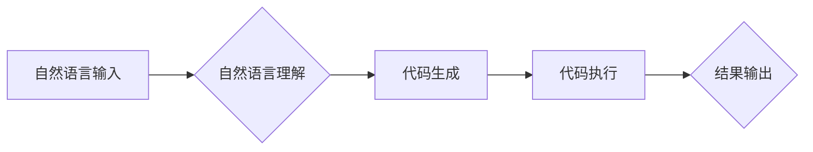

# 【LangChain编程：从入门到实践】对话场景

> 关键词：LangChain，编程，对话系统，自然语言理解，生成模型，人机交互，AI助手

## 1. 背景介绍

随着人工智能技术的飞速发展，自然语言处理（NLP）领域取得了显著的进步。特别是深度学习技术的应用，使得机器在理解、生成和处理自然语言方面变得越来越出色。在这个背景下，LangChain应运而生，它将编程语言与自然语言处理技术相结合，为构建智能对话系统提供了新的思路和方法。

LangChain是一个开源项目，它允许开发者使用自然语言来编写程序，从而简化了编程的复杂性，提高了开发效率。本文将深入探讨LangChain的核心概念、算法原理、项目实践和实际应用场景，帮助读者从入门到实践，全面了解并掌握LangChain技术。

## 2. 核心概念与联系

### 2.1 LangChain的定义

LangChain是一个将自然语言与编程语言相结合的框架，它允许开发者使用自然语言来描述程序逻辑，从而生成对应的代码。通过LangChain，开发者可以快速构建各种应用程序，包括聊天机器人、问答系统、自动化工具等。

### 2.2 LangChain的架构

以下是一个简化的LangChain架构流程图：



- **自然语言输入**：用户输入自然语言指令或问题。
- **自然语言理解**：LangChain对输入的自然语言进行处理，理解其意图和语义。
- **代码生成**：根据自然语言理解的结果，LangChain生成相应的代码。
- **代码执行**：执行生成的代码，完成用户的需求。
- **结果输出**：将执行结果输出给用户。

### 2.3 LangChain与相关技术的联系

- **自然语言处理（NLP）**：LangChain的核心功能是处理自然语言，因此与NLP技术紧密相关。它通常依赖于NLP技术，如词性标注、命名实体识别、依存句法分析等，来理解自然语言输入。
- **生成模型**：LangChain使用生成模型来生成代码，如Transformer、GPT-3等。这些模型能够根据给定的输入生成高质量的文本。
- **编程语言**：LangChain生成的代码可以是任何编程语言，如Python、JavaScript、Java等。

## 3. 核心算法原理 & 具体操作步骤

### 3.1 算法原理概述

LangChain的核心算法包括自然语言理解、代码生成和代码执行三个部分。

- **自然语言理解**：LangChain使用NLP技术对用户输入的自然语言进行处理，提取出关键信息，如意图、实体、操作等。
- **代码生成**：根据自然语言理解的结果，LangChain使用生成模型生成相应的代码。
- **代码执行**：执行生成的代码，完成用户的需求。

### 3.2 算法步骤详解

1. **自然语言理解**：
    - 接收用户输入的自然语言指令。
    - 使用NLP技术对指令进行解析，提取出意图、实体、操作等信息。
    - 将解析结果转换为内部表示。

2. **代码生成**：
    - 根据内部表示，使用生成模型生成相应的代码。
    - 对生成的代码进行格式化，使其符合编程语言的规范。

3. **代码执行**：
    - 使用编程语言解释器执行生成的代码。
    - 将执行结果返回给用户。

### 3.3 算法优缺点

**优点**：

- **易用性**：LangChain允许开发者使用自然语言来描述程序逻辑，简化了编程的复杂性。
- **效率**：使用LangChain可以快速构建各种应用程序，提高开发效率。
- **灵活性**：LangChain可以生成任何编程语言的代码，具有很高的灵活性。

**缺点**：

- **准确性**：自然语言理解可能存在歧义，导致生成的代码存在错误。
- **可解释性**：生成的代码缺乏可解释性，难以调试和优化。

### 3.4 算法应用领域

LangChain可以应用于以下领域：

- **聊天机器人**：构建能够与用户进行自然语言交互的聊天机器人。
- **问答系统**：构建能够回答用户问题的问答系统。
- **自动化工具**：构建能够自动完成特定任务的自动化工具。

## 4. 数学模型和公式 & 详细讲解 & 举例说明

### 4.1 数学模型构建

LangChain使用的数学模型主要包括NLP模型和生成模型。

- **NLP模型**：如BERT、GPT-3等，用于对自然语言输入进行理解。
- **生成模型**：如Transformer、GPT-3等，用于生成代码。

### 4.2 公式推导过程

由于LangChain涉及的数学模型较为复杂，这里不进行详细的公式推导。但以下是一些关键公式的简要说明：

- **自然语言理解**：
    - $P(y|x) = \frac{P(x,y)}{P(x)}$，其中 $y$ 为标签，$x$ 为输入。
    - $P(x,y) = \frac{P(x|y)P(y)}{P(x)}$，其中 $P(x|y)$ 为条件概率。

- **代码生成**：
    - $P(\text{code}|x) = \frac{P(x,\text{code})}{P(x)}$，其中 $\text{code}$ 为生成的代码。

### 4.3 案例分析与讲解

以下是一个使用LangChain生成Python代码的例子：

```python
# 输入：使用Python编写一个函数，该函数接收一个列表作为输入，返回列表中所有大于2的数字。
# 输出：
def filter_list(input_list):
    result = []
    for num in input_list:
        if num > 2:
            result.append(num)
    return result

print(filter_list([1, 2, 3, 4, 5]))
```

在这个例子中，LangChain首先使用NLP技术理解用户输入的意图，然后使用生成模型生成相应的Python代码，最后执行生成的代码，并将结果输出给用户。

## 5. 项目实践：代码实例和详细解释说明

### 5.1 开发环境搭建

要使用LangChain，你需要安装以下依赖：

- Python 3.7+
- transformers库
- langchain库

以下是一个简单的安装命令：

```bash
pip install transformers langchain
```

### 5.2 源代码详细实现

以下是一个使用LangChain构建聊天机器人的示例代码：

```python
from langchain import LanguageChain
from transformers import pipeline

# 初始化LangChain和NLP模型
lc = LanguageChain()
nlp = pipeline("feature-extraction")

# 聊天机器人主循环
while True:
    user_input = input("您想说什么？")
    if user_input.lower() == "退出":
        break
    # 使用NLP模型理解用户输入
    input_features = nlp(user_input)
    # 使用LangChain生成回复
    response_code = lc.generate_code(input_features, language="python")
    # 执行生成的代码，获取回复
    response = eval(response_code)
    print(response)
```

### 5.3 代码解读与分析

- `LanguageChain` 类：用于生成代码。
- `pipeline` 函数：用于加载预训练的NLP模型。
- `input_features`：NLP模型对用户输入的处理结果。
- `response_code`：LangChain生成的代码。
- `response`：执行生成的代码后得到的回复。

### 5.4 运行结果展示

当用户输入“你好”时，聊天机器人会回复“你好，很高兴见到你！”。当用户输入“退出”时，聊天机器人会结束。

## 6. 实际应用场景

LangChain可以应用于以下实际应用场景：

- **客服机器人**：构建能够自动回答客户问题的客服机器人。
- **智能助手**：构建能够帮助用户完成各种任务的智能助手。
- **自动化脚本**：构建能够自动执行特定任务的自动化脚本。

## 7. 工具和资源推荐

### 7.1 学习资源推荐

- LangChain官方文档：[https://langchain.readthedocs.io/](https://langchain.readthedocs.io/)
- Transformers库官方文档：[https://huggingface.co/docs/transformers](https://huggingface.co/docs/transformers)
- GPT-3官方文档：[https://gpt-3-docs.openai.com/](https://gpt-3-docs.openai.com/)

### 7.2 开发工具推荐

- Python 3.7+
- PyCharm或Jupyter Notebook

### 7.3 相关论文推荐

- **BERT: Pre-training of Deep Bidirectional Transformers for Language Understanding**
- **Generative Pre-trained Transformers**
- **Language Models are Unsupervised Multitask Learners**

## 8. 总结：未来发展趋势与挑战

### 8.1 研究成果总结

LangChain将编程语言与自然语言处理技术相结合，为构建智能对话系统提供了新的思路和方法。它具有易用性、效率、灵活性等优点，在聊天机器人、问答系统、自动化工具等领域具有广泛的应用前景。

### 8.2 未来发展趋势

- **模型更加强大**：随着NLP和生成模型技术的不断发展，LangChain将具备更强的自然语言理解和代码生成能力。
- **应用场景更加丰富**：LangChain将应用于更多领域，如教育、医疗、金融等。
- **生态更加完善**：LangChain将与其他人工智能技术（如计算机视觉、语音识别等）融合，构建更加智能的生态系统。

### 8.3 面临的挑战

- **自然语言理解**：自然语言理解是LangChain的核心，如何提高理解准确性是一个挑战。
- **代码生成**：生成的代码可能存在错误或不完整，需要进一步优化。
- **可解释性**：生成的代码缺乏可解释性，难以调试和优化。

### 8.4 研究展望

LangChain技术具有广阔的发展前景，未来需要在以下方面进行深入研究：

- **提高自然语言理解能力**：通过改进NLP模型、引入新的语言特征等方法，提高LangChain的自然语言理解能力。
- **优化代码生成能力**：通过改进生成模型、引入新的编程语言语法规则等方法，优化LangChain的代码生成能力。
- **增强可解释性**：通过引入可解释性技术、开发可视化工具等方法，提高LangChain的可解释性。

## 9. 附录：常见问题与解答

**Q1：LangChain是什么？**

A：LangChain是一个将编程语言与自然语言处理技术相结合的框架，它允许开发者使用自然语言来编写程序。

**Q2：LangChain有哪些应用场景？**

A：LangChain可以应用于聊天机器人、问答系统、自动化工具等领域。

**Q3：如何安装LangChain？**

A：使用pip安装transformers和langchain库。

**Q4：如何使用LangChain生成代码？**

A：使用LanguageChain类生成代码。

**Q5：LangChain有哪些局限性？**

A：LangChain的自然语言理解能力、代码生成能力和可解释性还有待提高。

---

作者：禅与计算机程序设计艺术 / Zen and the Art of Computer Programming
