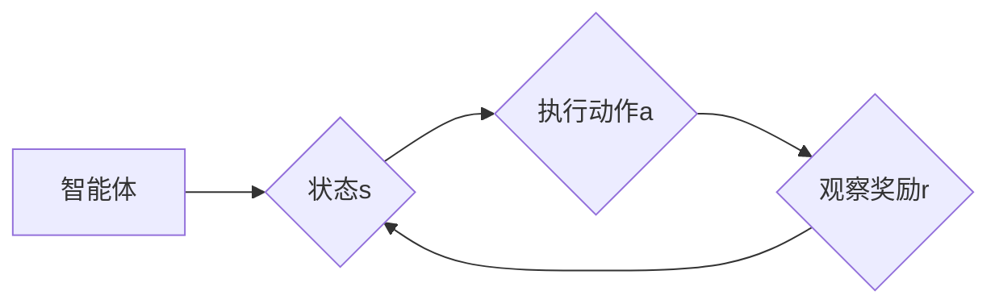

> 强化学习，工业自动化，映射学习，自适应控制，优化，智能决策，案例分析，实践指南

# 一切皆是映射：强化学习在工业自动化中的应用：挑战与机遇

强化学习（Reinforcement Learning，RL）作为一种先进的人工智能技术，近年来在工业自动化领域展现出巨大的潜力。它通过智能体与环境的交互，学习最优策略，从而实现复杂任务的自动化。本文将深入探讨强化学习在工业自动化中的应用，分析其挑战与机遇，并提供实践指南。

## 1. 背景介绍

### 1.1 工业自动化的发展

工业自动化是现代工业生产的重要趋势，旨在提高生产效率、降低成本、提升产品质量。随着传感器技术、机器人技术和计算机视觉的快速发展，工业自动化正在向智能化、柔性化、网络化方向发展。

### 1.2 强化学习的兴起

强化学习作为机器学习的一个重要分支，通过智能体与环境交互，不断学习最优策略，以实现特定目标。近年来，强化学习在游戏、推荐系统、自动驾驶等领域取得了显著成果，也为工业自动化领域带来了新的机遇。

### 1.3 强化学习在工业自动化中的应用意义

强化学习在工业自动化中的应用，有助于实现以下目标：

- 提高生产效率，降低生产成本。
- 增强生产系统的柔性和适应性。
- 提高产品质量，降低不良品率。
- 实现生产过程的智能化、自主化。

## 2. 核心概念与联系

### 2.1 强化学习的基本概念

强化学习的基本概念包括：

- 智能体（Agent）：执行任务的主体，如机器人、控制系统等。
- 环境（Environment）：智能体所处的环境，提供状态和奖励。
- 状态（State）：描述智能体当前所处的环境信息。
- 动作（Action）：智能体可以执行的操作。
- 奖励（Reward）：环境对智能体动作的反馈。
- 策略（Policy）：智能体选择动作的规则。

### 2.2 强化学习与映射学习的关系

强化学习可以看作是一种特殊的映射学习，它通过学习状态-动作-奖励的映射关系，实现智能体与环境之间的交互。Mermaid流程图如下：



### 2.3 强化学习与自适应控制的关系

强化学习在自适应控制领域有着广泛的应用，可以将强化学习视为一种自适应控制方法。通过学习最优控制策略，智能体可以实现对动态环境的适应和控制。

## 3. 核心算法原理 & 具体操作步骤

### 3.1 算法原理概述

强化学习算法主要包括：

- Q-Learning：基于值函数的强化学习算法，通过学习状态-动作值函数来指导智能体的动作选择。
- Deep Q-Network（DQN）：结合深度学习的Q-Learning算法，通过神经网络来近似状态-动作值函数。
- Policy Gradient：直接学习策略函数，而不是值函数，通过优化策略函数来指导智能体的动作选择。
- Actor-Critic：结合策略函数和价值函数，通过同时优化策略函数和价值函数来指导智能体的动作选择。

### 3.2 算法步骤详解

强化学习算法的基本步骤如下：

1. 初始化智能体、环境和策略。
2. 智能体在环境中随机选择动作。
3. 环境根据智能体的动作返回状态和奖励。
4. 智能体根据接收到的状态和奖励更新策略。
5. 重复步骤2-4，直到达到终止条件。

### 3.3 算法优缺点

强化学习算法的优点：

- 不需要大量标注数据。
- 能够处理复杂、动态的环境。
- 能够学习到最优策略。

强化学习算法的缺点：

- 学习过程可能非常缓慢。
- 可能陷入局部最优解。
- 需要大量的计算资源。

### 3.4 算法应用领域

强化学习在工业自动化领域的应用领域包括：

- 自动化生产线控制。
- 机器人路径规划。
- 设备故障诊断与预测。
- 能源管理。
- 质量检测。

## 4. 数学模型和公式 & 详细讲解 & 举例说明

### 4.1 数学模型构建

强化学习的主要数学模型包括：

- 状态-动作空间：\$ S \times A \$
- 值函数：\$ V(s) \$
- 策略函数：\$ \pi(a|s) \$

### 4.2 公式推导过程

以下以Q-Learning为例，介绍强化学习算法的数学推导过程。

**Q-Learning的目标是学习状态-动作值函数 \$ Q(s,a) \$**。

\$ Q(s,a) \$ 的估计公式如下：

$$
Q(s,a) = \sum_{a'} Q(s,a') \pi(a'|s) \times R(s,a) + \gamma \max_{a''} Q(s',a'')
$$

其中：

- \$ R(s,a) \$ 为智能体在状态 \$ s \$ 下执行动作 \$ a \$ 获得的奖励。
- \$ \gamma \$ 为折扣因子，表示对未来奖励的重视程度。
- \$ \max_{a''} Q(s',a'') \$ 为在状态 \$ s' \$ 下选择最优动作 \$ a'' \$ 的期望值。

### 4.3 案例分析与讲解

以下以自动化生产线控制为例，介绍强化学习在工业自动化领域的应用。

假设有一条自动化生产线，需要控制机器人的运动轨迹，以将物体从起始位置运送到目标位置。机器人可以执行以下动作：

- 向前移动
- 向后移动
- 向左移动
- 向右移动
- 停止

智能体在环境中移动，根据到达目标位置的距离获得奖励。通过强化学习，智能体可以学习到最优的运动轨迹，以实现高效的物体运输。

## 5. 项目实践：代码实例和详细解释说明

### 5.1 开发环境搭建

在进行强化学习项目实践前，需要准备以下开发环境：

- Python 3.6及以上版本
- TensorFlow 2.x或PyTorch
- OpenAI Gym

### 5.2 源代码详细实现

以下是一个简单的强化学习项目示例，使用PyTorch实现Q-Learning算法。

```python
import torch
import numpy as np
import gym

# 创建环境
env = gym.make('CartPole-v1')

# 初始化参数
state_dim = env.observation_space.shape[0]
action_dim = env.action_space.n
learning_rate = 0.01
gamma = 0.99
epsilon = 0.1

# 初始化Q网络
Q = torch.nn.Linear(state_dim, action_dim)
Q.weight.data.uniform_(-1, 1)
Q.bias.data.uniform_(-1, 1)

# 定义损失函数和优化器
criterion = torch.nn.MSELoss()
optimizer = torch.optim.Adam(Q.parameters(), lr=learning_rate)

# 训练过程
for episode in range(1000):
    state = env.reset()
    state = torch.FloatTensor(state)
    done = False
    
    while not done:
        # 选择动作
        if np.random.rand() < epsilon:
            action = env.action_space.sample()
        else:
            action = Q(state).argmax().item()
        
        # 执行动作，获取奖励和下一状态
        next_state, reward, done, _ = env.step(action)
        next_state = torch.FloatTensor(next_state)
        
        # 计算Q值
        next_Q = Q(next_state).detach().clone()
        expected_Q = reward + gamma * next_Q.max()
        
        # 更新Q值
        Q_target = torch.zeros(action_dim, 1)
        Q_target[torch.arange(action_dim)][action] = expected_Q
        Q_loss = criterion(Q(state), Q_target)
        
        # 更新网络
        optimizer.zero_grad()
        Q_loss.backward()
        optimizer.step()
        
        # 更新状态
        state = next_state

# 评估模型
state = env.reset()
state = torch.FloatTensor(state)
done = False

while not done:
    action = Q(state).argmax().item()
    _, reward, done, _ = env.step(action)
    state = torch.FloatTensor(state)

env.close()
```

### 5.3 代码解读与分析

- 首先，创建环境 `env = gym.make('CartPole-v1')`，加载CartPole虚拟环境。
- 初始化参数，包括状态维度、动作维度、学习率、折扣因子、epsilon等。
- 初始化Q网络，使用PyTorch的线性层 `torch.nn.Linear`。
- 定义损失函数和优化器，使用MSELoss和Adam优化器。
- 训练过程：循环迭代 episodes，对每个episode：
  - 重置环境，获取初始状态。
  - 根据epsilon选择动作，epsilon为探索率。
  - 执行动作，获取奖励和下一状态。
  - 计算Q值，使用 detach() 防止梯度反向传播。
  - 计算期望Q值，根据奖励和下一状态的Q值计算。
  - 更新Q值，使用MSELoss计算损失。
  - 更新网络参数，使用Adam优化器进行反向传播。
  - 更新状态，准备下一轮迭代。
- 评估模型：加载训练好的Q网络，在CartPole环境中进行评估。

### 5.4 运行结果展示

通过运行代码，可以看到智能体在CartPole环境中逐渐学习到稳定的策略，能够使杆子保持平衡的时间越来越长。

## 6. 实际应用场景

### 6.1 自动化生产线控制

强化学习可以应用于自动化生产线控制，实现机器人路径规划、生产线调度、产品质量检测等任务。例如，使用强化学习优化机器人的运动轨迹，提高生产效率。

### 6.2 机器人路径规划

强化学习可以用于机器人路径规划，使机器人避开障碍物、快速到达目标位置。例如，使用DRL算法优化机器人在仓库中的拣选路径。

### 6.3 设备故障诊断与预测

强化学习可以用于设备故障诊断与预测，通过学习设备运行状态与故障之间的映射关系，实现早期故障检测和预测。例如，使用强化学习分析工业设备振动信号，预测设备故障。

### 6.4 能源管理

强化学习可以用于能源管理，优化能源消耗和分配。例如，使用强化学习优化数据中心能耗，提高能源利用效率。

### 6.5 质量检测

强化学习可以用于质量检测，自动识别产品缺陷。例如，使用强化学习分析工业产品质量数据，识别和分类缺陷类型。

## 7. 工具和资源推荐

### 7.1 学习资源推荐

- 《深度强化学习》（刘铁岩 著）
- 《强化学习与决策》（David Silver 著）
- 《Reinforcement Learning: An Introduction》（Richard S. Sutton和Barto N. 著）

### 7.2 开发工具推荐

- TensorFlow
- PyTorch
- OpenAI Gym

### 7.3 相关论文推荐

- Deep Q-Network (DQN)：Nature paper by DeepMind
- Asynchronous Advantage Actor-Critic (A3C)：Nature paper by OpenAI
- Proximal Policy Optimization (PPO)：ICLR 2017 paper by OpenAI

## 8. 总结：未来发展趋势与挑战

### 8.1 研究成果总结

本文探讨了强化学习在工业自动化中的应用，分析了其挑战与机遇，并提供了实践指南。强化学习在工业自动化领域具有广阔的应用前景，能够提高生产效率、降低成本、提升产品质量。

### 8.2 未来发展趋势

未来，强化学习在工业自动化领域的发展趋势包括：

- 深度强化学习：结合深度学习技术，实现更复杂的任务和学习能力。
- 多智能体强化学习：实现多个智能体之间的协同作业。
- 强化学习与其他技术的融合：与知识图谱、物联网、区块链等技术融合，构建更加智能的工业自动化系统。

### 8.3 面临的挑战

强化学习在工业自动化领域面临的挑战包括：

- 计算资源消耗：强化学习算法需要大量的计算资源。
- 数据收集：需要收集大量的环境数据，以训练有效的模型。
- 模型可解释性：强化学习模型的决策过程难以解释。

### 8.4 研究展望

未来，强化学习在工业自动化领域的研究方向包括：

- 算法优化：提高算法的效率、可扩展性和可解释性。
- 应用拓展：将强化学习应用于更多工业自动化领域，如生产调度、设备维护等。
- 伦理和安全性：确保强化学习模型在工业自动化领域的应用符合伦理和安全性要求。

## 9. 附录：常见问题与解答

**Q1：强化学习在工业自动化中的应用有哪些优势？**

A：强化学习在工业自动化中的应用优势包括：

- 不需要大量标注数据。
- 能够处理复杂、动态的环境。
- 能够学习到最优策略。

**Q2：如何解决强化学习在工业自动化中面临的计算资源消耗问题？**

A：可以采用以下方法解决计算资源消耗问题：

- 使用更高效的算法和优化器。
- 使用分布式计算资源，如GPU、TPU等。
- 优化数据存储和传输。

**Q3：如何提高强化学习模型的可解释性？**

A：可以采用以下方法提高强化学习模型的可解释性：

- 使用可视化技术展示模型决策过程。
- 分析模型的内部机制，如特征提取、决策策略等。
- 引入可解释性评估指标，如模型复杂度、解释性指标等。

**Q4：如何将强化学习应用于实际工业自动化项目？**

A：将强化学习应用于实际工业自动化项目的步骤包括：

- 确定应用目标和场景。
- 收集和预处理环境数据。
- 选择合适的强化学习算法。
- 设计和实现强化学习模型。
- 进行模型训练和评估。
- 集成到实际工业自动化系统中。

通过以上步骤，可以将强化学习应用于实际的工业自动化项目，实现智能化、高效化的生产。

---

作者：禅与计算机程序设计艺术 / Zen and the Art of Computer Programming