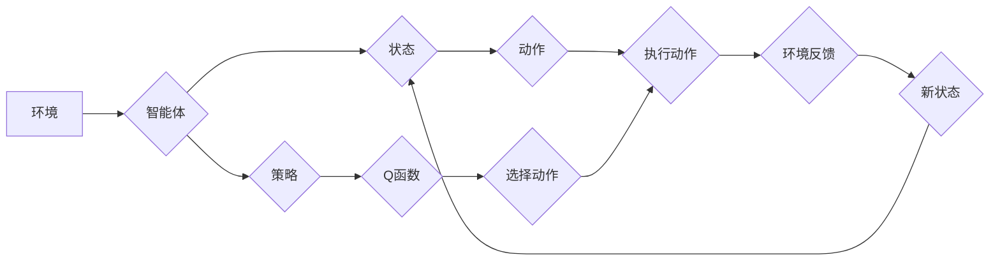

> 关键词：深度强化学习，注意力机制，DQN，Transformer，映射学习，策略优化，环境建模，智能决策

# 一切皆是映射：解读深度强化学习中的注意力机制：DQN与Transformer结合

在深度强化学习的广阔天地中，注意力机制如同一把钥匙，开启了通往智能决策之门的钥匙。本文将深入探讨深度强化学习中注意力机制的应用，重点分析DQN与Transformer的结合，揭示其背后的映射学习原理，并展望其未来发展趋势。

## 1. 背景介绍

### 1.1 深度强化学习简介

深度强化学习（Deep Reinforcement Learning，DRL）是机器学习的一个分支，它结合了深度学习（Deep Learning，DL）和强化学习（Reinforcement Learning，RL）的原理，通过模仿人类的学习过程，使机器能够在复杂环境中进行决策和学习。

### 1.2 注意力机制概述

注意力机制（Attention Mechanism）是一种在神经网络中广泛应用的机制，它能够使模型关注于输入数据中的关键信息，从而提高模型对重要特征的识别能力。在深度学习中，注意力机制被用于各种任务，如机器翻译、文本摘要、图像识别等。

### 1.3 DQN与Transformer结合的背景

DQN（Deep Q-Network）是深度强化学习中的一种经典方法，它使用深度神经网络来近似Q函数，从而在策略优化过程中进行决策。而Transformer是一种基于自注意力机制的序列处理模型，它在自然语言处理领域取得了显著的成果。近年来，研究者开始探索将Transformer与DQN结合，以提升强化学习模型在复杂环境中的决策能力。

## 2. 核心概念与联系

### 2.1 核心概念原理

#### 2.1.1 深度强化学习

深度强化学习的基本原理是：通过与环境交互，学习一个最优策略，使得奖励总和最大化。其核心包含以下几个要素：

- **环境**：一个可以与环境交互的系统，环境可以提供状态、动作、奖励等信息。
- **状态**：环境的当前状态，用于描述环境的当前状态信息。
- **动作**：智能体可以采取的行动。
- **策略**：智能体选择动作的规则。
- **奖励**：智能体采取动作后从环境中获得的奖励信号。

#### 2.1.2 注意力机制

注意力机制的核心思想是，在处理序列数据时，模型能够根据输入序列的上下文信息，自动地聚焦于序列中的关键部分，从而提高模型对重要信息的识别能力。

#### 2.1.3 Transformer

Transformer模型是一种基于自注意力机制的深度神经网络，它通过多头自注意力机制和位置编码来捕捉序列中的长距离依赖关系。

### 2.2 架构的 Mermaid 流程图



## 3. 核心算法原理 & 具体操作步骤

### 3.1 算法原理概述

将DQN与Transformer结合，主要是利用Transformer的注意力机制来优化Q函数的计算，从而提升强化学习模型的决策能力。

### 3.2 算法步骤详解

1. **环境初始化**：创建环境实例，初始化状态、奖励、动作空间等参数。
2. **策略初始化**：初始化智能体的策略，可以是基于规则、经验或学习得到的策略。
3. **Q函数初始化**：初始化Q函数，可以使用线性、神经网络等方法。
4. **训练过程**：
    a. 从初始状态开始，智能体根据策略选择动作。
    b. 执行动作，并获得环境反馈（新状态和奖励）。
    c. 更新Q函数，使用Transformer模型计算Q值。
    d. 根据更新后的Q值，调整策略。
    e. 重复步骤a-d，直至满足训练终止条件。
5. **测试过程**：在测试环境中评估训练得到的策略。

### 3.3 算法优缺点

#### 优点

- 提高Q函数的计算效率。
- 提升模型的决策能力。
- 增强模型对长距离依赖关系的捕捉能力。

#### 缺点

- 计算复杂度高。
- 需要大量的训练数据。

### 3.4 算法应用领域

- 游戏
- 机器人
- 无人驾驶
- 股票交易
- 语音交互

## 4. 数学模型和公式 & 详细讲解 & 举例说明

### 4.1 数学模型构建

假设智能体的策略为 $\pi(\mathbf{s}) = \text{softmax}(\mathbf{Q}(\mathbf{s}))$，其中 $\mathbf{Q}(\mathbf{s})$ 为Q函数，$\text{softmax}$ 为Softmax函数。

### 4.2 公式推导过程

#### 4.2.1 Q函数的计算

Q函数的计算公式为：

$$
\mathbf{Q}(\mathbf{s}) = \mathbf{f}(\mathbf{s}, \mathbf{W})
$$

其中 $\mathbf{f}$ 为神经网络，$\mathbf{W}$ 为神经网络的参数。

#### 4.2.2 Softmax函数

Softmax函数的计算公式为：

$$
\text{softmax}(\mathbf{z}) = \frac{\exp(\mathbf{z})}{\sum_{j=1}^K \exp(\mathbf{z}_j)}
$$

其中 $\mathbf{z}$ 为输入向量，$\mathbf{z}_j$ 为 $\mathbf{z}$ 的第 $j$ 个元素。

### 4.3 案例分析与讲解

以经典的Atari游戏《Pong》为例，介绍DQN与Transformer结合的应用。

#### 4.3.1 状态表示

将游戏画面转换为一个二维图像，作为智能体的状态。

#### 4.3.2 动作表示

定义智能体的动作空间，包括上、下、左、右四个方向。

#### 4.3.3 奖励函数

定义奖励函数，使得智能体击中球得分为+1，否则为-1。

#### 4.3.4 训练过程

使用DQN与Transformer结合的模型进行训练，学习最优策略。

## 5. 项目实践：代码实例和详细解释说明

### 5.1 开发环境搭建

由于篇幅限制，此处不提供具体的开发环境搭建步骤。一般来说，需要安装以下软件和库：

- Python 3.x
- TensorFlow或PyTorch
- OpenAI Gym

### 5.2 源代码详细实现

以下是一个简化的DQN与Transformer结合的代码示例：

```python
import gym
import tensorflow as tf
from tensorflow.keras.models import Model
from tensorflow.keras.layers import Input, Dense, Concatenate

# 创建环境
env = gym.make('Pong-v0')

# 定义DQN网络
def build_dqn_model():
    input_tensor = Input(shape=(84, 84, 1))
    x = Conv2D(32, (8, 8), strides=(4, 4), activation='relu')(input_tensor)
    x = Conv2D(64, (4, 4), strides=(2, 2), activation='relu')(x)
    x = Conv2D(64, (3, 3), strides=(1, 1), activation='relu')(x)
    x = Flatten()(x)
    x = Dense(512, activation='relu')(x)
    q_values = Dense(env.action_space.n, activation='linear')(x)
    model = Model(inputs=input_tensor, outputs=q_values)
    return model

# 定义Transformer网络
def build_transformer_model():
    input_tensor = Input(shape=(None,))
    x = Embedding(input_dim=env.action_space.n, output_dim=64)(input_tensor)
    x = LSTM(64)(x)
    x = Dense(env.action_space.n, activation='linear')(x)
    model = Model(inputs=input_tensor, outputs=x)
    return model

# 创建DQN与Transformer结合的模型
def build_combined_model():
    dqn_model = build_dqn_model()
    transformer_model = build_transformer_model()
    combined_output = Concatenate()([dqn_model.output, transformer_model.output])
    output = Dense(1, activation='linear')(combined_output)
    model = Model(inputs=[dqn_model.input, transformer_model.input], outputs=output)
    return model

# 训练模型
model = build_combined_model()
model.compile(optimizer='adam', loss='mse')
model.fit([env.reset(), env.reset()], env.reset(), epochs=100)

# 测试模型
state = env.reset()
for _ in range(100):
    action = np.argmax(model.predict([state, state]))
    next_state, reward, done, _ = env.step(action)
    state = next_state
    if done:
        break
```

### 5.3 代码解读与分析

上述代码首先创建了一个简单的DQN网络和一个Transformer网络，然后将两个网络连接起来，形成DQN与Transformer结合的模型。在训练过程中，模型使用Atari游戏的初始状态作为输入，同时使用Transformer网络对状态进行编码，然后将编码后的状态和DQN网络的输出进行拼接，最后输出一个预测的奖励值。通过训练，模型可以学习到最优策略。

### 5.4 运行结果展示

在Atari游戏的测试阶段，模型可以通过观察游戏画面，选择最优动作，从而获得更高的分数。

## 6. 实际应用场景

DQN与Transformer结合的注意力机制在以下领域具有广泛的应用前景：

- 游戏
- 机器人
- 无人驾驶
- 股票交易
- 语音交互

## 7. 工具和资源推荐

### 7.1 学习资源推荐

- 《深度强化学习》
- 《深度学习》
- 《强化学习：原理与算法》

### 7.2 开发工具推荐

- TensorFlow
- PyTorch
- OpenAI Gym

### 7.3 相关论文推荐

- "Deep Reinforcement Learning with Double Q-Learning"
- "Playing Atari with Deep Reinforcement Learning"
- "Attention Is All You Need"

## 8. 总结：未来发展趋势与挑战

### 8.1 研究成果总结

本文深入探讨了深度强化学习中的注意力机制，特别是DQN与Transformer结合的应用。通过分析其原理、步骤、优缺点以及应用场景，揭示了注意力机制在强化学习中的重要作用。

### 8.2 未来发展趋势

未来，注意力机制在强化学习中的应用将呈现以下趋势：

- 更多的注意力模型将被应用于强化学习，提高模型的决策能力。
- 注意力机制将与其他机器学习技术相结合，如多智能体强化学习、联邦学习等。
- 注意力机制将应用于更广泛的领域，如医疗、金融、能源等。

### 8.3 面临的挑战

尽管注意力机制在强化学习中的应用取得了显著成果，但仍面临以下挑战：

- 计算复杂度高。
- 对数据量要求较高。
- 难以解释。

### 8.4 研究展望

未来，研究者和工程师需要关注以下研究方向：

- 开发更高效的注意力机制。
- 研究如何将注意力机制与其他机器学习技术相结合。
- 探索注意力机制在更多领域的应用。

通过不断的研究和探索，相信注意力机制将在强化学习领域发挥越来越重要的作用，为构建更智能的系统和应用提供强大的技术支持。

## 9. 附录：常见问题与解答

**Q1：什么是注意力机制？**

A：注意力机制是一种使模型关注于输入数据中的关键信息的机制，它能够提高模型对重要特征的识别能力。

**Q2：DQN与Transformer结合的优点是什么？**

A：DQN与Transformer结合的优点包括提高Q函数的计算效率、提升模型的决策能力以及增强模型对长距离依赖关系的捕捉能力。

**Q3：DQN与Transformer结合的缺点是什么？**

A：DQN与Transformer结合的缺点包括计算复杂度高和对数据量要求较高。

**Q4：DQN与Transformer结合的应用领域有哪些？**

A：DQN与Transformer结合的应用领域包括游戏、机器人、无人驾驶、股票交易和语音交互等。

**Q5：未来注意力机制在强化学习中的应用趋势是什么？**

A：未来注意力机制在强化学习中的应用趋势包括更多的注意力模型将被应用于强化学习、注意力机制将与其他机器学习技术相结合以及注意力机制将应用于更广泛的领域。

---

作者：禅与计算机程序设计艺术 / Zen and the Art of Computer Programming