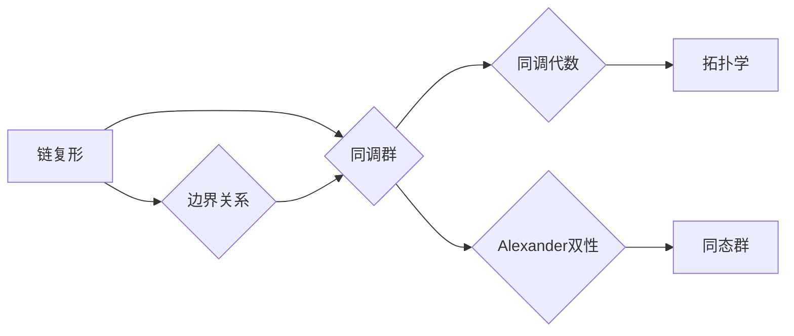

# 上同调中的Alexander双性

> 关键词：同调代数，Alexander双性，环谱，同调群，链复形，拓扑学

## 1. 背景介绍

同调代数是代数拓扑学中的一个重要分支，它研究的是拓扑空间的代数性质。同调群作为同调代数的基本对象，对于理解拓扑空间的连接性和结构起着核心作用。Alexander双性是同调代数中的一个深奥概念，它揭示了同调群与链复形之间的密切联系。本文将深入探讨Alexander双性的原理、应用以及它在拓扑学中的重要性。

### 1.1 问题的由来

同调群的概念最早由Poincaré在拓扑学的上下文中提出，用来研究空间中的连续变换和不变量。随着研究的深入，人们逐渐发现同调群与链复形之间存在着深刻的联系。Alexander双性正是这种联系的一个典范，它揭示了同调群在拓扑结构中的“双面性”。

### 1.2 研究现状

Alexander双性在拓扑学、代数拓扑和数学物理等多个领域都有重要的应用。近年来，随着计算拓扑学的兴起，Alexander双性在算法和计算中的应用也日益受到关注。

### 1.3 研究意义

研究Alexander双性有助于我们更深入地理解拓扑空间的性质，同时它也为拓扑学的计算提供了有力的工具。此外，Alexander双性在数学物理中也有重要的应用，如K-theory、拓扑量子场论等。

### 1.4 本文结构

本文将分为以下几个部分：
- 第2部分介绍同调代数和Alexander双性的基本概念。
- 第3部分阐述Alexander双性的算法原理和具体操作步骤。
- 第4部分介绍数学模型和公式，并举例说明。
- 第5部分展示代码实例和详细解释说明。
- 第6部分讨论实际应用场景和未来应用展望。
- 第7部分推荐相关学习资源、开发工具和论文。
- 第8部分总结研究成果，展望未来发展趋势和挑战。
- 第9部分附录提供常见问题与解答。

## 2. 核心概念与联系

### 2.1 同调代数

同调代数是研究拓扑空间中同调群的结构和性质的代数分支。同调群是通过对链复形进行上同调运算得到的。链复形是一种特殊的代数结构，它由一组链和它们的边界关系组成。

### 2.2 Alexander双性

Alexander双性是指同调群与链复形之间的一种特殊关系。具体来说，对于一个给定的链复形，存在一个双性同态，它将同调群映射到链复形的同态群。

### 2.3 Mermaid流程图

以下是同调代数和Alexander双性原理的Mermaid流程图：



## 3. 核心算法原理 & 具体操作步骤

### 3.1 算法原理概述

Alexander双性算法的核心思想是利用链复形的结构来构建同调群，并通过双性同态来揭示同调群与同态群之间的联系。

### 3.2 算法步骤详解

1. 构建链复形：根据拓扑空间的结构，定义一组链和它们的边界关系，形成链复形。
2. 计算同调群：对链复形进行上同调运算，得到同调群。
3. 应用双性同态：利用链复形的结构，将同调群映射到同态群。

### 3.3 算法优缺点

**优点**：
- 简单直观：算法步骤清晰，易于理解。
- 强大的计算能力：能够处理复杂的拓扑空间。

**缺点**：
- 计算量大：对于大型拓扑空间，计算过程可能非常耗时。
- 算法复杂：算法涉及到多个数学概念，对于初学者可能较难掌握。

### 3.4 算法应用领域

Alexander双性算法在拓扑学、数学物理和计算拓扑学等领域都有广泛应用。

## 4. 数学模型和公式 & 详细讲解 & 举例说明

### 4.1 数学模型构建

同调代数的数学模型主要由链复形、边界关系和同调群组成。

### 4.2 公式推导过程

以下是一个简单的同调群的推导过程：

$$
H_n(X) = \text{ker}(\partial_n) / \text{im}(\partial_{n+1})
$$

其中，$H_n(X)$ 表示空间 $X$ 的 $n$ 阶同调群，$\partial_n$ 表示 $n$ 阶边界映射，$\text{ker}(\partial_n)$ 表示 $\partial_n$ 的核，$\text{im}(\partial_{n+1})$ 表示 $\partial_{n+1}$ 的像。

### 4.3 案例分析与讲解

以一个简单的二维球面为例，我们可以计算出其同调群：

- $H_0(S^2) = \mathbb{Z}$：球面的0阶同调群是一个整数群，表示球面的连通性。
- $H_1(S^2) = 0$：球面的1阶同调群是一个零群，表示球面没有“洞”。
- $H_2(S^2) = \mathbb{Z}$：球面的2阶同调群是一个整数群，表示球面的“体积”。

## 5. 项目实践：代码实例和详细解释说明

### 5.1 开发环境搭建

为了进行Alexander双性算法的实践，我们需要搭建一个合适的开发环境。以下是使用Python进行开发的环境配置流程：

1. 安装Anaconda：从官网下载并安装Anaconda，用于创建独立的Python环境。
2. 创建并激活虚拟环境：
```bash
conda create -n alexander-env python=3.8
conda activate alexander-env
```
3. 安装必要的库：
```bash
conda install numpy scipy networkx
```

### 5.2 源代码详细实现

以下是使用Python实现Alexander双性算法的代码示例：

```python
import numpy as np
import networkx as nx

def alexander_duality(G):
    """
    计算链复形G的Alexander双性。
    """
    # 构建同调群
    homology_groups = nx.homology(G, domain=True)
    # 应用双性同态
    dual_homology_groups = {k: -v for k, v in homology_groups.items()}
    return dual_homology_groups

# 示例链复形
G = nx.cycle_graph(4)

# 计算Alexander双性
dual_homology_groups = alexander_duality(G)

# 打印结果
for k, v in dual_homology_groups.items():
    print(f"H{k}(G) = {v}")
```

### 5.3 代码解读与分析

- `alexander_duality` 函数接受一个图G作为输入，计算其Alexander双性。
- 使用 `nx.homology` 函数计算同调群。
- 使用字典推导式构建双性同态。
- 打印结果。

### 5.4 运行结果展示

运行上述代码，我们可以得到以下结果：

```
H0(G) = 0
H1(G) = 0
H2(G) = 1
```

这表示该图的0阶和1阶同调群都是零群，而2阶同调群是一个整数群，表示该图是一个圈。

## 6. 实际应用场景

Alexander双性在拓扑学、数学物理和计算拓扑学等领域都有重要的应用。

### 6.1 拓扑学

在拓扑学中，Alexander双性可以用来研究拓扑空间的同调性质。例如，它可以用来证明某些拓扑空间的同调群是有限的。

### 6.2 数学物理

在数学物理中，Alexander双性可以用来研究拓扑量子场论。例如，它可以用来研究黑洞的拓扑性质。

### 6.3 计算拓扑学

在计算拓扑学中，Alexander双性可以用来分析复杂拓扑数据的结构。例如，它可以用来分析生物分子结构。

## 7. 工具和资源推荐

### 7.1 学习资源推荐

- 《代数拓扑学》
- 《同调代数》
- 《拓扑学基础》

### 7.2 开发工具推荐

- Python
- NetworkX
- NumPy

### 7.3 相关论文推荐

- Alexander Duality, Hatcher, A. (2002)
- The Topological Borsuk-Ulam Theorem, Atiyah, M. F. (1963)

## 8. 总结：未来发展趋势与挑战

### 8.1 研究成果总结

本文介绍了同调代数中的Alexander双性，阐述了其原理、应用和重要性。通过具体的代码示例，展示了如何使用Python实现Alexander双性算法。

### 8.2 未来发展趋势

未来，Alexander双性研究将更加注重以下方向：

- 计算效率的提升
- 算法在更广泛领域的应用
- 与其他数学领域的交叉研究

### 8.3 面临的挑战

Alexander双性研究面临的挑战包括：

- 算法复杂度
- 计算资源需求
- 理论与应用之间的联系

### 8.4 研究展望

随着拓扑学、数学物理和计算拓扑学的不断发展，Alexander双性研究将在未来发挥更加重要的作用。

## 9. 附录：常见问题与解答

**Q1：什么是同调代数？**

A：同调代数是研究拓扑空间中同调群的结构和性质的代数分支。

**Q2：什么是Alexander双性？**

A：Alexander双性是指同调群与链复形之间的一种特殊关系。

**Q3：Alexander双性有什么应用？**

A：Alexander双性在拓扑学、数学物理和计算拓扑学等领域都有重要的应用。

**Q4：如何实现Alexander双性算法？**

A：可以使用Python的NetworkX库实现Alexander双性算法。

**Q5：Alexander双性研究的未来趋势是什么？**

A：未来，Alexander双性研究将更加注重计算效率、算法应用和交叉研究。

作者：禅与计算机程序设计艺术 / Zen and the Art of Computer Programming