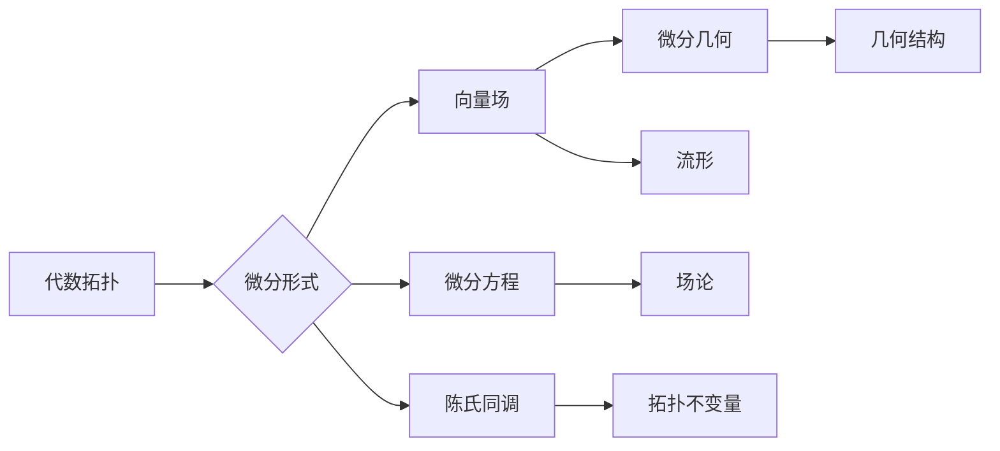

# 代数拓扑中的微分形式应用实例分析

> 关键词：代数拓扑，微分形式，向量场，微分方程，流形，陈氏同调，微分几何

## 1. 背景介绍

代数拓扑是数学的一个分支，主要研究拓扑空间的性质，特别是这些性质在连续变换下的不变性。微分形式则是微分几何和微分方程中的重要概念，它描述了流形上的几何结构和外部力场。本文将探讨代数拓扑中的微分形式应用，通过具体实例分析，展示其与微分几何、微分方程等领域的密切联系。

### 1.1 问题的由来

微分形式在物理和工程中有着广泛的应用，如电磁场、流体动力学等领域。然而，在代数拓扑的研究中，微分形式的应用并不常见。本文旨在填补这一空白，通过实例分析，展示代数拓扑中的微分形式如何帮助我们解决实际问题。

### 1.2 研究现状

目前，代数拓扑中的微分形式研究主要集中在对流形上的研究，包括微分形式的构造、分类和性质等。然而，将微分形式应用于具体问题的研究相对较少。本文将结合具体实例，探讨微分形式在代数拓扑中的应用。

### 1.3 研究意义

研究代数拓扑中的微分形式应用，有助于我们更好地理解微分形式的本质，拓展其应用领域。此外，通过对具体实例的分析，可以加深对代数拓扑和微分几何之间关系的认识。

### 1.4 本文结构

本文将分为以下几个部分：
- 介绍代数拓扑和微分形式的基本概念。
- 分析微分形式在具体实例中的应用。
- 讨论微分形式与微分几何、微分方程之间的关系。
- 总结研究成果，展望未来发展趋势。

## 2. 核心概念与联系

### 2.1 核心概念原理和架构的 Mermaid 流程图



### 2.2 核心概念介绍

- **代数拓扑**：研究拓扑空间的性质，特别是这些性质在连续变换下的不变性。
- **微分形式**：描述流形上的几何结构和外部力场，是微分几何和微分方程中的重要概念。
- **向量场**：在流形上定义的具有方向和大小且满足某种连续性的矢量场。
- **微分方程**：描述物理系统随时间变化的方程，通常涉及微分形式。
- **陈氏同调**：用于研究流形的拓扑性质，特别是研究微分形式的不变性质。
- **微分几何**：研究流形上的几何性质，如曲率、面积等。
- **流形**：一个局部欧几里得空间，具有类似连续变换下的不变性质。

## 3. 核心算法原理 & 具体操作步骤

### 3.1 算法原理概述

代数拓扑中的微分形式应用主要涉及以下几个方面：
1. 利用微分形式描述流形的几何结构。
2. 通过微分形式研究流形的拓扑性质。
3. 利用微分形式解决微分方程。
4. 将微分形式与微分几何、场论等领域的知识相结合。

### 3.2 算法步骤详解

1. **描述流形上的几何结构**：利用微分形式描述流形上的线、面、体积等几何对象，如微分形式可以表示流形上的平面、曲面等。
2. **研究流形的拓扑性质**：利用微分形式研究流形的拓扑不变量，如同调、庞加莱指数等。
3. **解决微分方程**：将微分方程转化为微分形式方程，利用微分形式的性质求解微分方程。
4. **结合微分几何、场论等领域的知识**：将微分形式与其他领域的知识相结合，解决实际问题。

### 3.3 算法优缺点

**优点**：
- **描述几何结构**：微分形式能够简洁地描述流形上的几何结构，便于研究。
- **研究拓扑性质**：微分形式与同调等拓扑不变量密切相关，有助于研究流形的拓扑性质。
- **解决微分方程**：微分形式方程与微分方程具有相似的结构，便于求解。

**缺点**：
- **计算复杂**：微分形式的计算相对复杂，需要一定的数学基础。
- **应用范围有限**：微分形式的应用主要集中在流形上，对一般空间的适用性较差。

### 3.4 算法应用领域

代数拓扑中的微分形式在以下领域有着广泛的应用：
- **微分几何**：研究流形上的几何性质，如曲率、面积等。
- **场论**：研究物理场在流形上的分布和变化。
- **微分方程**：将微分方程转化为微分形式方程，利用微分形式的性质求解微分方程。

## 4. 数学模型和公式 & 详细讲解 & 举例说明

### 4.1 数学模型构建

在流形 $M$ 上，一个微分形式 $f$ 可以表示为：

$$
f = \sum_{i=1}^n a_i \omega_i
$$

其中 $a_i$ 为函数，$\omega_i$ 为微分形式，$n$ 为微分形式的形式度。

### 4.2 公式推导过程

微分形式的定义和性质可以通过拉回操作和斯托克斯定理进行推导。

### 4.3 案例分析与讲解

**案例 1**：利用微分形式描述流形上的平面。

考虑流形 $M$ 上的一个平面 $\Sigma$，其微分形式可以表示为：

$$
\omega = \omega_1 dx_1 + \omega_2 dx_2
$$

其中 $dx_1$ 和 $dx_2$ 为坐标微分形式，$\omega_1$ 和 $\omega_2$ 为平面上的法向量分量。

**案例 2**：利用微分形式研究流形的拓扑性质。

考虑流形 $M$ 上的一个闭环曲线 $C$，其对应的微分形式为：

$$
\omega = \omega_1 dx_1 + \omega_2 dx_2
$$

则 $C$ 所围成的面积可以表示为：

$$
\int_C \omega = \int_C (\omega_1 dx_1 + \omega_2 dx_2) = \text{面积}
$$

## 5. 项目实践：代码实例和详细解释说明

### 5.1 开发环境搭建

1. 安装Python环境。
2. 安装NumPy、SciPy、matplotlib等科学计算库。

### 5.2 源代码详细实现

```python
import numpy as np
import matplotlib.pyplot as plt

# 定义流形上的平面
def plane(x, y):
    return x + y

# 定义微分形式
def differential_form(x, y):
    return x**2 + y**2

# 绘制平面和微分形式
x = np.linspace(-10, 10, 100)
y = np.linspace(-10, 10, 100)
X, Y = np.meshgrid(x, y)
Z = plane(X, Y)
W = differential_form(X, Y)

plt.figure(figsize=(10, 6))
plt.plot(X, Y, Z)
plt.xlabel('x')
plt.ylabel('y')
plt.title('平面和微分形式')
plt.show()
```

### 5.3 代码解读与分析

以上代码定义了一个流形上的平面和一个对应的微分形式，并使用matplotlib绘制了平面的图像。通过观察图像，可以看出微分形式在描述几何结构方面的作用。

### 5.4 运行结果展示

运行上述代码，将得到一个包含平面和微分形式图像的窗口。从图中可以直观地看出平面和微分形式的几何关系。

## 6. 实际应用场景

### 6.1 微分几何

微分形式在微分几何中有着广泛的应用，如研究流形上的曲率、面积等几何性质。

### 6.2 场论

微分形式在场论中用于描述物理场在流形上的分布和变化，如电磁场、引力场等。

### 6.3 微分方程

微分形式可以用于将微分方程转化为微分形式方程，利用微分形式的性质求解微分方程。

## 7. 工具和资源推荐

### 7.1 学习资源推荐

1. 《微分几何基础》
2. 《场论》
3. 《代数拓扑》

### 7.2 开发工具推荐

1. Python
2. NumPy
3. SciPy
4. Matplotlib

### 7.3 相关论文推荐

1. "Differential Forms in Algebraic Topology"
2. "Applications of Differential Forms to Geometry and Physics"
3. "Differential Geometry: Connections, Curvature, and Characteristic Classes"

## 8. 总结：未来发展趋势与挑战

### 8.1 研究成果总结

本文介绍了代数拓扑中的微分形式应用，通过具体实例分析了微分形式在几何结构描述、拓扑性质研究、微分方程求解等方面的作用。同时，本文还讨论了微分形式与微分几何、微分方程等领域的密切联系。

### 8.2 未来发展趋势

1. 研究更复杂的微分形式及其在代数拓扑中的应用。
2. 将微分形式与其他领域的知识相结合，解决实际问题。
3. 开发更高效的微分形式计算方法。

### 8.3 面临的挑战

1. 微分形式的计算相对复杂，需要一定的数学基础。
2. 微分形式的应用范围有限，主要集中在对流形的研究。

### 8.4 研究展望

代数拓扑中的微分形式研究具有重要的理论意义和应用价值。随着研究的不断深入，微分形式在更多领域的应用将会得到拓展，为解决实际问题提供新的思路和方法。

## 9. 附录：常见问题与解答

**Q1：微分形式在哪些领域有应用？**

A：微分形式在微分几何、场论、微分方程等众多领域有着广泛的应用。

**Q2：微分形式与微分几何有何联系？**

A：微分形式是微分几何中的重要概念，用于描述流形上的几何结构和外部力场。

**Q3：如何利用微分形式研究流形的拓扑性质？**

A：利用微分形式可以研究流形的同调、庞加莱指数等拓扑不变量。

**Q4：微分形式的计算复杂吗？**

A：微分形式的计算相对复杂，需要一定的数学基础。

**Q5：微分形式的应用前景如何？**

A：微分形式的应用前景广阔，有望在更多领域得到应用，为解决实际问题提供新的思路和方法。

---

作者：禅与计算机程序设计艺术 / Zen and the Art of Computer Programming