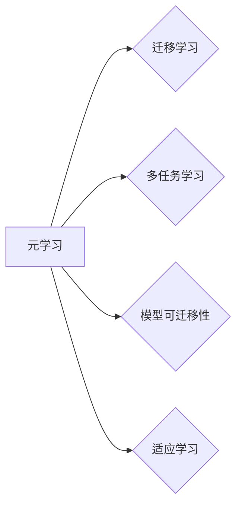

# 元学习(Meta-Learning) - 原理与代码实例讲解

> 关键词：元学习，快速学习，迁移学习，多任务学习，模型可迁移性，强化学习，适应学习

## 1. 背景介绍

在人工智能领域，随着机器学习技术的不断发展，研究者们不断追求的是让机器能够在各种不同的任务中快速学习。传统的机器学习方法往往需要大量的标注数据进行训练，这在某些情况下是不现实的。为了解决这个问题，元学习(Meta-Learning)应运而生。元学习是一种学习如何学习的方法，它让机器能够通过学习如何在不同的任务中快速适应，从而在新的任务上表现出色。

### 1.1 问题的由来

传统的机器学习方法通常需要大量的标注数据来训练模型，这在实际应用中可能存在以下问题：

- 数据收集困难：某些领域的数据难以收集，如医疗影像数据。
- 数据标注成本高：高质量标注数据的获取成本高昂。
- 任务特定性：每个任务可能都需要独立的模型和大量的训练数据。

### 1.2 研究现状

元学习的研究始于20世纪80年代，近年来随着深度学习技术的发展而迅速兴起。目前，元学习在强化学习、计算机视觉、自然语言处理等领域都有广泛的应用。

### 1.3 研究意义

元学习的研究意义在于：

- 降低数据需求：通过元学习，机器可以在少量样本上快速学习，减少对大量标注数据的依赖。
- 提高泛化能力：元学习可以帮助模型在不同任务之间迁移知识，提高模型的泛化能力。
- 加快学习速度：元学习可以让模型更快地适应新的任务，缩短学习时间。

### 1.4 本文结构

本文将分为以下几个部分：

- 介绍元学习的基本概念和联系。
- 详细讲解元学习的核心算法原理和具体操作步骤。
- 使用数学模型和公式对元学习进行详细讲解，并举例说明。
- 提供项目实践，包括代码实例和详细解释说明。
- 探讨元学习的实际应用场景和未来应用展望。
- 推荐元学习相关的学习资源、开发工具和参考文献。
- 总结元学习的研究成果、未来发展趋势和面临的挑战。

## 2. 核心概念与联系

### 2.1 核心概念

- **元学习**：学习如何学习，即让模型能够在不同的任务中快速适应。
- **迁移学习**：利用在另一个任务上学到的知识来解决新的任务。
- **多任务学习**：同时学习多个相关任务，以提高模型在不同任务上的性能。
- **模型可迁移性**：模型在不同任务之间迁移知识的能力。
- **适应学习**：模型在新的任务上快速适应的能力。

### 2.2 Mermaid 流程图



## 3. 核心算法原理 & 具体操作步骤

### 3.1 算法原理概述

元学习的主要思想是：通过学习一组任务，使得模型能够在新的任务上快速适应。这通常涉及到以下步骤：

1. **任务定义**：定义一组任务，每个任务都有一个输入空间和一个输出空间。
2. **模型初始化**：初始化一个模型，该模型将学习如何学习。
3. **元学习训练**：在定义的任务集上训练模型，使得模型能够在新的任务上快速适应。
4. **新任务适应**：在新的任务上使用训练好的模型，通过少量的样本进行快速适应。

### 3.2 算法步骤详解

#### 步骤1：任务定义

任务定义是元学习的第一步，需要明确每个任务的输入和输出空间。例如，在强化学习场景中，任务可以是学习一个策略来最大化回报。

#### 步骤2：模型初始化

模型初始化涉及到选择一个合适的模型架构。常见的模型架构包括神经网络、决策树等。

#### 步骤3：元学习训练

在元学习训练过程中，模型会在一组任务上学习如何学习。这通常涉及到以下两个子步骤：

- **内循环**：在每个任务上训练模型，以最小化损失函数。
- **外循环**：选择一组任务，并在这些任务上评估模型的性能。

#### 步骤4：新任务适应

在新任务上，模型会利用在元学习训练中获得的知识，通过少量的样本进行快速适应。

### 3.3 算法优缺点

#### 优点

- **降低数据需求**：元学习可以在少量样本上快速学习，减少对大量标注数据的依赖。
- **提高泛化能力**：元学习可以帮助模型在不同任务之间迁移知识，提高模型的泛化能力。
- **加快学习速度**：元学习可以让模型更快地适应新的任务，缩短学习时间。

#### 缺点

- **计算复杂度高**：元学习通常需要大量的计算资源。
- **难以评估**：由于元学习涉及到多个任务，评估其性能比较困难。

### 3.4 算法应用领域

元学习在以下领域都有广泛的应用：

- **强化学习**：在强化学习场景中，元学习可以帮助模型快速学习策略，以解决新的任务。
- **计算机视觉**：在计算机视觉任务中，元学习可以帮助模型快速适应不同的图像数据集。
- **自然语言处理**：在自然语言处理任务中，元学习可以帮助模型快速适应不同的语言数据集。

## 4. 数学模型和公式 & 详细讲解 & 举例说明

### 4.1 数学模型构建

在元学习中，常见的数学模型是神经网络。神经网络由多个层组成，每个层都有权重和偏置。

$$
y = f(WL(x) + b)
$$

其中，$x$ 是输入，$W$ 是权重，$L$ 是激活函数，$b$ 是偏置。

### 4.2 公式推导过程

神经网络的学习过程涉及到损失函数和优化算法。常见的损失函数是均方误差(MSE)。

$$
L = \frac{1}{2} \sum_{i=1}^{n} (y_i - \hat{y}_i)^2
$$

其中，$y_i$ 是真实标签，$\hat{y}_i$ 是模型预测的标签。

优化算法通常使用梯度下降法。

$$
W_{t+1} = W_t - \alpha \nabla_W L
$$

其中，$\alpha$ 是学习率。

### 4.3 案例分析与讲解

以下是一个使用神经网络进行元学习的例子。

假设我们有以下三个任务：

- 任务1：输入是[1, 2, 3]，输出是[1, 3, 5]。
- 任务2：输入是[2, 3, 4]，输出是[4, 6, 8]。
- 任务3：输入是[3, 4, 5]，输出是[5, 7, 9]。

我们使用一个简单的神经网络来学习这些任务。

```python
import torch
import torch.nn as nn
import torch.optim as optim

class Net(nn.Module):
    def __init__(self):
        super(Net, self).__init__()
        self.fc1 = nn.Linear(3, 3)
        self.fc2 = nn.Linear(3, 1)

    def forward(self, x):
        x = torch.relu(self.fc1(x))
        x = self.fc2(x)
        return x

net = Net()
criterion = nn.MSELoss()
optimizer = optim.Adam(net.parameters(), lr=0.001)

# 训练任务1
inputs = torch.tensor([[1, 2, 3]], requires_grad=True)
targets = torch.tensor([[1, 3, 5]], requires_grad=True)

outputs = net(inputs)
loss = criterion(outputs, targets)
loss.backward()
optimizer.step()

# 训练任务2
inputs = torch.tensor([[2, 3, 4]], requires_grad=True)
targets = torch.tensor([[4, 6, 8]], requires_grad=True)

outputs = net(inputs)
loss = criterion(outputs, targets)
loss.backward()
optimizer.step()

# 训练任务3
inputs = torch.tensor([[3, 4, 5]], requires_grad=True)
targets = torch.tensor([[5, 7, 9]], requires_grad=True)

outputs = net(inputs)
loss = criterion(outputs, targets)
loss.backward()
optimizer.step()
```

在这个例子中，我们使用了一个简单的神经网络来学习三个不同的任务。通过训练，模型学会了如何在不同的输入下生成正确的输出。

## 5. 项目实践：代码实例和详细解释说明

### 5.1 开发环境搭建

在进行元学习实践之前，我们需要搭建一个开发环境。以下是一个基于PyTorch的元学习项目环境搭建步骤：

1. 安装PyTorch：从PyTorch官网下载并安装适合自己硬件的PyTorch版本。
2. 安装TensorBoard：用于可视化模型训练过程。
3. 安装其他依赖库：如NumPy、Pandas等。

### 5.2 源代码详细实现

以下是一个使用PyTorch实现元学习的简单例子。

```python
import torch
import torch.nn as nn
import torch.optim as optim
from torch.utils.data import DataLoader, TensorDataset

# 定义模型
class MetaNet(nn.Module):
    def __init__(self):
        super(MetaNet, self).__init__()
        self.fc1 = nn.Linear(10, 5)
        self.fc2 = nn.Linear(5, 1)

    def forward(self, x):
        x = torch.relu(self.fc1(x))
        x = self.fc2(x)
        return x

# 定义元学习训练函数
def meta_train(model, dataloader, optimizer, criterion):
    model.train()
    for data, target in dataloader:
        optimizer.zero_grad()
        output = model(data)
        loss = criterion(output, target)
        loss.backward()
        optimizer.step()

# 定义元学习测试函数
def meta_test(model, dataloader, criterion):
    model.eval()
    total_loss = 0
    with torch.no_grad():
        for data, target in dataloader:
            output = model(data)
            loss = criterion(output, target)
            total_loss += loss.item()
    return total_loss / len(dataloader)

# 创建数据集
dataset = TensorDataset(torch.randn(100, 10), torch.randn(100, 1))
dataloader = DataLoader(dataset, batch_size=10, shuffle=True)

# 初始化模型和优化器
model = MetaNet()
optimizer = optim.Adam(model.parameters(), lr=0.001)
criterion = nn.MSELoss()

# 训练模型
for epoch in range(100):
    meta_train(model, dataloader, optimizer, criterion)
    loss = meta_test(model, dataloader, criterion)
    print(f"Epoch {epoch+1}, loss: {loss:.4f}")

# 测试模型
test_data = torch.randn(10, 10)
test_target = torch.randn(10, 1)
test_output = model(test_data)
print(f"Test output: {test_output}")
```

### 5.3 代码解读与分析

在这个例子中，我们定义了一个简单的元学习模型，并使用PyTorch进行了训练和测试。模型由两个全连接层组成，第一个层将输入的10个特征映射到5个特征，第二个层将这5个特征映射到1个输出。

我们使用了一个随机生成的数据集进行训练和测试。在训练过程中，我们使用了Adam优化器和均方误差损失函数。在测试过程中，我们使用了一个新的随机生成的数据集来评估模型的性能。

### 5.4 运行结果展示

运行上述代码后，我们将看到模型的训练和测试过程，以及最终的测试输出。

## 6. 实际应用场景

元学习在实际应用场景中具有广泛的应用，以下是一些常见的应用场景：

- **强化学习**：在强化学习中，元学习可以帮助模型快速学习策略，以解决新的任务。
- **计算机视觉**：在计算机视觉任务中，元学习可以帮助模型快速适应不同的图像数据集。
- **自然语言处理**：在自然语言处理任务中，元学习可以帮助模型快速适应不同的语言数据集。

## 7. 工具和资源推荐

### 7.1 学习资源推荐

- 《深度学习》系列书籍：介绍深度学习的基本原理和应用。
- 《强化学习》系列书籍：介绍强化学习的基本原理和应用。
- Hugging Face官方文档：提供大量预训练模型和代码示例。
- arXiv论文预印本：提供最新的研究论文。

### 7.2 开发工具推荐

- PyTorch：一个开源的深度学习框架。
- TensorFlow：另一个开源的深度学习框架。
- Hugging Face Transformers库：提供大量预训练模型和代码示例。

### 7.3 相关论文推荐

- Meta-Learning the Meta-Learning Algorithm：介绍元学习的理论基础。
- Fast Learning from Demonstrations and Human Feedback：介绍使用元学习进行快速学习的方法。
- MAML：介绍MAML算法，这是一种流行的元学习算法。

## 8. 总结：未来发展趋势与挑战

### 8.1 研究成果总结

元学习作为一种新兴的机器学习方法，在近年来取得了显著的研究成果。它可以帮助模型在少量样本上快速学习，提高模型的泛化能力和适应能力。

### 8.2 未来发展趋势

未来，元学习的研究可能会朝着以下方向发展：

- **多模态元学习**：将元学习扩展到多模态数据，如文本、图像和视频。
- **元学习算法的优化**：开发更有效的元学习算法，提高模型的性能。
- **元学习在实际应用中的应用**：将元学习应用于更多的实际应用场景。

### 8.3 面临的挑战

元学习在实际应用中仍然面临着一些挑战：

- **计算复杂度高**：元学习通常需要大量的计算资源。
- **评估方法**：如何有效地评估元学习模型是一个挑战。
- **模型的可解释性**：如何解释元学习模型的行为是一个挑战。

### 8.4 研究展望

尽管元学习在实际应用中面临着一些挑战，但它仍然是一个具有巨大潜力的研究方向。随着研究的不断深入，相信元学习将会在人工智能领域发挥越来越重要的作用。

## 9. 附录：常见问题与解答

**Q1：什么是元学习？**

A：元学习是一种学习如何学习的方法，它让机器能够通过学习如何在不同的任务中快速适应，从而在新的任务上表现出色。

**Q2：元学习和迁移学习有什么区别？**

A：迁移学习是指利用在另一个任务上学到的知识来解决新的任务，而元学习是指学习如何学习，即让模型能够在不同的任务中快速适应。

**Q3：元学习有哪些应用场景？**

A：元学习在强化学习、计算机视觉、自然语言处理等领域都有广泛的应用。

**Q4：如何评估元学习模型？**

A：评估元学习模型通常需要设计专门的评估指标，如泛化能力、适应能力等。

**Q5：元学习有哪些挑战？**

A：元学习在实际应用中面临着计算复杂度高、评估方法、模型的可解释性等挑战。

---

作者：禅与计算机程序设计艺术 / Zen and the Art of Computer Programming