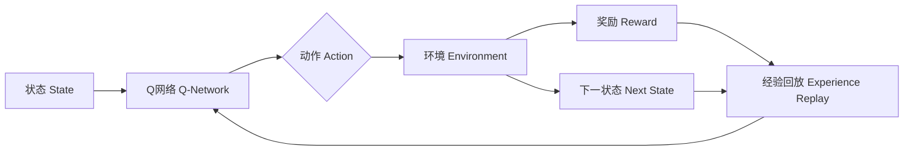

# 一切皆是映射：DQN在健康医疗领域的突破与实践

关键词：深度强化学习, DQN, 健康医疗, 人工智能, 决策支持

## 1. 背景介绍
### 1.1 问题的由来
随着人口老龄化加剧和慢性病高发,传统医疗资源面临巨大压力。如何利用人工智能技术辅助医疗决策,提高诊疗效率和质量,已成为亟待解决的问题。深度强化学习作为人工智能的前沿方向,为破解这一难题提供了新思路。

### 1.2 研究现状
近年来,深度强化学习在多个领域取得突破性进展。其中,Deep Q Network(DQN)算法通过将深度学习与强化学习相结合,在复杂环境中实现了端到端的自主决策能力。医疗领域研究者开始尝试将DQN引入临床决策支持、药物研发等场景,取得了初步成果。但目前研究多局限于概念验证阶段,离实际应用还有差距。

### 1.3 研究意义
将DQN应用于健康医疗领域,有望实现以下突破:

1. 辅助临床决策:通过学习大量医疗数据,DQN可以辅助医生进行疾病诊断、治疗方案制定等,提高决策效率和准确性。

2. 优化医疗资源配置:DQN可以根据患者病情和医院资源实时优化调度,缓解"看病难、看病贵"问题。

3. 加速药物研发:应用DQN进行药物虚拟筛选和先导化合物优化,有望大幅缩短新药研发周期。

4. 创新医疗服务模式:利用DQN提供个性化健康管理方案,实现"智慧医疗"服务升级。

### 1.4 本文结构
本文将重点探讨DQN在健康医疗领域的应用。第2部分介绍DQN的核心概念;第3部分详解DQN算法原理;第4部分建立数学模型并举例说明;第5部分给出项目实践的代码实例;第6部分分析实际应用场景;第7部分推荐相关工具和资源;第8部分总结全文并展望未来;第9部分为常见问题解答。

## 2. 核心概念与联系
DQN源自强化学习和深度学习,核心思想是通过端到端学习,让Agent学会在复杂环境中自主决策,以获得最大累积奖励。其涉及以下关键概念:

- 状态(State):描述Agent当前所处环境的特征集合。
- 动作(Action):Agent可执行的一组操作。
- 奖励(Reward):量化动作效果的即时反馈。
- 策略(Policy):基于状态选择动作的映射。
- 值函数(Value Function):评估状态或状态-动作对的长期价值。

在DQN中,通过深度神经网络近似值函数,不断与环境交互并优化策略,最终获得最优决策。下图展示了DQN的核心架构:



## 3. 核心算法原理 & 具体操作步骤
### 3.1 算法原理概述
DQN通过Q-Learning算法来学习最优策略。Q-Learning 基于值迭代,通过不断更新状态-动作值函数Q(s,a)来逼近最优Q*。DQN创新地引入深度神经网络作为Q函数的近似,并通过经验回放和目标网络等机制提升了训练稳定性。

### 3.2 算法步骤详解
DQN算法主要包括以下步骤:

1. 初始化Q网络参数θ和目标网络参数θ'=θ
2. 初始化经验回放缓存D
3. for episode = 1 to M do
    1. 初始化环境状态s
    2. for t = 1 to T do
        1. 基于ε-greedy策略选择动作a
        2. 执行动作a,观察奖励r和下一状态s'
        3. 将转移(s,a,r,s')存入D
        4. 从D中随机采样一批转移样本(s_i,a_i,r_i,s'_i)
        5. 计算目标值:
            - if s'为终止状态: y_i = r_i
            - else: y_i = r_i + γ max_a' Q(s'_i, a'; θ')
        6. 最小化TD误差,更新Q网络参数θ:
            $$ \mathcal{L}(\theta) = \mathbb{E}_{(s,a,r,s')\sim D}[(y - Q(s,a;\theta))^2] $$
        7. 每C步同步目标网络参数: θ' = θ
        8. s = s'
4. end for

其中,ε-greedy策略在探索和利用间权衡,以ε的概率随机选择动作,1-ε的概率选择Q值最大的动作。γ为折扣因子,控制远期奖励的权重。

### 3.3 算法优缺点
DQN的主要优点包括:
- 端到端学习最优策略,不需人工设计特征
- 通过深度神经网络增强了对高维状态空间的表征能力
- 引入经验回放缓解了数据相关性问题
- 双网络结构提升了训练稳定性

但DQN也存在一些局限:
- 对奖励函数设计敏感,容易陷入次优
- 探索效率较低,在稀疏奖励环境中性能受限
- 值函数估计偏差较大,难以应对连续动作空间

### 3.4 算法应用领域
DQN在以下领域展现出广阔应用前景:
- 游戏智能体:Atari、星际争霸、Dota等
- 机器人控制:自主导航、抓取操作等
- 推荐系统:个性化推荐、广告投放等
- 自然语言处理:对话系统、机器翻译等
- 网络优化:流量调度、缓存策略等

在医疗健康领域,DQN可用于辅助诊断、用药推荐、手术规划等决策任务。

## 4. 数学模型和公式 & 详细讲解 & 举例说明
### 4.1 数学模型构建
我们考虑一个离散时间、离散状态和动作空间的马尔可夫决策过程(MDP),其中:
- 状态空间: $\mathcal{S}$
- 动作空间: $\mathcal{A}$
- 状态转移概率: $\mathcal{P}(s'|s,a)$
- 奖励函数: $\mathcal{R}(s,a)$
- 折扣因子: $\gamma \in [0,1]$

Agent的目标是学习一个策略$\pi(a|s)$,使得期望累积奖励最大化:

$$ \pi^* = \arg\max_{\pi} \mathbb{E}_{\pi}[\sum_{t=0}^{\infty} \gamma^t r_t] $$

其中,$r_t$为t时刻获得的奖励。最优策略可通过值迭代法求解,即不断更新状态值函数$V(s)$或状态-动作值函数$Q(s,a)$,直至收敛。

对于Q函数,贝尔曼最优方程为:

$$ Q^*(s,a) = \mathcal{R}(s,a) + \gamma \sum_{s' \in \mathcal{S}} \mathcal{P}(s'|s,a) \max_{a'} Q^*(s',a') $$

DQN算法使用深度神经网络$Q(s,a;\theta)$来近似$Q^*$,其中$\theta$为网络参数。网络训练过程即是最小化TD误差:

$$ \mathcal{L}(\theta) = \mathbb{E}_{(s,a,r,s')\sim D}[(r + \gamma \max_{a'} Q(s',a';\theta') - Q(s,a;\theta))^2] $$

其中,D为经验回放缓存,$\theta'$为目标网络参数。

### 4.2 公式推导过程
我们来推导Q-Learning的更新公式。根据贝尔曼方程,最优Q函数满足:

$$ Q^*(s,a) = \mathcal{R}(s,a) + \gamma \sum_{s' \in \mathcal{S}} \mathcal{P}(s'|s,a) \max_{a'} Q^*(s',a') $$

定义TD目标:

$$ y = r + \gamma \max_{a'} Q(s',a';\theta') $$

则TD误差为:

$$ \delta = y - Q(s,a;\theta) $$

我们希望最小化TD误差的均方,即最小化目标函数:

$$ \mathcal{L}(\theta) = \mathbb{E}_{(s,a,r,s')\sim D}[(y - Q(s,a;\theta))^2] $$

对$\theta$求导并使用梯度下降法更新,可得Q网络参数的更新公式:

$$ \theta \leftarrow \theta + \alpha (y - Q(s,a;\theta)) \nabla_{\theta} Q(s,a;\theta) $$

其中,$\alpha$为学习率。这就是Q-Learning的核心更新公式。

### 4.3 案例分析与讲解
下面我们以医疗诊断为例,说明如何应用DQN进行决策优化。假设一个患者先后出现了头痛、发烧等症状,我们希望通过强化学习得到最优诊疗策略。

首先定义状态空间、动作空间和奖励函数:
- 状态s:症状特征(如体温、血压等)的集合
- 动作a:可选的检查/治疗措施(如开药、住院等)
- 奖励r:综合考虑疗效、费用等因素设计

然后通过DQN算法学习最优策略:
1. 状态s0:患者初始症状 头痛,体温38.5℃
2. 动作a0:初步检查,测量血压、心率等生命体征,奖励r0=-50
3. 状态s1:检查结果正常,排除危重症
4. 动作a1:开具退烧药,嘱咐患者回家观察,奖励r1=60
5. 状态s2:患者症状缓解,体温恢复正常
6. 动作a2:随访,了解用药后状况,奖励r2=100

通过不断exploring和exploiting,DQN网络学习到了这样的诊疗逻辑:先排查危急情况,对于常见病症给予对症治疗,然后密切观察疗效。这一策略在提高诊断效率的同时,也最大化了患者利益。

### 4.4 常见问题解答
Q: DQN能处理连续状态和动作空间吗?
A: 原始DQN只能处理离散空间,对于连续状态需先离散化。连续动作可考虑使用Actor-Critic、DDPG等算法。

Q: DQN的收敛性和稳定性如何?
A: DQN引入经验回放和双网络结构,一定程度上缓解了数据相关性和过估计问题。但在reward sparse或状态空间很大时,收敛速度较慢。可考虑Dueling DQN、Prioritized Replay等改进。

Q: 如何设计DQN的网络结构?
A: 对于图像输入,通常采用CNN提取特征。对于状态和动作维度较低的控制类任务,可使用MLP。一些工作还尝试了RNN、Transformer等结构。网络设计需平衡表达能力和计算效率。

Q: DQN对奖励函数的设计有什么要求?
A: 奖励函数直接影响策略学习的方向,设计不当会导致次优策略。一般来说,奖励应该准确反映任务目标,数值应适中(不能过大或过小),正负奖励要平衡。可借鉴专家知识,或用逆强化学习从示范数据中学习奖励函数。

## 5. 项目实践：代码实例和详细解释说明
接下来我们使用PyTorch实现一个简单的DQN Agent,并在gym的CartPole环境中进行训练。

### 5.1 开发环境搭建
首先安装必要的依赖包:

```bash
pip install torch gym matplotlib
```

### 5.2 源代码详细实现
下面是DQN算法的核心代码,包括Q网络、经验回放、ε-greedy探索等组件:

```python
import torch
import torch.nn as nn
import torch.optim as optim
import random
from collections import deque

class QNetwork(nn.Module):
    def __init__(self, state_dim, action_dim, hidden_dim=64):
        super(QNetwork,