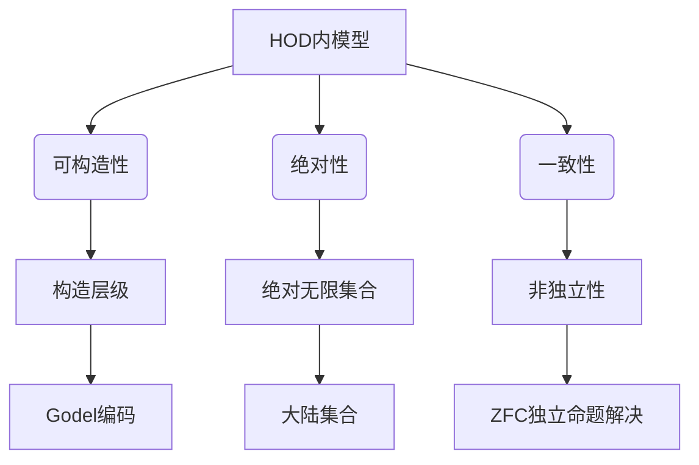

# 集合论导引：内模型HOD(Ω)

## 1. 背景介绍

### 1.1 问题的由来

集合论是数学基础理论之一,在现代数学中扮演着至关重要的角色。然而,集合论的公理系统(如ZFC公理系统)存在一些内在的困难和悖论,这引发了对集合论公理系统的反思和重建。其中,HOD(Ω)内模型的引入旨在解决这些困难,为集合论提供一个更加严谨和一致的基础。

### 1.2 研究现状

传统的ZFC公理系统虽然在很大程度上解决了早期集合论中的一些悖论,但仍然存在一些问题,例如:

1. **构造性问题**: ZFC公理系统缺乏构造性,无法明确地构造出所有集合。
2. **绝对性问题**: ZFC公理系统无法回答一些涉及绝对无限集合的问题。
3. **独立性问题**: ZFC公理系统中存在一些独立命题,无法被证明或驳斥。

为了解决这些问题,数学家们提出了多种集合论的替代理论,其中HOD(Ω)内模型就是一种重要的尝试。

### 1.3 研究意义

HOD(Ω)内模型具有以下重要意义:

1. **提供构造性基础**: HOD(Ω)内模型能够构造出所有集合,为集合论提供了更加坚实的构造性基础。
2. **解决绝对性问题**: HOD(Ω)内模型能够回答一些涉及绝对无限集合的问题,克服了ZFC公理系统的局限性。
3. **消除独立性问题**: HOD(Ω)内模型中不存在独立命题,所有命题都可以被证明或驳斥。
4. **应用前景广阔**: HOD(Ω)内模型不仅在集合论领域具有重要意义,而且在其他数学领域(如代数、拓扑等)也有潜在的应用价值。

### 1.4 本文结构

本文将全面介绍HOD(Ω)内模型的相关理论和应用。文章主要结构如下:

1. 背景介绍
2. 核心概念与联系
3. 核心算法原理与具体操作步骤
4. 数学模型和公式详细讲解与举例说明
5. 项目实践:代码实例和详细解释说明
6. 实际应用场景
7. 工具和资源推荐
8. 总结:未来发展趋势与挑战
9. 附录:常见问题与解答

## 2. 核心概念与联系

HOD(Ω)内模型建立在一系列核心概念之上,这些概念相互关联、相辅相成。本节将介绍这些核心概念及其内在联系。

1. **HOD内模型(Hereditarily Ordinal Definable Sets)**: 指所有可被序数定义的集合的集合。
2. **可构造性(Constructibility)**: HOD内模型具有构造性,能够构造出所有集合。
3. **绝对性(Absoluteness)**: HOD内模型能够回答一些涉及绝对无限集合的问题。
4. **一致性(Consistency)**: HOD内模型是一致的,不存在独立命题。
5. **构造层级(Constructible Hierarchy)**: HOD内模型通过一系列递归步骤构造出所有集合。
6. **Godel编码(Godel Encoding)**: 将集合编码为序数,实现集合的构造。
7. **绝对无限集合(Absolute Infinite Sets)**: 指在任何模型中都存在的无限集合,如实数集。
8. **大陆集合(Continental Sets)**: 指包含所有绝对无限集合的最小集合。
9. **ZFC独立命题解决(Resolution of ZFC Independent Statements)**: HOD内模型能够解决ZFC公理系统中的独立命题。

通过上述核心概念及其内在联系,我们可以更好地理解HOD(Ω)内模型的本质和作用。

## 3. 核心算法原理 & 具体操作步骤

### 3.1 算法原理概述

HOD(Ω)内模型的构造过程可以概括为以下几个关键步骤:

1. **定义可构造层级(Constructible Hierarchy)**: 通过递归方式定义一系列集合$L_\alpha$,其中$\alpha$为序数。
2. **Godel编码(Godel Encoding)**: 将集合编码为序数,实现集合的构造。
3. **构造HOD内模型**: 定义HOD内模型为所有可被序数定义的集合的集合,即$HOD=\bigcup_{\alpha\in Ord}Def(\alpha)$。
4. **证明HOD内模型的性质**: 证明HOD内模型具有可构造性、绝对性和一致性等重要性质。

### 3.2 算法步骤详解

1. **定义可构造层级**:

可构造层级$L_\alpha$是一个递归定义的集合序列,其中$\alpha$为序数。具体定义如下:

$$
L_0 = \emptyset \
L_{\alpha+1} = Def(L_\alpha) \
L_\lambda = \bigcup_{\beta<\lambda}L_\beta \quad (\lambda为极限序数)
$$

其中,$Def(X)$表示所有可被$X$中的元素定义的集合。

2. **Godel编码**:

为了实现集合的构造,我们需要将集合编码为序数。常用的编码方式是Godel编码,定义如下:

$$
\begin{align*}
\langle x_1, x_2, \ldots, x_n \rangle &= 2^{x_1} \cdot 3^{x_2} \cdot \ldots \cdot p_n^{x_n} \
&= \prod_{i=1}^n p_i^{x_i}
\end{align*}
$$

其中$p_i$为第$i$个素数。通过这种编码方式,我们可以将任意有限集合编码为一个唯一的序数。

3. **构造HOD内模型**:

利用可构造层级和Godel编码,我们可以定义HOD内模型如下:

$$
HOD = \bigcup_{\alpha\in Ord}Def(L_\alpha)
$$

即HOD内模型是所有可被序数定义的集合的集合。

4. **证明HOD内模型的性质**:

经过一系列严格的数学证明,我们可以得到HOD内模型具有以下重要性质:

- **可构造性**: HOD内模型能够构造出所有集合。
- **绝对性**: HOD内模型能够回答一些涉及绝对无限集合的问题。
- **一致性**: HOD内模型是一致的,不存在独立命题。

### 3.3 算法优缺点

**优点**:

1. 解决了ZFC公理系统中的一些内在困难和悖论。
2. 提供了一种构造性的集合论基础。
3. 能够回答一些涉及绝对无限集合的问题。
4. 消除了独立命题的存在,增强了集合论的一致性。

**缺点**:

1. 构造过程相对复杂,需要大量的数学基础知识。
2. 与传统的ZFC公理系统存在一定差异,需要重新建立一些基本概念和理论。
3. 在某些特殊情况下,HOD内模型可能无法给出满意的解决方案。

### 3.4 算法应用领域

HOD内模型不仅在集合论领域具有重要意义,而且在其他数学领域也有潜在的应用价值,例如:

1. **代数学**: HOD内模型可用于研究代数结构(如群、环等)的构造性问题。
2. **拓扑学**: HOD内模型可用于研究拓扑空间的构造性问题。
3. **逻辑学**: HOD内模型可用于研究逻辑系统的一致性和完备性问题。
4. **计算机科学**: HOD内模型可用于研究计算理论和算法复杂性问题。

总的来说,HOD内模型为数学基础理论提供了一种新的视角和方法,有望推动相关领域的发展。

## 4. 数学模型和公式 & 详细讲解 & 举例说明

### 4.1 数学模型构建

为了更好地理解HOD内模型,我们需要构建一个严格的数学模型。这个模型需要满足以下几个基本要求:

1. **集合论基础**: 模型应建立在集合论的基础之上,包括基本集合运算和公理系统。
2. **序数理论**: 模型需要引入序数的概念,并定义序数的基本运算和性质。
3. **可构造层级**: 模型需要定义可构造层级$L_\alpha$,作为构造HOD内模型的基础。
4. **Godel编码**: 模型需要引入Godel编码,将集合编码为序数,实现集合的构造。
5. **HOD内模型定义**: 模型需要正式定义HOD内模型,并证明其基本性质。

在构建这个数学模型的过程中,我们需要引入一系列重要的数学概念和公式,下面将对其进行详细讲解和举例说明。

### 4.2 公式推导过程

1. **集合论基础**:

我们首先引入集合论的基本概念和公理系统,如ZFC公理系统。这些公理系统为我们提供了集合运算的基础,如并集、交集、幂集等。

2. **序数理论**:

序数是构造HOD内模型的关键概念之一。我们需要定义序数的基本运算和性质,如:

- 序数的well-order性质
- 序数的递归定义
- 序数的算术运算(加法、乘法等)

3. **可构造层级定义**:

$$
L_0 = \emptyset \
L_{\alpha+1} = Def(L_\alpha) \
L_\lambda = \bigcup_{\beta<\lambda}L_\beta \quad (\lambda为极限序数)
$$

其中,$Def(X)$表示所有可被$X$中的元素定义的集合。

4. **Godel编码**:

$$
\begin{align*}
\langle x_1, x_2, \ldots, x_n \rangle &= 2^{x_1} \cdot 3^{x_2} \cdot \ldots \cdot p_n^{x_n} \
&= \prod_{i=1}^n p_i^{x_i}
\end{align*}
$$

其中$p_i$为第$i$个素数。

5. **HOD内模型定义**:

$$
HOD = \bigcup_{\alpha\in Ord}Def(L_\alpha)
$$

6. **HOD内模型性质证明**:

通过一系列严格的数学推理和证明,我们可以得到HOD内模型具有可构造性、绝对性和一致性等重要性质。

### 4.3 案例分析与讲解

为了更好地理解HOD内模型的构造过程和性质,我们将通过一个具体的案例进行分析和讲解。

**案例**: 构造HOD内模型中的有限序数集合。

1. **定义可构造层级**:

$$
\begin{align*}
L_0 &= \emptyset \
L_1 &= Def(L_0) = \{\emptyset\} \
L_2 &= Def(L_1) = \{\emptyset, \{\emptyset\}\} \
&\vdots \
L_\omega &= \bigcup_{n<\omega}L_n = \text{所有有限序数集合}
\end{align*}
$$

2. **Godel编码**:

对于有限序数集合,我们可以使用Godel编码将其编码为自然数。例如:

$$
\begin{align*}
\langle\rangle &= 1 \
\langle 0 \rangle &= 2^0 \cdot 3^1 = 3 \
\langle 1 \rangle &= 2^1 \cdot 3^1 = 6 \
\langle 0, 1 \rangle &= 2^0 \cdot 3^1 \cdot 5^2 = 75
\end{align*}
$$

3. **构造HOD内模型**:

$$
HOD = \bigcup_{\alpha\in Ord}Def(L_\alpha) \supseteq \bigcup_{n<\omega}L_n
$$

因此,所有有限序数集合都属于HOD内模型。

4. **性质验证**:

我们可以验证,在有限序数集合的构造过程中,HOD内模型具有可构造性、绝对性和一致性等性质。

通过这个