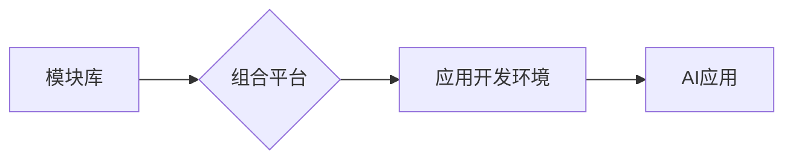

## 新世界的自由组合创造技术

> 关键词：人工智能、软件架构、自由组合、技术创新、算法设计、数学模型、项目实践

## 1. 背景介绍

当今世界，科技发展日新月异，人工智能（AI）作为科技发展的重要驱动力，正在深刻地改变着我们的生活和工作方式。从自动驾驶汽车到智能语音助手，从个性化推荐系统到医疗诊断辅助，AI技术的应用场景日益广泛。然而，随着AI技术的不断发展，我们也面临着新的挑战：如何更高效地开发和部署AI应用？如何更好地利用AI技术解决复杂问题？

传统的软件开发模式往往是线性化的，需要从需求分析、设计、编码、测试到部署等多个环节进行逐一完成。这种模式在面对快速变化的市场需求和复杂的技术挑战时显得不够灵活和高效。而“自由组合”的概念则为我们提供了一种全新的思路。

“自由组合”指的是将预先构建好的模块或组件进行灵活组合，从而快速构建出新的应用程序或系统。这种模式类似于乐高积木，通过将不同的模块组合在一起，可以创造出无限种类的作品。

在AI领域，“自由组合”意味着将预训练的AI模型、算法库、数据处理工具等组件进行灵活组合，从而快速构建出定制化的AI应用。这种模式可以极大地降低AI应用开发的门槛，并提高开发效率。

## 2. 核心概念与联系

### 2.1  自由组合的原则

自由组合的核心原则包括：

* **模块化设计:** 将系统分解成独立、可重用的模块。
* **接口标准化:**  模块之间通过标准化的接口进行通信和交互。
* **可插拔性:**  可以方便地替换或升级模块，实现系统灵活扩展。
* **配置驱动:**  通过配置文件或代码配置的方式，灵活调整模块的行为和参数。

### 2.2  自由组合的架构

自由组合的架构通常由以下几个部分组成：

* **模块库:**  包含各种预先构建好的AI模块，例如图像识别模型、自然语言处理模型、数据分析工具等。
* **组合平台:**  提供一个平台，用于管理和组合模块，并进行配置和部署。
* **应用开发环境:**  提供开发工具和环境，用于开发基于自由组合架构的AI应用。

**Mermaid 流程图**



### 2.3  自由组合的优势

自由组合模式具有以下优势：

* **提高开发效率:**  通过复用现有的模块，可以大大缩短开发时间。
* **降低开发成本:**  减少了重复开发的成本。
* **提高系统灵活性和可扩展性:**  可以方便地添加或替换模块，实现系统灵活扩展。
* **促进技术创新:**  提供了更灵活的平台，鼓励开发者探索新的AI应用场景。

## 3. 核心算法原理 & 具体操作步骤

### 3.1  算法原理概述

自由组合的核心算法原理是基于**模块间接口标准化**和**配置驱动**的灵活组合。

* **接口标准化:**  每个模块都拥有明确的输入和输出接口，通过这些接口进行通信和交互。
* **配置驱动:**  通过配置文件或代码配置的方式，可以灵活调整模块的行为和参数，实现不同的组合效果。

### 3.2  算法步骤详解

1. **模块选择:**  根据应用需求，从模块库中选择合适的模块进行组合。
2. **接口连接:**  将选定的模块通过标准化的接口连接起来，形成一个完整的系统架构。
3. **参数配置:**  根据应用需求，配置模块的参数，例如模型的学习率、数据处理方式等。
4. **系统测试:**  对组合后的系统进行测试，确保其功能正常运行。
5. **系统部署:**  将测试通过的系统部署到生产环境中。

### 3.3  算法优缺点

**优点:**

* **灵活性和可扩展性:**  可以根据需求灵活组合模块，实现系统灵活扩展。
* **开发效率:**  通过复用现有的模块，可以大大缩短开发时间。
* **易于维护:**  模块化设计使得系统维护更加方便。

**缺点:**

* **模块质量:**  模块库中模块的质量直接影响到最终系统的性能和稳定性。
* **接口兼容性:**  不同模块的接口兼容性需要进行严格测试。
* **组合复杂度:**  对于复杂的应用场景，模块组合的复杂度可能会增加。

### 3.4  算法应用领域

自由组合模式在以下领域具有广泛的应用前景：

* **人工智能应用开发:**  快速构建定制化的AI应用，例如图像识别、自然语言处理、机器翻译等。
* **软件系统开发:**  构建灵活、可扩展的软件系统，例如电商平台、社交网络、企业管理系统等。
* **数据分析平台:**  构建可定制的数据分析平台，满足不同用户的分析需求。

## 4. 数学模型和公式 & 详细讲解 & 举例说明

### 4.1  数学模型构建

自由组合模式可以抽象为一个图论模型，其中：

* **节点:** 代表不同的AI模块。
* **边:** 代表模块之间的接口连接。

我们可以使用**图的邻接矩阵**来表示这个模型，其中矩阵元素表示两个节点之间是否存在连接。

### 4.2  公式推导过程

假设我们有一个包含N个模块的图，邻接矩阵为A，则图的度数矩阵D可以表示为：

$$D_{ij} = \begin{cases}
  \sum_{k=1}^{N} A_{ik} & \text{if } i = j \\
  0 & \text{otherwise}
\end{cases}$$

其中，$D_{ij}$表示节点i的度数。

### 4.3  案例分析与讲解

例如，一个包含三个模块的图，邻接矩阵为：

$$A = \begin{bmatrix}
0 & 1 & 1 \\
1 & 0 & 1 \\
1 & 1 & 0
\end{bmatrix}$$

则度数矩阵为：

$$D = \begin{bmatrix}
2 & 2 & 2
\end{bmatrix}$$

这表示三个模块都与其他两个模块连接，每个模块的度数都是2。

## 5. 项目实践：代码实例和详细解释说明

### 5.1  开发环境搭建

* **操作系统:**  Linux/macOS/Windows
* **编程语言:**  Python
* **框架:**  TensorFlow/PyTorch
* **工具:**  Git、Docker

### 5.2  源代码详细实现

```python
# 模块A
def module_A(input_data):
  # 模块A的处理逻辑
  return processed_data

# 模块B
def module_B(input_data):
  # 模块B的处理逻辑
  return processed_data

# 组合平台
class CombinationPlatform:
  def __init__(self):
    self.modules = {}

  def add_module(self, module_name, module_function):
    self.modules[module_name] = module_function

  def execute_pipeline(self, input_data, pipeline):
    for module_name in pipeline:
      input_data = self.modules[module_name](input_data)
    return input_data

# 应用开发
platform = CombinationPlatform()
platform.add_module("module_A", module_A)
platform.add_module("module_B", module_B)

pipeline = ["module_A", "module_B"]
output_data = platform.execute_pipeline(input_data, pipeline)
```

### 5.3  代码解读与分析

* **模块化设计:**  代码将不同的模块封装成独立的函数，例如`module_A`和`module_B`。
* **接口标准化:**  每个模块都接受一个`input_data`参数，并返回一个`processed_data`结果，实现标准化的接口。
* **组合平台:**  `CombinationPlatform`类提供了一个平台，用于管理和组合模块，并执行模块流水线。
* **应用开发:**  代码演示了如何使用组合平台构建一个简单的AI应用，将两个模块组合成一个流水线。

### 5.4  运行结果展示

运行代码后，将根据模块的处理逻辑对`input_data`进行处理，最终输出`output_data`。

## 6. 实际应用场景

### 6.1  个性化推荐系统

自由组合可以用于构建个性化推荐系统，通过组合不同的推荐算法、数据处理工具和用户行为分析模块，实现对不同用户的个性化推荐。

### 6.2  智能客服系统

自由组合可以用于构建智能客服系统，通过组合自然语言处理模型、知识库和对话管理模块，实现与用户的自然语言交互，提供智能客服服务。

### 6.3  医疗诊断辅助系统

自由组合可以用于构建医疗诊断辅助系统，通过组合医学图像识别模型、病理数据分析工具和专家知识库，辅助医生进行诊断。

### 6.4  未来应用展望

随着AI技术的不断发展，自由组合模式将在更多领域得到应用，例如：

* **自动驾驶:**  通过组合传感器数据处理模块、路径规划算法和控制模块，构建更加智能的自动驾驶系统。
* **工业自动化:**  通过组合机器视觉、机器人控制和数据分析模块，实现工业生产过程的自动化和智能化。
* **教育科技:**  通过组合个性化学习推荐系统、智能辅导工具和虚拟现实技术，构建更加个性化和交互式的教育平台。

## 7. 工具和资源推荐

### 7.1  学习资源推荐

* **书籍:**  《深度学习》、《机器学习实战》
* **在线课程:**  Coursera、edX、Udacity
* **博客:**  Towards Data Science、Machine Learning Mastery

### 7.2  开发工具推荐

* **TensorFlow:**  开源深度学习框架
* **PyTorch:**  开源深度学习框架
* **Keras:**  高层深度学习API

### 7.3  相关论文推荐

* **Attention Is All You Need:**  Transformer模型的论文
* **BERT: Pre-training of Deep Bidirectional Transformers for Language Understanding:**  BERT模型的论文
* **Generative Adversarial Networks:**  GAN模型的论文

## 8. 总结：未来发展趋势与挑战

### 8.1  研究成果总结

自由组合模式为AI应用开发提供了一种更加灵活、高效和可扩展的思路。通过模块化设计、接口标准化和配置驱动，可以极大地降低AI应用开发的门槛，并促进技术创新。

### 8.2  未来发展趋势

未来，自由组合模式将朝着以下方向发展：

* **模块化程度更高:**  模块将更加细粒化，功能更加明确。
* **接口标准化更加完善:**  模块之间接口更加标准化，互操作性更加强。
* **自动化程度更高:**  模块组合和配置将更加自动化，降低人工干预。

### 8.3  面临的挑战

自由组合模式也面临着一些挑战：

* **模块质量:**  模块库中模块的质量直接影响到最终系统的性能和稳定性。
* **接口兼容性:**  不同模块的接口兼容性需要进行严格测试。
* **组合复杂度:**  对于复杂的应用场景，模块组合的复杂度可能会增加。

### 8.4  研究展望

未来研究方向包括：

* **开发更高质量的AI模块:**  提高模块的性能、稳定性和安全性。
* **建立更加完善的模块接口标准:**  促进模块之间的互操作性。
* **开发更加智能的模块组合和配置工具:**  降低人工干预，提高自动化程度。


## 9. 附录：常见问题与解答

**Q1:  自由组合模式适用于哪些场景？**

**A1:**  自由组合模式适用于需要快速构建、灵活扩展和定制化的AI应用场景，例如个性化推荐系统、智能客服系统、医疗诊断辅助系统等。

**Q2:  如何保证模块的质量？**

**A2:**  可以通过以下方式保证模块的质量：

* **严格的测试流程:**  对每个模块进行严格的